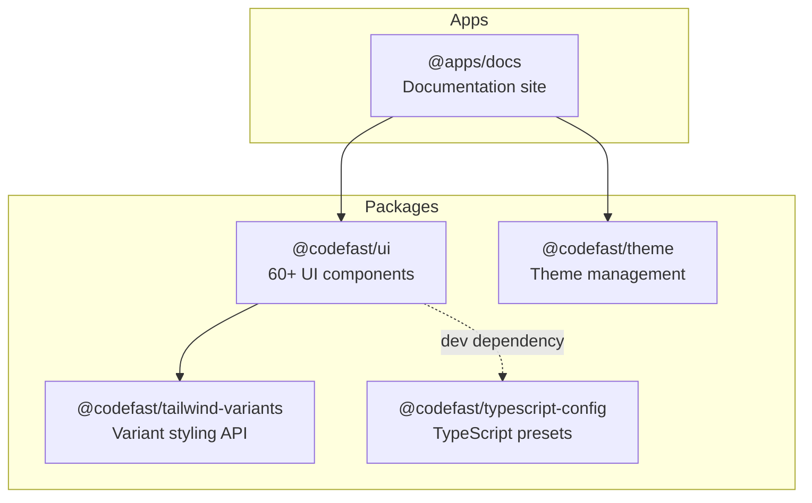

<h1 align="center">CodeFast</h1>

<p align="center">
  A production-ready monorepo for building modern web applications with accessible UI components, high-performance styling utilities, and shared development tooling.
</p>

<!-- Build & Deploy -->
<p align="center">
  <a href="https://github.com/codefastlabs/codefast/actions/workflows/release.yml"></a>
  <a href="https://codecov.io/gh/codefastlabs/codefast"></a>
</p>

<!-- Package -->
<p align="center">
  <a href="https://www.npmjs.com/package/@codefast/ui"></a>
  <a href="https://bundlephobia.com/package/@codefast/ui"></a>
  <a href="https://www.npmjs.com/package/@codefast/ui"></a>
  <a href="https://github.com/codefastlabs/codefast/tags"></a>
</p>

<!-- Tech Stack -->
<p align="center">
  <a href="https://react.dev"></a>
  <a href="https://www.typescriptlang.org"></a>
  <a href="https://www.radix-ui.com/primitives"></a>
  <a href="https://tailwindcss.com"></a>
  <a href="https://tanstack.com/start"></a>
</p>

<!-- Community -->
<p align="center">
  <a href="https://github.com/codefastlabs/codefast/blob/main/LICENSE"></a>
  <a href="https://github.com/codefastlabs/codefast/graphs/contributors"></a>
  <a href="https://github.com/codefastlabs/codefast/issues"></a>
  <a href="https://github.com/codefastlabs/codefast/stargazers"></a>
</p>

---

## Table of Contents

- [Introduction](#introduction)
- [Architecture](#architecture)
- [Packages](#packages)
- [Getting Started](#getting-started)
  - [Use in Your Project](#use-in-your-project)
  - [Develop Locally](#develop-locally)
- [Scripts](#scripts)
- [Technologies](#technologies)
- [Contributing](#contributing)
- [Security](#security)
- [Code of Conduct](#code-of-conduct)
- [Support](#support)
- [License](#license)

## Introduction

CodeFast is a **monorepo** containing a production-ready UI component library and supporting tools for building modern web applications. The core package, `@codefast/ui`, provides **60+ accessible components** built on **Radix UI** primitives, styled with **Tailwind CSS 4**, and fully typed with **TypeScript**.

**Key highlights:**

- **Reusability** -- Versatile UI components that work across multiple projects.
- **Flexible Customization** -- Override or extend default styles with Tailwind Variants.
- **High Performance** -- Optimized for fast loading and minimal bundle size.
- **Clear Codebase** -- Modern, readable, and easy-to-maintain structure.

## Architecture



## Packages

| Package                                                     | Description                                                                  |
| ----------------------------------------------------------- | ---------------------------------------------------------------------------- |
| [`@codefast/ui`](packages/ui)                               | 60+ accessible UI components built on Radix UI primitives                    |
| [`@codefast/tailwind-variants`](packages/tailwind-variants) | Type-safe variant API for Tailwind CSS (4-7x faster than tailwind-variants)  |
| [`@codefast/theme`](packages/theme)                         | Theme management with React 19 features (optimistic updates, cross-tab sync) |
| [`@codefast/typescript-config`](packages/typescript-config) | Shared TypeScript configuration presets                                      |

| App                       | Description                                                |
| ------------------------- | ---------------------------------------------------------- |
| [`@apps/docs`](apps/docs) | Documentation and component showcase site (TanStack Start) |

## Getting Started

### Use in Your Project

Install the UI component library:

```bash
pnpm add @codefast/ui
```

Import the required CSS and start using components:

```tsx
import "@codefast/ui/css/style.css";
import { Button } from "@codefast/ui";

export default function App() {
  return <Button variant="outline">Click me</Button>;
}
```

> See the individual [package READMEs](#packages) for detailed installation and usage instructions.

### Develop Locally

#### Prerequisites

- **Node.js** >= 24.0.0 (LTS)
- **pnpm** 10.25.0

#### Setup

```bash
# Clone the repository
git clone https://github.com/codefastlabs/codefast.git
cd codefast

# Install dependencies
pnpm install

# Build all packages (required before running apps)
pnpm build:packages
```

#### Start development

```bash
# Start all apps and packages in dev mode
pnpm dev

# Or start a specific package
pnpm dev --filter=@codefast/ui
```

## Scripts

| Command               | Description                                                                |
| --------------------- | -------------------------------------------------------------------------- |
| `pnpm dev`            | Start all apps and packages in development mode                            |
| `pnpm build`          | Build all apps and packages                                                |
| `pnpm build:packages` | Build only packages (excludes apps)                                        |
| `pnpm test`           | Run tests across the monorepo                                              |
| `pnpm test:coverage`  | Run tests with coverage reports                                            |
| `pnpm lint`           | Run [Oxlint](https://oxc.rs) (with type-aware rules via `oxlint-tsgolint`) |
| `pnpm lint:fix`       | Oxlint with `--fix`                                                        |
| `pnpm format`         | Format with [Oxfmt](https://oxc.rs)                                        |
| `pnpm format:check`   | Check formatting (CI)                                                      |
| `pnpm typecheck`      | Run TypeScript type checking                                               |
| `pnpm clean`          | Clean build artifacts, cache, and node_modules                             |
| `pnpm deps:check`     | Check for outdated dependencies                                            |
| `pnpm deps:update`    | Update all dependencies to latest                                          |
| `pnpm deps:upgrade`   | Interactively update dependencies to latest                                |

## Technologies

| Technology                                               | Purpose                                                                                                  |
| -------------------------------------------------------- | -------------------------------------------------------------------------------------------------------- |
| [React 19](https://react.dev)                            | Component framework with hooks, server components, and optimistic updates                                |
| [TypeScript 5](https://www.typescriptlang.org)           | Static type checking for safer, more maintainable code                                                   |
| [Tailwind CSS 4](https://tailwindcss.com)                | Utility-first CSS framework for rapid UI development                                                     |
| [Radix UI](https://www.radix-ui.com)                     | Unstyled, accessible primitives for building UI components                                               |
| [TanStack Start](https://tanstack.com/start)             | Full-stack React framework powering the documentation site                                               |
| [Turbo](https://turbo.build)                             | High-performance monorepo build system with caching                                                      |
| [pnpm](https://pnpm.io)                                  | Fast, disk space efficient package manager                                                               |
| [Oxc](https://oxc.rs) (Oxlint, Oxfmt, `oxlint-tsgolint`) | Fast lint and format; type-aware rules per [Oxc docs](https://oxc.rs/docs/guide/usage/linter/type-aware) |
| [Changesets](https://github.com/changesets/changesets)   | Versioning and changelog management for monorepo packages                                                |
| [Zod](https://zod.dev)                                   | TypeScript-first schema validation                                                                       |

## Contributing

Contributions are welcome! Here's how to get started:

1. [Fork](https://github.com/codefastlabs/codefast/fork) the repository.
2. Clone your fork locally:
   ```bash
   git clone https://github.com/<your-username>/codefast.git
   ```
3. Install dependencies:
   ```bash
   pnpm install
   ```
4. Create a feature branch:
   ```bash
   git checkout -b feat/my-feature
   ```
5. Make your changes and add tests where applicable. Before committing, run `pnpm build:packages` (needed for type-aware Oxlint), then `pnpm lint`, `pnpm format:check`, and `pnpm test` from the repo root.
6. Commit your changes following [Conventional Commits](https://www.conventionalcommits.org/):
   ```bash
   git commit -m "feat: add new component"
   ```
7. Push to your branch and open a [Pull Request](https://github.com/codefastlabs/codefast/pulls).

Please check the [open issues](https://github.com/codefastlabs/codefast/issues) for ideas on where to contribute.

## Security

If you discover a security vulnerability, please report it responsibly. **Do not open a public issue.** Instead, email the maintainers or use [GitHub's private vulnerability reporting](https://github.com/codefastlabs/codefast/security/advisories/new).

## Code of Conduct

This project follows the [Contributor Covenant Code of Conduct](https://www.contributor-covenant.org/version/2/1/code_of_conduct/). By participating, you are expected to uphold this code. Please report unacceptable behavior via [GitHub Issues](https://github.com/codefastlabs/codefast/issues).

## Support

- **Bug Reports**: [Open an issue](https://github.com/codefastlabs/codefast/issues/new?template=bug_report.md)
- **Feature Requests**: [Open an issue](https://github.com/codefastlabs/codefast/issues/new?template=feature_request.md)
- **Discussions**: [GitHub Discussions](https://github.com/codefastlabs/codefast/discussions)

## License

This project is licensed under the [MIT License](LICENSE).
