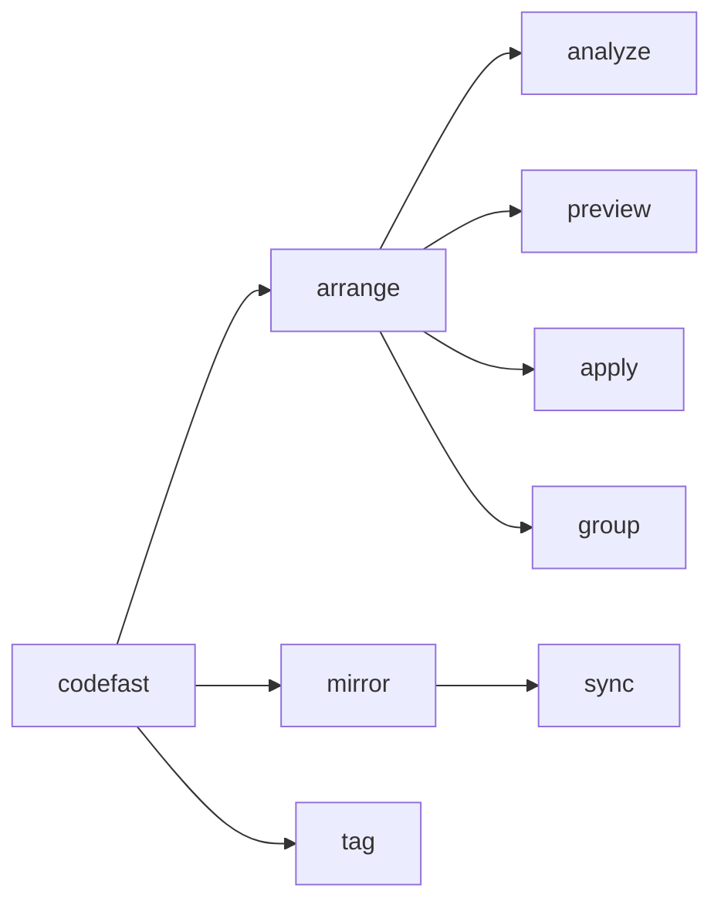

# @codefast/cli

A focused CLI for two recurring maintenance tasks in monorepos:

- **`arrange`** — analyze and regroup Tailwind class strings inside `cn()` / `tv()` calls according to a consistent render-pipeline order.
- **`mirror`** — regenerate `package.json` `exports` fields from built `dist/` trees across a pnpm workspace.
- **`tag`** (alias: **`annotate`**) — auto-add `@since <version>` to exported TypeScript declarations that are still missing version metadata.



---

## Requirements

- Node.js `>=22.0.0`
- pnpm (recommended)

---

## Installation

```bash
# Install globally
pnpm add -g @codefast/cli

# Or run without installing
pnpm dlx @codefast/cli --help
```

---

## Quick start

```bash
# 1. Preview proposed changes — no files written
codefast arrange preview packages/ui/src/components

# 2. Apply after reviewing the diff
codefast arrange apply packages/ui/src/components

# 3. Regenerate package exports from built dist/
codefast mirror sync

# 4. Add @since tags to exported APIs under src/
codefast tag
```

---

## `arrange`

Reads `cn()` and `tv()` call sites, classifies each Tailwind utility, and rewrites the class strings in render-pipeline order (see [Grouping philosophy](#grouping-philosophy--render-pipeline-order) below).

### Workflow

Run the three subcommands in order:

| Step | Command                             | Effect                                |
| ---- | ----------------------------------- | ------------------------------------- |
| 1    | `codefast arrange analyze [target]` | Report only — no files changed        |
| 2    | `codefast arrange preview [target]` | Show exactly what `apply` would write |
| 3    | `codefast arrange apply [target]`   | Write the changes                     |

The default `target` when omitted is `packages/ui/src/components`, resolved from `process.cwd()`.

### Flags

| Flag                 | Description                                                             |
| -------------------- | ----------------------------------------------------------------------- |
| `--with-class-name`  | Append `className` as the last argument when rewriting a `cn(...)` call |
| `--cn-import <spec>` | Override the module specifier used when adding a missing `cn` import    |

### `arrange group` — one-shot string grouping

Groups a single class string without touching the filesystem. Useful for checking how a string would be classified before running `apply`:

```bash
codefast arrange group "relative flex items-center h-10 w-full rounded-md bg-primary text-white hover:bg-primary/90"
```

---

## `mirror sync`

Scans built `dist/` trees and regenerates the `exports` field in each `package.json`. Run from anywhere inside the monorepo — the workspace root is discovered automatically via `pnpm-workspace.yaml`.

```bash
codefast mirror sync              # all packages in the workspace
codefast mirror sync packages/ui  # a single package path
codefast mirror sync -v           # verbose output
```

> **Note:** Packages must be built first so `dist/` exists. Run your build step before `mirror sync`.

### Configuration

Create a `codefast.config.js` (or `.mjs`, `.cjs`, `.json`) at the repo root with a `mirror` key:

```js
// codefast.config.mjs
export default {
  mirror: {
    skipPackages: ["@acme/internal"],
    pathTransformations: {
      "@acme/ui": {
        removePrefix: "./components/",
      },
    },
    customExports: {
      "@acme/ui": {
        "./css/*": "./src/styles/*",
      },
    },
    cssExports: {
      "@acme/ui": {
        enabled: true,
        customExports: {
          "./tokens.css": "./dist/tokens.css",
        },
      },
    },
  },
};
```

Use your real package names from `package.json#name` (for example `@acme/ui`) and adjust entries to match your workspace.

> **Migration:** Path-based keys (for example `packages/ui`) are deprecated for `pathTransformations`, `customExports`, `cssExports`, and `skipPackages`. Migrate to package-name keys.

> **Security note:** `.js`, `.mjs`, and `.cjs` config files are loaded via `import()`. Only run `mirror sync` in repositories you trust.

---

## Lifecycle hooks (`codefast.config.mjs`)

`codefast` supports lifecycle hooks so teams can plug in their own post-write workflow (formatter, lint-fix, codemods) without hardcoding any formatter inside CLI core.

```javascript
import { execSync } from "node:child_process";

export default {
  tag: {
    onAfterWrite: ({ files }) => {
      console.log(`Formatting ${files.length} files with Oxc...`);
      execSync(`npx oxc format ${files.join(" ")}`, { stdio: "inherit" });
    },
  },
  arrange: {
    onAfterWrite: ({ files }) => {
      execSync(`npx oxc format ${files.join(" ")}`, { stdio: "inherit" });
    },
  },
};
```

Hook contract:

- `tag.onAfterWrite?.({ files })` runs after `codefast tag` writes files.
- `arrange.onAfterWrite?.({ files })` runs after `codefast arrange apply` writes files.
- Hooks support both sync and async functions (`void | Promise<void>`).
- Hook errors are logged but do not crash the CLI process.

---

## `tag` / `annotate`

Scans `.ts` / `.tsx` source files and annotates exported declarations with `@since <current-package-version>`. This keeps API evolution visible and reduces documentation drift in long-lived codebases.

```bash
codefast tag                  # annotate exports in ./src
codefast tag packages/ui/src  # annotate a custom target
codefast annotate --dry-run   # preview only, do not write files
```

What it updates:

- Adds `/** @since <version> */` when an exported declaration has no JSDoc.
- Injects `@since <version>` into an existing JSDoc block when missing.
- Leaves declarations unchanged when `@since` is already present.

The `<version>` value is read from the nearest `package.json` found by walking up from the target path.

---

## Grouping philosophy — Render Pipeline Order

`arrange` does **not** sort classes alphabetically. Instead, it groups utilities in roughly the order the browser applies them — from the box's existence, through its shape and surface, to interactive behavior. This makes class strings easier to scan and reason about at a glance.

**Existence → Position → Layout → Sizing → Spacing → Shape → Background → Shadow → Typography → Composite → Motion → Starting → Behavior → State → Selector**

| Bucket         | What it covers                                      | Examples                                          |
| -------------- | --------------------------------------------------- | ------------------------------------------------- |
| **Existence**  | Display and containment context                     | `hidden`, `block`, `@container`, `group`, `peer`  |
| **Position**   | Where the box sits                                  | `absolute`, `inset-*`, `top-*`, `z-*`             |
| **Layout**     | How children flow                                   | `flex`, `grid`, `gap-*`, `items-*`                |
| **Sizing**     | Box dimensions and overflow                         | `w-*`, `h-*`, `aspect-*`, `overflow-*`            |
| **Spacing**    | Padding and margin only (gaps stay with Layout)     | `p-*`, `m-*`                                      |
| **Shape**      | Corners and strokes                                 | `rounded-*`, `border-*`, `ring-*`                 |
| **Background** | Surfaces and masks                                  | `bg-*`, `from-*`, `via-*`, `to-*`, `mask-*`       |
| **Shadow**     | Depth                                               | `shadow-*`, `inset-shadow-*`, `text-shadow-*`     |
| **Typography** | Text appearance                                     | `font-*`, `text-*`, `leading-*`                   |
| **Composite**  | Layers and transforms (3D context → 3D → 2D)        | `opacity-*`, `rotate-x-*`, `translate-*`          |
| **Motion**     | Time-based change                                   | `transition-*`, `animate-*`                       |
| **Starting**   | Tailwind's `starting:` layer — kept next to Motion  | `starting:*`                                      |
| **Behavior**   | Input, scrolling, and browser chrome                | `cursor-*`, `scroll-*`, `field-sizing-*`, `inert` |
| **State**      | Interactive and conditional variants (non-selector) | `hover:`, `md:`, `@md/sidebar:`, `data-[…]:`      |
| **Selector**   | Selector-driven variants                            | `[&…]:`, `*:`, `**:`, `has-*`, `group-[…]:`       |

Adjacent buckets may be merged into one string literal when declared _compatible_ (e.g. `layout` + `sizing`). This keeps `cn()` calls readable without flattening unrelated concerns into a single undifferentiated blob.

To change a placement, edit `classifyBareUtility` in `src/lib/arrange/domain/tokenizer.util.ts` and add a corresponding `classifyToken` test in `src/lib/arrange/domain/tokenizer.util.test.ts`.

---

## Troubleshooting

**`codefast: command not found`**
Install globally with `pnpm add -g @codefast/cli`, or run via `pnpm dlx @codefast/cli <command>`.

**`mirror sync` writes little or no output**
Packages must be built before syncing. Ensure `dist/` exists by running your build step first, then re-run `codefast mirror sync`.

**Unexpected class reorder after `arrange apply`**
Run `arrange preview` before applying and smoke-test the UI. Some components rely on cascade-sensitive ordering that `arrange` cannot detect automatically.

---

## Contributing (monorepo setup)

```bash
# Build the local CLI (produces dist/bin.js)
pnpm --filter @codefast/cli build

# Run the local entrypoint
pnpm exec codefast --help
```

A few naming conventions to keep in mind:

- **`codefast <command>`** refers to CLI commands exposed via the `@codefast/cli` `bin` entry.
- **Scripts in `packages/cli/package.json`** (`build`, `test`, …) are package-local dev scripts, not CLI commands.
- The root `package.json` includes optional convenience wrappers such as `cli:mirror-sync` and `cli:arrange-analyze` for common dev workflows.
