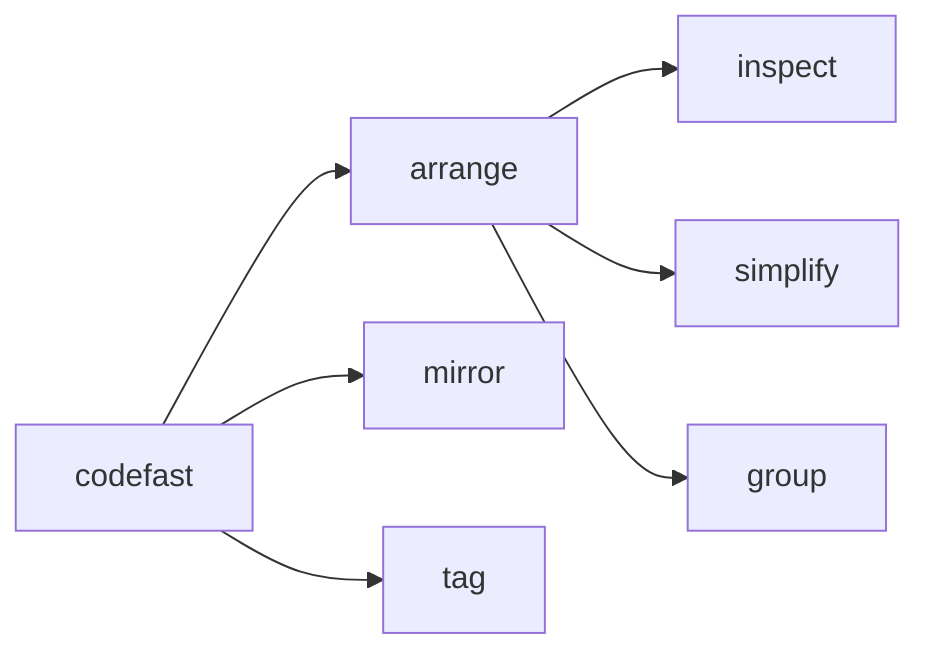

# @codefast/cli

A small developer CLI for maintenance tasks in a TypeScript monorepo — Tailwind class arranging, `package.json` `exports` mirroring, and `@since` JSDoc tagging.

[](https://github.com/codefastlabs/codefast/actions/workflows/release.yml)
[](https://www.npmjs.com/package/@codefast/cli)
[](https://www.npmjs.com/package/@codefast/cli)
[](https://opensource.org/licenses/MIT)

---

## Table of Contents

- [Why @codefast/cli](#why-codefastcli)
- [Requirements](#requirements)
- [Installation](#installation)
- [Quick Start](#quick-start)
- [Global options](#global-options)
- [Exit codes](#exit-codes)
- [`arrange`](#arrange)
- [`mirror`](#mirror)
- [`tag`](#tag)
- [Configuration (`codefast.config.*`)](#configuration-codefastconfig)
  - [Full skeleton](#full-skeleton)
  - [`mirror` configuration](#mirror-configuration)
  - [`tag` configuration](#tag-configuration)
  - [`arrange` configuration](#arrange-configuration)
- [Lifecycle hooks](#lifecycle-hooks)
- [Grouping philosophy — Render Pipeline Order](#grouping-philosophy--render-pipeline-order)
- [Troubleshooting](#troubleshooting)
- [Contributing (monorepo setup)](#contributing-monorepo-setup)
- [License](#license)
- [Changelog](#changelog)

---

## Why @codefast/cli

Three recurring maintenance chores you don't want to script by hand:

- **`arrange`** — regroup Tailwind class strings inside `cn()` / `tv()` calls in render-pipeline order.
- **`mirror`** — regenerate `package.json` `exports` fields from built `dist/` trees across a pnpm workspace.
- **`tag`** — add `@since <version>` JSDoc tags to exported declarations that are missing version metadata.

Each top-level command **performs its action by default** (writing files). Pass `--dry-run` to preview without writing. `arrange` additionally exposes a read-only `inspect` report.



---

## Requirements

- Node.js `>= 22.0.0`
- pnpm (recommended — the CLI discovers workspaces via `pnpm-workspace.yaml`)

---

## Installation

```bash
# Install globally
pnpm add -g @codefast/cli
# or
npm install -g @codefast/cli
# or
yarn global add @codefast/cli

# Or run without installing
pnpm dlx @codefast/cli --help
# or
npx @codefast/cli --help
```

---

## Quick Start

```bash
# Inspect Tailwind classes in the nearest package (read-only report)
codefast arrange inspect

# Preview proposed rewrites — no files written
codefast arrange --dry-run packages/ui/src/components

# Apply after reviewing
codefast arrange packages/ui/src/components

# Regenerate every package's `exports` from built dist/
codefast mirror

# Add @since <version> to exported APIs under ./src
codefast tag
```

---

## Global options

| Flag              | Effect                                                                 |
| ----------------- | ---------------------------------------------------------------------- |
| `--no-color`      | Disable ANSI color output (also respected by JSON output suppression). |
| `-V`, `--version` | Print the CLI version and exit.                                        |
| `-h`, `--help`    | Show contextual help for the invoked command.                          |

> **Placement.** Global flags must come **before** the command name (git-style), e.g. `codefast --no-color mirror`. A flag after the command name binds to that command.

---

## Exit codes

| Code | Meaning                                                                                             |
| ---- | --------------------------------------------------------------------------------------------------- |
| `0`  | Success.                                                                                            |
| `1`  | General failure (missing paths, infrastructure errors, partial failures in `mirror`, failed hooks). |
| `2`  | Invalid invocation or input (Zod schema validation on CLI requests — `CLI_EXIT_USAGE`).             |

Diagnostics go to **stderr**; primary command output goes to **stdout**. When a subcommand accepts `--json`, only the JSON object is written to stdout and all human progress is suppressed, so the stream stays pipeline-safe.

---

## `arrange`

Reads `cn()` and `tv()` call sites, classifies each Tailwind utility, and rewrites the class string in render-pipeline order (see [Grouping philosophy](#grouping-philosophy--render-pipeline-order)).

### Target resolution

When `[target]` is omitted, `arrange` auto-detects the **nearest package directory** by walking up from the current working directory until it finds a `package.json`. Pass an explicit path (file or directory) to override.

### Workflow

| Step | Command                               | Effect                                         |
| ---- | ------------------------------------- | ---------------------------------------------- |
| 1    | `codefast arrange inspect [target]`   | Report only — no files changed                 |
| 2    | `codefast arrange --dry-run [target]` | Show exactly what a bare `arrange` would write |
| 3    | `codefast arrange [target]`           | Write the changes                              |

### Flags (`arrange`)

| Flag                 | Description                                                                 |
| -------------------- | --------------------------------------------------------------------------- |
| `--dry-run`          | Preview the rewrite without writing files.                                  |
| `--with-class-name`  | Append `className` as the last argument when rewriting a `cn(...)` call.    |
| `--cn-import <spec>` | Override the module specifier used when a missing `cn` import is added.     |
| `--json`             | Print a single JSON object on stdout; suppresses human progress and colors. |

`inspect` also supports `--json`. `simplify` accepts `--dry-run` and `--json`.

> **Test files are skipped.** Directory scans exclude `*.test.*` / `*.spec.*` files — a `cn(...)` inside an assertion is test data, not styling to reformat. Pass such a file explicitly to override.

### `arrange group` — one-shot classification

Groups a class string without touching the filesystem. Useful for checking how classes would be grouped before running `arrange`:

```bash
# Quoted string
codefast arrange group "relative flex items-center h-10 w-full rounded-md bg-primary text-white hover:bg-primary/90"

# Or space-separated tokens (no quotes needed)
codefast arrange group relative flex items-center h-10 w-full rounded-md

# Emit a tv()-style array instead of a cn() call
codefast arrange group --tv "flex items-center gap-2"
```

| Flag                | Description                                                          |
| ------------------- | -------------------------------------------------------------------- |
| `--tv`              | Emit a `tv()`-style array literal instead of a `cn(...)` call.       |
| `--with-class-name` | Append `className` to the emitted `cn(...)` call.                    |
| `--json`            | Emit `{ schemaVersion, primaryLine, bucketsCommentLine }` on stdout. |

### `--json` payloads

| Subcommand | Payload highlights                                                                                                                         |
| ---------- | ------------------------------------------------------------------------------------------------------------------------------------------ |
| `arrange`  | `schemaVersion`, `write`, `ok` (`false` if the `onAfterWrite` hook failed), full `result` (`filePaths`, `modifiedFiles`, `totalFound`, …). |
| `inspect`  | `schemaVersion`, `analyzeRootPath`, full `report` (same data as the human report).                                                         |
| `simplify` | `schemaVersion`, `write`, `ok`, full `result`.                                                                                             |
| `group`    | `schemaVersion`, `primaryLine`, `bucketsCommentLine`.                                                                                      |

---

## `mirror`

Scans built `dist/` trees and regenerates the `exports` field of every workspace package. Run it from anywhere inside the monorepo — the workspace root is discovered via `pnpm-workspace.yaml`.

```bash
codefast mirror                 # all workspace packages
codefast mirror packages/ui     # one package (path relative to repo root)
codefast mirror --dry-run       # preview — report changes without writing
codefast mirror -v              # verbose diagnostics
codefast mirror --json          # JSON summary for scripts / CI
```

| Flag              | Description                                                                  |
| ----------------- | ---------------------------------------------------------------------------- |
| `--dry-run`       | Report what would change without writing any `package.json`.                 |
| `-v`, `--verbose` | Print extra diagnostics.                                                     |
| `--json`          | Print a single `{ schemaVersion, ok, write, elapsedSeconds, stats }` object. |

> **Build first.** `mirror` reads from `dist/`. Run your build before syncing or exports will reflect stale output.

Exit code is `1` when any package fails (`stats.packagesErrored > 0`), `0` otherwise.

---

## `tag`

Scans `.ts` / `.tsx` sources and adds `@since <current-package-version>` to exported declarations that don't already carry one. The version is read from the nearest `package.json` walking up from the target path.

```bash
codefast tag                   # auto-discover workspace packages from cwd
codefast tag packages/ui/src   # tag a custom target
codefast tag --dry-run         # preview only, do not write
codefast tag --json            # JSON summary for scripts / CI
```

| Flag        | Description                                                       |
| ----------- | ----------------------------------------------------------------- |
| `--dry-run` | Show summary without writing files.                               |
| `--json`    | Print a single JSON summary on stdout; suppresses human progress. |

What it updates:

- Adds `/** @since <version> */` when an exported declaration has no JSDoc.
- Injects `@since <version>` into an existing JSDoc block that lacks one.
- Leaves declarations alone when `@since` is already present.

---

## Configuration (`codefast.config.*`)

Create a config file at the **monorepo root** (next to `pnpm-workspace.yaml`). Supported names, in priority order:

| File name              | Format                                  |
| ---------------------- | --------------------------------------- |
| `codefast.config.mjs`  | ES module — `export default { … }`      |
| `codefast.config.js`   | ES module (if `"type":"module"`) or CJS |
| `codefast.config.cjs`  | CommonJS — `module.exports = { … }`     |
| `codefast.config.json` | Plain JSON (no functions — no hooks)    |

The file is found by walking up from the working directory, so running the CLI from any sub-directory still picks up the root config.

> **Security.** `.js`, `.mjs`, and `.cjs` files are executed via `import()`. Only run `codefast` inside repositories you trust.

---

### Full skeleton

```javascript
// codefast.config.mjs
import { execSync } from "node:child_process";

export default {
  // ─── mirror ────────────────────────────────────────────────────────────────
  // Keys are package names (from package.json#name).
  // Set a package to `false` to skip it entirely.
  // Omit a package to process it with default settings.
  mirror: {
    "@acme/ui": {
      strip: "./components/",
      exports: { "./css/*": "./src/css/*" },
      source: true, // default: true
      types: true, // default: true
      import: true, // default: true
      css: true,
    },
    "@acme/internal": false,
    "@acme/docs": false,
  },

  // ─── tag ───────────────────────────────────────────────────────────────────
  tag: {
    skipPackages: ["@acme/internal"],
    onAfterWrite: ({ files }) => {
      execSync(`oxfmt ${files.join(" ")}`, { stdio: "inherit" });
    },
  },

  // ─── arrange ───────────────────────────────────────────────────────────────
  arrange: {
    onAfterWrite: ({ files }) => {
      execSync(`oxfmt ${files.join(" ")}`, { stdio: "inherit" });
    },
  },
};
```

---

### `mirror` configuration

`mirror` is a record keyed by **package name** (the `name` field in the package's `package.json`, e.g. `"@acme/ui"`).

#### Skipping a package

Set a package to `false` to exclude it from `codefast mirror` entirely:

```javascript
mirror: {
  "@acme/internal": false,
  "@acme/docs": false,
}
```

Packages not mentioned in the config are processed with default settings.

#### Per-package options

Each package entry is an object with the following fields:

| Field      | Type                     | Default | Description                                                                                                                                                                                                                                |
| ---------- | ------------------------ | ------- | ------------------------------------------------------------------------------------------------------------------------------------------------------------------------------------------------------------------------------------------ |
| `source`   | `boolean \| string`      | `true`  | Add a `source` condition to each export entry pointing to the original `.ts` file. `true` auto-derives the path (`./src/<module>.ts`). Pass a string to set the root-export path explicitly (`"./src/index.tsx"`). Set to `false` to omit. |
| `types`    | `boolean`                | `true`  | Include the `types` condition when a `.d.ts` file is present. Set to `false` to omit.                                                                                                                                                      |
| `import`   | `boolean`                | `true`  | Include the `import` condition. Set to `false` to omit (useful for CJS-only packages).                                                                                                                                                     |
| `strip`    | `string`                 | —       | Strip a leading path segment from generated export specifiers. See below.                                                                                                                                                                  |
| `exports`  | `Record<string, string>` | —       | Add or override specific export specifiers. See below.                                                                                                                                                                                     |
| `preserve` | `boolean`                | —       | Keep the existing `package.json#exports` and only fill in missing conditions.                                                                                                                                                              |
| `css`      | `boolean \| CssConfig`   | —       | Enable CSS export detection. See below.                                                                                                                                                                                                    |

#### `strip`

Removes a fixed prefix from every generated export specifier. Use this when a package's `dist/` mirrors deep directory structure that you want to flatten in the public API.

```javascript
// Without strip, dist/components/button.mjs → "./components/button"
// With strip: "./components/", it becomes → "./button"
"@acme/ui": {
  strip: "./components/",
}
```

The original file path is preserved for sorting — only the public specifier changes.

#### `exports`

Adds or overrides specific specifiers in the final export map. Keys and values are the exact strings written into `package.json#exports`.

```javascript
"@acme/ui": {
  exports: {
    "./css/*": "./src/css/*",        // wildcard passthrough to sources
    "./tokens": "./dist/tokens.js",  // explicit extra entry
  },
}
```

Extra entries are merged after auto-generation. They win over anything the scanner would produce for the same specifier. `./package.json` cannot be overridden.

#### `preserve`

Keeps the existing `package.json#exports` map exactly as-is and only fills in missing conditions (`source`, `types`, `import`) for each entry — no `dist/` scan is performed. Use this when you maintain the exports map by hand and only want the CLI to supplement missing conditions.

```javascript
"@acme/tailwind-variants": {
  preserve: true,
}
```

#### `css`

Controls CSS file export generation. `mirror` scans `dist/` for `.css` files and writes wildcard or per-file export entries.

```javascript
// Shorthand: auto-detect all CSS files in dist/
"@acme/theme": { css: true }

// Full config:
"@acme/ui": {
  css: {
    enabled: true,
    // Force individual file entries instead of directory wildcards:
    forceExportFiles: false,
    // Manually add or override individual CSS specifiers:
    customExports: {
      "./tokens.css": "./dist/tokens.css",
    },
  },
}

// Explicitly disable CSS exports for this package:
"@acme/legacy": { css: false }
```

When `css` is omitted, CSS files found in `dist/` are still exported by default.

#### What `mirror` writes

For a package with `dist/button.mjs`, `dist/button.d.ts`, and `source: true`, the generated export entry looks like:

```json
{
  "./button": {
    "source": "./src/button.ts",
    "types": "./dist/button.d.ts",
    "import": "./dist/button.mjs"
  }
}
```

It also updates the top-level `main`, `module`, and `types` fields from the root (`.`) export, and ensures `"dist"` is listed in `files`.

---

### `tag` configuration

```javascript
tag: {
  // Package names to skip when running without an explicit target
  skipPackages: ["@acme/internal", "@acme/docs"],

  // Called after files are written — use it to format or lint-fix
  onAfterWrite: ({ files }) => {
    execSync(`prettier --write ${files.join(" ")}`, { stdio: "inherit" });
  },
}
```

| Field          | Type                                                  | Description                                                                                                                         |
| -------------- | ----------------------------------------------------- | ----------------------------------------------------------------------------------------------------------------------------------- |
| `skipPackages` | `string[]`                                            | Package names to skip when `codefast tag` is run without an explicit target. Has no effect when a target path is provided directly. |
| `onAfterWrite` | `(ctx: { files: string[] }) => void \| Promise<void>` | Lifecycle hook — runs after files are written.                                                                                      |

---

### `arrange` configuration

```javascript
arrange: {
  // Called after files are written by `codefast arrange`
  onAfterWrite: ({ files }) => {
    execSync(`oxfmt ${files.join(" ")}`, { stdio: "inherit" });
  },
}
```

| Field          | Type                                                  | Description                                                                      |
| -------------- | ----------------------------------------------------- | -------------------------------------------------------------------------------- |
| `onAfterWrite` | `(ctx: { files: string[] }) => void \| Promise<void>` | Lifecycle hook — runs after `arrange` writes files. Not called with `--dry-run`. |

---

## Lifecycle hooks

Both `tag` and `arrange` call `onAfterWrite` immediately after writing files to disk. The hook receives the list of written file paths and can run any synchronous or asynchronous work — formatters, linters, codegen, notifications.

```javascript
export default {
  tag: {
    onAfterWrite: async ({ files }) => {
      // async is supported
      await runFormatter(files);
    },
  },
  arrange: {
    onAfterWrite: ({ files }) => {
      // sync is fine too
      execSync(`oxfmt ${files.join(" ")}`, { stdio: "inherit" });
    },
  },
};
```

Contract:

- `tag.onAfterWrite` fires after `codefast tag` writes JSDoc annotations.
- `arrange.onAfterWrite` fires after `codefast arrange` rewrites class strings.
- Hook is **not** called on `--dry-run`.
- Hooks may be synchronous or `async` (`void | Promise<void>`).
- If the hook throws or rejects, the command reports the error on stderr and exits with code `1`.

---

## Grouping philosophy — Render Pipeline Order

`arrange` does **not** sort classes alphabetically. Instead, it groups utilities in roughly the order the browser applies them — from the box's existence, through its shape and surface, to interactive behavior. This makes class strings easier to scan and diff.

**Existence → Position → Layout → Sizing → Spacing → Shape → Background → Shadow → Typography → Composite → Motion → Starting → Behavior → State → Selector**

| Bucket         | What it covers                                      | Examples                                          |
| -------------- | --------------------------------------------------- | ------------------------------------------------- |
| **Existence**  | Display and containment context                     | `hidden`, `block`, `@container`, `group`, `peer`  |
| **Position**   | Where the box sits                                  | `absolute`, `inset-*`, `top-*`, `z-*`             |
| **Layout**     | How children flow                                   | `flex`, `grid`, `gap-*`, `items-*`                |
| **Sizing**     | Box dimensions and overflow                         | `w-*`, `h-*`, `aspect-*`, `overflow-*`            |
| **Spacing**    | Padding and margin only (gaps stay with Layout)     | `p-*`, `m-*`                                      |
| **Shape**      | Corners and strokes                                 | `rounded-*`, `border-*`, `ring-*`                 |
| **Background** | Surfaces and masks                                  | `bg-*`, `from-*`, `via-*`, `to-*`, `mask-*`       |
| **Shadow**     | Depth                                               | `shadow-*`, `inset-shadow-*`, `text-shadow-*`     |
| **Typography** | Text appearance                                     | `font-*`, `text-*`, `leading-*`                   |
| **Composite**  | Layers and transforms (3D context → 3D → 2D)        | `opacity-*`, `rotate-x-*`, `translate-*`          |
| **Motion**     | Time-based change                                   | `transition-*`, `animate-*`                       |
| **Starting**   | Tailwind's `starting:` layer — kept next to Motion  | `starting:*`                                      |
| **Behavior**   | Input, scrolling, and browser chrome                | `cursor-*`, `scroll-*`, `field-sizing-*`, `inert` |
| **State**      | Interactive and conditional variants (non-selector) | `hover:`, `md:`, `@md/sidebar:`, `data-[…]:`      |
| **Selector**   | Selector-driven variants                            | `[&…]:`, `*:`, `**:`, `has-*`, `group-[…]:`       |

Adjacent buckets may be merged into a single string literal when declared _compatible_ (e.g. Layout + Sizing), which keeps `cn()` calls readable without flattening unrelated concerns.

To change placement, extend `classifyBareUtility` in `packages/cli/src/arrange/domain/token-classifier.ts` (and cover the new rule with arrange tests if you introduce a new bucket).

---

## Troubleshooting

**`codefast: command not found`**
Install globally with `pnpm add -g @codefast/cli`, or run via `pnpm dlx @codefast/cli <command>`.

**`mirror` writes little or no output**
Packages must be built first. Ensure `dist/` exists by running your build step, then re-run `codefast mirror`.

**Unexpected class reorder after `arrange`**
Run `arrange --dry-run` first and smoke-test the UI. Some components rely on cascade-sensitive ordering that `arrange` cannot detect automatically.

**`--json` output mixed with progress lines**
Some shells buffer progress writes on stderr into stdout when piping — redirect stderr explicitly: `codefast mirror --json 2>/dev/null | jq`.

---

## Contributing (monorepo setup)

```bash
# Build the local CLI (produces dist/bin.mjs)
pnpm --filter @codefast/cli build

# Run the local entrypoint
pnpm exec codefast --help

# Test + type-check
pnpm --filter @codefast/cli test
pnpm --filter @codefast/cli check-types
```

A few naming conventions:

- **`codefast <command>`** refers to CLI commands exposed via the `bin` entry in `@codefast/cli`.
- **Scripts in `packages/cli/package.json`** (`build`, `test`, …) are package-local dev scripts, not CLI commands.
- The root `package.json` includes optional convenience wrappers (e.g. `cli:mirror`, `cli:arrange-inspect`) for common dev workflows.

---

## License

[MIT](https://opensource.org/licenses/MIT) — see [`package.json`](./package.json).

---

## Changelog

See [CHANGELOG.md](./CHANGELOG.md) for the full version history. Releases are also published on [npm](https://www.npmjs.com/package/@codefast/cli?activeTab=versions).
