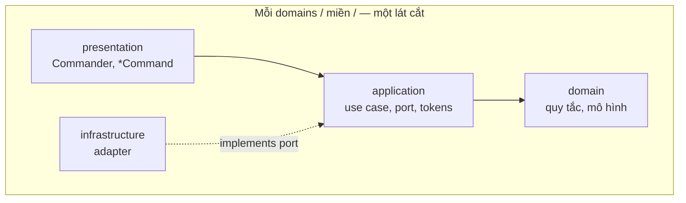

# `@codefast/cli` — đặc tả thiết kế (làm mới từ đầu)

> `Commander` · **Kiến trúc tường minh (Explicit Architecture)** · `@codefast/di` · Tổ chức theo miền · Ưu tiên lớp — **mục 3** là hợp đồng _hành vi_ đối với người dùng (WHAT). **Cây `src/` mới** cố ý khác snapshot ở _cách wiring và ranh giới_ (HOW): một miền rõ ràng, một policy DI, không sao chép lỗi thiết kế cũ — xem [mục 1.4](#14-thiết-kế-mới-parity-hành-vi-không-parity-mã-cũ). Snapshot `old/` chỉ để đối chiếu và trích thuật toán.

---

## Mục lục

1. [Bối cảnh và mục tiêu](#1-bối-cảnh-và-mục-tiêu)
   - [1.3 Phạm vi không làm](#13-phạm-vi-không-làm)
   - [1.4 Thiết kế mới: parity hành vi, không parity mã cũ](#14-thiết-kế-mới-parity-hành-vi-không-parity-mã-cũ)
2. [Nền tảng kỹ thuật và ràng buộc monorepo](#2-nền-tảng-kỹ-thuật-và-ràng-buộc-monorepo)
   - [2.1 Gói `@codefast/di` — API dùng cho CLI](#21-gói-codefastdi--api-dùng-cho-cli)
3. [Hành vi sản phẩm — tương đương bắt buộc](#3-hành-vi-sản-phẩm--tương-đương-bắt-buộc)
   - [3.1 Điểm vào, chương trình `Commander`, vòng đời container](#31-điểm-vào-chương-trình-commander-vòng-đời-container)
   - [3.2 Tùy chọn toàn cục và quy ước nhập–xuất](#32-tùy-chọn-toàn-cục-và-quy-ước-nhập-xuất)
   - [3.3 Mã thoát và lớp lỗi thống nhất](#33-mã-thoát-và-lớp-lỗi-thống-nhất)
   - [3.4 Cấu hình `codefast.config.*`](#34-cấu-hình-codefastconfig)
   - [3.5 Miền `arrange`](#35-miền-arrange)
     - [3.5.1 Hằng số miền `arrange`](#351-hằng-số-miền-arrange)
   - [3.6 Miền `mirror`](#36-miền-mirror)
   - [3.7 Miền `tag` / `annotate`](#37-miền-tag--annotate)
   - [3.8 Móc vòng đời `onAfterWrite`](#38-móc-vòng-đời-onafterwrite)
   - [3.9 Phần dùng chung giữa các miền](#39-phần-dùng-chung-giữa-các-miền)
   - [3.10 Checklist kịch bản kiểm thử (parity)](#310-checklist-kịch-bản-kiểm-thử-parity)
4. [Kiến trúc tường minh (Explicit Architecture)](#4-kiến-trúc-tường-minh-explicit-architecture)
   - [4.1 Ba khối và luồng điều khiển](#41-ba-khối-và-luồng-điều-khiển)
   - [4.2 Port và bộ thích ứng (lục giác / vành)](#42-port-và-bộ-thích-ứng-lục-giác--vành)
   - [4.3 Lõi ứng dụng: tầng ứng dụng và tầng miền](#43-lõi-ứng-dụng-tầng-ứng-dụng-và-tầng-miền)
   - [4.4 Thành phần (component) và gói theo miền](#44-thành-phần-component-và-gói-theo-miền)
   - [4.5 Đảo ngược phụ thuộc và gốc composition](#45-đảo-ngược-phụ-thuộc-và-gốc-composition)
   - [4.6 CQRS và Command/Query Bus](#46-cqrs-và-commandquery-bus)
   - [4.7 Ánh xạ vào cây thư mục trong gói](#47-ánh-xạ-vào-cây-thư-mục-trong-gói)
   - [4.8 Quy ước đặt tên tệp](#48-quy-ước-đặt-tên-tệp)
5. [Ưu tiên class, `Commander` ở biên, Zod](#5-ưu-tiên-class-commander-ở-biên-zod)
6. [Quy ước `@codefast/di`](#6-quy-ước-codefastdi)
   - [6.1 Module theo miền](#61-module-theo-miền)
   - [6.2 Gốc composition (bootstrap)](#62-gốc-composition-bootstrap)
   - [6.3 Bind port → bộ thích ứng](#63-bind-port--bộ-thích-ứng)
   - [6.4 Đăng ký nhiều `CliCommand` (multi-binding — đã hỗ trợ sẵn)](#64-đăng-ký-nhiều-clicommand-multi-binding--đã-hỗ-trợ-sẵn)
   - [6.5 Scope mặc định](#65-scope-mặc-định)
   - [6.6 Vòng đời theo môi trường](#66-vòng-đời-theo-môi-trường)
7. [Cấu trúc thư mục `src/` — package by domain + Explicit Architecture](#7-cấu-trúc-thư-mục-src--package-by-domain--explicit-architecture)
   - [7.1 Trục domains: một thư mục con = một miền](#71-trục-domains-một-thư-mục-con--một-miền)
   - [7.2 Bốn tầng trong mỗi miền (cùng một “lát cắt”)](#72-bốn-tầng-trong-mỗi-miền-cùng-một-lát-cắt)
   - [7.3 Cây src đầy đủ và chỗ đặt module DI](#73-cây-src-đầy-đủ-và-chỗ-đặt-module-di)
   - [7.4 Bố cục shell](#74-bố-cục-shell)
8. [Chiến lược kiểm thử](#8-chiến-lược-kiểm-thử)
9. [Kế hoạch chuyển đổi](#9-kế-hoạch-chuyển-đổi)
   - [9.1 Lưu trữ mã và kiểm thử cũ trong `old/`](#91-lưu-trữ-mã-và-kiểm-thử-cũ-trong-old)
   - [Bước 0 — Chốt mục 10](#bước-0--chốt-mục-10)
   - [9.2 Hoàn thành theo miền (Definition of Done)](#92-hoàn-thành-theo-miền-definition-of-done)
10. [Quyết định còn mở](#10-quyết-định-còn-mở)

---

## 1. Bối cảnh và mục tiêu

### 1.1 Vấn đề với cấu trúc hiện tại (`src/lib/**`)

Mã hiện tại đã theo hướng phân lớp và đảo ngược phụ thuộc, nhưng **chưa** hiển thị rõ mô hình **kiến trúc tường minh** (gói theo thành phần + port/bộ thích ứng) như tổng hợp trong [mục 4](#4-kiến-trúc-tường-minh-explicit-architecture). Hệ quả:

- Cây `lib/` trộn `arrange`, `mirror`, `tag`, `core`, `config`, `kernel`, `shared`, `infrastructure` — khó biết một tính năng thuộc về đâu chỉ nhìn đường dẫn.
- Trộn **lớp** (`@injectable`) với **hàm** ở nhiều lớp (hiển thị, dịch vụ, nạp cấu hình) nên khó có một quy ước thống nhất.

### 1.2 Mục tiêu khi viết lại

- **Giữ nguyên** môi trường chạy: `Commander`, `@codefast/di`, Node ESM, `bin` `codefast`, và **toàn bộ tương đương hành vi** ở [mục 3](#3-hành-vi-sản-phẩm--tương-đương-bắt-buộc), trừ khi ghi rõ thay đổi phá vỡ tương thích trong đặc tả hoặc `CHANGELOG.md`.
- **Căn cứ kiến trúc**: áp dụng các quy tắc đã **chốt** ở [mục 4](#4-kiến-trúc-tường-minh-explicit-architecture) (tổng hợp từ Graça: Ports & Adapters, Onion, Clean, thành phần theo miền).
- **Cây theo miền**: `domains/arrange`, `domains/mirror`, `domains/tag`, `domains/config` (tải `codefast.config` và prelude chung), cùng `bootstrap/` và `shell/` (nhân chung tối thiểu — tương tự shared kernel trong bài gốc; giữ nhỏ).
- **Ưu tiên lớp** cho mọi thành phần tham gia đồ thị DI và điều phối; hàm chỉ dùng cho tiện ích thuần, phạm vi nhỏ, đặt cạnh lớp sở hữu.
- **Một gốc composition mỏng**, ràng buộc theo module từng miền.
- **Thiết kế mới có chủ đích** — không nhằm “dời thư mục rồi giữ nguyên mọi quyết định wiring” của mã cũ. Các khác biệt **cố ý** so với snapshot (đồ thị DI, miền `config`, `shell/` mỏng, v.v.) được gom ở [mục 1.4](#14-thiết-kế-mới-parity-hành-vi-không-parity-mã-cũ).

### 1.3 Phạm vi không làm

- Thay `Commander` hoặc dùng bộ chứa DI khác.
- Hỗ trợ môi trường không phải Node.
- Đổi tên gói hoặc diễn giải quy ước phiên bản (kiểu semver) ngoài những gì đã thống nhất hướng người dùng ở mục 3.

### 1.4 Thiết kế mới: parity hành vi, không parity mã cũ

**Phân tách hai lớp đặc tả**

| Lớp                                 | Nội dung                                | Ràng buộc                                                            |
| ----------------------------------- | --------------------------------------- | -------------------------------------------------------------------- |
| **Hành vi (mục 3)**                 | Lệnh, cờ, thoát mã, JSON, config, hook… | **Bắt buộc** tương đương trừ khi ghi `CHANGELOG` / đặc tả            |
| **Kiến trúc & wiring (mục 4–7, 6)** | Đường dẫn, port, module, bind           | **Được** và **nên** tốt hơn snapshot — chỉ cần vẫn thỏa mục 3 + test |

**Đột phá / quyết định mới (không có trong “chỉ dịch sang `@codefast/di` giữ nguyên bố cục cũ”)**

1. **Miền `config` tách khỏi “kernel/core”** — prelude tải `codefast.config` là bounded context riêng ([mục 4.4](#44-thành-phần-component-và-gói-theo-miền), [mục 7](#7-cấu-trúc-thư-mục-src--package-by-domain--explicit-architecture)), thay vì logic cấu hình trải rác dưới tên kỹ thuật chung.
2. **`shell/` chỉ nhân chung: hợp đồng + token** — không `shell/application/`; mọi ca nghiệp vụ nằm trong `domains/*` ([mục 4.4](#44-thành-phần-component-và-gói-theo-miền), [mục 7.4](#74-bố-cục-shell)).
3. **Đồ thị DI một nghĩa cho lệnh** — snapshot cũ dễ tạo **hai singleton** cho cùng một `*Command` (bind class + bind `CliCommandToken` + `whenNamed`). Thiết kế mới **ưu tiên một instance / lệnh**: ví dụ một bind chính + **`toAlias`** cho token có tên, hoặc một chiến lược resolve duy nhất ([mục 6.4](#64-đăng-ký-nhiều-clicommand-multi-binding--đã-hỗ-trợ-sẵn), hướng (1)). Đây là thay đổi **cố ý** so với copy-paste composition-root cũ.
4. **Ranh giới Port → Adapter có tên và kiểm chứng được** — mọi IO (fs, workspace, TS AST…) đi qua port trong `application/` với adapter trong `infrastructure/`; presentation không “với tay” vào chi tiết fs ngoài DTO đã chốt ([mục 4](#4-kiến-trúc-tường-minh-explicit-architecture)).
5. **Quy ước tệp một-một** — bỏ “hoặc” mơ hồ giữa pattern đặt tên; giảm quyết định lúc gõ máy ([mục 4.8](#48-quy-ước-đặt-tên-tệp)).
6. **Cây test là bằng chứng thiết kế** — checklist parity ([3.10](#310-checklist-kịch-bản-kiểm-thử-parity)) + độ phủ ([mục 8](#8-chiến-lược-kiểm-thử)) biện minh rằng kiến trúc mới vẫn cố định hành vi, không chỉ “đẹp trên giấy”.

**Điều không coi là đột phá (giữ nguyên có chủ đích)**

- **Công cụ**: `Commander`, `@codefast/di`, ESM — đã chốt; không đổi framework chỉ để “mới”.
- **Mục 3** — không “cải tiến hành vi” ngầm; mọi thay đổi facing-user phải tài liệu hoá.

---

## 2. Nền tảng kỹ thuật và ràng buộc monorepo

| Thành phần        | Ghi chú                                                                                       |
| ----------------- | --------------------------------------------------------------------------------------------- |
| Node              | `>=22` (theo `package.json`)                                                                  |
| Kiểu module       | ESM (`"type": "module"`)                                                                      |
| Thư viện CLI      | `Commander`                                                                                   |
| DI                | `@codefast/di` — chi tiết API dùng trong gói: [mục 2.1](#21-gói-codefastdi--api-dùng-cho-cli) |
| Kiểm tra tại biên | Zod (schema request sau khi gom tùy chọn `Commander`)                                         |
| Cấu hình động     | `jiti` cho `codefast.config.{js,mjs,cjs}`; đọc JSON cho `.json`                               |
| Import nội bộ     | `#/*` theo quy tắc workspace                                                                  |
| Kiểm thử          | Vitest, hồ sơ **môi trường Node**; chỉ `tests/**`, không đặt file test dưới `src/**`          |

### 2.1 Gói `@codefast/di` — API dùng cho CLI

Tham chiếu mã: `packages/di/src/` (bản trong monorepo). Dưới đây dùng **tên file + API** (interface / method), không gắn số dòng (dễ lệch khi refactor).

**Container**

- Tạo: `Container.create()` → `DefaultContainer` thỏa interface `Container` (`container.ts` — `interface Container`, `Container.create`).
- Gom module sẵn: `Container.fromModules(...syncModules)` / `await Container.fromModulesAsync(...modules)` (`container.ts` — `ContainerStatic`).
- Ràng buộc: `container.bind(tokenOrClass)` → fluent theo `BindToBuilder` trong `binding.ts`: `.to(Class)` / `.toSelf()` / `.toConstantValue` / `.toDynamic` / `.toDynamicAsync` / `.toResolved` / `.toResolvedAsync` / `.toAlias`.
- Sau `.to` / `.toSelf` / …: trên `BindingBuilder` gọi `.singleton()` | `.transient()` | `.scoped()` — nếu **chưa** gọi một trong ba, binding mặc định **`transient`** (mỗi lần resolve một instance mới cho đến khi chốt scope bằng `.singleton()` v.v.).
- **Cùng token, nhiều hiện thực:** `bind(token)` nhiều lần + phân **slot** bằng `.whenNamed`, `.whenTagged`, `.whenDefault`, hoặc `.when(predicate)` với `predicate` động (xem `BindingBuilder` trong `binding.ts`; ví dụ `examples/06-constraints-multi-binding/06-constraints-multi-binding.ts`).
- Resolve: `resolve(token, hint?)`, `resolveAll(token, hint?)`, và biến thể `*Async` / `resolveOptional*` (khai báo trên `interface Container`). `hint`: `ResolveOptions` trong `types.ts` — `{ name?, tag?, tags? }`.

**Singleton cache — quan trọng cho CLI**

- Cache singleton gắn với **`binding.id`** (định danh từng binding), **không** gộp theo class. Hai lần `bind(...).to(CùngMộtClass).singleton()` tạo **hai binding id** → có thể có **hai instance khác nhau** tùy cách resolve (xem [mục 6.4](#64-đăng-ký-nhiều-clicommand-multi-binding--đã-hỗ-trợ-sẵn)).

**Module và `load`**

- `Module.create(name, (builder) => { … })` — `builder.bind` như `container.bind`, `builder.import(...modules)` (`module.ts` — `Module`, `ModuleBuilder`).
- `container.load(mod1, mod2, …)` variadic **đồng bộ**; `await container.loadAsync(…)` cho `AsyncModule` (`DefaultContainer.load` / `loadAsync` trong `container.ts`).
- **Không** có topological sort toàn cục trước khi chạy module: thứ tự nạp là thứ tự `load(...)` và thứ tự `builder.import()` **trong lúc** `_setup` đang chạy (dedup theo identity object module). Phụ thuộc vòng (`A` import `B` mà `B` import `A`) là rủi ro thiết kế — cần tự đảm bảo DAG hoặc tách binding chung.

**Vòng đời container**

- `DefaultContainer.validate()` — `void`, **ném** `ScopeViolationError` khi singleton bắt captive dependency.
- `DefaultContainer.initializeAsync()` — `Promise<void>`, làm nóng singleton: **chỉ bỏ qua** binding có **`binding.predicate !== undefined`** (tức nhánh `.when(fn)` động). **`.whenNamed` / `.whenTagged` chỉ gán `slot`, không gán `predicate`** → các singleton đó **vẫn** được warm-up; `resolveAsync` dùng `slotKeyToResolveOptions(binding.slot)` làm hint (ví dụ `{ name: "arrange" }`).
- `await container.dispose()` / `[Symbol.asyncDispose]` — idempotent; `[Symbol.dispose]` **ném** `SyncDisposalNotSupportedError` (`DefaultContainer` trong `container.ts`).

**`inject()` — hai vai trò**

- **Phần tử deps:** `inject(token, options?)` trả về `InjectionDescriptor` dùng trong mảng `@injectable([inject(Token), …])` (`inject.ts`).
- **Field accessor:** cùng hàm có thể dùng làm decorator trên `accessor` — inject sau construct qua `getActiveContainer()` (`inject.ts`, `environment.ts`). Khác hoàn toàn với khai báo deps ctor; CLI ưu tiên pattern ctor + `@injectable([…])` trừ khi có lý do.

**`optional()` và `injectAll()` — descriptor trong mảng deps**

- `optional(token, options?)` — descriptor `optional: true` cho dependency có thể không bound (`inject.ts`).
- `injectAll(token, options?)` — descriptor `multi: true` để resolve **mảng** mọi binding khớp token (và filter `name`/`tags` nếu có) — **không** phải decorator độc lập; **chỉ** hợp lệ trong `@injectable([…])`.

**`@injectable` / lifecycle**

- `@injectable([deps])` hoặc `@injectable()`; `@postConstruct` / `@preDestroy` (`injectable.ts`, `lifecycle-decorators.ts`).
- Không dùng `reflect-metadata` cho constructor params — deps khai báo bằng mảng (README gói `di`).

**Token**

- `token<Value>(name): Token<Value>` — branded `{ name: string }` (`token.ts`). Cùng **class constructor** làm khóa `bind` / `resolve`.

**`@codefast/di/constraints` (predicate cho `.when`)**

- Xuất đủ tám hàm từ `constraints.ts`: `whenParentIs`, `whenNoParentIs`, `whenAnyAncestorIs`, `whenNoAncestorIs`, `whenParentNamed`, `whenAnyAncestorNamed`, `whenParentTagged`, `whenAnyAncestorTagged`.

**Scoped trên root**

- `scoped()` resolve trên **root** container (`createChild()` = false) dẫn tới **`MissingScopeContextError`** khi cố gắng lưu instance scoped (`scope.ts` — `setScoped`). `@codefast/cli` chỉ dùng root process-wide → **không** dùng `.scoped()` trong cây này.

---

## 3. Hành vi sản phẩm — tương đương bắt buộc

Đây là **hợp đồng hành vi** (WHAT) rút từ `packages/cli/src` và từ `README.md` (phần mô tả cho người dùng). Bản triển khai mới phải tương đương. **Cách tổ chức mã và DI** không bắt buộc trùng snapshot — các đột phá cố ý nằm ở [mục 1.4](#14-thiết-kế-mới-parity-hành-vi-không-parity-mã-cũ).

### 3.1 Điểm vào, chương trình `Commander`, vòng đời container

- **`src/bin.ts`**: đọc `process.argv`, gọi `runCli(argv)`, `process.exit(code)` với số nguyên trả về.
- **`runCli`** (`bootstrap/run-cli.ts`):
  - Tạo container runtime (`createCliRuntimeContainer`).
  - Nếu `NODE_ENV !== "production"`: gọi `validate()` (**ném** `ScopeViolationError` nếu vi phạm scope — xem [mục 2.1](#21-gói-codefastdi--api-dùng-cho-cli)) rồi `await initializeAsync()` (làm nóng singleton, chạy `@postConstruct` khi materialize).
  - **Giải thích (hiện trạng lệnh):** trong production, hai bước này **bị bỏ qua** để giảm chi phí khởi động mỗi lần gọi `codefast`. **Rủi ro:** sai ràng buộc DI (captive dependency, scope, …) chỉ bộc lộ khi `resolve` tại runtime thay vì fail-fast lúc khởi động. **Giả định:** đồ thị binding đã được kiểm tra bằng test tích hợp / môi trường dev.
  - Resolve danh sách lệnh (`ArrangeCommand`, `MirrorCommand`, `TagCommand`), mỗi lệnh thực thi port `CliCommand`: `name`, `description`, `register(program)`.
  - Tạo `Command` gốc (`name`: `codefast`, `description`, `version` đọc từ `package.json` cạnh bundle, `configureHelp({ sortSubcommands: true })`, `showHelpAfterError`, tùy chọn toàn cục `--no-color`).
  - `await program.parseAsync(argv, { from: "node" })`.
  - Trả về `process.exitCode ?? 0` (chuẩn hoá số).
  - **`finally`**: `await runtimeContainer.dispose()` (chỉ lộ trình **bất đồng bộ**; không gọi `[Symbol.dispose]` — thư viện ném nếu dùng `using` đồng bộ).

### 3.2 Tùy chọn toàn cục và quy ước nhập–xuất

- **Tùy chọn gốc**: `--no-color` (`Commander` ánh xạ tới `color: false` khi phân tích cú pháp toàn cục — `mirror` dùng `parseGlobalCliOptions` và `command.optsWithGlobals()`).
- **Phiên bản / trợ giúp**: `-V` / `--version`, `-h` / `--help` (có sẵn trên lệnh gốc).
- **Luồng**: chẩn đoán → **stderr**; kết quả chính → **stdout**. Với `--json`, chỉ một đối tượng JSON trên stdout, không in tiến trình cho người (theo từng lệnh hiện có).

### 3.3 Mã thoát và lớp lỗi thống nhất

**Hằng số** (`cli-exit-codes.domain.ts`):

| Mã  | Ý nghĩa                                                                                                                 |
| --- | ----------------------------------------------------------------------------------------------------------------------- |
| `0` | Thành công                                                                                                              |
| `1` | Lỗi chung (`CLI_EXIT_GENERAL_ERROR`) — hạ tầng, lỗi một phần ở `mirror`, móc thất bại, `tag` không có target / lỗi chạy |
| `2` | Sai cách gọi hoặc không đạt kiểm tra hợp lệ (`CLI_EXIT_USAGE`) — `AppError` mã `VALIDATION_ERROR` (Zod / schema CLI)    |

**`AppError`** (không kế thừa `Error`): mã `NOT_FOUND` \| `VALIDATION_ERROR` \| `INFRA_FAILURE`; nằm trong `Result`; `consumeCliAppError` ánh xạ tới `process.exitCode` và in `formatAppError`; `INFRA_FAILURE` có thể in stack khi bật chẩn đoán chi tiết.

**Theo từng miền (cụ thể hoá trên nền trên):**

- **`arrange` đồng bộ (preview/apply)**: `hookError !== null` → thoát `1`; payload JSON có `ok: hookError === null`.
- **`mirror sync`**: `packagesErrored > 0` → thoát `1`; JSON `ok: packagesErrored === 0`.
- **`tag`**: `exitCodeForTagSyncResult` — không có target đã chọn, hoặc bất kỳ `runError`, hoặc `hookError` → `1`.

### 3.4 Cấu hình `codefast.config.*`

**Tìm file** (`config-loader.adapter.ts`):

- Duyệt lên từ `startDir`; tại mỗi thư mục thu thập theo thứ tự: `codefast.config.mjs`, `.js`, `.cjs`, rồi `codefast.config.json`.
- **File đầu tiên** gặp khi duyệt từ thư mục làm việc là file được tải (ưu tiên gần thư mục làm việc).
- Bộ nhớ đệm theo `resolve(startDir)` — cùng `startDir` → cùng promise tải.

**Tải nội dung**:

- `.json`: `readFile` + `JSON.parse` + `codefastConfigSchema.parse`.
- `.js` / `.mjs` / `.cjs`: `jiti(jitiBaseDir, { interopDefault: true, moduleCache: false })`, lấy `default` nếu có, rồi kiểm tra bằng Zod.

**Schema Zod** (`config-schema.adapter.ts`) — dạng `CodefastConfig` strict:

- `mirror?`: `skipPackages?`, `pathTransformations?` (bản ghi chuỗi → `{ removePrefix? }`), `customExports?` (bản ghi → bản ghi specifier → đường dẫn), `cssExports?` (bản ghi → boolean hoặc `{ enabled?, customExports?, forceExportFiles? }`).
- `tag?`: `skipPackages?`, `onAfterWrite?` (tùy biến Zod: phải là hàm).
- `arrange?`: `onAfterWrite?` (hàm).

**Kiểu trong tầng miền** (`schema.domain.ts`): `CodefastAfterWriteHook` = `(ctx: { files: string[] }) => void | Promise<void>`.

**Cảnh báo**: `LoadCodefastConfigUseCase` báo cảnh báo qua `ConfigWarningReporterPort` (in stdout với tiền tố màu vàng).

`README.md` hướng người dùng nhấn: khóa `mirror`/`tag` theo **tên gói** (`package.json#name`); đặc tả coi đó là tài liệu hợp đồng.

### 3.5 Miền `arrange`

**`Commander`** (`arrange.command.ts`):

- Cấp trên: `arrange` — mô tả: phân tích / sắp xếp lại nhóm Tailwind trong `cn()` / `tv()` (Tailwind v4).
- Lệnh con:
  1. **`analyze`** — `[target]`; `--json`. Chỉ báo cáo, không ghi file.
  2. **`preview`** — `[target]`; `--with-classname` / `--with-class-name`; `--cn-import <spec>`; `--json`.
  3. **`apply`** — cùng tùy chọn như `preview`; ghi file.
  4. **`group`** — `[tokens...]`: chuỗi class dán hoặc token tách bằng khoảng trắng; `--tv`; cùng `with-class-name`; `--json`.

**Mục tiêu** (khi có `[target]` hoặc tự động): resolve qua ca chuẩn bị workspace — mặc định **gói gần nhất** (duyệt tìm `package.json`) nếu không truyền đường dẫn.

**Luồng preview / apply**:

- Mở đầu: chuẩn bị workspace → `rootDir`, `config`, đường đích, màu toàn cục.
- Phân tích cú pháp `arrangeSyncRunRequestSchema`: `rootDir`, `targetPath`, `write`, `withClassName`, `cnImport`, phần `config` cho arrange.

**Phân tích (`analyze`)**:

- `arrangeAnalyzeDirectoryRequestSchema`: `analyzeRootPath`.
- Đầu ra cho người: thống kê file `.ts/.tsx`, số call site `cn` / `tv`, danh sách (giới hạn `MAX_REPORT_LINES`) cho:
  - literal chuỗi `cn` dài (ngưỡng `LONG_STRING_TOKEN_THRESHOLD`),
  - chuỗi `tv` dài trong base/variants/…,
  - JSX `className` tĩnh dài,
  - `cn` lồng trong `tv`.
- Đầu ra JSON phân tích: `{ schemaVersion: 1, analyzeRootPath, report }`.

**Nhóm (`group`)** (không đụng hệ thống tệp):

- Gom token thành một chuỗi inline; thông báo Zod có ví dụ lệnh nếu rỗng.
- Đầu ra: dòng thuần hoặc JSON `{ schemaVersion: 1, primaryLine, bucketsCommentLine }`.

**JSON preview/apply**: `{ schemaVersion: 1, ok, write, result }` với `result` là `ArrangeRunResult` **không** gồm `previewPlans` (loại trước khi chuỗi hoá JSON).

**Miền sắp xếp lớp** (logic tương đương — bản mới phải giữ ngữ nghĩa):

- **Thứ tự bucket** theo thứ tự hiển thị (render): `existence` → … → `selector` → `other` → `arbitrary` (`BUCKET_ORDER` trong `constants.domain.ts`).
- **COMPATIBLE_BUCKET_SETS**: cặp bucket được phép gộp trong cùng literal khi kề nhau theo thứ tự sắp — không suy luận bắc cầu tùy ý.
- Hằng số giới hạn: `APPLY_MIN_TOKENS`, `MIN_GROUP_TOKENS`, `MAX_GROUPS_*`, `MAX_OBJECT_DEPTH`, `MAX_CLASS_EXPR_DEPTH`, `MAX_STRIP_VARIANT_PASSES`, v.v.
- **Bộ phân loại** xử lý biến thể Tailwind v4 (regex tiền tố responsive, `STATE_PREFIXES`, biến thể phức như `has-*`, `in-[…]`, `nth-*`, …) — chú thích trong `tailwind-token-classifier.domain-service.ts` mô tả biên.
- Quét / AST: collectors JSX, `tv`, `cn`; xử lý file và quét mục tiêu qua port `ArrangeTargetScannerService` / `ArrangeFileProcessorService`.
- Thông báo cho người sau đồng bộ: nhắc kiểm tra nhanh giao diện khi phụ thuộc thứ tự tầng CSS, nếu có chỗ cần xem hoặc đã áp dụng.

#### 3.5.1 Hằng số miền `arrange` (giá trị parity)

Các hằng dưới đây **phải giữ nguyên giá trị** so với bản hiện tại (`constants.domain.ts`) trừ khi đổi có lý do và cập nhật đặc tả + test. `COMPATIBLE_BUCKET_SETS`, `BUCKET_ORDER`, `RESPONSIVE_PREFIX`, `STATE_PREFIXES` là cấu trúc phức tạp — khi viết lại, sao chép nguyên khối từ snapshot `old/` hoặc kiểm chứng từng test.

| Hằng                          | Giá trị / ghi chú                 |
| ----------------------------- | --------------------------------- |
| `LONG_STRING_TOKEN_THRESHOLD` | `18` (số token — báo cáo analyze) |
| `APPLY_MIN_TOKENS`            | `2`                               |
| `MIN_GROUP_TOKENS`            | `2`                               |
| `MAX_GROUPS_BASE`             | `4`                               |
| `MAX_GROUPS_CAP`              | `24`                              |
| `MAX_GROUPS_HEADROOM`         | `2`                               |
| `MAX_REPORT_LINES`            | `40`                              |
| `MAX_OBJECT_DEPTH`            | `12` (`tv` object)                |
| `MAX_CLASS_EXPR_DEPTH`        | `12` (`cn` args)                  |
| `MAX_STRIP_VARIANT_PASSES`    | `12`                              |

**Công thức số nhóm tối đa (dynamic clamp, parity với `grouping.domain.ts`):** với `tokenCount` là số token trong chuỗi cần nhóm, đặt `byTokens = ceil(tokenCount / 2) + MAX_GROUPS_HEADROOM`, khi đó `maxGroups = max(MAX_GROUPS_BASE, min(MAX_GROUPS_CAP, byTokens))`. Chỉ giữ đúng ba hằng mà sai công thức này vẫn là lỗi tương đương.

### 3.6 Miền `mirror`

**`Commander`** (`mirror.command.ts`):

- `mirror` → lệnh con `sync`.
- Tham số: `[package]` tuỳ chọn (đường dẫn gói tương đối gốc kho).
- Cờ: `-v`/`--verbose`, `--json`.
- Dùng `parseGlobalCliOptions` từ `optsWithGlobals()` cho màu.

**Luồng**:

- `prepareMirrorSync`: thư mục làm việc, `packageArg`, tùy chọn toàn cục → `rootDir`, `config` đầy đủ, `packageFilter`, tùy chọn toàn cục.
- `mirrorSyncRunRequestSchema`: `rootDir`, `config.mirror`, `verbose`, `json`, `noColor`, `packageFilter`.

**Chức năng lõi** (tương đương):

- Phát hiện workspace qua cấu hình pnpm (bộ thích ứng hiện tại); resolve bộ lọc gói.
- Đọc cây thư mục **`dist/`** (đầu ra sau bước đóng gói/biên dịch), tạo lại trường `exports` trong `package.json` theo đồ thị module (phần mở rộng `.js`/`.mjs`/`.cjs`/`.d.ts` như trong `constants.domain.ts`).
- Áp dụng `MirrorConfig`: bỏ qua gói, biến đổi đường dẫn (`removePrefix`), `customExports`, `cssExports` (viết tắt boolean hoặc object đầy đủ).
- Thứ tự nhóm export: `GROUP_ORDER` trong `generate-mirror-exports.service.ts` (components, hooks, …, css).

**JSON**: `{ schemaVersion: 1, ok, elapsedSeconds, stats }` với `stats: GlobalStats` như hiện tại.

**Thoát**: có lỗi cấp gói → tổng `packagesErrored` → thoát khác `0` (cụ thể `1`).

### 3.7 Miền `tag` / `annotate`

**`Commander`** (`tag.command.ts`):

- Lệnh `tag`, **bí danh** `annotate`.
- `[target]` tuỳ chọn — không có thì tự phát hiện gói workspace.
- `--dry-run`, `--json`.

**Luồng**:

- `prepareTagSync`: thư mục làm việc, target thô → `rootDir`, `config`, `resolvedTargetPath`.
- `tagSyncRunRequestSchema`: `rootDir`, `write` (= không dry-run), `json`, `targetPath`, `skipPackages` từ config, phần `config` cho tag.

**Chức năng**:

- Duyệt cây TypeScript (port); lấy phiên bản từ **`package.json`** gần nhất theo đường dẫn mục tiêu.
- Với gói workspace: ưu tiên thư mục `src/` nếu tồn tại (`chooseWorkspacePackageTargetPath`).
- Ghi hoặc mô phỏng ghi `@since <version>`: thêm block JSDoc mới, chèn vào block sẵn có, bỏ qua nếu đã có `@since`.
- Người nghe tiến trình tắt khi `--json`.
- JSON: `{ schemaVersion: 1, ok, rootDir, result: TagSyncResult }` với `ok` theo `exitCodeForTagSyncResult === 0`.

### 3.8 Móc vòng đời `onAfterWrite`

- **`arrange`**: sau `apply`, nếu `write && modifiedFiles.length > 0`, gọi `config.arrange?.onAfterWrite({ files })`. Lỗi móc → giá trị `hookError`, thoát `1`, JSON `ok: false`.
- **`tag`**: sau khi có file bị sửa, gọi `config.tag?.onAfterWrite` tương tự — ngữ nghĩa trong `RunTagSyncUseCase` (gộp lỗi móc vào kết quả).

**Hợp đồng lỗi móc (chốt cho mã mới):**

- **`hookError` trên kết quả ca nghiệp vụ:** kiểu **`string | null`** — một trường nullable duy nhất mang thông điệp lỗi đã dịch. Không ném `Error` thô ra khỏi use case; thông điệp được tạo trong `catch` (ví dụ tiền tố `[arrange] onAfterWrite hook failed: …` / `[tag] …`).
- **Luồng `AppError` / `consumeCliAppError`:** áp dụng cho lỗi **trước** khi có `Result` thành công (validation, thiết lập prelude, v.v.). **`hookError`** là phần **sau** khi ghi file: do presenter / form JSON đọc từ `result.hookError`, **không** đi qua `formatAppError` trừ khi nhóm cố ý map lại cho đồng nhất — hiện tại là **đường tách** (stderr chuỗi từ presenter hoặc gói trong payload JSON).
- **`--json`:** payload `arrange` preview/apply đã có `ok: hookError === null` và `result` chứa `hookError` (chuỗi hoặc `null`) khi có; serialize như mọi trường primitive trong `JSON.stringify`. `tag` JSON gói trong `result` → `result.hookError` tương tự.
- Móc cấu hình có thể **đồng bộ hoặc bất đồng bộ** (`void | Promise<void>`); lỗi được bắt trong use case và chỉ đưa vào `hookError`, không để ném ra ngoài như exception không kiểm soát.

### 3.9 Phần dùng chung giữa các miền

- **`CliLogger` / `CliRuntime`**: stdout/stderr, `cwd`, `setExitCode`.
- **`parseWithCliSchema`**: nối Zod với `AppError` khi kiểm tra hợp lệ.
- **Xác định gốc kho**: dịch vụ và bộ thích ứng dưới `core` và `infrastructure/workspace` hiện tại — tương đương đường dẫn và cách tìm.
- **`LoadCodefastConfigUseCase`**: tải + cảnh báo; dùng chung cho bước mở đầu các lệnh.
- **Mã nguồn dùng chung** (`shared/source-code`): duyệt TS, mô hình sửa văn bản — cách tổ chức trong cây mới: [mục 10](#10-quyết-định-còn-mở) (AST / bộ duyệt dùng chung).

### 3.10 Checklist kịch bản kiểm thử (parity)

Các hạng mục sau **phải** được bảo phủ bởi `tests/integration/**` sau khi cây `src/` mới ổn định (tên tệp cụ thể có thể đổi; hành vi không được mất so với [mục 3](#3-hành-vi-sản-phẩm--tương-đương-bắt-buộc)):

1. **Entry / `runCli`:** thoát mã, `--help` / `--version` trên lệnh gốc (tương đương `old/tests/integration/core/bin.integration.test.ts`).
2. **Composition root:** container load trong môi trường test, không lỗi validate khi quy ước [mục 3.1](#31-điểm-vào-chương-trình-commander-vòng-đời-container) yêu cầu.
3. **`mirror sync`:** đồng bộ exports tối thiểu trên thư mục tạm và gói giả lập.
4. **`arrange`:** nhánh analyze và nhánh arrange (preview/apply hoặc ít nhất một đường ghi file).
5. **`arrange group` / phân nhóm chuỗi:** tương đương `group-file` hoặc lệnh con tương đương.
6. **`tag` / `annotate`:** dry-run hoặc ghi thử trên file tạm; JSON trên stdout khi `--json`.

Khi thêm miền hoặc lệnh, **mở rộng** checklist này trong cùng đặc tả; không coi gói xong nếu thiếu hạng mục đã có trong `old/tests/` mà chưa có test mới tương ứng.

---

## 4. Kiến trúc tường minh (Explicit Architecture)

**Tham chiếu lý thuyết (ưu tiên URL ổn định):**

- Bài gốc (tiếng Anh): [DDD, Hexagonal, Onion, Clean, CQRS, … How I put it all together](https://herbertograca.com/2017/11/16/explicit-architecture-01-ddd-hexagonal-onion-clean-cqrs-how-i-put-it-all-together/) — Herberto Graça.

Nếu tổ chức có bản mirror trong kho tài liệu nội bộ, có thể thêm liên kết **tương đối từ gốc monorepo** (ví dụ `docs/.../index.md`) — **không** ghi đường dẫn tuyệt đối máy cá nhân trong đặc tả.

Các mục dưới đây **chốt** cách hiểu và áp dụng bài tổng hợp đó trong phạm vi `@codefast/cli` (ứng dụng dòng lệnh, lõi đơn, không phân tách vi dịch vụ). Đây là **đặc tả chuẩn** cho mã mới; không bắt buộc trùng từng từ với bài tiếng Anh nhưng **bắt buộc** giữ cùng hướng phụ thuộc và vai trò lớp.

### 4.1 Ba khối và luồng điều khiển

| Khối                                           | Ý nghĩa trong CLI                                                                                                                                                      |
| ---------------------------------------------- | ---------------------------------------------------------------------------------------------------------------------------------------------------------------------- |
| **Cơ chế giao (delivery)**                     | `Commander`, luồng `stdin`/`stdout`/`stderr`, phiên bản, trợ giúp — nơi người dùng **ra lệnh** cho ứng dụng.                                                           |
| **Lõi ứng dụng (application core)**            | Ca nghiệp vụ, port (hợp đồng), mô hình miền, dịch vụ miền: đây là phần “ứng dụng thật sự”, có thể được kích hoạt từ CLI hoặc (lý thuyết) từ API khác mà không đổi lõi. |
| **Công cụ / hạ tầng (tools & infrastructure)** | Hệ thống tệp, `typescript`, `jiti`, workspace pnpm… — được **gọi bởi** lõi qua port, không định hình luật nghiệp vụ.                                                   |

**Luồng điều khiển** (theo bài gốc): từ giao diện (ở đây là CLI) **vào** lõi, từ lõi **ra** công cụ (bộ thích ứng thứ cấp), **trở lại** lõi, rồi trả lời người dùng. Mọi mũi tên **phụ thuộc** xuyên ranh giới lõi phải **hướng vào trong** (xem 4.5).

### 4.2 Port và bộ thích ứng (lục giác / vành)

- **Port** là **đặc tả** (trong TypeScript thường là `interface` / lớp trừu tượng / `Token` + hợp đồng) nằm **phía lõi**, mô tả cách công cụ kích hoạt lõi hoặc cách lõi dùng công cụ. Port có thể gồm nhiều kiểu và DTO đi kèm.
- **Quy tắc then chốt:** port **phải** phục vụ **nhu cầu của lõi ứng dụng**, **không** chỉ sao chép hình dạng API của `node:fs`, `commander`, thư viện bên thứ ba…
- **Bộ thích ứng thứ nhất (primary / driving):** “quấn” quanh port phía vào — **dịch** cơ chế giao (đối tượng `Commander`, cờ, argv) thành lời gọi có kiểu vào ca nghiệp vụ hoặc DTO. Trong gói này: lớp `*Command` + tầng `presentation/` của từng miền.
- **Bộ thích ứng thứ hai (secondary / driven):** **hiện thực** port (hành vi `save`, `readTree`, v.v.) và được **tiêm** vào lõi. Trong gói này: các lớp dưới `infrastructure/` (trừ khi chỉ là mô hình thuần trong miền).

`Commander`/máy in lỗi là **công cụ** ở rìa; lõi không phụ thuộc `Commander`, chỉ phụ thuộc `CliLogger` / port tương đương nếu cần ghi chẩn đoán.

### 4.3 Lõi ứng dụng: tầng ứng dụng và tầng miền

**Tầng ứng dụng (`application/`):**

- Chứa **ca nghiệp vụ** (application services / use cases): mở một quy trình, điều phối port, kết quả trả về dạng `Result` hoặc DTO cho lớp trình bày.
- Chứa **định nghĩa port** mà lõi cần (ORM kiểu trừu tượng, đọc gói, ghi tệp JSDoc…) — đúng như Onion/DDD trong bài gốc: port nằm cùng tầng ứng dụng hoặc được import bởi nó; bộ thích ứng nằm ngoài.
- **Không** chứa logic miền “thuộc về một thực thể cụ thể” nếu logic đó có thể sống trong **thực thể / giá trị miền**.

**Tầng miền (`domain/`):**

- **Mô hình miền**: thực thể, đối tượng giá trị, enum theo nghiệp vụ — **không** biết ca nghiệp vụ, `Commander`, hay `fs`.
- **Dịch vụ miền (domain services):** khi quy tắc vượt một thực thể hoặc cần phối hợp nhiều khái niệm miền **mà** không gán đủ “trách nhiệm” cho một thực thể — **không** nhét logic đó vào tầng ứng dụng chỉ vì tiện (tránh làm logic miền không tái sử dụng được trong lõi).

**Sự kiện:** chỉ dùng **Application events** / cơ chế tương đương nếu có tác dụng phụ xuyên miền; trong CLI hiện tại phần lớn luồng là đồng bộ — không bắt buộc bus sự kiện (xem 4.6).

### 4.4 Thành phần (component) và gói theo miền

- **Độ phân hạt thô:** tổ chức theo **thành phần / miền** (`arrange`, `mirror`, `tag`, `config`) — tương ứng gói theo thành phần / tính năng (“screaming architecture”), tên cây thư mục phản ánh năng lực nghiệp vụ chứ không chỉ lớp kỹ thuật.
- **Coupling giữa thành phần:** một miền **không** import trực tiếp lớp cụ thể của miền khác (kể cả `interface` đặt nhầm trong “gói bên kia”). Giao tiếp qua:
  - **nhân chung tối giản** `shell/` (kiểu hợp đồng, token — tương tự shared kernel trong bài Graça; phải **nhỏ**, thay đổi ít), hoặc
  - **gốc composition** nạp nhiều module, hoặc
  - sự kiện / mở rộng sau này nếu thật sự cần.

**Bố cục `shell/` (đã chốt trong đặc tả này):**

- **`shell/contracts/`:** hợp đồng và token DI dùng chung giữa miền (`CliCommand`, token logger/runtime nếu chung, …). Đây là nơi **đặt port/token xuyên miền**, không phải logic dài.
- **Không** có `shell/application/`: tải `codefast.config`, cảnh báo schema và mọi ca prelude thuộc **`domains/config/`** ([mục 7](#7-cấu-trúc-thư-mục-src--package-by-domain--explicit-architecture)). **Cấm** đặt use case thuộc bounded context `arrange` / `mirror` / `tag` dưới `shell/`.

### 4.5 Đảo ngược phụ thuộc và gốc composition

- Lõi chỉ phụ thuộc **trừu tượng (port)**; bộ thích ứng phụ thuộc **cả công cụ cụ thể** và port mà chúng hiện thực.
- **`bootstrap/`** là **composition root** duy nhất: lắp module, không chứa quy tắc nghiệp vụ `arrange`/`mirror`/`tag`.

### 4.6 CQRS và Command/Query Bus

- Bài gốc mô tả **CQRS** và **Command/Query Bus** như tùy chọn: không có bus thì “controller” phụ thuộc trực tiếp **Application Service** hoặc đối tượng truy vấn.
- **`@codefast/cli` chốt:** **không** bắt buộc Command Bus / Query Bus / Mediator. Luồng chuẩn: **bộ thích ứng thứ nhất** (`*Command`) → **ca nghiệp vụ** → port → **bộ thích ứng thứ hai**.
- Nếu sau này thêm bus, bus chỉ nằm ở **rìa hoặc tầng ứng dụng**, không làm lộ công cụ vào miền.

### 4.7 Ánh xạ vào cây thư mục trong gói

| Ý niệm (Explicit Architecture)       | Thư mục / vị trí trong `@codefast/cli`                          |
| ------------------------------------ | --------------------------------------------------------------- |
| Composition root, công cụ ngoài cùng | `bootstrap/`, `bin.ts`                                          |
| Nhân chung tối thiểu (shared kernel) | `shell/`                                                        |
| Thành phần theo miền                 | `domains/<miền>/` với `<miền> ∈ {arrange, mirror, tag, config}` |
| Bộ thích ứng thứ nhất (CLI)          | `domains/<miền>/presentation/`                                  |
| Ca nghiệp vụ + port                  | `domains/<miền>/application/`                                   |
| Mô hình & dịch vụ miền               | `domains/<miền>/domain/`                                        |
| Bộ thích ứng thứ hai (fs, TS, …)     | `domains/<miền>/infrastructure/`                                |

**Cây con trong từng tầng** (ví dụ `presentation/cli/`, `application/{ports,use-cases}/`, `infrastructure/adapters/`) được chốt trong [mục 7.3](#73-cây-src-đầy-đủ-và-chỗ-đặt-module-di).

**Quy tắc import lớp (cô đọng):**

- `domain` → không `application` / `infrastructure` / `presentation`.
- `application` → không `infrastructure` / `presentation`.
- `infrastructure` → hiện thực port của `application` (và có thể dùng kiểu từ `domain`).
- `presentation` → gọi `application`; được dùng `Commander` và kiểu DTO/parse biên.

Chi tiết **hai trục** (ưu tiên tên miền rồi mới tầng kỹ thuật): [mục 7](#7-cấu-trúc-thư-mục-src--package-by-domain--explicit-architecture).

### 4.8 Quy ước đặt tên tệp

| Loại                                                    | Pattern (bắt buộc trong `src/` mới)                                             | Ví dụ                                         |
| ------------------------------------------------------- | ------------------------------------------------------------------------------- | --------------------------------------------- |
| Port (hợp đồng ứng dụng)                                | `*.port.ts`                                                                     | `file-writer.port.ts`                         |
| Ca nghiệp vụ                                            | `*.use-case.ts`                                                                 | `run-arrange-sync.use-case.ts`                |
| Dịch vụ miền                                            | `*.domain-service.ts`                                                           | `tailwind-token-classifier.domain-service.ts` |
| Bộ thích ứng thứ hai                                    | `*.adapter.ts`                                                                  | `config-loader.adapter.ts`                    |
| Lược đồ Zod gắn CLI (argv, request đi vào use case)     | `*-cli.schema.ts`                                                               | `arrange-cli.schema.ts`                       |
| Lược đồ Zod thuần miền (không phụ thuộc hình dạng argv) | `*.schema.ts`                                                                   | `mirror-sync-run-request.schema.ts`           |
| Presenter (đầu ra cho người, stderr/stdout có màu)      | `*.presenter.ts`                                                                | `arrange-sync.presenter.ts`                   |
| Định dạng JSON thuần (stringify / shape payload)        | `*-json.format.ts`                                                              | `arrange-sync-json.format.ts`                 |
| Mô hình / lỗi / hằng miền                               | `*.domain.ts` (hoặc `errors.domain.ts`, `constants.domain.ts`)                  | `types.domain.ts`                             |
| Module DI                                               | **`{miền}.module.ts`** — **nhiều nhất một** tệp này trong mỗi `domains/<miền>/` | `arrange.module.ts`                           |

**Lưu ý:** không dùng `*.interface.ts` làm tên chuẩn; port là `*.port.ts`. Lớp trùng tên với port có thể đặt cùng stem (ví dụ `file-writer.port.ts` export `FileWriterPort`). **Token DI:** tệp **`*.tokens.ts`** trong **cùng thư mục `application/`** của miền đó, gom token gắn với các port/use case của miền; token và hợp đồng xuyên miền nằm trong `shell/contracts/` ([mục 7.4](#74-bố-cục-shell)).

---

## 5. Ưu tiên class, `Commander` ở biên, Zod

- Mỗi lệnh cấp trên: **một class** `*Command implements CliCommand`, `@injectable`, `register()` khai báo cây `Commander`.
- **Ca nghiệp vụ**: class có `execute(request)`.
- **Trình hiển thị / người nghe sự kiện tiến trình**: class có thể inject khi cần thay trong kiểm thử; tránh hàm singleton không qua DI trừ tiện ích thuần.
- Sau `action`: ánh xạ argv → đối tượng → **`parseWithCliSchema` / schema Zod** → một lần gọi ca nghiệp vụ → trình hiển thị đặt mã thoát.

---

## 6. Quy ước `@codefast/di`

Căn cứ [mục 2.1](#21-gói-codefastdi--api-dùng-cho-cli) và **định hướng thiết kế mới** ([mục 1.4](#14-thiết-kế-mới-parity-hành-vi-không-parity-mã-cũ)). **Không** đặt logic nghiệp vụ `arrange` / `mirror` / `tag` trong `bootstrap/` — chỉ nạp module và bind rìa (lệnh, glue).

### 6.1 Module theo miền

Mỗi miền có **nhiều nhất một** tệp `Module` tại gốc `domains/<miền>/`, tên **`{miền}.module.ts`** (ví dụ `arrange.module.ts`). **Mọi** bind DI của miền đó — port → adapter, `*Command`, v.v. — gom trong **`Module.create` của tệp đó**; **cấm** thêm tệp `*.module.ts` thứ hai trong cùng thư mục miền (kể cả `*.presentation.module.ts`). Tách “lõi / presentation” bằng tầng thư mục EA (`application/`, `presentation/cli/`, …), không bằng nhiều file module.

Trong `Module.create`, dùng `builder.bind(PortToken).to(AdapterClass).singleton()` (hoặc `transient` khi có lý do). **Không** dùng `.scoped()` trên cây CLI (root). Thứ tự bind trong tệp: ưu tiên bind port/adapter **trước** `*Command` để lệnh resolve được phụ thuộc.

**Đối chiếu:** snapshot trong `old/` có thể tách `*PresentationModule` + module lõi — đó **không** là mẫu cho `src/` mới ([mục 1.4](#14-thiết-kế-mới-parity-hành-vi-không-parity-mã-cũ)).

Nạp không topological toàn cục — thứ tự `import` / `load` phải phản ánh phụ thuộc ([mục 2.1](#21-gói-codefastdi--api-dùng-cho-cli)).

### 6.2 Gốc composition (bootstrap)

- `const container = Container.create()` (hoặc `Container.fromModules(...)` nếu toàn bộ cấu hình nằm trong module).
- `container.load(ConfigModule, ArrangeModule, MirrorModule, TagModule, …)` — **thứ tự có ý nghĩa**: module phụ thuộc binding từ module khác phải được nạp **sau** (hoặc đã được `import` đúng thứ tự bên trong `Module.create`). Với cây mới: nạp **`ConfigModule`** (hoặc tên tương đương của `domains/config`) trước nếu các miền khác cần port prelude/ cấu hình.
- Mỗi tên trong `load(...)` tương ứng **một** tệp `{miền}.module.ts` — không cặp “presentation + lõi” cho cùng một miền.
- Bind thêm ở gốc glue không thuộc một module đơn (lệnh + alias token nếu có).

### 6.3 Bind port → bộ thích ứng

```typescript
// Trong Module.create("Arrange", (b) => { … })
b.bind(FileWriterPort).to(FsFileWriterAdapter).singleton();
```

Lớp adapter: `@injectable([…])`, constructor nhận dependency qua mảng đã khai báo.

### 6.4 Đăng ký nhiều `CliCommand` (multi-binding — đã hỗ trợ sẵn)

`@codefast/di` cho phép **nhiều binding** cùng token nếu mỗi binding có **slot** khác nhau (thường `.whenNamed(...)` — `BindingBuilder` trong `binding.ts`). Resolve một nhánh: `resolve(CliCommandToken, { name: "arrange" })`. Lấy **tất cả**: `resolveAll(CliCommandToken)` hoặc trong ctor `@injectable([injectAll(CliCommandToken)])` — `injectAll` là **hàm** trả `InjectionDescriptor` (`inject.ts`), dùng **trong mảng deps**, không phải decorator `@injectAll`.

**Hai binding singleton cho cùng một class = hai instance**

Snapshot (`bootstrap/composition-root.ts`; sau bước 9.1 tham chiếu `old/src/…`):

```typescript
runtimeContainer.bind(ArrangeCommand).to(ArrangeCommand).singleton(); // binding id riêng
runtimeContainer.bind(CliCommandToken).to(ArrangeCommand).whenNamed("arrange").singleton(); // id khác
```

Singleton cache theo **`binding.id`** (`scope.ts`), không gộp theo class → `resolve(ArrangeCommand)` và `resolve(CliCommandToken, { name: "arrange" })` có thể trả **hai object khác nhau**. `resolveCliCommands` hiện chỉ `resolve(ArrangeCommand)` … → đang dùng nhánh **theo class**. Mọi nơi khác **không** được giả định cùng tham chiếu nếu họ `resolveAll(CliCommandToken)` / `injectAll(CliCommandToken)` (nhánh token).

**Chốt cho `src/` mới (chọn một và ghi rõ trong PR):**

1. **Ưu tiên đặc tả — một singleton mỗi lệnh:** bỏ bind trùng hoặc thay bằng **`toAlias`** từ `CliCommandToken` + `whenNamed` sang token/class đã bind sẵn. Đây là **đột phá wiring** so với snapshot ([mục 1.4](#14-thiết-kế-mới-parity-hành-vi-không-parity-mã-cũ)) — vẫn parity hành vi, nhưng loại hai instance ẩn.
2. **Chỉ khi có lý do đo được (test kép, extension point):** giữ hai binding — toàn bộ code base thống nhất **một** cách resolve (chỉ class **hoặc** chỉ token có tên), không trộn.

**Mẫu parity (snapshot — đối chiếu hành vi):** trong `old/` có thể thấy `load(ArrangePresentationModule, ArrangeModule)`; **`src/` mới** chỉ `load(ArrangeModule)` (một tệp module mỗi miền — [6.1](#61-module-theo-miền)).

```typescript
runtimeContainer.load(ArrangeModule);
runtimeContainer.bind(ArrangeCommand).to(ArrangeCommand).singleton();
runtimeContainer.bind(CliCommandToken).to(ArrangeCommand).whenNamed("arrange").singleton();
// … mirror, tag tương tự

export function resolveCliCommands(runtimeContainer: ReturnType<typeof Container.create>) {
  return [
    runtimeContainer.resolve(ArrangeCommand),
    runtimeContainer.resolve(MirrorCommand),
    runtimeContainer.resolve(TagCommand),
  ];
}
```

### 6.5 Scope mặc định

Nếu sau `.to(Class)` **không** gọi `.singleton()` / `.transient()` / `.scoped()`, binding ở phạm vi **`transient`**. **CLI** nên `.singleton()` cho lệnh và dịch vụ sống suốt process.

**.scoped() trên root:** khi resolve binding `scoped` trên container gốc (không qua `createChild()`), runtime ném **`MissingScopeContextError`** (`scope.ts` — `ScopeManager.setScoped` chỉ cho phép khi container là child). **@codefast/cli** chỉ dùng root process-wide → **không** dùng `.scoped()` trong gói này; chỉ `singleton` / `transient`.

### 6.6 Vòng đời theo môi trường

`validate()` / `initializeAsync()` / `await dispose()` — theo [mục 3.1](#31-điểm-vào-chương-trình-commander-vòng-đời-container) và [mục 2.1](#21-gói-codefastdi--api-dùng-cho-cli).

---

## 7. Cấu trúc thư mục `src/` — package by domain + Explicit Architecture

Cây `src/` **không** bố trí kiểu một bộ `controllers/` · `services/` · `repositories/` dùng chung cho mọi tính năng. Thay vào đó có **hai trục** luôn đọc cùng nhau:

1. **Trục thứ nhất — package by domain:** bậc ngay dưới `domains/` là **tên năng lực nghiệp vụ** (`config`, `arrange`, `mirror`, `tag`). Mỗi thư mục là một **bounded context** (“screaming architecture”): từ đường dẫn đoán được _khả năng_ sản phẩm, không chỉ lớp kỹ thuật.
2. **Trục thứ hai — Explicit Architecture trong từng lát cắt:** _trong cùng một_ `domains/<miền>/` luôn có **bốn tầng** lặp lại: `presentation/` · `application/` · `domain/` · `infrastructure/`, ánh xạ trực tiếp [mục 4.2–4.3](#42-port-và-bộ-thích-ứng-lục-giác--vành) và bảng [4.7](#47-ánh-xạ-vào-cây-thư-mục-trong-gói).

**Quy tắc gói**

- Luật nghiệp vụ và điều phối **thuộc** một tính năng phải nằm **trong** `domains/<tên-miền>/`. Không thêm `arrange/` hay `services/` song song ở gốc `src/` (ngoại trừ `shell/`, `bootstrap/`, `bin`).
- Hai miền **không** import lớp triển khai cụ thể của nhau; chỉ qua `shell/contracts` hoặc do `bootstrap/` nạp nhiều module — [mục 4.4](#44-thành-phần-component-và-gói-theo-miền).



### 7.1 Trục domains: một thư mục con = một miền

| Thư mục            | Bounded context                                                                         |
| ------------------ | --------------------------------------------------------------------------------------- |
| `domains/config/`  | Tải / kiểm tra `codefast.config`, prelude, cảnh báo — **không** gói “core/kernel” mơ hồ |
| `domains/arrange/` | Phân tích / sắp xếp / nhóm class trong `cn()` · `tv()`                                  |
| `domains/mirror/`  | Đồng bộ trường `exports` sau build                                                      |
| `domains/tag/`     | `annotate`, `@since`, quy ước workspace                                                 |

Một miền là **một** cây `domains/<miền>/` và **nhiều nhất một** tệp **`{miền}.module.ts`** gắn với miền đó — xem [6.1](#61-module-theo-miền).

### 7.2 Bốn tầng trong mỗi miền (cùng một lát cắt)

| Tầng              | Vai trò EA                          | Nội dung điển hình                                                       |
| ----------------- | ----------------------------------- | ------------------------------------------------------------------------ |
| `presentation/`   | Bộ thích ứng **thứ nhất** (driving) | `*Command`, `register(Commander)`, argv → DTO; **được** dùng `commander` |
| `application/`    | Ca nghiệp vụ + **định nghĩa port**  | `*.use-case.ts`, `*.port.ts`, `*.tokens.ts`                              |
| `domain/`         | Mô hình & luật **không** biết IO    | `*.domain.ts`, `*.domain-service.ts`                                     |
| `infrastructure/` | Bộ thích ứng **thứ hai** (driven)   | `*.adapter.ts` — fs, TS API, pnpm workspace, jiti…                       |

Chiều phụ thuộc: `presentation` → `application` → `domain`; `infrastructure` hiện thực port mà `application` khai báo — [mục 4.7](#47-ánh-xạ-vào-cây-thư-mục-trong-gói).

### 7.3 Cây src đầy đủ và chỗ đặt module DI

- **`bin.ts`:** điểm vào process — ủy quyền cho `bootstrap/run-cli.ts`.
- **`bootstrap/`:** **composition root** — `cli-composition-root.ts` tạo container, `load` module, bind lệnh / alias; **không** chứa quy tắc miền ([mục 4.5](#45-đảo-ngược-phụ-thuộc-và-gốc-composition)).
- **`shell/contracts/`:** hợp đồng & token **xuyên** miền; không đặt use case dài tại đây.
- **`domains/<miền>/`:** mỗi miền có **đúng một** tệp **`{miền}.module.ts`** ở gốc (cạnh bốn tầng), gom toàn bộ bind DI của miền; **không** tệp `*.module.ts` thứ hai. File module **không** thay thế tầng `application` / `domain`.

**Cây con chuẩn trong mỗi tầng (Explicit Architecture — bắt buộc áp dụng trong `src/` mới)**

Các thư mục con dưới đây là **quy ước gói** để nhìn đường dẫn là biết vai trò EA; tệp vẫn tuân [mục 4.8](#48-quy-ước-đặt-tên-tệp) (hậu tố `.use-case.ts`, `.port.ts`, …).

| Tầng              | Thư mục con             | Vai trò                                                                                                                                                                          |
| ----------------- | ----------------------- | -------------------------------------------------------------------------------------------------------------------------------------------------------------------------------- |
| `presentation/`   | `cli/`                  | Lớp `*Command`, đăng ký `Commander`, ánh xạ argv (bộ thích ứng thứ nhất).                                                                                                        |
| `presentation/`   | `presenters/`           | `*.presenter.ts`, `*-json.format.ts` (đầu ra người / JSON). Có thể bỏ qua nếu miền chỉ có `cli` mỏng.                                                                            |
| `application/`    | `use-cases/`            | `*.use-case.ts`.                                                                                                                                                                 |
| `application/`    | `ports/`                | `*.port.ts` (hợp đồng do application sở hữu).                                                                                                                                    |
| `application/`    | _(gốc `application/`)_  | `*.tokens.ts` (hoặc một tệp `tokens.ts` / `<miền>.tokens.ts` tại gốc tầng này — xem [4.8](#48-quy-ước-đặt-tên-tệp)); `*-cli.schema.ts` nếu đặt schema argv ở application.        |
| `domain/`         | _(phẳng hoặc nhóm nhỏ)_ | `*.domain.ts`, `errors.domain.ts`, `constants.domain.ts`. Tuỳ độ lớn có thể thêm `services/` cho `*.domain-service.ts`.                                                          |
| `infrastructure/` | `adapters/`             | `*.adapter.ts` hiện thực port (fs, workspace, TS AST, jiti, …). Có thể nhóm thêm một cấp theo công nghệ (`adapters/fs/`, `adapters/workspace/`) khi số tệp lớn — không bắt buộc. |

**Cây tổng thể (shell + bootstrap + một lát cắt `arrange` mở đầy đủ; các miền khác lặp cùng bốn tầng)**

```text
src/
  bin.ts
  bootstrap/
    run-cli.ts
    cli-composition-root.ts
  shell/
    contracts/
      cli-command.contract.ts
      tokens.ts
  domains/
    config/
      config.module.ts
      domain/
        errors.domain.ts
        schema.domain.ts
      application/
        config.tokens.ts
        ports/
          config-warning-reporter.port.ts
        use-cases/
          load-codefast-config.use-case.ts
      infrastructure/
        adapters/
          config-loader.adapter.ts
          config-schema.adapter.ts
      presentation/
        cli/
    arrange/
      arrange.module.ts
      domain/
        constants.domain.ts
        types.domain.ts
        grouping.domain.ts
        tailwind-token-classifier.domain-service.ts
      application/
        arrange.tokens.ts
        ports/
          file-writer.port.ts
        use-cases/
          run-arrange-sync.use-case.ts
      infrastructure/
        adapters/
          fs-file-writer.adapter.ts
      presentation/
        cli/
          arrange.command.ts
        presenters/
          arrange-sync.presenter.ts
          arrange-sync-json.format.ts
    mirror/
      mirror.module.ts
      domain/ ...
      application/
        ports/ ...
        use-cases/ ...
      infrastructure/
        adapters/ ...
      presentation/
        cli/ ...
    tag/
      tag.module.ts
      domain/ ...
      application/ ...
      infrastructure/
        adapters/ ...
      presentation/
        cli/ ...
        presenters/ ...
```

Các nhánh `mirror/` và `tag/` dùng **cùng khung** `presentation/{cli,presenters?}` · `application/{ports,use-cases}` · `domain/` · `infrastructure/adapters/` — không liệt kê hết tệm để tránh trùng lặp. Miền `config` có thể có `presentation/cli/` rỗng hoặc rất mỏng nếu không có lệnh Commander riêng.

**Lưu ý:** tên tệp trong ví dụ mang tính minh hoạ; khi triển khai phải khớp hành vi [mục 3](#3-hành-vi-sản-phẩm--tương-đương-bắt-buộc) và quy tắc đặt tên [4.8](#48-quy-ước-đặt-tên-tệp).

### 7.4 Bố cục shell

- **`shell/contracts/`:** port, token và kiểu dùng chung giữa miền (`CliCommand`, …). Giữ **mỏng**; mọi ca nghiệp vụ (kể cả tải cấu hình) nằm dưới `domains/`, không dưới `shell/`.
- **Tên thư mục `shell/`** đã chốt trong đặc tả này (tương đương **shared kernel** trong bài Graça). **Không** dùng `kernel/` làm tên cây trong gói — tránh đổi tên hàng loạt và mâu thuẫn tài liệu.

---

## 8. Chiến lược kiểm thử

- **Danh sách kịch bản tích hợp tối thiểu (parity):** [mục 3.10](#310-checklist-kịch-bản-kiểm-thử-parity).
- **Phạm vi:** chỉ `tests/**`; coverage tính trên `src/**/*.ts` (theo `vitest` gói), **loại** `old/**`.
- **Tích hợp (`tests/integration/`):**
  - Chạy trên **hệ thống tệp thật** trong thư mục tạm (`fs.mkdtemp`, v.v.); **không** mock toàn bộ `node:fs` trừ khi kịch bản quy định rõ (ưu tiên tái hiện gần production).
  - **Timeout:** mặc định Vitest; kịch bản chậm (toàn workspace) đặt `testTimeout` ít nhất **30s** cho file đó hoặc từng `it` nặng.
- **Đơn vị (`tests/unit/`):**
  - Mock **mọi port** tầng hạ tầng; không đọc đĩa trừ khi test pure path.
  - **Thời gian:** mục tiêu từng test **&lt; 50 ms** (điều chỉnh khi cần, ghi chú trong PR nếu vượt).
- **Cấu trúc:** phản chiếu `src/domains/<miền>/…` → `tests/unit/domains/<miền>/…` hoặc `tests/integration/<miền>/…` (ví dụ `tests/integration/mirror/run-mirror-sync.integration.test.ts`).
- **Tương đương mục 3** là **chuẩn chức năng** trước khi xoá `old/`.
- **Độ phủ dòng (mục tiêu):** **≥ 80%** dòng trên `src/` trước khi xoá `old/` — áp dụng khi cây `src/` mới đã đủ lệnh; nếu threshold không đạt, ghi lý do trong PR và cập nhật đặc tả (trừ hợp tạm thời có milestone rõ).

## 9. Kế hoạch chuyển đổi

### 9.1 Lưu trữ mã và kiểm thử cũ trong `old/`

Trước khi triển khai `src/` và `tests/` **mới** theo đặc tả:

1. Di chuyển toàn bộ **`src/`** hiện tại → **`old/src/`**, và **`tests/`** → **`old/tests/`** (cấu trúc gợi ý dưới đây).
2. Mục đích **chỉ để tham chiếu**: đối chiếu hành vi (mục 3), so sánh khi sửa lỗi, sao chép đoạn thuật toán khi cần — **không** coi đây là nền để “vá” hay tiếp tục phát triển.
3. **Không tái sử dụng** cấu trúc thư mục, đường import hay lớp cũ trong mã mới: bản cũ **phân mãnh**; import chéo từ `old/` vào `src/` mới là **cấm**.

```text
packages/cli/
  old/                 # không tham gia build/publish mặc định (tsdown chỉ gom src/ mới)
    src/               # snapshot tham chiếu
    tests/             # kịch bản cũ — nguồn ý tưởng cho tests/ mới
  src/                 # cây mới (theo mục 7)
  tests/               # cây test mới
```

- **Công cụ**: sau khi di chuyển, `tsdown`/`vitest` vẫn trỏ `src/` và `tests/` ở gốc gói; đảm bảo `old/**` không nằm trong `entry` build và (nếu có chỉ định tường minh) loại `old/` khỏi coverage khi cần.
- **Xoá `old/`:** khi **DoD toàn gói** đạt ([9.2](#92-hoàn-thành-theo-miền-definition-of-done) cho `mirror`, `tag`, `arrange` và [mục 8](#8-chiến-lược-kiểm-thử) — độ phủ ≥ 80% trên `src/`, parity [mục 3](#3-hành-vi-sản-phẩm--tương-đương-bắt-buộc)), **xoá thư mục `old/`** khỏi working tree của gói. Cần giữ snapshot lịch sử → dùng **git tag** hoặc nhánh riêng; **không** duy trì `old/` song song như nguồn sự thật thứ hai sau thời điểm đó.

### Bước 0 — Chốt mục 10

Sau **9.1** (nếu dùng snapshot), và **trước mọi dòng mã** của cây `src/` mới:

**Bắt buộc** giải quyết toàn bộ [mục 10](#10-quyết-định-còn-mở), vì các quyết định đó ảnh hưởng `bootstrap/` và cách chia mã dùng chung (AST). Đăng ký `CliCommand` đã được chốt theo khả năng thực tế của `@codefast/di` tại [mục 6.4](#64-đăng-ký-nhiều-clicommand-multi-binding--đã-hỗ-trợ-sẵn). Không có bước 0, implementer sẽ phải đoán và có nguy cơ refactor lớn.

### 9.2 Hoàn thành theo miền (Definition of Done)

Một miền (`mirror`, `tag`, `arrange`) chỉ được coi **xong** khi **đồng thời**:

1. Toàn bộ lệnh và cờ trong [mục 3](#3-hành-vi-sản-phẩm--tương-đương-bắt-buộc) thuộc miền đó có hành vi tương đương (manual smoke + test).
2. Có ít nhất **một** test tích hợp mới (hoặc port từ `old/tests/`) bao phủ đường hấp dẫn chính của miền.
3. Độ phủ dòng trên mã `src/` của miền đó **≥ 80%** (hoặc ngoại lệ có lý do ghi trong PR).
4. Không còn import tạm từ `old/`; không vi phạm [mục 4](#4-kiến-trúc-tường-minh-explicit-architecture) (port/adapters, phụ thuộc lớp).

Thứ tự triển khai đề xuất vẫn: **mirror → tag → arrange** (độ phức tạp tăng dần).

### Các bước tiếp theo (sau bước 0 và 9.1)

1. Đối chiếu [mục 3.10](#310-checklist-kịch-bản-kiểm-thử-parity) với `tests/integration/**`; bổ sung hoặc port kịch bản từ `old/tests/` cho đến khi đủ hạng mục.
2. Dựng khung `bootstrap` + `shell/contracts` + `domains/config` + một miền mẫu (nên **`mirror`** — ít lớp hiển thị hướng người nhất).
3. Hoàn tất **DoD** [9.2](#92-hoàn-thành-theo-miền-definition-of-done) cho `mirror`, rồi `tag`, rồi `arrange`.
4. Xoá `old/` theo điều kiện đã ghi ở [9.1](#91-lưu-trữ-mã-và-kiểm-thử-cũ-trong-old) (DoD toàn gói + mục 8); cập nhật `README` / `CHANGELOG` nếu có thay đổi phá vỡ thật sự.

---

## 10. Quyết định còn mở

**Hạn:** phải chốt **hết** các mục dưới đây tại [bước 0](#bước-0--chốt-mục-10) (sau [9.1](#91-lưu-trữ-mã-và-kiểm-thử-cũ-trong-old)).

- **AST / bộ duyệt mã nguồn dùng chung:** một module dưới `shell/` (ví dụ gói con logic `shared-source-code` chỉ export kiểu/port) so với nhân đôi tối thiểu trong `domains/arrange` và `domains/tag` — chọn một, tránh cả hai song song không có ranh giới.
- **File `index.ts` gom export:** cấm hay bắt buộc theo từng tầng — chọn một và ghi trong hướng dẫn đóng góp của gói.

> **Đăng ký lệnh:** không còn là quyết định mở về _khả năng_ thư viện. `@codefast/di` hỗ trợ multi-binding + `whenNamed` + `resolveAll` / `@injectable([injectAll(...)])` ([mục 6.4](#64-đăng-ký-nhiều-clicommand-multi-binding--đã-hỗ-trợ-sẵn)). Không có class `CliCommandRegistry` trong codebase. **Lưu ý bắt buộc:** hai binding singleton cùng một class (class token + `CliCommandToken.whenNamed`) tạo **hai instance** nếu trộn `resolve(Class)` với `resolveAll(CliCommandToken)` — xem cùng mục 6.4 để chốt một hướng.

---

_Đặc tả này là nguồn tham chiếu chính cho bố cục và **hành vi** chương trình dòng lệnh sau khi viết lại. Nên tham chiếu số mục khi thay đổi tương đương hành vi hoặc cấu trúc._
