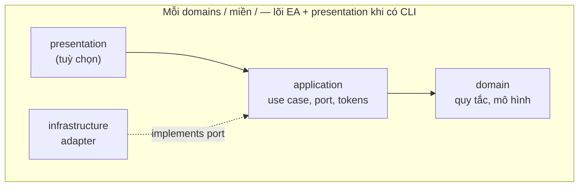

# `@codefast/cli` — đặc tả thiết kế (làm mới từ đầu)

<a id="opening-workflow-old-snapshot"></a>

**Quy trình nền (bắt buộc — đọc trước khi triển khai cây `src/` mới):** đặc tả này **không** khuyến khích refactor “tại chỗ” kéo dài trong cùng một `src/` mà không snapshot. **Chuẩn triển khai** là: (1) **chuyển toàn bộ** `packages/cli/src/` → `packages/cli/old/src/` **và** `packages/cli/tests/` → `packages/cli/old/tests/` để giữ bản chỉ đọc của mã và test cũ; (2) **làm lại** `src/` và `tests/` ở gốc gói như **cây hoàn toàn mới** theo [mục 7](#7-src-directory-layout) và các phần EA/DI — chi tiết thứ tự file, ràng buộc CI và xoá `old/` khi xong: [mục 9.1](#9-1-old-snapshot), [Bước 0](#step-0-section-10-import-boundaries). Mục đích của `old/` là **đối chiếu hành vi**, **port thuật toán** và **oracle test**, không phải nguồn import trong `src/` mới ([mục 2.3](#2-3-import-boundary-enforcement)).

> `Commander` · **Kiến trúc tường minh (Explicit Architecture)** · `@codefast/di` · Tổ chức theo miền · Ưu tiên lớp — **mục 3** là hợp đồng _hành vi_ đối với người dùng (WHAT). **Cây `src/` mới** cố ý khác snapshot ở _cách wiring và ranh giới_ (HOW): một miền rõ ràng, một policy DI, không sao chép lỗi thiết kế cũ — xem [mục 1.4](#1-4-behavior-parity-not-code-parity). Snapshot `old/` chỉ để đối chiếu và trích thuật toán.

**Phạm vi “đã chốt” vs “cổng trước code miền”:** toàn bộ tài liệu là **đặc tả làm việc**: **hành vi** [mục 3](#3-product-behavior) và quy tắc **EA / DI / cây `src/`** ở [mục 4](#4-explicit-architecture)–[7](#7-src-directory-layout) là chuẩn triển khai. **[Mục 10](#10-open-decisions)** ghi **hai quyết định kiến trúc đã chốt** (chia sẻ AST giữa `arrange`/`tag`; chính sách `index.ts` barrel) — không cần họp thêm để “mở” §10. **[Bước 0](#step-0-section-10-import-boundaries)** vẫn là cổng **trước PR đầu có `src/domains/**`**: bật [mục 2.3](#2-3-import-boundary-enforcement) trên CI và dựng khung `src/` tuân SPEC; từ chối merge nếu thiếu.

---

<a id="toc"></a>

## Mục lục

_Liên kết cùng tệp dùng fragment `#` **tiếng Anh**; ngay trên mỗi tiêu đề h2–h6 có `<a id="…"></a>` để neo không phụ thuộc slug tự sinh từ tiêu đề tiếng Việt (GitHub / VS Code)._

1. [Bối cảnh và mục tiêu](#1-context-and-goals)
   - [1.1 Vấn đề với cấu trúc hiện tại (`src/lib/**`)](#1-1-current-layout-issues)
   - [1.2 Mục tiêu khi viết lại](#1-2-rewrite-goals)
   - [1.3 Phạm vi không làm](#1-3-out-of-scope)
   - [1.4 Thiết kế mới: parity hành vi, không parity mã cũ](#1-4-behavior-parity-not-code-parity)
2. [Nền tảng kỹ thuật và ràng buộc monorepo](#2-technical-foundation)
   - [2.1 Gói `@codefast/di` — API dùng cho CLI](#2-1-di-package-api)
   - [2.2 `@codefast/di` trong CLI — lý do chọn và ngân sách khởi động](#2-2-di-cli-rationale-startup-budget)
   - [2.3 Ranh giới import (kiểm chứng tự động)](#2-3-import-boundary-enforcement)
3. [Hành vi sản phẩm — tương đương bắt buộc](#3-product-behavior)
   - [3.1 Điểm vào, chương trình `Commander`, vòng đời container](#3-1-entry-commander-container-lifecycle)
   - [3.2 Tùy chọn toàn cục và quy ước nhập-xuất](#3-2-global-io-conventions)
   - [3.3 Mã thoát và lớp lỗi thống nhất](#3-3-exit-codes-unified-errors)
   - [3.4 Cấu hình `codefast.config.*`](#3-4-codefast-config)
   - [3.5 Miền `arrange`](#3-5-arrange-domain)
     - [3.5.1 Hằng số miền `arrange`](#3-5-1-arrange-constants-parity)
   - [3.6 Miền `mirror`](#3-6-mirror-domain)
   - [3.7 Miền `tag` / `annotate`](#3-7-tag-annotate-domain)
   - [3.8 Móc vòng đời `onAfterWrite`](#3-8-on-after-write-hook)
   - [3.9 Phần dùng chung giữa các miền](#3-9-cross-domain-shared)
   - [3.10 Checklist kịch bản kiểm thử (parity)](#3-10-parity-test-checklist)
4. [Kiến trúc tường minh (Explicit Architecture)](#4-explicit-architecture)
   - [4.1 Ba khối và luồng điều khiển](#4-1-three-blocks-control-flow)
   - [4.2 Port và bộ thích ứng (lục giác / vành)](#4-2-ports-adapters-hex-onion)
   - [4.3 Lõi ứng dụng: tầng ứng dụng và tầng miền](#4-3-application-domain-core)
   - [4.4 Thành phần (component) và gói theo miền](#4-4-components-package-by-domain)
   - [4.5 Đảo ngược phụ thuộc và gốc composition](#4-5-dependency-inversion-composition-root)
   - [4.6 Ánh xạ vào cây thư mục trong gói](#4-6-directory-mapping)
   - [4.7 Quy ước đặt tên tệp](#4-7-file-naming-conventions)
5. [Ưu tiên class, `Commander` ở biên, Zod](#5-classes-commander-zod)
6. [Quy ước `@codefast/di`](#6-di-conventions)
   - [6.1 Module theo miền](#6-1-modules-per-domain)
   - [6.2 Gốc composition (bootstrap)](#6-2-composition-root)
   - [6.3 Bind port → bộ thích ứng; cross-domain (`config` → miền khác)](#6-3-port-bindings-cross-domain-config)
   - [6.4 Đăng ký nhiều `CliCommand` (multi-binding — đã hỗ trợ sẵn)](#6-4-multibind-clicommand)
   - [6.5 Scope mặc định](#6-5-default-scope)
   - [6.6 Vòng đời theo môi trường](#6-6-lifecycle-by-environment)
7. [Cấu trúc thư mục `src/` — package by domain + Explicit Architecture](#7-src-directory-layout)
   - [7.1 Trục domains: một thư mục con = một miền](#7-1-domain-axis)
   - [7.2 Bốn tầng trong mỗi miền (cùng một lát cắt)](#7-2-four-layers-per-slice)
   - [7.3 Cây src đầy đủ và chỗ đặt module DI](#7-3-full-src-tree-di-modules)
   - [7.4 Bố cục shell](#7-4-shell-layout)
8. [Chiến lược kiểm thử](#8-testing-strategy)
9. [Kế hoạch chuyển đổi](#9-migration-plan)
   - [9.1 Lưu trữ mã và kiểm thử cũ trong `old/`](#9-1-old-snapshot)
   - [Bước 0 — Ranh giới import và khung `src/`](#step-0-section-10-import-boundaries)
   - [9.2 Hoàn thành theo miền (Definition of Done)](#9-2-definition-of-done)
10. [Quyết định bước 0 (đã chốt trong SPEC)](#10-open-decisions)

---

<a id="1-context-and-goals"></a>

## 1. Bối cảnh và mục tiêu

<a id="1-1-current-layout-issues"></a>

### 1.1 Vấn đề với cấu trúc hiện tại (`src/lib/**`)

**Hiện trạng mã nguồn:** gói không còn `src/lib/**`; cây làm việc theo [mục 7.3](#7-3-full-src-tree-di-modules) (`src/domains/**`, `src/shell/**`, `src/bootstrap/**`). Phần dưới ghi lại **động lực** của đợt refactor: trước đó mã đã phân lớp và đảo phụ thuộc phần nào, nhưng cây `lib/` **chưa** phản chiếu rõ **kiến trúc tường minh** (gói theo thành phần + port/bộ thích ứng) như [mục 4](#4-explicit-architecture). Hệ quả điển hình:

- Cây `lib/` từng trộn `arrange`, `mirror`, `tag`, `core`, `config`, `kernel`, `shared`, `infrastructure` — khó biết một tính năng thuộc về đâu chỉ nhìn đường dẫn.
- Trộn **lớp** (`@injectable`) với **hàm** ở nhiều lớp (hiển thị, dịch vụ, nạp cấu hình) nên khó có một quy ước thống nhất.

<a id="1-2-rewrite-goals"></a>

### 1.2 Mục tiêu khi viết lại

- **Quy trình repo:** trước khi gắn mã mới vào cây `src/` theo SPEC, **ưu tiên** hoàn tất [mục 9.1](#9-1-old-snapshot) (snapshot `src/` + `tests/` vào `old/`) rồi mới coi `src/` / `tests/` ở gốc gói là **làm mới hoàn toàn** theo layout §7 — tránh hai “nguồn sự thật” trong cùng một cây làm việc.
- **Giữ nguyên** môi trường chạy: `Commander`, `@codefast/di`, Node ESM, `bin` `codefast`, và **toàn bộ tương đương hành vi** ở [mục 3](#3-product-behavior), trừ khi ghi rõ thay đổi phá vỡ tương thích trong đặc tả hoặc `CHANGELOG.md`.
- **Căn cứ kiến trúc**: áp dụng các quy tắc đã **chốt** ở [mục 4](#4-explicit-architecture) (tổng hợp từ Graça: Ports & Adapters, Onion, Clean, thành phần theo miền).
- **Cây theo miền**: `domains/arrange`, `domains/mirror`, `domains/tag`, `domains/config` (tải `codefast.config` và prelude chung), cùng `bootstrap/` và `shell/` (nhân chung tối thiểu — tương tự shared kernel trong bài gốc; giữ nhỏ).
- **Ưu tiên lớp** cho mọi thành phần tham gia đồ thị DI và điều phối; hàm chỉ dùng cho tiện ích thuần, phạm vi nhỏ, đặt cạnh lớp sở hữu.
- **Một gốc composition mỏng**, ràng buộc theo module từng miền.
- **Thiết kế mới có chủ đích** — không nhằm “dời thư mục rồi giữ nguyên mọi quyết định wiring” của mã cũ. Các khác biệt **cố ý** so với snapshot (đồ thị DI, miền `config`, `shell/` mỏng, v.v.) được gom ở [mục 1.4](#1-4-behavior-parity-not-code-parity).
- **Chi phí duy trì EA:** ranh giới import và module theo miền là **đầu tư** chống regression khi viết lại; nếu sau khi ổn định team muốn giản lược có chứng cứ số đo, có thể đề xuất trong PR / ADR riêng — ngoài phạm vi “một lần” chuyển cây `src/` này.

<a id="1-3-out-of-scope"></a>

### 1.3 Phạm vi không làm

- Thay `Commander` hoặc dùng bộ chứa DI khác.
- Hỗ trợ môi trường không phải Node.
- Đổi tên gói hoặc diễn giải quy ước phiên bản (kiểu semver) ngoài những gì đã thống nhất hướng người dùng ở mục 3.

<a id="1-4-behavior-parity-not-code-parity"></a>

### 1.4 Thiết kế mới: parity hành vi, không parity mã cũ

**Phân tách hai lớp đặc tả**

| Lớp                                 | Nội dung                                | Ràng buộc                                                            |
| ----------------------------------- | --------------------------------------- | -------------------------------------------------------------------- |
| **Hành vi (mục 3)**                 | Lệnh, cờ, thoát mã, JSON, config, hook… | **Bắt buộc** tương đương trừ khi ghi `CHANGELOG` / đặc tả            |
| **Kiến trúc & wiring (mục 4–7, 6)** | Đường dẫn, port, module, bind           | **Được** và **nên** tốt hơn snapshot — chỉ cần vẫn thỏa mục 3 + test |

**Đột phá / quyết định mới (không có trong “chỉ dịch sang `@codefast/di` giữ nguyên bố cục cũ”)**

1. **Miền `config` tách khỏi “kernel/core”** — prelude tải `codefast.config` là bounded context riêng ([mục 4.4](#4-4-components-package-by-domain), [mục 7](#7-src-directory-layout)), thay vì logic cấu hình trải rác dưới tên kỹ thuật chung.
2. **`shell/` chỉ nhân chung: hợp đồng + token** — không `shell/application/`; mọi ca nghiệp vụ nằm trong `domains/*` ([mục 4.4](#4-4-components-package-by-domain), [mục 7.4](#7-4-shell-layout)).
3. **Đồ thị DI một nghĩa cho lệnh** — snapshot cũ dễ tạo **hai singleton** cho cùng một `*Command` vì bind **thừa** class token (`bind(ArrangeCommand).toSelf()…`) **và** bind `CliCommandToken`. Thiết kế mới: **chỉ** `bind(CliCommandToken).to(*Command).whenNamed(…).singleton()` trong từng miền — **không** bind class token cho lệnh; `bootstrap` lấy danh sách bằng **`resolveAll(CliCommandToken)`** ([mục 6.4](#6-4-multibind-clicommand)). **`toAlias`** không dùng cho đăng ký lệnh CLI. Đây là thay đổi **cố ý** so với composition-root cũ.
4. **Ranh giới Port → Adapter có tên và kiểm chứng được** — mọi IO (fs, workspace, TS AST…) đi qua port trong `application/` với adapter trong `infrastructure/`; presentation không “với tay” vào chi tiết fs ngoài DTO đã chốt ([mục 4](#4-explicit-architecture)).
5. **Quy ước tệp một-một** — bỏ “hoặc” mơ hồ giữa pattern đặt tên; giảm quyết định lúc gõ máy ([mục 4.7](#4-7-file-naming-conventions)).
6. **Cây test là bằng chứng thiết kế** — checklist parity ([3.10](#3-10-parity-test-checklist)) + độ phủ ([mục 8](#8-testing-strategy)) biện minh rằng kiến trúc mới vẫn cố định hành vi, không chỉ “đẹp trên giấy”.

**Điều không coi là đột phá (giữ nguyên có chủ đích)**

- **Công cụ**: `Commander`, `@codefast/di`, ESM — đã chốt; không đổi framework chỉ để “mới”.
- **Mục 3** — không “cải tiến hành vi” ngầm; mọi thay đổi facing-user phải tài liệu hoá.

---

<a id="2-technical-foundation"></a>

## 2. Nền tảng kỹ thuật và ràng buộc monorepo

| Thành phần        | Ghi chú                                                                              |
| ----------------- | ------------------------------------------------------------------------------------ |
| Node              | `>=22` (theo `package.json`)                                                         |
| Kiểu module       | ESM (`"type": "module"`)                                                             |
| Thư viện CLI      | `Commander`                                                                          |
| DI                | `@codefast/di` — chi tiết API dùng trong gói: [mục 2.1](#2-1-di-package-api)         |
| Kiểm tra tại biên | Zod (schema request sau khi gom tùy chọn `Commander`)                                |
| Cấu hình động     | `jiti` cho `codefast.config.{js,mjs,cjs}`; đọc JSON cho `.json`                      |
| Import nội bộ     | `#/*` theo quy tắc workspace                                                         |
| Kiểm thử          | Vitest, hồ sơ **môi trường Node**; chỉ `tests/**`, không đặt file test dưới `src/**` |

<a id="2-1-di-package-api"></a>

### 2.1 Gói `@codefast/di` — API dùng cho CLI

Tham chiếu mã: `packages/di/src/` (bản trong monorepo). Dưới đây dùng **tên file + API** (interface / method), không gắn số dòng (dễ lệch khi refactor).

**Container**

- Tạo: `Container.create()` → `DefaultContainer` thỏa interface `Container` (`container.ts` — `interface Container`, `Container.create`).
- Gom module sẵn: `Container.fromModules(...syncModules)` / `await Container.fromModulesAsync(...modules)` (`container.ts` — `ContainerStatic`).
- Ràng buộc: `container.bind(tokenOrClass)` → fluent theo `BindToBuilder` trong `binding.ts`: `.to(Class)` / `.toSelf()` / `.toConstantValue` / `.toDynamic` / `.toDynamicAsync` / `.toResolved` / `.toResolvedAsync` / `.toAlias`.
- Sau `.to` / `.toSelf` / …: trên `BindingBuilder` gọi `.singleton()` | `.transient()` | `.scoped()` — nếu **chưa** gọi một trong ba, binding mặc định **`transient`** (mỗi lần resolve một instance mới cho đến khi chốt scope bằng `.singleton()` v.v.).
- **Cùng token, nhiều hiện thực:** `bind(token)` nhiều lần + phân **slot** bằng `.whenNamed`, `.whenTagged`, `.whenDefault`, hoặc `.when(predicate)` với `predicate` động (xem `BindingBuilder` trong `binding.ts`; ví dụ `examples/06-constraints-multi-binding/06-constraints-multi-binding.ts`).
- Resolve: `resolve(token, hint?)`, `resolveAll(token, hint?)`, và biến thể `*Async` / `resolveOptional*` (khai báo trên `interface Container`). `hint`: `ResolveOptions` trong `types.ts` — `{ name?, tag?, tags? }`.

**Singleton cache — quan trọng cho CLI**

- Cache singleton gắn với **`binding.id`** (định danh từng binding), **không** gộp theo class. Hai lần `bind(...).to(CùngMộtClass).singleton()` tạo **hai binding id** → có thể có **hai instance khác nhau** tùy cách resolve (xem [mục 6.4](#6-4-multibind-clicommand)).

**Module và `load`**

- `Module.create(name, (builder) => { … })` — `builder.bind` như `container.bind`, `builder.import(...modules)` (`module.ts` — `Module`, `ModuleBuilder`).
- `container.load(mod1, mod2, …)` variadic **đồng bộ**; `await container.loadAsync(…)` cho `AsyncModule` (`DefaultContainer.load` / `loadAsync` trong `container.ts`).
- **Không** có topological sort toàn cục trước khi chạy module: thứ tự nạp là thứ tự `load(...)` và thứ tự `builder.import()` **trong lúc** `_setup` đang chạy (dedup theo identity object module). Phụ thuộc vòng (`A` import `B` mà `B` import `A`) là rủi ro thiết kế — cần tự đảm bảo DAG hoặc tách binding chung.

**Vòng đời container**

- `DefaultContainer.validate()` — `void`, **ném** `ScopeViolationError` khi singleton bắt captive dependency.
- `DefaultContainer.initializeAsync()` — `Promise<void>`, làm nóng singleton: **chỉ bỏ qua** binding có **`binding.predicate !== undefined`** (tức nhánh `.when(fn)` động). **`.whenNamed` / `.whenTagged` chỉ gán `slot`, không gán `predicate`** → các singleton đó **vẫn** được warm-up; `resolveAsync` dùng `slotKeyToResolveOptions(binding.slot)` làm hint (ví dụ `{ name: "arrange" }`).
- `await container.dispose()` / `[Symbol.asyncDispose]` — idempotent; `[Symbol.dispose]` **ném** `SyncDisposalNotSupportedError` (`DefaultContainer` trong `container.ts`).

**`inject()` — hai vai trò**

- **Phần tử deps:** `inject(token, options?)` trả về `InjectionDescriptor` dùng trong mảng `@injectable([inject(Token), …])` (`inject.ts`).
- **Field accessor:** cùng hàm có thể dùng làm decorator trên `accessor` — inject sau construct qua `getActiveContainer()` (`inject.ts`, `environment.ts`). Khác hoàn toàn với khai báo deps ctor; CLI ưu tiên pattern ctor + `@injectable([…])` trừ khi có lý do.

**`optional()` và `injectAll()` — descriptor trong mảng deps**

- `optional(token, options?)` — descriptor `optional: true` cho dependency có thể không bound (`inject.ts`).
- `injectAll(token, options?)` — descriptor `multi: true` để resolve **mảng** mọi binding khớp token (và filter `name`/`tags` nếu có) — **không** phải decorator độc lập; **chỉ** hợp lệ trong `@injectable([…])`.

**`@injectable` / lifecycle**

- `@injectable([deps])` hoặc `@injectable()`; `@postConstruct` / `@preDestroy` (`injectable.ts`, `lifecycle-decorators.ts`).
- **Ràng buộc `@codefast/cli`:** trong production, `runCli` **không** gọi `initializeAsync()` — `@postConstruct` **không bao giờ** chạy trên môi trường đó. **Cấm** dùng `@postConstruct` cho logic **thiết yếu** suốt process (mở kết nối, khởi tạo trạng thái mà resolve sau này phụ thuộc tuyệt đối); chỉ dùng cho warm-up **có thể bỏ qua** (pre-cache, log diagnostic). Xem [mục 3.1](#3-1-entry-commander-container-lifecycle). **Gợi ý enforcement:** mọi class có `@postConstruct` trong gói nên có ghi chú một dòng `// SPEC §2.1 — chỉ warm-up, không logic bắt buộc`; khi thêm ESLint tùy chỉnh, cân nhắc rule cảnh báo nếu decorator xuất hiện ngoài danh sách ngoại lệ (cập nhật trong PR wiring cùng `dependency-cruiser`).
- Không dùng `reflect-metadata` cho constructor params — deps khai báo bằng mảng (README gói `di`).

**Token**

- `token<Value>(name): Token<Value>` — branded `{ name: string }` (`token.ts`). Cùng **class constructor** làm khóa `bind` / `resolve`.

**`@codefast/di/constraints` (predicate cho `.when`)**

- Xuất đủ tám hàm từ `constraints.ts`: `whenParentIs`, `whenNoParentIs`, `whenAnyAncestorIs`, `whenNoAncestorIs`, `whenParentNamed`, `whenAnyAncestorNamed`, `whenParentTagged`, `whenAnyAncestorTagged`.

**Scoped trên root**

- `scoped()` resolve trên **root** container (`createChild()` = false) dẫn tới **`MissingScopeContextError`** khi cố gắng lưu instance scoped (`scope.ts` — `setScoped`). `@codefast/cli` chỉ dùng root process-wide → **không** dùng `.scoped()` trong cây này.

<a id="2-2-di-cli-rationale-startup-budget"></a>

### 2.2 `@codefast/di` trong CLI — lý do chọn và ngân sách khởi động

**Mục tiêu khởi động** ([mục 8 — thời gian khởi động](#8-testing-strategy), ~&lt; 500 ms tới `parseAsync`) **áp vào đường production**: `Container.create` + `load(module…)` + `resolveAll(CliCommandToken)` — **không** kèm `validate()` / `await initializeAsync()` ([mục 3.1](#3-1-entry-commander-container-lifecycle)). Chi phí DI trong lộ trình đó là **ràng buộc module**, **bảng registry** và **resolve ctor**; không có vòng lặp request dài như server.

**Vì sao vẫn dùng `@codefast/di` thay vì “new thủ công”:**

- Cùng **một** bộ chứa với phần còn của monorepo — kiểm chứng được `ScopeViolationError`, multi-binding `CliCommandToken`, và tài liệu [mục 2.1](#2-1-di-package-api) khớp mã thật.
- **Rủi ro đã thừa nhận:** `validate()` / `initializeAsync()` trong test có chi phí (duyệt đồ thị, warm-up singleton) — đó là **cố ý** để bắt lỗi wiring sớm; production **trả giá bằng** việc không gọi hai bước đó. Nếu đo regression startup, so sánh **production path**; đừng lấy số có `initializeAsync` làm proxy cho CLI thật.
- **Khi tranh luận “DI quá nặng”:** phải có **số đo** (flamegraph / `node --cpu-prof` / timestamp trong `runCli`) chứng minh container chiếm phần lớn ngân sách; nếu không, ưu tiên giữ một mô hình wiring đã chốt ở [mục 6](#6-di-conventions) thay vì tự chế factory song song.

**Không đổi container trong phạm vi đặc tả này** ([mục 1.3](#1-3-out-of-scope)); mọi đề xuất thay DI là thay đổi phạm vi — PR riêng + cập nhật mục 1.3 nếu team chấp nhận.

<a id="2-3-import-boundary-enforcement"></a>

### 2.3 Ranh giới import (kiểm chứng tự động)

Quy tắc [mục 4.6](#4-6-directory-mapping) **phải** được kiểm chứng bằng công cụ trong CI, không chỉ qua review.

- **Chốt:** dùng **`dependency-cruiser`** (hoặc tương đương, ví dụ `eslint-plugin-boundaries`) với rule phản ánh tầng trong từng `domains/<miền>/`, **cấm** import lớp cụ thể giữa hai miền (`domains/foo` → `domains/bar/**`), và **danh sách cho phép** tới `shell/contracts/**` (xem [4.4](#4-4-components-package-by-domain)).
- Vi phạm công cụ ranh giới trong `packages/cli` = **không merge** (trừ PR chỉ sửa cấu hình rule, kèm cập nhật đặc tả nếu đổi chính sách).
- **Hạn chót:** cấu hình tối thiểu (file rule + lệnh trong `package.json` của gói + chạy trong CI) phải có **trước khi merge** nhánh đầu tiên chứa bất kỳ `src/domains/**` nào — cùng cửa sổ với [bước 0](#step-0-section-10-import-boundaries) / PR dựng khung cây. **Không** trì hoãn tới “khi đã có nhiều mã”.
- **Rule mẫu — cấm import từ `old/`:** trong file cấu hình `dependency-cruiser` của gói, bảo đảm có quy tắc dạng **không cho** mã dưới `src/` (và `tests/` mới nếu muốn) resolve tới `old/` — ví dụ:

```javascript
// dependency-cruiser.cjs (hoặc .js) — rút gọn; điều chỉnh path theo repo thật
module.exports = {
  forbidden: [
    {
      name: "no-import-from-old-snapshot",
      comment: "SPEC §9.1 — src/ mới không import old/",
      severity: "error",
      from: { path: "^(src|tests)/" },
      to: { path: "^old/" },
    },
    // EA trong từng miền: domain/ không import application/ (đảo ngược [4.6](#4-6-directory-mapping))
    {
      name: "no-domain-imports-application",
      comment: "SPEC §4.6 — domain không phụ thuộc application",
      severity: "error",
      from: { path: "^src/domains/[^/]+/domain/" },
      to: { path: "^src/domains/[^/]+/application/" },
    },
  ],
};
```

Bản **đầy đủ** (cấm `domain` → `presentation` / `infrastructure`, `application` → `presentation`, chéo miền…) do PR dựng cây gửi kèm; đặc tả không nhân bản toàn bộ file để tránh lệch khi công cụ đổi phiên bản. Rule trên là **tối thiểu** chứng minh hướng EA — copy-paste được ngay.

---

<a id="3-product-behavior"></a>

## 3. Hành vi sản phẩm — tương đương bắt buộc

Đây là **hợp đồng hành vi** (WHAT) rút từ `packages/cli/src` và từ `README.md` (phần mô tả cho người dùng). Bản triển khai mới phải tương đương. **Cách tổ chức mã và DI** không bắt buộc trùng snapshot — các đột phá cố ý nằm ở [mục 1.4](#1-4-behavior-parity-not-code-parity).

**JSON trên stdout — định nghĩa “tương đương” (oracle):**

- **Ngữ nghĩa**, không **bit-for-bit** (byte giống hệt / thứ tự key) trừ khi test cụ thể ghi rõ cần snapshot chuỗi: `JSON.parse` hai bên rồi so sánh **trường theo đặc tả** (`schemaVersion`, `ok`, cấu trúc `result`, v.v.).
- **`schemaVersion`:** phải khớp số phiên bản schema output do mục 3 quy định (hiện `1` các ví dụ).
- **`null` vs bỏ trường:** với các trường đã nêu tường minh (ví dụ `hookError: string | null` — [3.8](#3-8-on-after-write-hook)), payload phải có **trường đó** với giá trị `null` hoặc chuỗi — **không** “lặn” trường khi đặc tả đã chốt nullable.
- **Fixture / test gốc (đường dẫn cụ thể — sau [9.1](#9-1-old-snapshot) nằm dưới `old/tests/`):** dùng làm oracle JSON và hành vi lệnh khi port — ví dụ:
  - `old/tests/integration/mirror/run-mirror-sync.integration.test.ts` — `--json` / `exports` / workspace tạm;
  - `old/tests/integration/mirror/mirror-command.integration.test.ts` — lệnh `mirror` qua Commander;
  - `old/tests/integration/arrange/run-arrange-sync.integration.test.ts`, `old/tests/integration/arrange/arrange-command.integration.test.ts`, `old/tests/integration/arrange/analyze-directory.integration.test.ts`, `old/tests/integration/arrange/group-file.integration.test.ts` — analyze / preview / apply / group;
  - `old/tests/integration/tag/run-tag-sync.integration.test.ts`, `old/tests/integration/tag/tag-command-and-presenter.integration.test.ts` — `tag` / presenter;
  - `old/tests/integration/core/bin.integration.test.ts`, `old/tests/integration/core/cli-runtime.integration.test.ts` — entry / runtime (trước 9.1 tương đương `packages/cli/tests/integration/...`). Trích JSON mẫu từ assertion hoặc stdout mock trong các file đó vào `tests/fixtures/cli-json/` khi cần golden nhỏ.

<a id="3-1-entry-commander-container-lifecycle"></a>

### 3.1 Điểm vào, chương trình `Commander`, vòng đời container

- **`src/bin.ts`**: đọc `process.argv`, gọi `runCli(argv)`, `process.exit(code)` với số nguyên trả về.
- **`runCli`** (`bootstrap/run-cli.ts`) — **cấu trúc bắt buộc** (`runtimeContainer` có thể là tên biến tương đương):

```typescript
export async function runCli(argv: string[]): Promise<number> {
  let runtimeContainer: ReturnType<typeof createCliRuntimeContainer> | undefined;
  try {
    runtimeContainer = createCliRuntimeContainer();
    if (process.env.NODE_ENV !== "production") {
      runtimeContainer.validate();
      await runtimeContainer.initializeAsync();
    }
    // resolve lệnh, dựng Commander, await program.parseAsync(argv, { from: "node" }) …
    return process.exitCode ?? 0;
  } catch (error) {
    if (error instanceof ScopeViolationError /* từ @codefast/di */) {
      // không đi qua consumeCliAppError / AppError — lỗi đồ thị DI khi validate
      console.error(error);
      process.exitCode = 1; // CLI_EXIT_GENERAL_ERROR — cùng nhóm “lỗi chung” [3.3]
      return 1;
    }
    throw error; // lỗi không mong đợi trong bootstrap — để lớp ngoài / bin quyết định
  } finally {
    if (runtimeContainer !== undefined) {
      await runtimeContainer.dispose();
    }
  }
}
```

- **`ScopeViolationError`:** từ `validate()` khi `NODE_ENV !== "production"` — **không** ánh xạ qua `consumeCliAppError` hay mô hình `AppError`; xử lý như **lỗi hạ tầng / wiring**, thoát **`1`** (`CLI_EXIT_GENERAL_ERROR`, [mục 3.3](#3-3-exit-codes-unified-errors)), in lỗi chẩn đoán (stderr). **`finally`** luôn gọi `dispose()` khi container đã tạo — kể cả sau `validate()` ném.
- **`createCliRuntimeContainer`:** định nghĩa trong `bootstrap/cli-composition-root.ts` — chỉ wiring DI ([mục 7.3](#7-3-full-src-tree-di-modules)).
- **Production** bỏ `validate()` / `await initializeAsync()` để giảm chi phí — **hệ quả:** `@postConstruct` **không** chạy trong production. **Bắt buộc:** không dùng `@postConstruct` cho trạng thái thiết yếu suốt process; chỉ tối ưu tùy chọn (xem [mục 2.1](#2-1-di-package-api)). **Bù trừ:** test/CI với `NODE_ENV !== "production"` — [mục 8](#8-testing-strategy).
- **`version` trên lệnh gốc:** đọc trường `"version"` từ `package.json` **của gói** `@codefast/cli` (bundle publish). **Chốt (ESM):** dùng `import { createRequire } from "node:module"; const require = createRequire(import.meta.url); const { version } = require("./package.json") as { version: string };` — đường dẫn `./package.json` phải resolve tới gói publish (cùng thư mục với entry bundle sau build). **Cấm** xen kẽ `readFile`+`JSON.parse` cho cùng mục đích trong các PR khác nhau; nếu vì lý do bất khả kháng đổi cách đọc, cập nhật một dòng tại đây + `CHANGELOG`.
- Các bước còn lại: resolve danh sách lệnh — chuẩn **`container.resolveAll(CliCommandToken)`** (sau `load` module — [mục 6.4](#6-4-multibind-clicommand)), rồi tạo program gốc (`configureHelp`, `showHelpAfterError`, `--no-color`), `await program.parseAsync(argv, { from: "node" })`.

<a id="3-2-global-io-conventions"></a>

### 3.2 Tùy chọn toàn cục và quy ước nhập-xuất

- **Tùy chọn gốc**: `--no-color` (`Commander` ánh xạ tới `color: false` khi phân tích cú pháp toàn cục — `mirror` dùng `parseGlobalCliOptions` từ [mục 7.4](#7-4-shell-layout) và `command.optsWithGlobals()`).
- **Phiên bản / trợ giúp**: `-V` / `--version`, `-h` / `--help` (có sẵn trên lệnh gốc). **Parity chuỗi:** không yêu cầu help **byte-for-byte** giống `old/`; **bắt buộc** có integration test đối chiếu với `old/tests/integration/core/bin.integration.test.ts` (hoặc `tests/integration/core/...` trước 9.1) sao cho **cùng tập** lệnh gốc / lệnh con xuất hiện trong output (tên và hierarchy), và `--version` in **đúng** trường `"version"` từ `package.json` của gói ([3.1](#3-1-entry-commander-container-lifecycle)).
- **Luồng**: chẩn đoán → **stderr**; kết quả chính → **stdout**. Với **`--json`**, **chỉ** một đối tượng JSON trên stdout — **không** in tiến trình hướng người trên stdout/stderr theo kiểu progress (trừ lỗi/chẩn đoán nếu quy ước lệnh cho phép).
- **`--verbose` + `--json` (chốt):** **`--json` thắng** cho hướng người: **không** in log verbose / progress stream hướng người; stdout chỉ JSON. Nếu cần chẩn đoán khi gỡ lỗi, dùng môi trường dev **không** kèm `--json` hoặc mở rộng sau với cờ riêng (ghi `CHANGELOG` nếu đổi hành vi).

<a id="3-3-exit-codes-unified-errors"></a>

### 3.3 Mã thoát và lớp lỗi thống nhất

**Hằng số** (`cli-exit-codes.domain.ts`):

| Mã  | Ý nghĩa                                                                                                                                                        |
| --- | -------------------------------------------------------------------------------------------------------------------------------------------------------------- |
| `0` | Thành công                                                                                                                                                     |
| `1` | Lỗi chung (`CLI_EXIT_GENERAL_ERROR`) — hạ tầng, `ScopeViolationError` từ `validate()`, lỗi một phần ở `mirror`, móc thất bại, `tag` không có target / lỗi chạy |
| `2` | Sai cách gọi hoặc không đạt kiểm tra hợp lệ (`CLI_EXIT_USAGE`) — `AppError` mã `VALIDATION_ERROR` (Zod / schema CLI)                                           |

**`AppError`** (đối tượng **không** `extends Error` — tránh `throw` trực tiếp như exception JS thuần): vật dạng `{ code: …; message: string; cause?: Error }` với `code` ∈ `NOT_FOUND` \| `VALIDATION_ERROR` \| `INFRA_FAILURE`; nằm trong `Result`; `consumeCliAppError` ánh xạ tới `process.exitCode` và in `formatAppError`. **Stack:** với `INFRA_FAILURE`, nếu có `cause instanceof Error`, chế độ chẩn đoán chi tiết in **`cause.stack`** (stack của lỗi gốc), không giả định `AppError` tự có `.stack`.

**Theo từng miền (cụ thể hoá trên nền trên):**

- **`arrange` đồng bộ (preview/apply)**: `hookError !== null` → thoát `1`; payload JSON có `ok: hookError === null`.
- **`mirror sync`**: `packagesErrored > 0` → thoát `1`; JSON `ok: packagesErrored === 0`.
- **`tag`**: `exitCodeForTagSyncResult` — không có target đã chọn, hoặc bất kỳ `runError`, hoặc `hookError` → `1`.

<a id="3-4-codefast-config"></a>

### 3.4 Cấu hình `codefast.config.*`

**Tìm file** (`config-loader.adapter.ts`):

- Duyệt lên từ `startDir`; tại mỗi thư mục thu thập theo thứ tự: `codefast.config.mjs`, `.js`, `.cjs`, rồi `codefast.config.json`.
- **File đầu tiên** gặp khi duyệt từ thư mục làm việc là file được tải (ưu tiên gần thư mục làm việc).
- Bộ nhớ đệm theo `resolve(startDir)` — cùng `startDir` → cùng promise tải.

**Tải nội dung**:

- `.json`: `readFile` + `JSON.parse` + `codefastConfigSchema.parse`.
- `.js` / `.mjs` / `.cjs`: `jiti(jitiBaseDir, { interopDefault: true, moduleCache: false })`, lấy `default` nếu có, rồi kiểm tra bằng Zod.

**Schema Zod** (`config-schema.adapter.ts`) — dạng `CodefastConfig` strict:

- `mirror?`: `skipPackages?`, `pathTransformations?` (bản ghi chuỗi → `{ removePrefix? }`), `customExports?` (bản ghi → bản ghi specifier → đường dẫn), `cssExports?` (bản ghi → boolean hoặc `{ enabled?, customExports?, forceExportFiles? }`).
- `tag?`: `skipPackages?`, `onAfterWrite?` (tùy biến Zod: phải là hàm).
- `arrange?`: `onAfterWrite?` (hàm).

**Kiểu trong tầng miền** (`schema.domain.ts`): `CodefastAfterWriteHook` = `(ctx: { files: string[] }) => void | Promise<void>`.

**Cảnh báo**: `LoadCodefastConfigUseCase` báo cảnh báo qua `ConfigWarningReporterPort` (in stdout với tiền tố màu vàng). Port này nằm trong `domains/config/application/ports/`; adapter **`config-warning-reporter.adapter.ts`** trong `domains/config/infrastructure/adapters/`, `@injectable([inject(CliLoggerToken), …])` (hoặc token logger đã chốt trong `shell/contracts/tokens.ts`) — **không** cần `presentation/`; binding trong `config.module.ts` — [mục 6.3](#6-3-port-bindings-cross-domain-config).

`README.md` hướng người dùng nhấn: khóa `mirror`/`tag` theo **tên gói** (`package.json#name`); đặc tả coi đó là tài liệu hợp đồng.

**Chiến lược phiên bản schema:** mọi thay đổi **breaking** đối với shape `CodefastConfig` mà CLI chấp nhận (đổi tên khóa đã document, bỏ field mà người dùng hợp lệ phụ thuộc, thu hẹp kiểu không tương thích ngược) **phải** có mục trong `CHANGELOG.md` của gói và **bump major** khi publish. Thêm khóa **optional** hoặc nới `Zod` (chấp nhận thêm giá trị) thường **minor/patch** nếu không phá consumer hiện có — ghi rõ trong `CHANGELOG`.

**Ranh giới lớp (`ConfigWarningReporterAdapter`):** màu vàng / tiền tố dòng cảnh báo là **hiện thực** của `ConfigWarningReporterPort` trong `domains/config/infrastructure/` — đây là bộ thích ứng thứ hai theo port, **không** “tầng presentation” cho miền `config` (miền này không có `presentation/`; [4.6](#4-6-directory-mapping)). Logic **khi nào** cảnh báo (sau parse Zod, loại cảnh báo…) thuộc use case / domain; adapter chỉ định dạng IO theo hợp đồng port.

<a id="3-5-arrange-domain"></a>

### 3.5 Miền `arrange`

**`Commander`** (`arrange.command.ts`):

- Cấp trên: `arrange` — mô tả: phân tích / sắp xếp lại nhóm Tailwind trong `cn()` / `tv()` (Tailwind v4).
- Lệnh con:
  1. **`analyze`** — `[target]`; `--json`. Chỉ báo cáo, không ghi file.
  2. **`preview`** — `[target]`; `--with-classname` / `--with-class-name`; `--cn-import <spec>`; `--json`.
  3. **`apply`** — cùng tùy chọn như `preview`; ghi file.
  4. **`group`** — `[tokens...]`: chuỗi class dán hoặc token tách bằng khoảng trắng; `--tv`; cùng `with-class-name`; `--json`.

**Mục tiêu** (khi có `[target]` hoặc tự động): resolve qua ca chuẩn bị workspace — mặc định **gói gần nhất** (duyệt tìm `package.json`) nếu không truyền đường dẫn.

**Luồng preview / apply**:

- Mở đầu: chuẩn bị workspace → `rootDir`, `config`, đường đích, màu toàn cục.
- Phân tích cú pháp `arrangeSyncRunRequestSchema`: `rootDir`, `targetPath`, `write`, `withClassName`, `cnImport`, phần `config` cho arrange.

**Phân tích (`analyze`)**:

- `arrangeAnalyzeDirectoryRequestSchema`: `analyzeRootPath`.
- Đầu ra cho người: thống kê file `.ts/.tsx`, số call site `cn` / `tv`, danh sách (giới hạn `MAX_REPORT_LINES`) cho:
  - literal chuỗi `cn` dài (ngưỡng `LONG_STRING_TOKEN_THRESHOLD`),
  - chuỗi `tv` dài trong base/variants/…,
  - JSX `className` tĩnh dài,
  - `cn` lồng trong `tv`.
- Đầu ra JSON phân tích: `{ schemaVersion: 1, analyzeRootPath, report }`.

**Nhóm (`group`)** (không đụng hệ thống tệp):

- Gom token thành một chuỗi inline; thông báo Zod có ví dụ lệnh nếu rỗng.
- Đầu ra: dòng thuần hoặc JSON `{ schemaVersion: 1, primaryLine, bucketsCommentLine }`.

**JSON preview/apply**: `{ schemaVersion: 1, ok, write, result }` với `result` là `ArrangeRunResult` **không** gồm `previewPlans` (loại trước khi chuỗi hoá JSON).

**Miền sắp xếp lớp** (logic tương đương — bản mới phải giữ ngữ nghĩa):

- **Thứ tự bucket** theo thứ tự hiển thị (render): `existence` → … → `selector` → `other` → `arbitrary` (`BUCKET_ORDER` trong `constants.domain.ts`).
- **COMPATIBLE_BUCKET_SETS**: cặp bucket được phép gộp trong cùng literal khi kề nhau theo thứ tự sắp — không suy luận bắc cầu tùy ý.
- Hằng số giới hạn: `APPLY_MIN_TOKENS`, `MIN_GROUP_TOKENS`, `MAX_GROUPS_*`, `MAX_OBJECT_DEPTH`, `MAX_CLASS_EXPR_DEPTH`, `MAX_STRIP_VARIANT_PASSES`, v.v.
- **Bộ phân loại** xử lý biến thể Tailwind v4 (regex tiền tố responsive, `STATE_PREFIXES`, biến thể phức như `has-*`, `in-[…]`, `nth-*`, …) — chú thích trong `tailwind-token-classifier.domain-service.ts` mô tả biên.
- Quét / AST: collectors JSX, `tv`, `cn`; xử lý file và quét mục tiêu qua port `ArrangeTargetScannerService` / `ArrangeFileProcessorService`.
- Thông báo cho người sau đồng bộ: nhắc kiểm tra nhanh giao diện khi phụ thuộc thứ tự tầng CSS, nếu có chỗ cần xem hoặc đã áp dụng.

<a id="3-5-1-arrange-constants-parity"></a>

#### 3.5.1 Hằng số miền `arrange` (giá trị parity)

Các hằng dưới đây **phải giữ nguyên giá trị** so với bản hiện tại (`constants.domain.ts`) trừ khi đổi có lý do và cập nhật đặc tả + test. `COMPATIBLE_BUCKET_SETS`, `BUCKET_ORDER`, `RESPONSIVE_PREFIX`, `STATE_PREFIXES` là cấu trúc phức tạp — khi viết lại, sao chép nguyên khối từ snapshot `old/` hoặc kiểm chứng từng test.

| Hằng                          | Giá trị / ghi chú                 |
| ----------------------------- | --------------------------------- |
| `LONG_STRING_TOKEN_THRESHOLD` | `18` (số token — báo cáo analyze) |
| `APPLY_MIN_TOKENS`            | `2`                               |
| `MIN_GROUP_TOKENS`            | `2`                               |
| `MAX_GROUPS_BASE`             | `4`                               |
| `MAX_GROUPS_CAP`              | `24`                              |
| `MAX_GROUPS_HEADROOM`         | `2`                               |
| `MAX_REPORT_LINES`            | `40`                              |
| `MAX_OBJECT_DEPTH`            | `12` (`tv` object)                |
| `MAX_CLASS_EXPR_DEPTH`        | `12` (`cn` args)                  |
| `MAX_STRIP_VARIANT_PASSES`    | `12`                              |

**Công thức số nhóm tối đa (dynamic clamp, parity với `grouping.domain.ts`):** với `tokenCount` là số token trong chuỗi cần nhóm, đặt `byTokens = ceil(tokenCount / 2) + MAX_GROUPS_HEADROOM`, khi đó `maxGroups = max(MAX_GROUPS_BASE, min(MAX_GROUPS_CAP, byTokens))`. Chỉ giữ đúng ba hằng mà sai công thức này vẫn là lỗi tương đương.

<a id="3-6-mirror-domain"></a>

### 3.6 Miền `mirror`

**`Commander`** (`mirror.command.ts`):

- `mirror` → lệnh con `sync`.
- Tham số: `[package]` tuỳ chọn (đường dẫn gói tương đối gốc kho).
- Cờ: `-v`/`--verbose`, `--json`.
- Dùng `parseGlobalCliOptions` ([mục 7.4](#7-4-shell-layout)) với `optsWithGlobals()` cho màu. Kết hợp **`--verbose` + `--json`:** tuân [mục 3.2](#3-2-global-io-conventions) — không in verbose hướng người khi `--json`.

**Luồng**:

- `prepareMirrorSync`: thư mục làm việc, `packageArg`, tùy chọn toàn cục → `rootDir`, `config` đầy đủ, `packageFilter`, tùy chọn toàn cục.
- `mirrorSyncRunRequestSchema`: `rootDir`, `config.mirror`, `verbose`, `json`, `noColor`, `packageFilter`.

**Chức năng lõi** (tương đương):

- Phát hiện workspace **pnpm:** adapter đọc **`pnpm-workspace.yaml`** ở gốc kho (và/hoặc quy ước tương đương mà snapshot hiện tại dùng) để suy ra danh sách gói — ghi rõ trong port “workspace detection” và test adapter; **không** chỉ nói mơ hồ “cấu hình pnpm”.
- Đọc cây thư mục **`dist/`** (đầu ra sau bước đóng gói/biên dịch), tạo lại trường `exports` trong `package.json` theo đồ thị module (phần mở rộng `.js`/`.mjs`/`.cjs`/`.d.ts` như trong `constants.domain.ts`).
- Áp dụng `MirrorConfig`: bỏ qua gói, biến đổi đường dẫn (`removePrefix`), `customExports`, `cssExports` (viết tắt boolean hoặc object đầy đủ).
- Thứ tự nhóm export: **`GROUP_ORDER`** và logic sort trong `generate-mirror-exports.service.ts` (tên tệp trong cây mới có thể khác nhưng **bắt buộc** parity hành vi).

**JSON**: `{ schemaVersion: 1, ok, elapsedSeconds, stats }` với `stats: GlobalStats` như hiện tại.

**Thoát**: có lỗi cấp gói → tổng `packagesErrored` → thoát khác `0` (cụ thể `1`).

**Tham chiếu thuật toán (sau 9.1 — `old/src/`):** triển khai đồng bộ `exports` / nhóm key chủ yếu nằm trong `old/src/lib/mirror/application/services/generate-mirror-exports.service.ts` (`GROUP_ORDER`, thứ tự export); luồng use case tương ứng `old/src/lib/mirror/application/use-cases/run-mirror-sync.use-case.ts` (điều chỉnh nếu cây `lib/` đổi tên miền nhưng **giữ** file làm nguồn parity). Đặc tả **không** thay thế việc port đủ nhánh — nó **định vị** mã và test cần đối chiếu.

**Test tích hợp bắt buộc (DoD `mirror`):** port hoặc viết lại tương đương các kịch bản trong `old/tests/integration/mirror/run-mirror-sync.integration.test.ts` (ghi `exports`, layout `dist/`, lỗi gói, …), cộng `mirror-command.integration.test.ts` và `workspace-service.adapter.integration.test.ts` nếu vẫn phản ánh ranh giới adapter — thiếu **nhánh tương đương** các case “hấp dẫn” trong các file đó thì DoD [9.2](#9-2-definition-of-done) `mirror` chưa đạt.

<a id="3-7-tag-annotate-domain"></a>

### 3.7 Miền `tag` / `annotate`

**`Commander`** (`tag.command.ts`):

- Lệnh `tag`, **bí danh** `annotate`.
- `[target]` tuỳ chọn — không có thì tự phát hiện gói workspace.
- `--dry-run`, `--json`.

**Luồng**:

- `prepareTagSync`: thư mục làm việc, target thô → `rootDir`, `config`, `resolvedTargetPath`.
- `tagSyncRunRequestSchema`: `rootDir`, `write` (= không dry-run), `json`, `targetPath`, `skipPackages` từ config, phần `config` cho tag.

**Chức năng**:

- Duyệt cây TypeScript (port); lấy phiên bản từ **`package.json`** gần nhất theo đường dẫn mục tiêu.
- Với gói workspace: ưu tiên thư mục `src/` nếu tồn tại (`chooseWorkspacePackageTargetPath`).
- Ghi hoặc mô phỏng ghi `@since <version>`: thêm block JSDoc mới, chèn vào block sẵn có, bỏ qua nếu đã có `@since`.
- Người nghe tiến trình tắt khi `--json`. Kết hợp **`--verbose` + `--json`** (nếu lệnh có verbose): tuân [mục 3.2](#3-2-global-io-conventions).
- JSON: `{ schemaVersion: 1, ok, rootDir, result: TagSyncResult }` với `ok` theo `exitCodeForTagSyncResult === 0`.

<a id="3-8-on-after-write-hook"></a>

### 3.8 Móc vòng đời `onAfterWrite`

- **`arrange`**: sau `apply`, nếu `write && modifiedFiles.length > 0`, gọi `config.arrange?.onAfterWrite({ files })`. Lỗi móc → giá trị `hookError`, thoát `1`, JSON `ok: false`.
- **`tag`**: sau khi có file bị sửa, gọi `config.tag?.onAfterWrite` tương tự — ngữ nghĩa trong `RunTagSyncUseCase` (gộp lỗi móc vào kết quả).

**Hợp đồng lỗi móc (chốt cho mã mới):**

- **`hookError` trên kết quả ca nghiệp vụ:** kiểu **`string | null`** — một trường nullable duy nhất mang thông điệp lỗi đã dịch. Không ném `Error` thô ra khỏi use case; thông điệp được tạo trong `catch` (ví dụ tiền tố `[arrange] onAfterWrite hook failed: …` / `[tag] …`).
- **Luồng `AppError` / `consumeCliAppError`:** áp dụng cho lỗi **trước** khi có `Result` thành công (validation, thiết lập prelude, v.v.). **`hookError`** là phần **sau** khi ghi file: do presenter / form JSON đọc từ `result.hookError`, **không** đi qua `formatAppError` trừ khi nhóm cố ý map lại cho đồng nhất — hiện tại là **đường tách** (stderr chuỗi từ presenter hoặc gói trong payload JSON).
- **`--json`:** payload `arrange` preview/apply đã có `ok: hookError === null` và `result` chứa `hookError` (chuỗi hoặc `null`) khi có; serialize như mọi trường primitive trong `JSON.stringify`. `tag` JSON gói trong `result` → `result.hookError` tương tự.
- Móc cấu hình có thể **đồng bộ hoặc bất đồng bộ** (`void | Promise<void>`); lỗi được bắt trong use case và chỉ đưa vào `hookError`, không để ném ra ngoài như exception không kiểm soát.

<a id="3-9-cross-domain-shared"></a>

### 3.9 Phần dùng chung giữa các miền

- **`CliLogger` / `CliRuntime`**: stdout/stderr, `cwd`, `setExitCode`.
- **`parseWithCliSchema`**: nối Zod với `AppError` khi kiểm tra hợp lệ.
- **Xác định gốc kho**: dịch vụ và bộ thích ứng dưới `core` và `infrastructure/workspace` hiện tại — tương đương đường dẫn và cách tìm.
- **`LoadCodefastConfigUseCase`**: tải + cảnh báo; dùng chung cho bước mở đầu các lệnh — **cơ chế DI** với miền khác: [mục 6.3](#6-3-port-bindings-cross-domain-config).
- **`parseGlobalCliOptions`**: ánh xạ tùy chọn toàn cục Commander (ví dụ `--no-color`) — đặt trong `shell/contracts/` ([mục 7.4](#7-4-shell-layout)), không thuộc `domains/config`.
- **Duyệt / sửa mã nguồn TypeScript** dùng chung (AST, sửa text…) giữa `arrange` và `tag` — **đã chốt** tại [mục 10](#10-open-decisions): hợp đồng / kiểu / token **mỏng** trong `shell/contracts/` (port hoặc `kebab-case.ts` tiện ích, **không** visitor/collector nặng); **hiện thực** duyệt TypeScript (factory program, visitor, refactor…) đặt trong `domains/arrange/infrastructure/adapters/` và `domains/tag/infrastructure/adapters/` (có thể nhóm con `adapters/typescript-source/` hoặc tương đương). **Cấm** cây thứ ba kiểu `shared/source-code` hoặc trùng lớp AST ở ba nơi không ranh giới — nếu đổi chính sách này, sửa SPEC và PR có lý do.

<a id="3-10-parity-test-checklist"></a>

### 3.10 Checklist kịch bản kiểm thử (parity)

Các hạng mục sau **phải** được bảo phủ bởi `tests/integration/**` sau khi cây `src/` mới ổn định (tên tệp cụ thể có thể đổi; hành vi không được mất so với [mục 3](#3-product-behavior)). Đây là **sàn tối thiểu**, không thay thế việc **lướt toàn bộ** `old/tests/integration/**` đã liệt kê ở [đầu mục 3](#3-product-behavior): mọi nhánh có assertion/behavior đáng kể ở đó **phải** có test mới tương đương trước khi xoá `old/`.

1. **Entry / `runCli`:** thoát mã, `--help` / `--version` trên lệnh gốc (tương đương `old/tests/integration/core/bin.integration.test.ts`).
2. **Composition root / DI:** `createCliRuntimeContainer()`, `validate()`, `await initializeAsync()` thành công trong môi trường test với `NODE_ENV !== "production"` ([mục 3.1](#3-1-entry-commander-container-lifecycle), [mục 8](#8-testing-strategy)).
3. **`mirror sync`:** đồng bộ exports tối thiểu trên thư mục tạm và gói giả lập.
4. **`mirror sync` — lỗi gói / thoát không `0`:** fixture làm `packagesErrored > 0` → thoát `1`, JSON `ok: false` theo [3.3](#3-3-exit-codes-unified-errors) / [3.6](#3-6-mirror-domain).
5. **`arrange`:** nhánh **analyze** (JSON `report`) và nhánh **preview/apply** (ít nhất một đường ghi file nếu snapshot có; còn không thì cả preview **và** apply được kiểm chứng riêng).
6. **`arrange` — `group`:** tương đương `group-file` hoặc lệnh con tương đương (`primaryLine` / `bucketsCommentLine` hoặc JSON).
7. **`arrange` — cờ biên:** ít nhất một kịch bản với `--with-classname` / `--with-class-name` hoặc `--cn-import` (theo [3.5](#3-5-arrange-domain)) để tránh regression parse argv.
8. **`tag` / `annotate`:** dry-run hoặc ghi thử trên file tạm; JSON trên stdout khi `--json`.
9. **`tag` — alias:** cùng hành vi khi gọi `annotate` thay vì `tag` (cùng fixture).
10. **`tag` — đường lỗi thoát `1`:** không có target hợp lệ hoặc lỗi chạy (`runError`) theo [3.3](#3-3-exit-codes-unified-errors) / [3.7](#3-7-tag-annotate-domain).
11. **Lỗi wiring DI — `ScopeViolationError`:** với `NODE_ENV !== "production"`, kịch bản (test hoặc fixture) làm `validate()` thất bại → thoát `1`, stderr có chẩn đoán; **không** đi qua `AppError` ([3.1](#3-1-entry-commander-container-lifecycle), [3.3](#3-3-exit-codes-unified-errors)).
12. **Cảnh báo schema config:** fixture `codefast.config.*` có khóa thừa / cảnh báo tiêu biểu — sau prelude, xác nhận đường cảnh báo đi qua `ConfigWarningReporterPort` (màu / tiền tố theo [3.4](#3-4-codefast-config)) và lệnh vẫn tiếp tục khi chỉ là cảnh báo.
13. **Tải config — thứ tự ưu tiên file:** xác nhận file được chọn đúng khi có nhiều ứng viên trong cùng thư mục (thứ tự [3.4](#3-4-codefast-config)) hoặc port test loader trực tiếp.
14. **`mirror` + cấu hình:** ít nhất một kịch bản với `skipPackages`, `pathTransformations`, hoặc `customExports` / `cssExports` (rút từ `old/tests` nếu có) — chứng minh prelude + `mirror` đọc đúng slice `config.mirror`.
15. **Lỗi móc `onAfterWrite`:** `arrange apply` hoặc `tag` với móc ném/.reject — payload JSON có `hookError` **chuỗi**, `ok: false`, thoát `1`; so oracle [đầu mục 3](#3-product-behavior) và [3.8](#3-8-on-after-write-hook).
16. **`--verbose` + `--json`:** trên lệnh có verbose (`mirror`, `tag` nếu có), xác nhận **không** có log verbose hướng người trên stdout khi `--json`; stdout chỉ một object JSON ([3.2](#3-2-global-io-conventions)).
17. **Đường lỗi validation CLI (`AppError` `VALIDATION_ERROR`):** argv / schema Zod — thoát `2`, thông điệp qua `consumeCliAppError` / presenter (ít nhất **hai** lệnh khác miền để tránh chỉ test một đường parse).
18. **Đường lỗi `AppError` khác (tối thiểu một):** `NOT_FOUND` hoặc `INFRA_FAILURE` được ánh xạ tới mã thoát và stderr/JSON đúng [3.3](#3-3-exit-codes-unified-errors) (cụ thể hoá bằng fixture tương đương snapshot).
19. **Oracle JSON:** ít nhất một test so `JSON.parse` hai phía ([đầu mục 3](#3-product-behavior)) — `schemaVersion`, `ok`, tồn tại trường nullable (`hookError`) khi đặc tả yêu cầu.
20. **Runtime / glue CLI:** kịch bản tương đương `old/tests/integration/core/cli-runtime.integration.test.ts` (hoặc tên mới) — vòng đời `parseAsync`, mã thoát sau lệnh thành công/thất bại.
21. **`dispose()` trong `finally`:** sau lệnh thành công **và** sau lỗi bootstrap có tạo container, `dispose()` vẫn được gọi (có thể gộp với test entry hoặc test riêng instrument container).

Khi thêm miền hoặc lệnh, **mở rộng** checklist này trong cùng đặc tả; không coi gói xong nếu thiếu hạng mục đã có trong `old/tests/` mà chưa có test mới tương ứng.

---

<a id="4-explicit-architecture"></a>

## 4. Kiến trúc tường minh (Explicit Architecture)

**Tham chiếu lý thuyết (ưu tiên URL ổn định):**

- Bài gốc (tiếng Anh): [DDD, Hexagonal, Onion, Clean, CQRS, … How I put it all together](https://herbertograca.com/2017/11/16/explicit-architecture-01-ddd-hexagonal-onion-clean-cqrs-how-i-put-it-all-together/) — Herberto Graça.

Nếu tổ chức có bản mirror trong kho tài liệu nội bộ, có thể thêm liên kết **tương đối từ gốc monorepo** (ví dụ `docs/.../index.md`) — **không** ghi đường dẫn tuyệt đối máy cá nhân trong đặc tả.

Các mục dưới đây **chốt** cách hiểu và áp dụng bài tổng hợp đó trong phạm vi `@codefast/cli` (ứng dụng dòng lệnh, lõi đơn, không phân tách vi dịch vụ). Đây là **đặc tả chuẩn** cho mã mới; không bắt buộc trùng từng từ với bài tiếng Anh nhưng **bắt buộc** giữ cùng hướng phụ thuộc và vai trò lớp.

<a id="4-1-three-blocks-control-flow"></a>

### 4.1 Ba khối và luồng điều khiển

| Khối                                           | Ý nghĩa trong CLI                                                                                                                                                      |
| ---------------------------------------------- | ---------------------------------------------------------------------------------------------------------------------------------------------------------------------- |
| **Cơ chế giao (delivery)**                     | `Commander`, luồng `stdin`/`stdout`/`stderr`, phiên bản, trợ giúp — nơi người dùng **ra lệnh** cho ứng dụng.                                                           |
| **Lõi ứng dụng (application core)**            | Ca nghiệp vụ, port (hợp đồng), mô hình miền, dịch vụ miền: đây là phần “ứng dụng thật sự”, có thể được kích hoạt từ CLI hoặc (lý thuyết) từ API khác mà không đổi lõi. |
| **Công cụ / hạ tầng (tools & infrastructure)** | Hệ thống tệp, `typescript`, `jiti`, workspace pnpm… — được **gọi bởi** lõi qua port, không định hình luật nghiệp vụ.                                                   |

**Luồng điều khiển** (theo bài gốc): từ giao diện (ở đây là CLI) **vào** lõi, từ lõi **ra** công cụ (bộ thích ứng thứ cấp), **trở lại** lõi, rồi trả lời người dùng. Mọi mũi tên **phụ thuộc** xuyên ranh giới lõi phải **hướng vào trong** (xem 4.5).

<a id="4-2-ports-adapters-hex-onion"></a>

### 4.2 Port và bộ thích ứng (lục giác / vành)

- **Port** là **đặc tả** (trong TypeScript thường là `interface` / lớp trừu tượng / `Token` + hợp đồng) nằm **phía lõi**, mô tả cách công cụ kích hoạt lõi hoặc cách lõi dùng công cụ. Port có thể gồm nhiều kiểu và DTO đi kèm.
- **Quy tắc then chốt:** port **phải** phục vụ **nhu cầu của lõi ứng dụng**, **không** chỉ sao chép hình dạng API của `node:fs`, `commander`, thư viện bên thứ ba…
- **Bộ thích ứng thứ nhất (primary / driving):** “quấn” quanh port phía vào — **dịch** cơ chế giao (đối tượng `Commander`, cờ, argv) thành lời gọi có kiểu vào ca nghiệp vụ hoặc DTO. Trong gói này: lớp `*Command` + tầng `presentation/` của từng miền.
- **Bộ thích ứng thứ hai (secondary / driven):** **hiện thực** port (hành vi `save`, `readTree`, v.v.) và được **tiêm** vào lõi. Trong gói này: các lớp dưới `infrastructure/` (trừ khi chỉ là mô hình thuần trong miền).

`Commander`/máy in lỗi là **công cụ** ở rìa; lõi không phụ thuộc `Commander`, chỉ phụ thuộc `CliLogger` / port tương đương nếu cần ghi chẩn đoán.

<a id="4-3-application-domain-core"></a>

### 4.3 Lõi ứng dụng: tầng ứng dụng và tầng miền

**Tầng ứng dụng (`application/`):**

- Chứa **ca nghiệp vụ** (application services / use cases): mở một quy trình, điều phối port, kết quả trả về dạng `Result` hoặc DTO cho lớp trình bày.
- Chứa **định nghĩa port** mà lõi cần (ORM kiểu trừu tượng, đọc gói, ghi tệp JSDoc…) — đúng như Onion/DDD trong bài gốc: port nằm cùng tầng ứng dụng hoặc được import bởi nó; bộ thích ứng nằm ngoài.
- **Không** chứa logic miền “thuộc về một thực thể cụ thể” nếu logic đó có thể sống trong **thực thể / giá trị miền**.

**Tầng miền (`domain/`):**

- **Mô hình miền**: thực thể, đối tượng giá trị, enum theo nghiệp vụ — **không** biết ca nghiệp vụ, `Commander`, hay `fs`.
- **Dịch vụ miền (domain services):** khi quy tắc vượt một thực thể hoặc cần phối hợp nhiều khái niệm miền **mà** không gán đủ “trách nhiệm” cho một thực thể — **không** nhét logic đó vào tầng ứng dụng chỉ vì tiện (tránh làm logic miền không tái sử dụng được trong lõi).

**Sự kiện và bus:** chỉ dùng **Application events** / cơ chế tương đương nếu có tác dụng phụ xuyên miền; trong CLI hiện tại phần lớn luồng là đồng bộ — không bắt buộc bus sự kiện. Bài Graça cũng mô tả **CQRS** và **Command/Query Bus** như tùy chọn; **`@codefast/cli` không dùng** bus hay mediator — luồng chuẩn: bộ thích ứng thứ nhất (`*Command`) → ca nghiệp vụ → port → bộ thích ứng thứ hai. Nếu sau này thêm bus, bus chỉ nằm ở **rìa hoặc tầng ứng dụng**, không làm lộ công cụ vào miền.

<a id="4-4-components-package-by-domain"></a>

### 4.4 Thành phần (component) và gói theo miền

- **Độ phân hạt thô:** tổ chức theo **thành phần / miền** (`arrange`, `mirror`, `tag`, `config`) — tương ứng gói theo thành phần / tính năng (“screaming architecture”), tên cây thư mục phản ánh năng lực nghiệp vụ chứ không chỉ lớp kỹ thuật.
- **Coupling giữa thành phần:** một miền **không** import trực tiếp lớp cụ thể của miền khác (kể cả `interface` đặt nhầm trong “gói bên kia”). Giao tiếp qua:
  - **nhân chung tối giản** `shell/` (kiểu hợp đồng, token — tương tự shared kernel trong bài Graça; phải **nhỏ**, thay đổi ít), hoặc
  - **gốc composition** nạp nhiều module, hoặc
  - sự kiện / mở rộng sau này nếu thật sự cần.
- **Ví dụ chốt:** prelude tải cấu hình — interface + token trong `shell/contracts/`, implementation trong `domains/config/`, consumer inject token chỉ từ `shell/contracts` ([mục 6.3](#6-3-port-bindings-cross-domain-config)).

**Quy tắc cứng `shell/contracts/` (tránh “core” ẩn):** trong mỗi file dưới `shell/contracts/`, **cấm** nhánh **`if` / `switch` (hoặc `?:` lặp)** thể hiện **luật nghiệp vụ miền** (arrange/mirror/tag: khi nào ghi file, thứ tự bucket, quy tắc workspace…). **Cho phép:** rẽ nhánh thuần **CLI / parse** (ví dụ đọc cờ `--no-color`, ánh xạ argv → DTO), guard kiểu nhỏ, delegate tới hàm thuần không biết miền. Vi phạm → **PR rejected** (reviewer + `dependency-cruiser` / ESLint nếu sau này bổ sung rule).

**Bố cục `shell/` (đã chốt trong đặc tả này):**

- **`shell/contracts/`:** hợp đồng và token DI dùng chung giữa miền (`CliCommand`, token logger/runtime nếu chung, …). Đây là nơi **đặt port/token xuyên miền**, không phải logic dài.
- **Không** có `shell/application/`: tải `codefast.config`, cảnh báo schema và mọi ca prelude thuộc **`domains/config/`** ([mục 7](#7-src-directory-layout)). **Cấm** đặt use case thuộc bounded context `arrange` / `mirror` / `tag` dưới `shell/`.

<a id="4-5-dependency-inversion-composition-root"></a>

### 4.5 Đảo ngược phụ thuộc và gốc composition

- Lõi chỉ phụ thuộc **trừu tượng (port)**; bộ thích ứng phụ thuộc **cả công cụ cụ thể** và port mà chúng hiện thực.
- **`bootstrap/`** là **composition root** duy nhất: lắp module, không chứa quy tắc nghiệp vụ `arrange`/`mirror`/`tag`.

<a id="4-6-directory-mapping"></a>

### 4.6 Ánh xạ vào cây thư mục trong gói

| Ý niệm (Explicit Architecture)       | Thư mục / vị trí trong `@codefast/cli`                                                                          |
| ------------------------------------ | --------------------------------------------------------------------------------------------------------------- |
| Composition root, công cụ ngoài cùng | `bootstrap/`, `bin.ts`                                                                                          |
| Nhân chung tối thiểu (shared kernel) | `shell/`                                                                                                        |
| Thành phần theo miền                 | `domains/<miền>/` với `<miền> ∈ {arrange, mirror, tag, config}`                                                 |
| Bộ thích ứng thứ nhất (CLI)          | `domains/<miền>/presentation/` **khi** miền có lệnh Commander — miền không CLI (ví dụ `config`) **bỏ** tầng này |
| Ca nghiệp vụ + port                  | `domains/<miền>/application/`                                                                                   |
| Mô hình & dịch vụ miền               | `domains/<miền>/domain/`                                                                                        |
| Bộ thích ứng thứ hai (fs, TS, …)     | `domains/<miền>/infrastructure/`                                                                                |

**Cây con trong từng tầng** (ví dụ `presentation/cli/`, `application/{ports,use-cases}/`, `infrastructure/adapters/`) được chốt trong [mục 7.3](#7-3-full-src-tree-di-modules).

**Quy tắc import lớp (cô đọng):**

- `domain` → không `application` / `infrastructure` / `presentation`.
- `application` → không `infrastructure` / `presentation`.
- `infrastructure` → hiện thực port của `application` (và có thể dùng kiểu từ `domain`).
- `presentation` → gọi `application`; được dùng `Commander` và kiểu DTO/parse biên.

Chi tiết **hai trục** (ưu tiên tên miền rồi mới tầng kỹ thuật): [mục 7](#7-src-directory-layout).

<a id="4-7-file-naming-conventions"></a>

### 4.7 Quy ước đặt tên tệp

| Loại                                                    | Pattern (bắt buộc trong `src/` mới)                                                                                                               | Ví dụ                                                       |
| ------------------------------------------------------- | ------------------------------------------------------------------------------------------------------------------------------------------------- | ----------------------------------------------------------- |
| Port (hợp đồng ứng dụng)                                | `*.port.ts` — **trừ** port xuyên miền trong `shell/contracts/*.port.ts` ([7.4](#7-4-shell-layout))                                                | `file-writer.port.ts`                                       |
| Ca nghiệp vụ                                            | `*.use-case.ts`                                                                                                                                   | `run-arrange-sync.use-case.ts`                              |
| Dịch vụ miền                                            | `*.domain-service.ts`                                                                                                                             | `tailwind-token-classifier.domain-service.ts`               |
| Bộ thích ứng thứ hai                                    | `*.adapter.ts`                                                                                                                                    | `config-loader.adapter.ts`                                  |
| Lược đồ Zod gắn CLI (argv, request đi vào use case)     | `*-cli.schema.ts`                                                                                                                                 | `arrange-cli.schema.ts`                                     |
| Lược đồ Zod thuần miền (không phụ thuộc hình dạng argv) | `*.schema.ts`                                                                                                                                     | `mirror-sync-run-request.schema.ts`                         |
| Presenter (đầu ra cho người, stderr/stdout có màu)      | `*.presenter.ts`                                                                                                                                  | `arrange-sync.presenter.ts`                                 |
| Định dạng JSON thuần (stringify / shape payload)        | `*-json.format.ts`                                                                                                                                | `arrange-sync-json.format.ts`                               |
| Mô hình / kiểu miền (Result, DTO, union…)               | `types.domain.ts` hoặc gộp trong `*.domain.ts` / `errors.domain.ts` — **không** tách file chỉ vì tên `*Result` nếu vẫn thuộc cùng bounded context | `ArrangeRunResult`, `TagSyncResult` trong `types.domain.ts` |
| Request vào use case (đã Zod hoá)                       | `*.schema.ts` (miền) hoặc `*-cli.schema.ts` (argv) — đã có ở trên; kiểu TS suy từ schema hoặc đặt cạnh schema                                     | `mirror-sync-run-request.schema.ts`                         |
| Module DI                                               | **`{miền}.module.ts`** — **nhiều nhất một** tệp này trong mỗi `domains/<miền>/`                                                                   | `arrange.module.ts`                                         |
| Tiện ích thuần trong `shell/contracts/`                 | **`kebab-case.ts`**, export hàm/kiểu nhỏ — **không** dùng suffix `*.port.ts` / `*.use-case.ts` ([7.4](#7-4-shell-layout))                         | `parse-global-cli-options.ts`                               |

**Lưu ý:** không dùng `*.interface.ts` làm tên chuẩn; port là `*.port.ts`. Lớp trùng tên với port có thể đặt cùng stem (ví dụ `file-writer.port.ts` export `FileWriterPort`). **Token DI:** tệp **`*.tokens.ts`** trong **cùng thư mục `application/`** của miền đó, gom token gắn với các port/use case của miền; token và hợp đồng xuyên miền nằm trong `shell/contracts/` ([mục 7.4](#7-4-shell-layout)). **Kiểu `*Result` / payload JSON:** nằm trong `domain/` (`types.domain.ts` hoặc `*.domain.ts`) trừ khi là DTO **chỉ** phục vụ một use case và cần tách — khi đó vẫn **dưới** `application/` hoặc `domain/` của cùng miền, **không** đặt dưới `shell/`; ghi trong PR nếu ngoại lệ.

**Barrel `index.ts` (đã chốt — [mục 10](#10-open-decisions)):** **không** dùng `index.ts` gom export trong `domains/<miền>/domain/` và `domains/<miền>/application/`. **Cho phép** tối đa **một** `index.ts` ở **gốc** `domains/<miền>/` khi cần re-export bề mặt hẹp (consumer `shell/contracts` hoặc test) — mô tả ngắn trong PR lần đầu thêm; đổi chính sách barrel → cập nhật §10 + đoạn này.

---

<a id="5-classes-commander-zod"></a>

## 5. Ưu tiên class, `Commander` ở biên, Zod

- Mỗi lệnh cấp trên: **một class** `*Command implements CliCommand`, `@injectable`, `register()` khai báo cây `Commander`.
- **Ca nghiệp vụ**: class có `execute(request)`.
- **Trình hiển thị / người nghe sự kiện tiến trình**: class có thể inject khi cần thay trong kiểm thử; tránh hàm singleton không qua DI trừ tiện ích thuần.
- Sau `action`: ánh xạ argv → đối tượng → **`parseWithCliSchema` / schema Zod** → một lần gọi ca nghiệp vụ → trình hiển thị đặt mã thoát.

---

<a id="6-di-conventions"></a>

## 6. Quy ước `@codefast/di`

Căn cứ [mục 2.1](#2-1-di-package-api) và **định hướng thiết kế mới** ([mục 1.4](#1-4-behavior-parity-not-code-parity)). **Không** đặt logic nghiệp vụ `arrange` / `mirror` / `tag` trong `bootstrap/` — chỉ nạp module và bind rìa (lệnh, glue).

<a id="6-1-modules-per-domain"></a>

### 6.1 Module theo miền

Mỗi miền có **nhiều nhất một** tệp `Module` tại gốc `domains/<miền>/`, tên **`{miền}.module.ts`** (ví dụ `arrange.module.ts`). **Mọi** bind DI của miền đó — port → adapter, `*Command`, v.v. — gom trong **`Module.create` của tệp đó**; **cấm** thêm tệp `*.module.ts` thứ hai trong cùng thư mục miền (kể cả `*.presentation.module.ts`). Tách “lõi / presentation” bằng tầng thư mục EA (`application/`, `presentation/cli/`, …), không bằng nhiều file module.

Trong `Module.create`, dùng `builder.bind(PortToken).to(AdapterClass).singleton()` (hoặc `transient` khi có lý do). **Không** dùng `.scoped()` trên cây CLI (root). Thứ tự bind trong tệp: bind port/adapter **trước**; **cuối cùng** bind **`CliCommandToken` → lớp `*Command`** của miền (`whenNamed` + `singleton` — [mục 6.4](#6-4-multibind-clicommand)) để lệnh resolve được phụ thuộc. **Cấm** thêm `bind(ArrangeCommand).toSelf()` (hoặc tương đương) chỉ để phục vụ `resolve(ArrangeCommand)` — không có trong thiết kế chuẩn.

**Đối chiếu:** snapshot trong `old/` có thể tách `*PresentationModule` + module lõi — đó **không** là mẫu cho `src/` mới ([mục 1.4](#1-4-behavior-parity-not-code-parity)).

Nạp không topological toàn cục — thứ tự `import` / `load` phải phản ánh phụ thuộc ([mục 2.1](#2-1-di-package-api)).

<a id="6-2-composition-root"></a>

### 6.2 Gốc composition (bootstrap)

- `const container = Container.create()` (hoặc `Container.fromModules(...)` nếu toàn bộ cấu hình nằm trong module).
- `container.load(ConfigModule, ArrangeModule, MirrorModule, TagModule, …)` — **thứ tự có ý nghĩa**: module phụ thuộc binding từ module khác phải được nạp **sau** (hoặc đã được `import` đúng thứ tự bên trong `Module.create`). Với cây mới: nạp **`ConfigModule`** (hoặc tên tương đương của `domains/config`) trước nếu các miền khác cần port prelude/ cấu hình.
- Mỗi tên trong `load(...)` tương ứng **một** tệp `{miền}.module.ts` — không cặp “presentation + lõi” cho cùng một miền.
- Bind thêm ở gốc glue chỉ khi **không** thuộc một module đơn (hiếm); **không** nhân đôi đăng ký `CliCommandToken` nếu đã bind trong từng `{miền}.module.ts`. Sau `load`, danh sách lệnh lấy bằng `container.resolveAll(CliCommandToken)` ([mục 6.4](#6-4-multibind-clicommand)) — không bắt buộc hàm helper một dòng.

<a id="6-3-port-bindings-cross-domain-config"></a>

### 6.3 Bind port → bộ thích ứng; cross-domain (`config` → miền khác)

**Trong cùng một miền** — ví dụ bind port nội bộ tới adapter:

```typescript
// Trong Module.create("Arrange", (b) => { … })
b.bind(FileWriterPort).to(FsFileWriterAdapter).singleton();
```

Lớp adapter: `@injectable([…])`, constructor nhận dependency qua mảng đã khai báo.

**Cross-domain — prelude `config` cho `arrange` / `mirror` / `tag` (tránh đoán “Bước 0”):**

Miền **không** `import` lớp cụ thể từ `domains/config/**` ([4.4](#4-4-components-package-by-domain)). Thay vào đó:

1. **`shell/contracts/load-codefast-config.port.ts`** (tên gợi ý): khai báo **`LoadCodefastConfigPort`** — interface mỏng (một phương thức / chữ ký tương đương `LoadCodefastConfigUseCase.execute(…)`) và **`LoadCodefastConfigToken`** (`token<LoadCodefastConfigPort>(…)` của `@codefast/di`). Đây là **hợp đồng + token** xuyên miền; không chứa logic hay adapter.
2. **`domains/config/application/use-cases/load-codefast-config.use-case.ts`:** lớp **`LoadCodefastConfigUseCase` implements `LoadCodefastConfigPort`** (hoặc kiểu tương thích DI).
3. **`config.module.ts`:** `b.bind(LoadCodefastConfigToken).to(LoadCodefastConfigUseCase).singleton()` — binding **duy nhất** của hợp đồng đó.
4. **`arrange.module.ts` / `mirror.module.ts` / `tag.module.ts`:** trong `ArrangeCommand` (hoặc use case cần prelude): `@injectable([inject(LoadCodefastConfigToken), …])` — import **chỉ** `#/shell/contracts/...` cho token và kiểu port, **không** import tệp implementation từ `domains/config`.
5. **`bootstrap` / thứ tự `load`:** `ConfigModule` được `load` **trước** các module cần resolve `LoadCodefastConfigToken` ([6.2](#6-2-composition-root)).

Các port **chỉ** dùng nội bộ `domains/config` (ví dụ `ConfigWarningReporterPort`) vẫn đặt dưới `domains/config/application/ports/` và **không** bắt buộc nằm trong `shell/contracts`.

**Ví dụ bind** (trong `Module.create` của `config.module.ts`):

```typescript
// ConfigWarningReporterToken (hoặc class port runtime) từ config.tokens.ts / *.port.ts của miền config
b.bind(ConfigWarningReporterToken).to(ConfigWarningReporterAdapter).singleton();
// ConfigWarningReporterAdapter: @injectable([inject(CliLoggerToken), …]) — stdout, tiền tố vàng theo [3.4](#3-4-codefast-config)
```

**Khớp tên:** adapter đặt tại `domains/config/infrastructure/adapters/config-warning-reporter.adapter.ts` (theo cây [7.3](#7-3-full-src-tree-di-modules)).

<a id="6-4-multibind-clicommand"></a>

### 6.4 Đăng ký nhiều `CliCommand` (multi-binding — đã hỗ trợ sẵn)

`@codefast/di` cho phép **nhiều binding** cùng token khi mỗi binding có **slot** khác nhau (thường `.whenNamed(...)` — `BindingBuilder` / `registry.ts`: cùng slot → **last-wins**, chỉ còn một binding). Resolve một nhánh có tên: `resolve(CliCommandToken, { name: "arrange" })`. Lấy **tất cả** (mọi slot của token, không truyền `hint`): `resolveAll(CliCommandToken)` hoặc trong ctor `@injectable([injectAll(CliCommandToken)])` — `injectAll` là **hàm** (`inject.ts`), dùng **trong mảng deps**.

**Ràng buộc registry (bắt buộc hiểu trước khi bỏ `whenNamed`):** hai lần `bind(CliCommandToken).to(SomeCommand).singleton()` **không** gọi `.whenNamed(…)` — cả hai đều dùng **default slot** → binding sau **thay** binding trước; `resolveAll(CliCommandToken)` chỉ còn **một** lệnh. Do đó mỗi lệnh CLI **phải** có `.whenNamed("<tên ổn định>")` **khác nhau** (ví dụ `"arrange"`, `"mirror"`, `"tag"`), kể khi `bootstrap` chỉ gọi `resolveAll(CliCommandToken)` không truyền hint.

**Anti-pattern lịch sử (snapshot):** bind **cả** class token **và** `CliCommandToken` trỏ tới cùng class:

```typescript
// ⚠️ SNAPSHOT / old — hai binding id → hai singleton nếu trộn resolve(ArrangeCommand) với resolveAll(CliCommandToken)
runtimeContainer.bind(ArrangeCommand).to(ArrangeCommand).singleton();
runtimeContainer.bind(CliCommandToken).to(ArrangeCommand).whenNamed("arrange").singleton();
```

Singleton cache theo **`binding.id`** (`scope.ts`) → `resolve(ArrangeCommand)` và `resolve(CliCommandToken, { name: "arrange" })` có thể trả **hai object khác nhau**. SnapShot hay dùng `resolve(ArrangeCommand)` theo lớp trong glue trong khi chỗ khác dùng `resolveAll(CliCommandToken)`.

**Chốt `src/` mới — một binding / lệnh, chỉ `CliCommandToken`, không `toAlias`:**

- **Chỉ** `b.bind(CliCommandToken).to(ArrangeCommand).whenNamed("arrange").singleton()` trong `arrange.module.ts` (và tương tự các miền có lệnh). **`toAlias` không dùng** cho đăng ký lệnh — không có “lớp trung gian”; không bind thêm `ArrangeCommand` như token riêng.
- **`bootstrap`:** sau `load(…)`, `const commands = container.resolveAll(CliCommandToken)` rồi đăng ký từng phần tử với Commander — **không** cần liệt kê class `*Command` trong glue; thêm lệnh mới = thêm một dòng bind trong module miền tương ứng.
- **Truy cập một lệnh** (test, tiện ích): `container.resolve(CliCommandToken, { name: "arrange" })` — **không** dùng `resolve(ArrangeCommand)` trong mã sản phẩm trừ ngoại lệ có lý do trong PR.
- **`whenNamed` không thừa:** nó tạo **slot khác nhau** cho cùng token; đây không phải “extension point tùy chọn” mà là điều kiện để có nhiều lệnh cùng `CliCommandToken`.

**Giả định thứ tự `resolveAll`:** thứ tự phần tử trả về gắn với thứ tự binding trong registry (thực tế: thứ tự `bind` / `load` module). Coi là đủ ổn định trong một phiên bản `@codefast/di`; nếu thứ tự lệnh trên `--help` hoặc đăng ký Commander phải **cố định giữa release**, **sort tường minh** sau `resolveAll` (ví dụ theo tên lệnh) hoặc bổ sung test smoke / integration assert thứ tự.

**Mẫu `src/` mới:**

```typescript
// arrange.module.ts — sau bind port → adapter
b.bind(CliCommandToken).to(ArrangeCommand).whenNamed("arrange").singleton();
```

```typescript
// mirror.module.ts
b.bind(CliCommandToken).to(MirrorCommand).whenNamed("mirror").singleton();
```

```typescript
// tag.module.ts
b.bind(CliCommandToken).to(TagCommand).whenNamed("tag").singleton();
```

```typescript
// bootstrap — sau container.load(ConfigModule, ArrangeModule, MirrorModule, TagModule, …)
const cliCommands = container.resolveAll(CliCommandToken);
// Đăng ký Commander từ cliCommands; sort nếu cần thứ tự hiển thị cố định
```

**Đối chiếu snapshot:** trong `old/` có thể thấy `load(ArrangePresentationModule, ArrangeModule)` và glue resolve theo class — **`src/` mới** chỉ `load(ArrangeModule)` và **một** chiến lược token ([6.1](#6-1-modules-per-domain)).

<a id="6-5-default-scope"></a>

### 6.5 Scope mặc định

Nếu sau `.to(Class)` **không** gọi `.singleton()` / `.transient()` / `.scoped()`, binding ở phạm vi **`transient`**. **CLI** nên `.singleton()` cho lệnh và dịch vụ sống suốt process.

**.scoped() trên root:** khi resolve binding `scoped` trên container gốc (không qua `createChild()`), runtime ném **`MissingScopeContextError`** (`scope.ts` — `ScopeManager.setScoped` chỉ cho phép khi container là child). **@codefast/cli** chỉ dùng root process-wide → **không** dùng `.scoped()` trong gói này; chỉ `singleton` / `transient`.

<a id="6-6-lifecycle-by-environment"></a>

### 6.6 Vòng đời theo môi trường

`validate()` / `initializeAsync()` / `await dispose()` — theo [mục 3.1](#3-1-entry-commander-container-lifecycle) và [mục 2.1](#2-1-di-package-api).

---

<a id="7-src-directory-layout"></a>

## 7. Cấu trúc thư mục `src/` — package by domain + Explicit Architecture

Cây `src/` **không** bố trí kiểu một bộ `controllers/` · `services/` · `repositories/` dùng chung cho mọi tính năng. Thay vào đó có **hai trục** luôn đọc cùng nhau:

1. **Trục thứ nhất — package by domain:** bậc ngay dưới `domains/` là **tên năng lực nghiệp vụ** (`config`, `arrange`, `mirror`, `tag`). Mỗi thư mục là một **bounded context** (“screaming architecture”): từ đường dẫn đoán được _khả năng_ sản phẩm, không chỉ lớp kỹ thuật.
2. **Trục thứ hai — Explicit Architecture trong từng lát cắt:** trong `domains/<miền>/` luôn có **`domain/`**, **`application/`**, **`infrastructure/`** — ánh xạ [mục 4.2](#4-2-ports-adapters-hex-onion) và [mục 4.3](#4-3-application-domain-core) và bảng [4.6](#4-6-directory-mapping). **`presentation/`** chỉ tồn tại khi miền có **biên điều khiển CLI** (`*Command`, Commander). Miền **không** có lệnh riêng (ví dụ **`config`**) **không** tạo `presentation/` rỗng — tránh artifact thừa.

**Quy tắc gói**

- Luật nghiệp vụ và điều phối **thuộc** một tính năng phải nằm **trong** `domains/<tên-miền>/`. Không thêm `arrange/` hay `services/` song song ở gốc `src/` (ngoại trừ `shell/`, `bootstrap/`, `bin`).
- Hai miền **không** import lớp triển khai cụ thể của nhau; chỉ qua `shell/contracts` hoặc do `bootstrap/` nạp nhiều module — [mục 4.4](#4-4-components-package-by-domain).



<a id="7-1-domain-axis"></a>

### 7.1 Trục domains: một thư mục con = một miền

| Thư mục            | Bounded context                                                                         |
| ------------------ | --------------------------------------------------------------------------------------- |
| `domains/config/`  | Tải / kiểm tra `codefast.config`, prelude, cảnh báo — **không** gói “core/kernel” mơ hồ |
| `domains/arrange/` | Phân tích / sắp xếp / nhóm class trong `cn()` · `tv()`                                  |
| `domains/mirror/`  | Đồng bộ trường `exports` sau build                                                      |
| `domains/tag/`     | `annotate`, `@since`, quy ước workspace                                                 |

Một miền là **một** cây `domains/<miền>/` và **nhiều nhất một** tệp **`{miền}.module.ts`** gắn với miền đó — xem [6.1](#6-1-modules-per-domain).

**`domains/config/` — gói vs bản chất:** tải và kiểm tra `codefast.config.*` là mối lo **cross-cutting** và **hạ tầng** (fs, `jiti`, Zod). Đặt dưới một slice `domains/config/` là **quyết định đóng gói** để prelude có port, adapter và module DI rõ ràng — không khẳng định “nghiệp vụ cốt lõi” theo nghĩa DDD nghiêm ngặt. Mô hình tinh thần thứ hai (tương đương): **dịch vụ cấu hình được inject** qua `LoadCodefastConfigToken` ([6.3](#6-3-port-bindings-cross-domain-config)); miền `arrange` / `mirror` / `tag` không import implementation trực tiếp. Nếu trong review ai cho rằng tên “miền” quá nặng cho `config`, hiểu đây là **đặt tên cây thư mục** để match các miền có lệnh, không phải tuyên bố domain model phức tạp.

<a id="7-2-four-layers-per-slice"></a>

### 7.2 Bốn tầng trong mỗi miền (cùng một lát cắt)

| Tầng              | Vai trò EA                          | Nội dung điển hình                                                                          |
| ----------------- | ----------------------------------- | ------------------------------------------------------------------------------------------- |
| `presentation/`   | Bộ thích ứng **thứ nhất** (driving) | `*Command`, … — **chỉ** khi miền có lệnh CLI; bỏ hẳn tầng này nếu không có (ví dụ `config`) |
| `application/`    | Ca nghiệp vụ + **định nghĩa port**  | `*.use-case.ts`, `*.port.ts`, `*.tokens.ts`                                                 |
| `domain/`         | Mô hình & luật **không** biết IO    | `*.domain.ts`, `*.domain-service.ts`                                                        |
| `infrastructure/` | Bộ thích ứng **thứ hai** (driven)   | `*.adapter.ts` — fs, TS API, pnpm workspace, jiti…                                          |

Chiều phụ thuộc: khi có `presentation/`, thì `presentation` → `application` → `domain`; `infrastructure` hiện thực port mà `application` khai báo — [mục 4.6](#4-6-directory-mapping).

<a id="7-3-full-src-tree-di-modules"></a>

### 7.3 Cây src đầy đủ và chỗ đặt module DI

- **`bin.ts`:** điểm vào process — ủy quyền cho `bootstrap/run-cli.ts`.
- **`bootstrap/run-cli.ts`:** vòng đời **process** — `try` / `catch` / `finally` theo [mục 3.1](#3-1-entry-commander-container-lifecycle) (`createCliRuntimeContainer`, `validate`/`initializeAsync` khi không production, `ScopeViolationError` → thoát `1`, `dispose` trong `finally`); dựng `Commander`, `parseAsync`. **Không** chứa `Module.create` / bind chi tiết.
- **`bootstrap/cli-composition-root.ts`:** **wiring DI thuần túy** — export `createCliRuntimeContainer()` (`Container.create`, `load(ConfigModule, …)`, bind glue không thuộc module theo [mục 6](#6-di-conventions)). Không gọi `program.parse`.
- **`shell/contracts/`:** hợp đồng & token **xuyên** miền; không đặt use case dài tại đây.
- **`domains/<miền>/`:** mỗi miền có **đúng một** tệp **`{miền}.module.ts`** ở gốc (cạnh các tầng EA áp dụng cho miền đó), gom toàn bộ bind DI của miền; **không** tệp `*.module.ts` thứ hai. File module **không** thay thế tầng `application` / `domain`.

**Cây con chuẩn trong mỗi tầng (khi tầng đó tồn tại — EA trong `src/` mới)**

Các thư mục con dưới đây là **quy ước gói** để nhìn đường dẫn là biết vai trò EA; tệp vẫn tuân [mục 4.7](#4-7-file-naming-conventions) (hậu tố `.use-case.ts`, `.port.ts`, …). **`presentation/`:** bỏ qua bảng này nếu miền không có CLI.

| Tầng              | Thư mục con             | Vai trò                                                                                                                                                                          |
| ----------------- | ----------------------- | -------------------------------------------------------------------------------------------------------------------------------------------------------------------------------- |
| `presentation/`   | `cli/`                  | Lớp `*Command`, đăng ký `Commander`, ánh xạ argv (bộ thích ứng thứ nhất).                                                                                                        |
| `presentation/`   | `presenters/`           | `*.presenter.ts`, `*-json.format.ts` (đầu ra người / JSON). Có thể bỏ qua nếu miền chỉ có `cli` mỏng.                                                                            |
| `application/`    | `use-cases/`            | `*.use-case.ts`.                                                                                                                                                                 |
| `application/`    | `ports/`                | `*.port.ts` (hợp đồng do application sở hữu).                                                                                                                                    |
| `application/`    | _(gốc `application/`)_  | `*.tokens.ts` (hoặc một tệp `tokens.ts` / `<miền>.tokens.ts` tại gốc tầng này — xem [4.7](#4-7-file-naming-conventions)); `*-cli.schema.ts` nếu đặt schema argv ở application.   |
| `domain/`         | _(phẳng hoặc nhóm nhỏ)_ | `*.domain.ts`, `errors.domain.ts`, `constants.domain.ts`. Tuỳ độ lớn có thể thêm `services/` cho `*.domain-service.ts`.                                                          |
| `infrastructure/` | `adapters/`             | `*.adapter.ts` hiện thực port (fs, workspace, TS AST, jiti, …). Có thể nhóm thêm một cấp theo công nghệ (`adapters/fs/`, `adapters/workspace/`) khi số tệp lớn — không bắt buộc. |

**Cây tổng thể (shell + bootstrap + `config` không `presentation/` + `arrange` mở đầy đủ)**

```text
src/
  bin.ts
  bootstrap/
    run-cli.ts
    cli-composition-root.ts
  shell/
    contracts/
      cli-command.contract.ts
      load-codefast-config.port.ts
      parse-global-cli-options.ts
      tokens.ts
  domains/
    config/
      config.module.ts
      domain/
        errors.domain.ts
        schema.domain.ts
      application/
        config.tokens.ts
        ports/
          config-warning-reporter.port.ts
        use-cases/
          load-codefast-config.use-case.ts
      infrastructure/
        adapters/
          config-loader.adapter.ts
          config-schema.adapter.ts
    arrange/
      arrange.module.ts
      domain/
        constants.domain.ts
        types.domain.ts
        grouping.domain.ts
        tailwind-token-classifier.domain-service.ts
      application/
        arrange.tokens.ts
        ports/
          file-writer.port.ts
        use-cases/
          run-arrange-sync.use-case.ts
      infrastructure/
        adapters/
          fs-file-writer.adapter.ts
      presentation/
        cli/
          arrange.command.ts
        presenters/
          arrange-sync.presenter.ts
          arrange-sync-json.format.ts
    mirror/
      mirror.module.ts
      domain/ ...
      application/
        ports/ ...
        use-cases/ ...
      infrastructure/
        adapters/ ...
      presentation/
        cli/ ...
    tag/
      tag.module.ts
      domain/ ...
      application/ ...
      infrastructure/
        adapters/ ...
      presentation/
        cli/ ...
        presenters/ ...
```

Các nhánh `mirror/` và `tag/` dùng **cùng khung** với `arrange`: có `presentation/` vì có `*Command`. **`config`** chỉ cần `domain/` · `application/` · `infrastructure/` — không liệt kê hết tệp `mirror`/`tag` để tránh trùng lặp.

**`arrange` / `tag` và mã duyệt TypeScript:** hiện thực AST (adapter nặng) nằm dưới `infrastructure/adapters/` của từng miền; phần **chỉ** là port/kiểu dùng chung nằm trong `shell/contracts/` — [mục 3.9](#3-9-cross-domain-shared), [mục 10](#10-open-decisions).

**Lưu ý:** tên tệp trong ví dụ mang tính minh hoạ; khi triển khai phải khớp hành vi [mục 3](#3-product-behavior) và quy tắc đặt tên [4.7](#4-7-file-naming-conventions).

<a id="7-4-shell-layout"></a>

### 7.4 Bố cục shell

- **`shell/contracts/`:** port, token và kiểu dùng chung giữa miền (`CliCommand`, …). Giữ **mỏng** — **chỉ** hợp đồng + token + hàm thuần không mang logic nghiệp vụ dài; mọi ca nghiệp vụ (kể cả tải cấu hình) nằm dưới `domains/`, không dưới `shell/`. **Quy tắc cứng** (domain `if`/`switch`…): [mục 4.4](#4-4-components-package-by-domain).
- **`load-codefast-config.port.ts`:** `LoadCodefastConfigPort` + `LoadCodefastConfigToken` — consumer các miền khác chỉ import từ đây ([6.3](#6-3-port-bindings-cross-domain-config)).
- **`parse-global-cli-options.ts`:** tệp theo **`kebab-case.ts`** ([mục 4.7](#4-7-file-naming-conventions) — tiện ích `shell/contracts/`). Export **`parseGlobalCliOptions`**, nhận kiểu tương thích `optsWithGlobals()` / `Commander` (theo [3.2](#3-2-global-io-conventions)), trả ví dụ `{ noColor: boolean }`. **Không** đặt trong `domains/config` (không thuộc bounded context file `codefast.config`).
- **Tên thư mục `shell/`:** trong tiếng Anh kỹ thuật, _shell_ thường gợi **CLI / sh** — **không phải** ý nghĩa ở đây. Trong đặc tả này `shell/` = **shared kernel** (Graça): hợp đồng + token **mỏng** xuyên miền; **không** chứa lớp `Commander`, không chứa `runCli`, không phải “tầng vỏ chương trình”. [Mục 7.3](#7-3-full-src-tree-di-modules) / `bootstrap/` mới là biên process + composition. Tên **`kernel/`** không dùng trong cây gói chủ yếu vì **chi phí chuyển** (đổi tên hàng loạt, `config`/`core` cũ) — nếu đội ưu tiên rõ nghĩa hơn, có thể đổi tên trong PR lớn đầu tiên **cùng** cập nhật dependency-cruiser và SPEC một lần; hiện tại SPEC giữ `shell/` và giải thích ở đây để tránh nhầm.

---

<a id="8-testing-strategy"></a>

## 8. Chiến lược kiểm thử

- **Danh sách kịch bản tích hợp tối thiểu (parity):** [mục 3.10](#3-10-parity-test-checklist).
- **Phạm vi:** chỉ `tests/**`; coverage tính trên `src/**/*.ts` (theo `vitest` gói), **loại** `old/**`.
- **Fail-fast DI (bù production bỏ `validate`):** ít nhất **một** test tích hợp (hoặc file smoke chạy trong CI cho gói) tạo `createCliRuntimeContainer()` với `NODE_ENV` **khác** `"production"`, gọi `validate()` và `await initializeAsync()` thành công — bắt sai ràng buộc binding trước khi merge ([3.1](#3-1-entry-commander-container-lifecycle)).
- **Ranh giới kiến trúc:** cấu hình [mục 2.3](#2-3-import-boundary-enforcement) chạy trong CI (cùng job hoặc gate tương đương); vi phạm = không merge.
- **Tích hợp (`tests/integration/`):**
  - Chạy trên **hệ thống tệp thật** trong thư mục tạm (`fs.mkdtemp`, v.v.); **không** mock toàn bộ `node:fs` trừ khi kịch bản quy định rõ (ưu tiên tái hiện gần production).
  - **Timeout:** mặc định Vitest; kịch bản chậm (toàn workspace) đặt `testTimeout` ít nhất **30s** cho file đó hoặc từng `it` nặng.
- **Đơn vị (`tests/unit/`):**
  - Mock **mọi port** tầng hạ tầng; không đọc đĩa trừ khi test pure path.
  - **Thời gian:** mục tiêu từng test **&lt; 50 ms** (điều chỉnh khi cần, ghi chú trong PR nếu vượt).
- **Cấu trúc:** phản chiếu `src/domains/<miền>/…` → `tests/unit/domains/<miền>/…` hoặc `tests/integration/<miền>/…` (ví dụ `tests/integration/mirror/run-mirror-sync.integration.test.ts`).
- **Tương đương mục 3** là **chuẩn chức năng** trước khi xoá `old/`.
- **Độ phủ — ưu tiên đường nghiệp vụ quan trọng:** ngưỡng dòng/nhánh dưới đây là **cổng Release** thực tế, không phải định nghĩa “chất lượng = %”. PR **phải** chứng minh các luồng tại [mục 3.10](#3-10-parity-test-checklist) và các test port từ `old/tests/integration/**` đều xanh; nếu một **đường hợp đồng** (ví dụ `hookError`, `mirror` lỗi gói, `tag` không target) không có test → coi là **chưa đạt** dù tổng % cao. Các con số % là **proxy** chống lưới quá mỏng (20 test trivial không bù được một luồng prelude/config sai).
- **Độ phủ dòng (mục tiêu toàn gói):** **≥ 80%** dòng trên `src/` trước khi xoá `old/` — ngưỡng **tạm** (đặc tả ở monorepo này để có thanh chắn tự động); nếu miền có logic nặng, reviewer ưu tiên **đủ nhánh** trên classifier / export generator hơn là săn % trên glue mỏng. Nếu threshold không đạt, ghi lý do trong PR và cập nhật đặc tả (trừ hợp tạm thời có milestone rõ).
- **Độ phủ nhánh (bổ sung cho logic phân nhánh dày — `arrange`):** trên `src/domains/arrange/domain/**` và `src/domains/arrange/application/**`, mục tiêu **≥ 70%** branch coverage (Vitest/`v8`) **hoặc** tương đương đo được (ví dụ property-based / bảng case cho bộ phân loại token); con số **củng cố** classifier, không thay cho test hành vi [3.5](#3-5-arrange-domain). Nếu chưa đạt, ghi lý do và kế hoạch trong PR. Mục tiêu này **bổ sung** cho 80% dòng, không thay thế.
- **Thời gian khởi động (mục tiêu mềm):** đường đi **production** từ bắt đầu process đến khi `program.parseAsync` chạy (sau `createCliRuntimeContainer`, không kèm `validate`/`initializeAsync`) — **mục tiêu &lt; ~500 ms** khi đo **một lần** trên cùng máy, cùng bản build, **Codefast monorepo** sau `pnpm install`, **không** đo “cold” `node_modules` vừa tải (chỉ CLI + container + Commander sẵn sàng). Con số **không** là SLA đồng nhất giữa máy khác nhau; khi tranh luận regression, ưu tiên lặp đo trên cùng máy tham chiếu hoặc thêm benchmark CI sau. Regression lớn không giải thích được → phân tích trong PR / issue; **không** gate CI cứng cho đến khi có benchmark tự động nếu team quyết định thêm.

<a id="9-migration-plan"></a>

## 9. Kế hoạch chuyển đổi

<a id="9-1-old-snapshot"></a>

### 9.1 Lưu trữ mã và kiểm thử cũ trong `old/`

Đây là bước **cụ thể hoá** quy trình đã nhấn mạnh [ngay đầu đặc tả](#opening-workflow-old-snapshot) (snapshot `src/` + `tests/` rồi mới làm cây mới). Trước khi triển khai `src/` và `tests/` **mới** theo đặc tả:

1. Di chuyển toàn bộ **`src/`** hiện tại → **`old/src/`**, và **`tests/`** → **`old/tests/`** (cấu trúc gợi ý dưới đây).
2. Mục đích **chỉ để tham chiếu**: đối chiếu hành vi (mục 3), so sánh khi sửa lỗi, sao chép đoạn thuật toán khi cần — **không** coi đây là nền để “vá” hay tiếp tục phát triển.
3. **Không tái sử dụng** cấu trúc thư mục, đường import hay lớp cũ trong mã mới: bản cũ **phân mãnh**; import chéo từ `old/` vào `src/` mới là **cấm**.
4. **Rủi ro cố ý:** trong thời gian tồn tại song song, `old/` tạo **hai bản mã** trong một package — dễ **nhầm chỗ sửa**, làm **nhiễu** lint/typecheck nếu công cụ vô tình include `old/`, và làm **loãng** báo cáo coverage nếu không loại trừ rõ. Git đã lưu snapshot; lợi ích chính của `old/` là **đối chiếu nhanh** khi port và cho CI `old/tests` đang chạy trong giai đoạn chuyển — không duy trì vô hạn (đoạn **Xoá `old/`** ngay dưới đây).

```text
packages/cli/
  old/                 # không tham gia build/publish mặc định (tsdown chỉ gom src/ mới)
    src/               # snapshot tham chiếu
    tests/             # kịch bản cũ — nguồn ý tưởng cho tests/ mới
  src/                 # cây mới (theo mục 7)
  tests/               # cây test mới
```

- **Công cụ**: sau khi di chuyển, `tsdown`/`vitest` vẫn trỏ `src/` và `tests/` ở gốc gói; đảm bảo `old/**` không nằm trong `entry` build và (nếu có chỉ định tường minh) loại `old/` khỏi coverage khi cần.
- **Xoá `old/`:** khi **DoD toàn gói** đạt ([9.2](#9-2-definition-of-done) cho **`config`**, `mirror`, `tag`, `arrange` và [mục 8](#8-testing-strategy) — độ phủ ≥ 80% dòng trên `src/`, parity [mục 3](#3-product-behavior)), **xoá thư mục `old/`** khỏi working tree của gói. Cần giữ snapshot lịch sử → dùng **git tag** hoặc nhánh riêng; **không** duy trì `old/` song song như nguồn sự thật thứ hai sau thời điểm đó.

<a id="step-0-section-10-import-boundaries"></a>

### Bước 0 — Ranh giới import và khung `src/`

Sau **9.1** (nếu dùng snapshot), và **trước mọi dòng mã** của cây `src/` mới có `domains/**`:

**Bắt buộc** tuân [mục 10](#10-open-decisions) (AST `arrange`/`tag` + barrel — đã ghi sẵn trong SPEC; không chờ quyết định thêm). Đăng ký `CliCommand` đã chốt theo `@codefast/di` tại [mục 6.4](#6-4-multibind-clicommand). **Đồng thời** có cấu hình tối thiểu [mục 2.3](#2-3-import-boundary-enforcement) (dependency-cruiser hoặc tương đương) chạy trên CI — **không merge** nhánh đầu có `src/domains/**` trước đó. Thiếu bước 0 → rủi ro vi phạm ranh giới và refactor lớn.

<a id="9-2-definition-of-done"></a>

### 9.2 Hoàn thành theo miền (Definition of Done)

**`config` (nền — phải đạt trước các miền còn lại):** coi **xong** khi **đồng thời**:

1. [mục 3.4](#3-4-codefast-config) (tìm file, tải, schema, cảnh báo) tương đương; prelude dùng được từ đường đi chuẩn của các lệnh.
2. **`LoadCodefastConfigPort` / token** trong `shell/contracts` + bind trong `config.module.ts` + consumer chỉ phụ thuộc shell ([6.3](#6-3-port-bindings-cross-domain-config)); không vi phạm [4.4](#4-4-components-package-by-domain).
3. Ít nhất **một** test tích hợp (hoặc port từ `old/tests/`) bao phủ đường tải cấu hình / cảnh báo tiêu biểu.
4. Độ phủ dòng trên mã `src/domains/config/**` **≥ 80%** (hoặc ngoại lệ có lý do ghi trong PR).

**`mirror`, `tag`, `arrange`:** một miền chỉ được coi **xong** khi **đồng thời**:

1. Toàn bộ lệnh và cờ trong [mục 3](#3-product-behavior) thuộc miền đó có hành vi tương đương (manual smoke + test).
2. Có ít nhất **một** test tích hợp mới (hoặc port từ `old/tests/`) bao phủ đường hấp dẫn chính của miền.
3. Độ phủ dòng trên mã `src/` của miền đó **≥ 80%** (hoặc ngoại lệ có lý do ghi trong PR); với `arrange`, thêm mục tiêu branch như [mục 8](#8-testing-strategy).
4. Không còn import tạm từ `old/`; không vi phạm [mục 4](#4-explicit-architecture) (port/adapters, phụ thuộc lớp).

**Smoke thủ công tối thiểu (reviewer / tác giả — dùng cùng lệnh để tránh “checklist hình thức”):** sau `pnpm build` (hoặc tương đương) của gói, từ **thư mục gói** hoặc qua `pnpm --filter @codefast/cli exec …`, chạy **ít nhất**:

| Miền      | Lệnh smoke (điền đúng entry đã build, ví dụ `dist/bin.js` hoặc `bin` publish)                                                                                                  |
| --------- | ------------------------------------------------------------------------------------------------------------------------------------------------------------------------------ |
| `config`  | Trong **thư mục tạm** có `codefast.config.mjs` hợp lệ + khóa thừa gây cảnh báo: chạy một lệnh kích prelude (hàng dưới) → thấy cảnh báo schema; hoặc test tích hợp tương đương. |
| `mirror`  | `node <entry> mirror sync --json` trong fixture mini-workspace (pnpm + `dist/` gói giả).                                                                                       |
| `tag`     | `node <entry> tag --dry-run --json` (hoặc `annotate`) trên fixture có file `.ts` và `package.json` phù hợp.                                                                    |
| `arrange` | `node <entry> arrange group "p-4 flex" --json` **hoặc** `arrange analyze --json` trên cwd/fixture nhỏ không cần cả monorepo.                                                   |

Ghi **chuỗi lệnh chính xác** trong mô tả PR khi khai báo DoD miền; nếu chỉ có test tự động bao phủ tương đương, link tới file test.

**Thứ tự triển khai đề xuất theo đồ thị phụ thuộc:** **`config` → mirror → tag → arrange** (`config` là foundation; các miền sau phức tạp dần).

<a id="9-next-steps-after-step-0"></a>

### Các bước tiếp theo (sau bước 0 và 9.1)

1. Đối chiếu [mục 3.10](#3-10-parity-test-checklist) với `tests/integration/**`; bổ sung hoặc port kịch bản từ `old/tests/` cho đến khi đủ hạng mục.
2. Dựng khung `bootstrap` + `shell/contracts` + **`domains/config` (đạt DoD [9.2](#9-2-definition-of-done) `config`)** + một miền mẫu có lệnh (nên **`mirror`** — ít lớp hiển thị hướng người nhất).
3. Hoàn tất **DoD** [9.2](#9-2-definition-of-done) theo thứ tự **`mirror` → `tag` → `arrange`** (sau khi `config` xong).
4. Xoá `old/` theo điều kiện đã ghi ở [9.1](#9-1-old-snapshot) (DoD toàn gói + mục 8); cập nhật `README` / `CHANGELOG` nếu có thay đổi phá vỡ thật sự.

---

<a id="10-open-decisions"></a>

## 10. Quyết định bước 0 (đã chốt trong SPEC)

_Record kiến trúc — áp dụng từ PR đầu có `src/domains/**`. Đổi chính sách → PR riêng cập nhật SPEC ([3.9](#3-9-cross-domain-shared), [4.7](#4-7-file-naming-conventions), [7.3](#7-3-full-src-tree-di-modules), mục này)._

**Chốt ngày (SPEC):** 2026-04-29 — theo **phương án hybrid** đã phân tích dưới đây: hợp đồng chung, implementation tách để `shell/` không phình.

<a id="10-1-arrange-tag-typescript-source-sharing"></a>

### 10.1 AST / duyệt mã nguồn TypeScript (`arrange` ↔ `tag`)

| Tầng                                                                                                                               | Chốt                                                                                                                                                                                                              |
| ---------------------------------------------------------------------------------------------------------------------------------- | ----------------------------------------------------------------------------------------------------------------------------------------------------------------------------------------------------------------- |
| **(A)** Hợp đồng + kiểu + token **mỏng** (không visitor/collector thật, không nhánh dài phụ thuộc `typescript` npm nếu tránh được) | `shell/contracts/` — cùng quy tắc mỏng [7.4](#7-4-shell-layout)                                                                                                                                                   |
| **(B)** Hiện thực duyệt / sửa AST (mã dài, TS compiler API, v.v.)                                                                  | `domains/arrange/infrastructure/adapters/` và `domains/tag/infrastructure/adapters/` — **nhân đôi có kiểm soát**; test song song hai miền khi logic song song; **cấm** thêm cây `shared/…` thứ ba cho cùng vấn đề |

**Cấm:** cùng lúc “mớ” AST ở `shell/`, lại copy lung tung ở cả hai miền **và** một `shared/` thứ ba — một ranh giới rõ ([mục 3.9](#3-9-cross-domain-shared)).

<a id="10-2-domain-index-barrel-policy"></a>

### 10.2 Barrel `index.ts`

- **Cấm** `index.ts` barrel trong `domains/<miền>/domain/` và `domains/<miền>/application/`.
- **Cho phép** tối đa **một** `index.ts` tại gốc `domains/<miền>/` khi cần re-export bề mặt hẹp (consumer `shell/contracts` hoặc test) — **mô tả trong PR** lần đầu thêm miền hoặc barrel đó.

**Bảng tham chiếu (đã dùng khi chốt hybrid AST):**

| Tiêu chí          | Chung hợp đồng trong `shell/contracts` | Hiện thực nặng trong từng `domains/…/infrastructure/` |
| ----------------- | -------------------------------------- | ----------------------------------------------------- |
| Coupling          | Một nơi sửa kiểu/port                  | Hai cây; import chéo tối thiểu giữa miền              |
| Trùng lặp / drift | Không duplicate visitor                | Copy có chủ đích + test tương ứng                     |
| Phạm vi `shell`   | **Mỏng** — không “core” ẩn             | `shell` không chứa AST engine                         |

> **Đăng ký lệnh:** `@codefast/di` hỗ trợ multi-binding + `whenNamed` + `resolveAll` / `@injectable([injectAll(...)])` ([mục 6.4](#6-4-multibind-clicommand)). Không có class `CliCommandRegistry` trong codebase. **`src/` mới** chỉ bind **`CliCommandToken` → `*Command`** (một dòng / lệnh, có `whenNamed`) — **cấm** thêm bind class token cho `*Command` như snapshot; không dùng `toAlias` cho lệnh. Sai lệch so với chốt này → nguy cơ hai instance hoặc last-wins (mất lệnh).

---

_Đặc tả này là nguồn tham chiếu chính cho bố cục và **hành vi** chương trình dòng lệnh sau khi viết lại. Nên tham chiếu số mục khi thay đổi tương đương hành vi hoặc cấu trúc._
