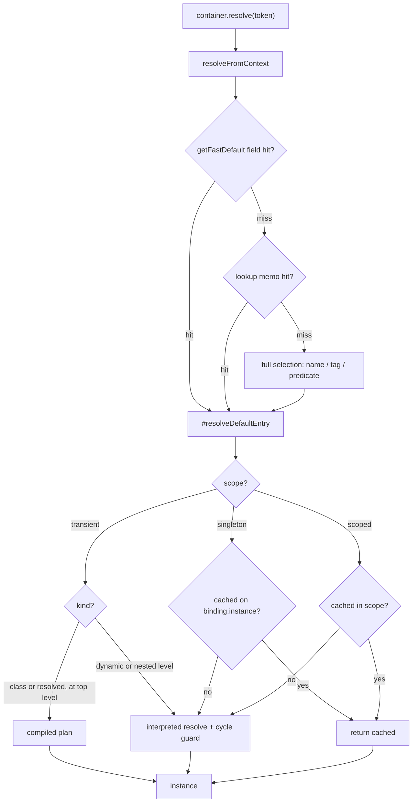
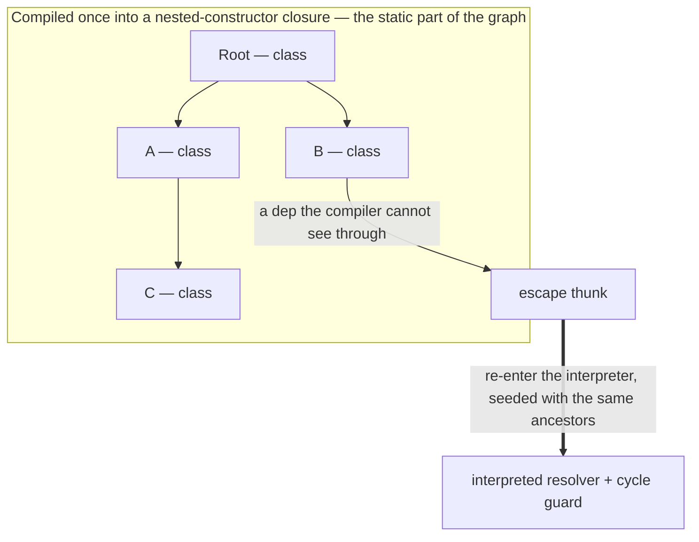
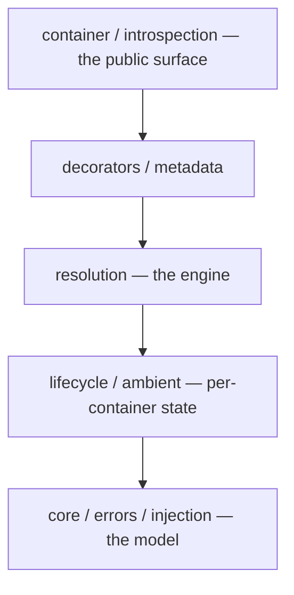
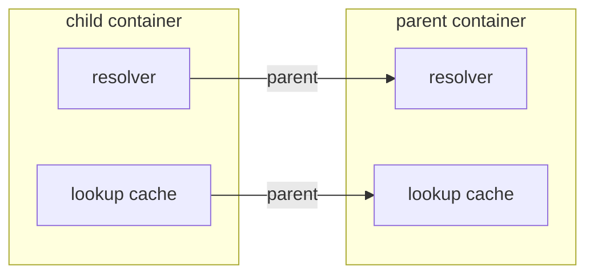
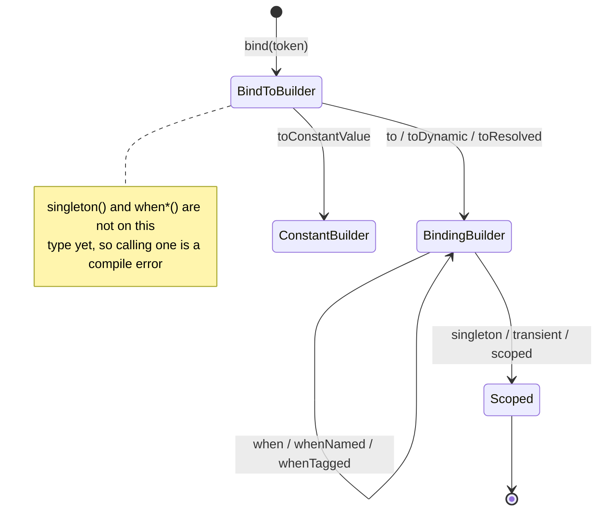

# Learning from `@codefast/di`

A guided read of how this dependency-injection engine applies real computer-science and software-engineering ideas —
architectural patterns, design patterns, algorithms and data structures, TypeScript type techniques, performance
engineering, and testing. The goal isn't to document the API (that's [`README.md`](./README.md)) or the contract (that's
[`SPEC.md`](./SPEC.md)); it's to give a newcomer a map of _which techniques live where_, and enough of the reasoning to
learn from them.

**Who this is for, and what you need first.** You have used a DI container before — "bind a token to a class",
"singleton vs. transient" are familiar — and you have not read this source. You do _not_ need V8 internals, TypeScript
variance, or graph algorithms up front: every such idea is introduced in a line or two where it first appears, and
collected in the [glossary](#glossary).

**How to use this document.** It teaches by pointing at real code. Every technique below cites the file that implements
it — open that file, that's where the learning is. The document has two parts you can read in either order:

- **Part 1 — a guided tour** follows one `resolve()` call from `bind()` to a returned instance, naming each concept as
  it comes up. Read this first for the big picture.
- **Part 2 — a catalogue** groups the same techniques by category so you can study one theme (say, all the caching, or
  all the TypeScript tricks) in depth, or come back to look one up. Each entry opens with the problem the technique
  solves, then the mechanism and the code, and closes with a one-line **Lesson**.

**A note on the performance claims.** Several techniques here exist for speed. Where this document explains _why_ a
shape is fast, treat that as a hypothesis tied to a particular Node/V8 version and machine — the numbers behind it live
with the [`benchmarks/di-inversify`](../../benchmarks/di-inversify/README.md) suite, which is how you'd actually check.
This document teaches the _technique and the reasoning_, not a scoreboard. When in doubt, read the code and measure.

The three companion documents, and when each is the one you want:

| You want to know…                               | Read                                   |
| ----------------------------------------------- | -------------------------------------- |
| how to _use_ the library                        | [`README.md`](./README.md)             |
| the exact behavioural _contract_                | [`SPEC.md`](./SPEC.md)                 |
| what the shape _is_ and what it _guarantees_    | [`ARCHITECTURE.md`](./ARCHITECTURE.md) |
| _which techniques_ it applies, and how to learn | this file                              |

---

## Part 1 — The life of a `resolve()`

Follow one dependency from the moment it's declared to the moment an instance comes back. Each stop names the technique
in play and links the code; Part 2 goes deeper on each.

The whole path on one page. Read it as a waterfall: the request tries the cheapest lane that could possibly answer, and
only falls through to a more expensive one on a miss. Once a binding is in hand, it dispatches on `scope`, then `kind`:



### Stop 0 — Declaring a binding: a fluent builder that is also a type-level state machine

Think of the binding chain as a form that reveals one page at a time: each page shows only the fields that make sense
next. `bind(T)` opens the first page, which offers `to(...)` and little else. `singleton()` isn't on it yet — so writing
it there is a _typo the compiler catches_, not a runtime error you find in production.

```ts
container.bind(Storage).to(S3Storage).whenTagged(Region.of("eu")).singleton();
```

That chain is one object. [`BindingChain`](src/container/binding-builders.ts) implements _every_ step interface at once
— `BindToBuilder`, `BindingBuilder`, `SingletonBindingBuilder`, and the rest — and each method's **return type**, not a
runtime check, decides what you may call next:

```ts
export class BindingChain<Value>
  implements
    AliasBindingBuilder,
    BindingBuilder<Value>,
    BindToBuilder<Value>,
    ConstantBindingBuilder<Value>,
    ScopedBindingBuilder<Value>,
    SingletonBindingBuilder<Value>,
    SingletonLifecycleBuilder<Value>,
    TransientBindingBuilder<Value> { … }
```

`bind()` hands you back the `BindToBuilder` face, on which `singleton()` and `whenTagged()` simply don't exist — so
`bind(T).singleton()` is a _compile_ error, not a runtime one. This is the **Builder pattern** carrying a **type-level
ordering guarantee** (see [SPEC — the canonical chain order](SPEC.md#chain-order)). Part 2 covers both the
[builder](#builder--fluent-interface) and the [type mechanics](#type-level-ordering-guarantee).

### Stop 1 — Registration: one construction site, last-wins, versioned

Every binding object in the process is built by _one_ line of code. That sounds like a triviality; Stop 7 and the
[hidden-class technique](#one-hidden-class-for-every-binding) explain why it's a deliberate performance decision.

`to()`/`toConstantValue()`/`toDynamic()` all funnel through `#register`, which calls the **single binding construction
site**, [`createBinding()`](src/core/binding.ts). One object literal, one fixed field order, every time.

The binding lands in the [`BindingRegistry`](src/core/registry.ts) — the **Registry pattern**, a token→bindings store
with side indexes for id and criterion lookups. Registration is **last-wins**: `add()` finds any existing binding whose
_slot_ is equal and displaces it (see [SPEC — slots and last-wins](SPEC.md#slot-matching)).

> A **slot** is the name-and-tags label a binding is filed under; a **criterion** is one such label on a request. "Does
> this request select this binding?" is a slot-vs-criteria question, and Stop 3 is where it gets answered.

Every mutation bumps a monotonic `#version` counter — the seed for all the
[cache invalidation](#version-stamping--cache-invalidation) later.

### Stop 2 — Asking for a value: a tiered fast-lane dispatch

Most `resolve()` calls are boring: one token, no name, no tag, bound right here. So the engine checks for the boring
case first, with the cheapest test that can settle it, and only pays for generality when the cheap test misses.

`container.resolve(Storage)` reaches the engine, [`DependencyResolver`](src/resolution/resolver.ts), and the hot entry
`resolveFromContext`. Three tiers, cheapest first:

1. a direct field read on the own-registry fast-default index (`getFastDefault`);
2. else the chain-versioned lookup memo ([`BindingLookupCache`](src/resolution/cache/binding-lookup-cache.ts));
3. else full candidate selection.

The memo mirrors the container's parent chain, so a child answers from its own cache without re-walking the hierarchy.
This tiering — and its [inline one-entry cache](#inline-cache-in-front-of-a-map) — is in Part 2.

### Stop 3 — Selecting the binding: interning, a bitmask prefilter, and specificity

When the request _does_ carry a name, a tag or a predicate, the engine has to pick among candidates. Comparing labels by
value would mean walking strings and objects on a hot path. Three techniques stack to avoid that:

- **Interning / flyweight.** A tag criterion is minted once by [`TagKey.of()`](src/core/tag.ts) and cached, so equal
  criteria are the _same object_ and can be compared by identity (`===`) instead of by value. See
  [interning](#interning--flyweight).
- **Bitmask subset prefilter.** Each tag key owns one bit; a slot's keys OR into a single number; one `&` rejects any
  slot the request doesn't cover before a value is read. See [the bitmask prefilter](#bitmask-subset-prefilter).
- **Most-specific-wins.** Among survivors, [`selectBinding`](src/resolution/select/binding-select.ts) prefers a
  predicate-bearing candidate, then the one with the most tags, else raises `AmbiguousBindingError`.

The one rule for "does this slot match this request" lives in a single function, `matchesSlot()` — a deliberate
[single source of truth](#one-rule-one-place) so the fast lanes can't drift from the slow one.

### Stop 4 — Deciding how to build: a tagged union, and compile-vs-interpret

A `Binding` is a **discriminated union**: a set of object shapes distinguished by one literal field, here `kind`
(`class`, `dynamic`, `constant`, `alias`, …), which a `switch` can narrow exhaustively. The dispatcher
[`#resolveDefaultEntry`](src/resolution/resolver.ts) switches on `scope` then `kind`:

```ts
if (scope === "transient") {
  if (binding.kind === "dynamic") { … }
  // Compiled plans only run at the top level — inner levels keep the runtime cycle guard.
  if ((binding.kind === "class" || binding.kind === "resolved") && resolutionStack.length === 0) {
    const plan = this.#getInstantiationPlan(binding);
    if (plan !== null) { return plan(); }
  }
} else if (scope === "singleton") {
  // A constant is a singleton that is already its own instance.
  if (owner.#isPlainConstant(binding)) { return binding.value; }
  const cachedSingleton = binding.instance;
  if (cachedSingleton !== NO_INSTANCE) { return cachedSingleton; }
  …
}
```

The interesting decision here is **compile vs. interpret** — the same trade a language runtime makes. Most of a
dependency graph never changes shape: `Root` always needs an `A` and a `B`, `A` always needs a `C`. Walking that graph
afresh on every resolve is _interpreting_ it. Working it out once and emitting a closure that just calls constructors is
_compiling_ it.

So a top-level transient `class`/`resolved` graph is compiled once into a nested-constructor closure by
[`InstantiationPlanCompiler`](src/resolution/plan/instantiation-plan.ts) and then runs with no per-resolve bookkeeping.
A dependency the compiler can't see through (a factory, a scoped binding, a hook) becomes an **escape**: the compiled
closure drops back into the interpreter for that one subtree, seeded with exactly the ancestors it would have had, so
behaviour is identical to never compiling. See [compile-vs-interpret](#plan-compile-vs-interpret) and
[the escape hatch](#escape-hatch--partial-compilation).



Notice where the plain-constant test sits: _inside_ the `singleton` branch, under the comment
`a constant is a singleton that is already its own instance`. That placement is a deliberate
[dispatcher-ordering technique](#dispatcher-ordering), not an accident of editing.

### Stop 5 — Guarding against cycles: four mechanisms, one per lane

A cycle is `A` needing `B` while `B` needs `A`: follow it naively and you recurse until the stack blows up. Catching it
means answering one question at every hop — _"is this binding already somewhere above me in this resolution?"_

The cheapest correct way to answer that depends on how the code around it runs:

- **Synchronously**, one resolution owns the call stack from start to finish. Nothing else can interleave, so "already
  above me" needs no bookkeeping at all — a single boolean per binding is exact.
- **Asynchronously**, the resolution parks at every `await`, and other resolutions run in the gaps. A shared flag or a
  push/pop array would then mix two independent chains together. The async lanes need a path that belongs to one branch.

That's why there are four detectors, not one:

| Lane                    | Mechanism                                                                                       |
| ----------------------- | ----------------------------------------------------------------------------------------------- |
| sync transient-dynamic  | a boolean `binding.inFlight` flag — O(1) exact membership                                       |
| everything else sync    | push/pop one shared path array ([`resolution-path.ts`](src/resolution/path/resolution-path.ts)) |
| async, inside a cascade | `inFlight` again, cleared when the factory returns its _promise_                                |
| async, across an await  | an append-only branch path read by depth                                                        |


The sync lanes differ from each other for a second reason: an error has to _name_ the cycle it found, and a boolean
can't name anything — so anything that must print a path pushes frames instead. See
[cycle detection](#cycle-detection-four-lanes) for each lane in full.

### Stop 6 — Constructing: ambient context, and reused scratch space

For a `class` binding the engine calls `new`, but constructor-parameter `@inject` accessors need to know _which
container_ is resolving. Passing it down every signature would be invasive, so the engine puts it somewhere the accessor
can find it: a module-level [`activeContainer`](src/ambient/active-container.ts), set around the call and restored after
— an **ambient-context** pattern.

The scratch arrays that track the resolution stack aren't allocated per call either; they come from an **object pool**
of resolution contexts reused by depth. See [ambient context](#ambient-context) and [the object pool](#object-pool).

### Stop 7 — Lifecycle: a sentinel, cached singletons, and hooks

Finally the value is produced, possibly run through `onActivation` hooks, and — if `singleton` — cached. The singleton
lives directly on `binding.instance`, a field read rather than a map lookup.

That raises a small puzzle: how do you tell "not resolved yet" from "resolved, and the answer was `undefined`"? A
**null-object sentinel** — a private unique value that no caller could ever supply:

```ts
export const NO_INSTANCE: unique symbol = Symbol("di:no-instance");
```

The value comes back to the caller. That's one `resolve()`. Part 2 revisits every stop as a standalone lesson.

---

## Part 2 — A catalogue of techniques

Each entry states the problem first, then the mechanism and the file that implements it, and closes with a **Lesson**.
You can read a section end-to-end or jump to one entry.

### Glossary

The terms this catalogue leans on, defined once. Each is also re-introduced in a line where it does real work.

| Term                               | In one sentence                                                                                                                                          |
| ---------------------------------- | -------------------------------------------------------------------------------------------------------------------------------------------------------- |
| **slot**                           | The name-and-tags label a binding is filed under; a request's labels are its **criteria**.                                                               |
| **criterion**                      | One label on a request — a name, or a tag key/value pair — that a slot must satisfy to be selected.                                                      |
| **branded / nominal type**         | A structural type carrying a phantom marker, so only code that mints it can produce a value of it.                                                       |
| **interning**                      | Minting one shared object per distinct value, so equal values become the _same_ object and compare with `===`.                                           |
| **flyweight**                      | The pattern interning implements: share one immutable instance instead of allocating copies.                                                             |
| **memoization**                    | Caching a derived value against what it derives from, so the derivation runs once.                                                                       |
| **discriminated union**            | A set of object shapes distinguished by one literal field, which a `switch` can narrow exhaustively.                                                     |
| **ambient context**                | A value stashed in a well-known place for the duration of a call, so it needn't be threaded through every signature.                                     |
| **captive dependency**             | A longer-lived object holding a shorter-lived one — e.g. a singleton capturing a scoped instance, which then outlives its scope.                         |
| **hidden class (V8)**              | V8's internal descriptor for an object's property layout; objects built with the same properties in the same order share one.                            |
| **monomorphic / megamorphic**      | A property read that always sees one hidden class is monomorphic and fast; one that sees many is megamorphic and slow.                                   |
| **write barrier**                  | Bookkeeping V8 runs on every pointer store into an old-space object, which makes an unnecessary write cost more than nothing.                            |
| **variance**                       | How a wrapper's assignability follows its type argument's: **covariant** keeps the direction, **contravariant** reverses it, **bivariant** accepts both. |
| **`SameValueZero` vs `Object.is`** | `Map` keys use SameValueZero (`===`, but `NaN` equals itself); `Object.is` is the same _except_ it keeps `+0` and `-0` apart.                            |
| **bitmask subset test**            | Encoding a set as bits in one integer, so "is A a subset of B" becomes a single `&` and a comparison.                                                    |

<a id="architecture"></a>

### A. Architectural patterns

<a id="layering"></a>

**Strict downward-only layering.** A big engine rots when any file may import any other: today's convenience is
tomorrow's cycle. The fix here is a rule the compiler can hold — the `src/` tree is organised into layers, and _value_
imports only ever point down.

Type-only imports may point up, because they erase at build time and couple nothing at runtime. `core/` (the model)
knows nothing of `resolution/` (the engine); the engine imports the model, not vice versa. You can see it in the import
block at the top of [`resolver.ts`](src/resolution/resolver.ts). [`ARCHITECTURE.md`](ARCHITECTURE.md) has the full layer
diagram.



An arrow reads "imports / depends on"; a value import only ever points down. A type-only import may point up (it erases
at build time), so it isn't drawn here.

> **Lesson** — a dependency direction can be an architectural invariant, and the compiler can hold it if you keep
> value-imports one-way.

<a id="ports-and-adapters"></a>

**Ports & adapters (hexagonal) — the metadata seam.** Reading decorator metadata is the one place the engine depends on
the outside world's reflection. Rather than calling it directly, the engine depends on an interface (a _port_) and takes
an implementation (an _adapter_) — which is what lets a consumer swap in their own.

The port is [`MetadataReader`](src/metadata/metadata-types.ts); the default adapter is
[`SymbolMetadataReader`](src/metadata/symbol-metadata-reader.ts). A foreign reader is wrapped by
[`verifyingMetadataReader`](src/metadata/verifying-metadata-reader.ts) — the **Decorator pattern** — which validates its
answers before use, while the trusted default is passed through untouched.

> **Lesson** — an injection point for a whole subsystem, plus a validating wrapper that only pays for untrusted
> implementations.

<a id="registry"></a>

**Registry.** Something has to answer "what is bound to this token?", and a hot path can't afford to scan.
[`BindingRegistry`](src/core/registry.ts) is that single store of truth: a primary token→bindings map, plus by-id,
named, and tagged side indexes that exist precisely so the hot lookups don't scan. Each index is a maintenance cost paid
on every mutation, so it earns its place only where a scan would sit on a hot path.

> **Lesson** — a registry earns its side indexes only where a scan would otherwise be on a hot path.

<a id="plan-compile-vs-interpret"></a>

**Plan-compile vs. interpret.** Same trade a language runtime makes. Walking the dependency graph on every resolve is
_interpreting_ it: flexible, works for anything, pays the bookkeeping every time. Working the graph out once and
emitting a closure that just calls constructors is _compiling_ it: much cheaper per call, but only possible for the part
of the graph whose shape is known ahead of time.

So this engine does both. The interpreter is the general resolver; the compiler is
[`InstantiationPlanCompiler`](src/resolution/plan/instantiation-plan.ts), which turns a static subgraph into a
nested-constructor closure once. The dispatcher picks the compiled path only at the top level
(`resolutionStack.length === 0`), because inner levels still need the runtime cycle guard.

> **Lesson** — compile the part of the graph that is static and known; keep an interpreter for the part that isn't.

<a id="escape-hatch--partial-compilation"></a>

**Escape hatch / partial compilation.** A compiler that gave up whenever it met something opaque would compile almost
nothing — one factory anywhere in a graph would disqualify the whole thing. The alternative is to compile around the
opaque part and drop back to the interpreter just there.

That drop-back is an _escape thunk_ ([`#compileEscapeThunk`](src/resolution/plan/instantiation-plan.ts)). It re-enters
the interpreter seeded with the exact ancestors the interpreted path would have had, so cycle detection and constraint
contexts behave identically.

The subtlety is what "identically" has to mean. If an escape produced even slightly different bookkeeping — a shorter
ancestor list, a stale membership set — then compiling would change behaviour, and an optimization that changes
behaviour is a bug. So "indistinguishable from interpreting" is a correctness invariant (see
[`ARCHITECTURE.md`](ARCHITECTURE.md)), pinned by `tests/unit/resolution/plan/instantiation-plan-escapes.test.ts`.

> **Lesson** — partial compilation is only safe if the escape is behaviourally identical to the slow path — design the
> seam so that's true by construction.

<a id="fast-lane-dispatch"></a>

**Fast-lane dispatch.** When most calls are easy and a few are hard, answer the easy ones with the cheapest test that
can settle them and let the rest fall through. `resolveFromContext` in [`resolver.ts`](src/resolution/resolver.ts) is
that waterfall: a field read first, then a versioned memo, then full selection.

The requirement that makes it safe: each tier must be a shortcut that yields _exactly_ what the general path would —
never a different answer, only a faster route to the same one.

The memo behind the waterfall isn't one shared table. Each container's
[`BindingLookupCache`](src/resolution/cache/binding-lookup-cache.ts) links to its parent's, mirroring the container
chain, so a child answers from its own cache without re-walking the hierarchy on every hop:



> **Lesson** — when a lookup has to consult a hierarchy, giving each level its own cache that points at the parent's
> turns a repeated walk into a single stamped check.

> **Lesson** — order a hot path cheapest-first, and make sure every shortcut yields exactly what the general path would.

<a id="deferred-initialization"></a>

**Deferred (lazy) subsystem initialization.** An empty `Map` isn't free, and most containers never touch most of their
machinery. So a container's constructor ([`container.ts`](src/container/container.ts)) builds only what a resolve cannot
happen without — registry, scope manager, lifecycle manager, resolver. The inspector, module tables, scoped/in-flight
caches, named/tagged indexes, and class-metadata caches all allocate on first use.

The catch is that laziness must be invisible: a deferred collaborator has to answer identically whether or not it's been
touched. That invariant is pinned by `tests/unit/container/deferred-subsystems.test.ts`.

> **Lesson** — pay for a subsystem when it's first used, but only if "never allocated" and "allocated but empty" are
> indistinguishable to callers.

<a id="ambient-context"></a>

**Ambient context (scoped implicit global).** A property-access `@inject` accessor runs deep inside a constructor and
needs to know which container is resolving. Threading a container parameter through every signature to reach it would be
invasive, so the value is left somewhere well-known for the duration of the call — the pattern's whole idea.

[`runWithContainer`](src/ambient/active-container.ts) sets and restores a single module-level `activeContainer` around a
callback. What keeps a global from being a liability here is the discipline around it: set around a strictly synchronous
callback, and always restored.

> **Lesson** — an ambient is a controlled global — safe when it's strictly set-around-a-synchronous-callback and always
> restored.

<a id="callbacks-as-interface"></a>

**Narrow callback interface between resolver and context.** A resolution context needs a few things from the resolver;
handing it the resolver wholesale, or sharing a base class, would couple them to each other's internals. Instead the
three `ResolutionContext` implementations call back through a small [`ResolverCallbacks`](src/resolution/context.ts)
interface — the messages they actually exchange, nothing more.

> **Lesson** — decouple two collaborators with the smallest interface that carries the messages, not with a shared base
> class.

<a id="one-rule-one-place"></a>

**One rule, one place (single source of truth for a decision).** The tiered fast lanes above are an optimization risk:
each is a shortcut that must yield exactly what the general path would. Two copies of a matching rule will agree on the
day they're written and drift on some later day, silently.

So "does this slot match this request?" is answered by _one_ function, `matchesSlot()`, and "does this request carry
exactly one criterion?" by `singleCriterionOnlyOf()` ([`binding-select.ts`](src/resolution/select/binding-select.ts),
[`resolve-options.ts`](src/injection/resolve-options.ts)) — the lanes _call_ those rather than re-deciding.

The drift is not hypothetical: a fast lane that re-implemented a rule once returned a binding a `when()` predicate was
refusing.

> **Lesson** — when several code paths must agree on a decision, put the decision in one function they all call — a
> duplicated rule is how the fast path and the slow path silently drift.

<a id="design-patterns"></a>

### B. Design patterns (GoF & idiomatic)

<a id="builder--fluent-interface"></a>

**Builder + fluent interface.** A chain like `bind(X).to(Y).whenTagged(t).singleton()` reads like a pipeline of objects,
but allocating a new object per step would be wasteful. [`BindingChain`](src/container/binding-builders.ts) is one
mutable object that implements every step interface; the _interfaces it returns_ are what create the pipeline feel.

It registers on `to*()` via `#register`, and refines in place via `#reslot`/`#withScope`. Refinement re-registers under
the _original id_, so `id()` stays stable across a chain:

```ts
#reslot(slot: BindingSlot, predicate: BindingConstraint | undefined): this {
  const previous = this.#registered();
  this.#binding = createBinding(previous, previous.token, slot, predicate, previous.id);
  this.#commit(this.#binding, previous.id);
  // The tracked-singleton list holds object references, and the re-slot just replaced the object.
  this.#registration.scope.replaceSingleton(previous as Binding, this.#binding as Binding);
  return this;
}
```

> **Lesson** — a fluent builder can be one mutable object; the interfaces it returns are what make it feel like a
> pipeline.

<a id="static-factory"></a>

**Static factory objects.** A constructor can only return an instance of its own class and can't attach a brand. A
factory function can do both, and can hide the construction entirely. `Container` (with `.create`/`.fromModules`),
`Module.create`, [`token()`](src/core/token.ts), and [`tag()`](src/core/tag.ts) are all factories handing back a typed
handle.

> **Lesson** — a factory function is the natural home for a brand (below) that a bare constructor can't produce.

<a id="strategy-table-driven"></a>

**Table-driven strategy.** A `switch` over a closed set has a failure mode: add a new case and nothing reminds you to
handle it. A lookup table typed as a _total_ `Record` does — the missing key is a compile error.

The scope-application step uses exactly that: a `Record` mapping each `BindingScope` to its builder call
([`APPLY_BINDING_SCOPE`](src/container/container.ts)).

> **Lesson** — a lookup table typed as a total `Record` turns "did I handle every case?" into a type check.

<a id="null-object--sentinels"></a>

**Null-object / sentinel values.** Any cache that may legitimately store `undefined` faces one question: does
`undefined` mean "cached, and the value is `undefined`" or "nothing cached"? A second boolean answers it at the cost of
a field and a branch; a private sentinel answers it with a value no caller could ever produce.

`unique symbol`s do that job here: [`NO_INSTANCE`](src/core/binding.ts) (unset singleton), `SCOPED_MISS`
([`scope-manager.ts`](src/lifecycle/scope-manager.ts)), `PLAN_RETRY`
([`instantiation-plan.ts`](src/resolution/plan/instantiation-plan.ts)), `UNOWNED_BRANCH`.

> **Lesson** — when `undefined` is a valid value, reach for a private sentinel, not a second boolean.

<a id="interning--flyweight"></a>

**Interning / flyweight.** Comparing two tag criteria by value means walking their contents — every time, on a hot path.
Interning buys a way out: mint exactly _one_ object per distinct value and hand that same object to everyone, and
value-equality collapses into reference-equality. `===` is then both faster _and_ indexable, since one object can be a
map key.

[`tag.ts`](src/core/tag.ts) does this. `TagKey.of(value)` returns one shared object per value; the miss path that mints
and stores it lives in `internPair`, kept outside `of()` so the hot wrapper stays small enough for the JIT to inline:

```ts
const internPair = (value: Value): BindingTag<Value> => {
  const cacheKey = internKeyFor(value);
  const existing = interned.get(cacheKey);

  if (existing !== undefined) {
    lastValue = value;
    lastPair = existing;

    return existing;
  }

  const pair = { key, value, mask } as BindingTag<Value>;

  interned.set(cacheKey, pair);
  lastValue = value;
  lastPair = pair;

  return pair;
};
```

`of()` itself checks a one-entry cache (`lastValue`/`lastPair`, compared with `Object.is`) before calling that — an
[inline cache](#inline-cache-in-front-of-a-map) for the call site that keeps asking about the same value.

> **Lesson** — interning turns value-equality into reference-equality, which is both faster and indexable — but read
> [the ±0 split](#interning-pm-zero) for the correctness subtlety it forces.

<a id="memoization"></a>

**Memoization, each with its own invalidation.** Caching a derived value is easy; knowing when it goes stale is the
whole problem. The instructive part of this codebase is that each memo has a _different_ invalidation rule, and each
rule is derived from the question "what does this value actually depend on?":

- the resolution `frame` on the binding — derives only from immutable binding fields, so it never needs clearing except
  when a chain rewrites `scope` in place (`clearBindingFrame`);
- per-slot frozen `ResolveOptions` ([`resolve-options.ts`](src/injection/resolve-options.ts));
- compiled plans by binding id;
- class metadata in [`ClassIntrospector`](src/resolution/cache/class-introspector.ts).

> **Lesson** — a memo is only as correct as its invalidation; write the invalidation rule from "what does this value
> depend on?", not from habit.

<a id="inline-cache-in-front-of-a-map"></a>

**Inline (one-entry) cache in front of a `Map`.** Real access patterns repeat: a loop asks about the same token over and
over. A hash lookup for each of those still costs a hash and a probe. Remembering just the _last_ key and value skips
both on a repeat, for the price of two fields.

[`LifecycleManager.activationHandlersFor`](src/lifecycle/lifecycle-manager.ts) and
[`BindingLookupCache.defaultEntry`](src/resolution/cache/binding-lookup-cache.ts) each keep one last-token/last-value
slot ahead of the map, as does `TagKey.of` above.

> **Lesson** — a one-entry cache in front of a hash map is nearly free and often wins the actual access pattern.

<a id="object-pool"></a>

**Object pool.** A deep resolution needs one small context object per level, and allocating them per call means garbage
proportional to graph depth times resolve count. A pool reuses the same objects instead: keep them, and `reset()` their
fields for the next use.

Sync resolution contexts are pooled by depth ([`resolver.ts`](src/resolution/resolver.ts)
`#acquireSyncResolutionContext`, [`context.ts`](src/resolution/context.ts) `reset`). The trade to remember is that a
pooled object stops being short-lived, which changes what a write into it costs — see
[write barriers](#write-barrier-aware-reset).

> **Lesson** — pool the objects on the hottest path, and remember a pooled object that lives long enough has different
> GC costs than a fresh one.

<a id="discriminated-union-dispatch"></a>

**Discriminated-union dispatch.** When a closed set of shapes must be handled differently, the object-oriented answer is
a method per subclass. That costs a megamorphic call on a hot path. The alternative is a plain union of shapes tagged by
one literal field, plus a `switch` — the compiler still checks you handled every case.

`Binding` is that `kind`-tagged union ([`binding.ts`](src/core/binding.ts)); the instantiation switches exhaustively on
`kind`, and errors form a parallel union keyed by a `code` literal on the base [`DiError`](src/errors/errors.ts).

> **Lesson** — a tagged union plus an exhaustive switch is the type-safe alternative to polymorphism when the set of
> shapes is closed and hot.

<a id="output-adapters"></a>

**Adapter (output formats).** Four output formats could mean four graph walks, each with its own chance of disagreeing
with the others. Building the graph once as a neutral JSON and converting at the edges means one walk and one truth.
[`introspection/graph-adapters/`](src/introspection/graph-adapters/mermaid.ts) holds the small conversions to Mermaid,
DOT, Cytoscape, and React Flow.

> **Lesson** — compute the neutral form once, adapt at the edges.

<a id="algorithms"></a>

### C. Algorithms & data structures

<a id="cycle-detection-four-lanes"></a>

**Cycle detection — four mechanisms, chosen per lane.** A cycle is `A` needing `B` while `B` needs `A`. Follow one
naively and the recursion never bottoms out. Detecting it means answering the same question at every hop: _is this
binding already an ancestor of the resolution I'm in?_

That is a membership test, and the cheapest structure that answers it exactly depends entirely on how the surrounding
code runs:

- **Synchronous resolution owns the call stack** from start to finish. Nothing else can interleave, so at any instant
  there is exactly one live chain. "Is this binding an ancestor?" therefore reduces to "is this binding currently being
  resolved at all?" — which a single boolean per binding answers exactly, with no allocation.
- **Asynchronous resolution parks at every `await`**, and other chains run in the gaps. Now several chains are live at
  once, and one shared flag or one push/pop array would blend them together. An async lane needs a path that belongs to
  its own branch.

Hence four detectors rather than one:

| Lane                    | Structure                               | Why this one is exact here                                                    |
| ----------------------- | --------------------------------------- | ----------------------------------------------------------------------------- |
| sync transient-dynamic  | `binding.inFlight` boolean              | one call stack, so the flag _is_ path membership — O(1), no allocation        |
| everything else sync    | one shared frame stack, push/pop        | the error must _name_ the cycle, and a boolean can't name anything            |
| async, inside a cascade | `binding.inFlight`, cleared early       | cleared when the factory returns its _promise_, which is what allows diamonds |
| async, across an await  | append-only branch stack, read by depth | no call stack to lean on; nothing is removed, so no level observes settlement |

Lane by lane:

- **Sync transient-dynamic** uses `binding.inFlight`. The lane's own comment states the reasoning: this is still one
  sync call stack, so the flag is exact path membership.
- **Everything else sync** pushes and pops frames on one shared stack
  ([`enterResolutionPath`](src/resolution/path/resolution-path.ts)). The check keys on **binding identity**
  (`frame.bindingId`) rather than on a display name, because two distinct tokens may print the same name; the names an
  error shows are derived from the frames at the throw site by `cycleNamesOf`.
- **Async in a cascade** reuses the `inFlight` flag but clears it when the factory returns its _promise_, not when that
  promise settles.
- **Async across an await** carries an append-only stack read by branch depth
  ([`extendResolutionBranch`](src/resolution/path/resolution-path.ts)). It appends in place while this branch still owns
  the next slot, and copies its own prefix once a sibling has claimed it. Nothing is ever removed, so no async level has
  to observe its own settlement in order to unwind.

The early-clear in the cascade lane is worth dwelling on, because it's where a naive detector gets the _wrong_ answer.
Consider a diamond: `D` depends on `B` and `C`, and both `B` and `C` depend on `A`. There is no cycle. But if `A`'s flag
stayed set until `A` fully settled, then `C` asking for `A` while `B`'s request is still pending would look exactly like
a cycle. Clearing when the factory hands back its promise is what distinguishes "this is genuinely re-entering itself"
from "two siblings legitimately want the same thing".

> **Lesson** — don't pick a cycle detector in the abstract — pick the cheapest structure that is exact for the
> concurrency model of that specific lane.

<a id="threshold-scan-vs-set"></a>

**Threshold-switched linear-scan vs. `Set`.** A `Set` has O(1) membership and an array has O(n) — but that hides a
constant factor. For a handful of items, scanning a contiguous array beats hashing a key and probing a table, and it
allocates nothing. For a large one, the asymptotics win. Neither structure is right at both sizes.

So the shared-stack detector uses both, switching at a measured depth. Membership is a linear frame scan while the stack
is short, and a `Set` attached to the array (under a symbol key) once it grows past the threshold:

```ts
export const RESOLUTION_SET_THRESHOLD = 32;
```

```ts
export function enterResolutionPath(
  resolutionStack: Array<ResolutionFrame>,
  frame: ResolutionFrame,
): Set<BindingIdentifier> | undefined {
  const stackWithSet = resolutionStack as ResolutionStackWithSet;
  let resolutionSet = stackWithSet[RESOLUTION_SET_KEY];
  // A live set mirrors the stack exactly, so a size that disagrees means it is holding ids of
  // frames that unwound: the ones already on the stack when it attached were handed no set to
  // delete from. Dropped rather than repaired, because the next deep frame rebuilds it.
  if (resolutionSet !== undefined && resolutionSet.size !== resolutionStack.length) {
    resolutionSet = undefined;
    stackWithSet[RESOLUTION_SET_KEY] = undefined;
  }
  if (resolutionSet === undefined && resolutionStack.length >= RESOLUTION_SET_THRESHOLD) {
    resolutionSet = new Set<BindingIdentifier>();
    for (let index = 0; index < resolutionStack.length; index += 1) {
      resolutionSet.add(resolutionStack[index]!.bindingId);
    }
    stackWithSet[RESOLUTION_SET_KEY] = resolutionSet;
  }
  …
}
```

The rule that keeps this honest: the two branches must answer _identically_ — the threshold switches the data structure,
never the behaviour.

The size check at the top is what preserves that. Frames already on the stack when the set attached were handed no set
to delete from on their way out, so a set whose size disagrees with the stack is holding unwound frames' ids. It gets
dropped rather than repaired, and the next deep frame rebuilds it.

(The value 32 is a tuning constant from a depth sweep; it's the kind of number worth re-measuring rather than trusting.)

> **Lesson** — for small n a linear scan often beats a hash set; a threshold lets you have both without changing
> semantics.

<a id="bitmask-subset-prefilter"></a>

**Bitmask subset prefilter for tags.** Tag matching asks a set question: _does the request carry every key this slot
declares?_ Comparing two sets of keys means looping over one and looking each up in the other.

There's a much cheaper representation when the universe of keys is small. Give each key its own bit position, and a
_set_ of keys becomes a single integer with those bits on. Subset then has a one-instruction answer: `A` is a subset of
`B` exactly when `A & B === A`.

Each tag key gets a monotonic id and thus one bit:

```ts
const mask = (1 << (id % MASK_WIDTH)) as TagKeyMask; // in tag()

export function coversTagKeys(requestMask: TagKeyMask, slotMask: TagKeyMask): boolean {
  return (requestMask & slotMask) === slotMask;
}
```

A single `&` rejects any non-covering slot before a criterion is read.

The edge case is that `MASK_WIDTH` is 32, so ids past it wrap and two keys can share a bit. That is fine, and the reason
is worth internalising: a collision can only make a slot _pass_ a filter it should have failed, never fail one it should
have passed. A false positive costs a re-check — `matchesSlot()` still confirms the exact criteria afterwards
([`binding-select.ts`](src/resolution/select/binding-select.ts)) — while a false negative would have been a wrong
answer.

> **Lesson** — a bitmask turns a set-subset test into one instruction; when bits can collide, design so collisions cost
> a re-check, never a wrong answer.

<a id="interning-pm-zero"></a>

**Interning meets a correctness edge: the ±0 split.** [Interning](#interning--flyweight) stores one object per distinct
value in a `Map`. That silently inherits the `Map`'s idea of "distinct" — and JavaScript has more than one.

> `Map` keys compare by **SameValueZero**: like `===`, except `NaN` equals itself. `Object.is` is the same _except_ it
> also keeps `+0` and `-0` apart. Those two definitions differ on exactly one pair of values.

That single divergence is enough to break things here, because the tag contract says values compare by `Object.is`. If
the intern cache stored both zeros under one `Map` key, `+0` and `-0` would map to one shared criterion object and
become indistinguishable everywhere downstream — a tag bound at `-0` would answer a request for `+0`.

The fix is to give the negative zero a key of its own:

```ts
const NEGATIVE_ZERO_KEY: unique symbol = Symbol("di:tag-negative-zero");

function internKeyFor(value: unknown): unknown {
  return value === 0 && Object.is(value, -0) ? NEGATIVE_ZERO_KEY : value;
}
```

Pinned by `tests/unit/resolution/select/tagged-selection.test.ts`.

> **Lesson** — `Map` equality (`SameValueZero`) and `Object.is` differ on exactly one pair of values — if your identity
> scheme rides on a `Map`, that difference is a bug waiting unless you handle it.

<a id="version-stamping--cache-invalidation"></a>

**Version stamping for cache invalidation.** A cache has to know when the world changed under it. Comparing the world
itself is expensive; comparing one number is not. A counter that only ever increases gives you exactly that: stamp the
cache with the counter's value, and a later mismatch means "something changed" — cheaply and without false negatives.

The registry keeps a monotonic `#version` that bumps on every mutation ([`registry.ts`](src/core/registry.ts)). Caches
stamp themselves with a `chainVersion()` and self-clear on a mismatch
([`binding-lookup-cache.ts`](src/resolution/cache/binding-lookup-cache.ts)).

`chainVersion()` is the _sum_ of the versions along the container chain — which extends the trick from "did my registry
change?" to "did anything change anywhere above me?", still in one comparison.

> **Lesson** — a monotonic version counter is the simplest correct cache key for "has anything changed since?", and
> summing along a chain extends it to "has anything changed anywhere above me?".

<a id="iterative-alias-resolution"></a>

**Iterative alias resolution with exact cycle detection.** An alias points at another token, which may itself be an
alias. Following that with recursion means a cyclic alias chain crashes the process with a stack overflow instead of
raising a usable error.

So `toAlias` bindings are followed in a `while` loop in [`#requireBinding`](src/resolution/resolver.ts), with a lazily
created `Set` of visited tokens that throws `CircularDependencyError` instead. The cache uses a bounded fold
(`ALIAS_HOP_LIMIT`) as a fast pre-check and defers to the exact loop past the cap — the cheap bound handles the common
short chain, the exact structure handles the rest.

> **Lesson** — follow a chain iteratively, not recursively, and keep an exact visited-set for the cycle case even when a
> cheap bound handles the common case.

<a id="dfs-scope-validation"></a>

**DFS for static scope validation.** Some bugs are shaped like graph properties, and can be found before anything runs.
A **captive dependency** is one: a longer-lived binding depending on a shorter-lived one — a singleton capturing a
scoped instance, which then outlives the scope it came from.

Finding those is a reachability question, and a plain depth-first search answers it.
[`validate()`](src/container/container.ts) walks the constructor/`toResolved` dependency edges depth-first, follows
aliases to their terminals, and throws `ScopeViolationError` on a violation. See [SPEC — `validate`](SPEC.md#validate).

> **Lesson** — some correctness properties are graph properties; a plain DFS with a visited set is often all you need to
> check them ahead of time.

<a id="most-specific-wins"></a>

**Most-specific-wins arbitration.** When several bindings match one request, picking one arbitrarily is how a container
becomes unpredictable. The alternative is to define "more specific" explicitly and to treat a genuine tie as an error
rather than a coin flip.

[`selectBinding`](src/resolution/select/binding-select.ts) ranks candidates: a lone predicate-bearing candidate wins (a
predicate being a deliberate specialization of the default); otherwise the lone candidate with the most tags; otherwise
it's ambiguous and raises.

> **Lesson** — when several answers match, define specificity explicitly and make ambiguity an error, not a silent pick.

<a id="fixed-arity-specialization"></a>

**Fixed-arity specialization.** `new T(...args)` has to build an array and spread it. Writing out `new T(a, b)` doesn't.
Since real constructors overwhelmingly take a small number of dependencies, the common cases are worth unrolling.

Both the interpreter (`#resolveDeps`) and the compiler special-case arities up to three — `new invokable(dep0())`,
`new invokable(dep0(), dep1())`, `new invokable(dep0(), dep1(), dep2())` — before falling back to a spread
([`instantiation-plan.ts`](src/resolution/plan/instantiation-plan.ts)).

> **Lesson** — the common case is usually low-arity; unrolling it a little avoids allocation and helps the JIT.

<a id="typescript"></a>

### D. TypeScript techniques

<a id="branded-types"></a>

**Branded / nominal types.** TypeScript is structural: any two types with the same shape are interchangeable, so a
`Token<string>` and any other object with the same fields are the same type to the compiler. A **brand** is a phantom
marker field that exists only in the type, which makes a type _nominal_ — assignable only from values the minting code
produced.

The codebase brands [`Token<Value>`](src/core/token.ts), `BindingIdentifier` ([`types.ts`](src/core/types.ts)), and the
tag types ([`tag.ts`](src/core/tag.ts)).

The most instructive use is in [`resolution-path.ts`](src/resolution/path/resolution-path.ts), where the brand encodes a
_permission_ rather than a mere identity. `OwnedBranchStack` and `OwnedBranchDepth` answer the question "may this async
lane append to this array?" — and only `extendResolutionBranch` can mint one. A sync frame's stack, which that frame
will pop, is a plain `Array<ResolutionFrame>` and simply cannot be passed where an owned branch is required. What would
otherwise be a rule in a comment becomes a rule the compiler enforces.

`BranchDepth` is then a union of the branded depth and the `UNOWNED_BRANCH` sentinel, deliberately kept as a union
rather than hidden inside the branded number — so both cases are visible at every signature, and `=== UNOWNED_BRANCH`
narrows to the owned one.

> **Lesson** — a brand encodes a provenance or a permission the structural type system would otherwise ignore.

<a id="variance-annotations"></a>

**Variance annotations (`out`) — and a deliberate omission.** **Variance** describes how a wrapper's assignability
follows its type argument's. If `Cat` is assignable to `Animal` and that makes `Box<Cat>` assignable to `Box<Animal>`,
`Box` is **covariant** in its parameter. TypeScript infers variance on its own, but you can also write it down.

`Token`, `Constructor`, and `InjectionDescriptor` declare `out Value`. That annotation is a self-checking assertion: the
compiler rejects it the day the type stops being covariant, so a change that quietly breaks the property is caught at
the declaration rather than at some distant call site.

The binding kinds deliberately carry _no_ variance annotation, which is what makes the next entry possible.

> **Lesson** — an explicit `out` is documentation the compiler enforces; leaving it off is sometimes just as deliberate.

<a id="method-vs-property-bivariance"></a>

**The method-vs-property bivariance trick.** Start with the practical problem. The engine's internal lanes pass bindings
around with their value type erased — a plain `Binding`, not a `Binding<Value>`. For that to work, a `Binding<Value>`
has to be assignable to `Binding`. Under `strictFunctionTypes`, it isn't.

The reason is a variance rule that only applies to _some_ declaration syntax:

> Under `strictFunctionTypes`, a function-typed **property** is checked **contravariantly** in its parameters: a
> substitute must accept everything the original accepted, so its parameter types compare in the _opposite_ direction to
> the type as a whole. A **method** declaration is exempt — its parameters compare **bivariantly**, so either direction
> is accepted.

A binding carries lifecycle hooks that take its value ([`binding.ts`](src/core/binding.ts)). Declared as function-typed
properties, those parameters flip the direction of the whole type and break the erasure. Declared as **methods**, the
parameters compare bivariantly and assignability is restored:

```ts
interface BindingLifecycleHooks<Value> {
  onActivation?(ctx: ResolutionContext, instance: Value): Value | Promise<Value>; // method → bivariant params
  onDeactivation?(instance: Value): void | Promise<void>;
}
```

The looseness is confined on purpose: the public `ActivationHandler`/`DeactivationHandler` types stay function-typed
_properties_, so a handler a user writes is still checked strictly. Bivariance is bought exactly where the engine needs
the erasure, and nowhere a user could be hurt by it.

Pinned by `tests/types/binding-variance.test.ts`.

> **Lesson** — method syntax and property syntax have different variance under `strictFunctionTypes` — a real tool, not
> a quirk, when you need the erasure to type-check.

<a id="type-level-ordering-guarantee"></a>

**Type-level ordering guarantee.** A fluent API has an order that makes sense (`bind` → `to` → `when` → scope) and
orders that don't. Checking that at runtime means the mistake ships and throws later. Encoding it in the _return types_
means the mistake doesn't compile.

Each return type is a state, and the methods that type offers are the only legal transitions out of it. The chain's
legal order (Stop 0) is enforced entirely this way ([`binding.ts`](src/core/binding.ts)); the runtime
`ChainNotRegisteredError` only backstops callers who have no types or who cast past them. Pinned by
`tests/types/container-api.test.ts`.



> **Lesson** — you can encode a small state machine in return types so illegal transitions don't compile.

<a id="satisfies-completeness-guard"></a>

**`satisfies` as a completeness guard.** [`createBinding`](src/core/binding.ts) writes one object literal that must
contain every field any binding kind declares — miss one and some binding kind is silently short a field. A plain type
annotation would catch that, but it would also widen the literal and lose the exact key order the single hidden class
depends on. `satisfies` checks without widening:

```ts
return {
  kind: fields.kind,
  id,
  inFlight: false,
  frame: undefined,
  // An `in` probe, not `??`: a re-slotted singleton may legitimately hold a cached `undefined`.
  instance: "instance" in fields ? fields.instance : NO_INSTANCE,
  token,
  slot,
  predicate,
  scope: fields.scope,
  target: fields.target,
  factory: fields.factory,
  deps: fields.deps,
  value: fields.value,
  onActivation: fields.onActivation,
  onDeactivation: fields.onDeactivation,
} satisfies ConstructedBindingFields as Binding<Value>;
```

`ConstructedBindingFields` is a `Record` of every field name, so forgetting one is a compile error. Note the `instance`
line: an `in` probe rather than `??`, because a re-slotted singleton may legitimately hold a cached `undefined` — the
same distinction the [`NO_INSTANCE` sentinel](#null-object--sentinels) exists to preserve.

> **Lesson** — `satisfies` checks a value against a type without widening it — here it turns "did I write every field?"
> into a compile error.

<a id="advanced-conditional-types"></a>

**Advanced conditional & mapped types.** Three worth reading, each replacing something a human would otherwise have to
keep in sync by hand:

- `DistributiveOmit`/`KeysOfUnion` driving `PartialBinding` ([`binding.ts`](src/core/binding.ts)) — omitting across a
  union without collapsing it into one shape.
- `ResolvedDependencyValue` ([`descriptor.ts`](src/injection/descriptor.ts)) — decoding the `multi`/`optional` flags on
  a descriptor into `Array<T>` / `T | undefined`, so the flags and the resulting type can't disagree.
- `toResolved`'s mapped tuple with a `const` type parameter plus `NoInfer`, which types a factory's arguments
  positionally against the dependency list it was given, instead of asking you to restate them.

> **Lesson** — mapped tuples plus `NoInfer` let a factory's argument types be _derived_ from a dependency list rather
> than restated.

<a id="type-predicates"></a>

**Type predicates.** A runtime shape check tells you something the compiler doesn't know. A return type of `x is T` is
how you hand that knowledge back to it — and it keeps the "which shape is this?" logic in one named place instead of
scattered inline conditions. Small examples: [`isInjectionDescriptor`](src/injection/descriptor.ts), `isSyncModule`,
`#isPlainConstant`.

> **Lesson** — a `x is T` predicate is how you turn a runtime shape check into type information.

<a id="conditional-package-imports"></a>

**Conditional `package.json#imports`.** During development, `#/…` should mean the TypeScript in `src/`. For a consumer
who installed the package, the same specifier must mean the built JavaScript in `dist/`. Conditional import maps let one
specifier serve both audiences ([`package.json`](package.json)) — no `tsconfig` path aliases needed.

This is a packaging technique as much as a TypeScript one; the root [`CLAUDE.md`](../../CLAUDE.md) explains the
three-audience reasoning in full.

> **Lesson** — the `imports`/`exports` fields can serve dev and published consumers different files under one specifier.

<a id="symbol-keyed-off-band-data"></a>

**Symbol-keyed off-band data.** The engine sometimes needs to attach bookkeeping to an object that also belongs to the
user, without that bookkeeping showing up in spreads, `Object.keys`, or `JSON.stringify`. A symbol key does exactly
that: `MEMOIZED_RESOLVE_OPTIONS` ([`resolve-options.ts`](src/injection/resolve-options.ts)), `CONSTRAINT_REQUIREMENT`,
`RESOLUTION_SET_KEY`.

The invisibility is occasionally load-bearing rather than merely tidy. The escape thunk's `[...frames]` copy
([`instantiation-plan.ts`](src/resolution/plan/instantiation-plan.ts)) produces a fresh array that deliberately does
_not_ carry the membership `Set` living under `RESOLUTION_SET_KEY` — a set that would be stale for the new stack.
Because spread doesn't copy symbol keys, dropping it takes no code at all.

> **Lesson** — a symbol key is private-by-convention storage that survives on the object but stays invisible to spreads
> and serialization — occasionally that invisibility is the feature.

<a id="performance"></a>

### E. Performance engineering techniques

_Reminder: the following are techniques and the reasoning behind them, not benchmark results. Whether any of them is
worth it today is an empirical question the [`benchmarks/di-inversify`](../../benchmarks/di-inversify/README.md) suite
answers; the [`ARCHITECTURE.md`](ARCHITECTURE.md) notes carry the design rationale._

<a id="one-hidden-class-for-every-binding"></a>

**One V8 hidden class for every binding.** V8 doesn't store objects as hash maps of names to values. It gives every
object a **hidden class** describing its property layout, and objects built with the same properties in the same order
share one. That matters because of how property reads are optimised: a read site that always sees the same hidden class
is **monomorphic** and compiles to little more than a fixed offset load, while one that sees many shapes goes
**megamorphic** and falls back to a lookup.

The resolver reads `kind`, `scope` and `factory` on every hop, so those reads should stay monomorphic. That is why every
binding in the process is built by the one object literal in [`createBinding`](src/core/binding.ts), in a fixed field
order (see [the `satisfies` guard](#satisfies-completeness-guard) that keeps the literal complete), and why the registry
stores bindings by reference rather than re-copying them into new shapes.

> **Lesson** — if a hot object type has many instances read on a fast path, build them all one way.

<a id="totalized-field"></a>

**Totalizing a field to avoid a branch.** An optional field forces every reader to handle its absence, and it gives the
object a second shape. Filling it in with a harmless default removes both costs.

An `alias` binding has no scope of its own, yet still declares `scope: "transient"` — so `scope` is _always_ a plain
field read, never an `undefined` fallback, and the hidden class stays stable. The named `effectiveBindingScope` helper
is kept only because it's the vocabulary validation and introspection speak.

> **Lesson** — making an optional field total can remove a branch (and keep the hidden class stable) at the cost of a
> tiny redundancy.

<a id="write-barrier-aware-reset"></a>

**Write-barrier-aware reset.** Pooling an object ([above](#object-pool)) has a consequence: the object stops being
short-lived and ends up in V8's old space. Storing a pointer into an old-space object triggers a **write barrier** —
bookkeeping the garbage collector needs so it can track references from old objects to young ones. So a pointer store
into a pooled object is not free, and an _unnecessary_ one is pure cost.

`reset()` ([`context.ts`](src/resolution/context.ts)) therefore compares before storing:

```ts
if (this.#resolver !== resolver) {
  this.#resolver = resolver;
}
if (this.#resolutionStack !== resolutionStack) {
  this.#resolutionStack = resolutionStack;
}
```

The compares only pay off if they actually hit, which is why the resolver hands every depth of a sync resolve the _same_
stack — the comparison is designed to succeed, not merely to be present.

> **Lesson** — for a long-lived object, an unnecessary pointer write isn't free; comparing first can be cheaper than
> storing.

<a id="allocation-avoidance"></a>

**Allocation avoidance on the hot path.** An object allocated per resolve is garbage created per resolve. Many shapes in
this engine exist for no other reason than to move an allocation from per-call to per-slot, per-container, or constant:

- the singleton stored on `binding.instance` — a field, not a `Map` entry;
- shared `ROOT_CONSTRAINT_CONTEXT`/`EMPTY_*` constants for the root case;
- one frozen `ResolveOptions` per slot, reused across every resolve;
- one `AsyncCascadeContext` shared across all levels of a cascade;
- a deliberately non-`async` helper, to avoid a promise plus a state machine per level
  ([`resolver.ts`](src/resolution/resolver.ts)).

> **Lesson** — the cheapest allocation is the one you don't make; look for per-call objects that could be per-slot,
> per-container, or constant.

<a id="eager-vs-lazy-upsert"></a>

**`getOrInsert` vs `getOrInsertComputed`, chosen by hit rate.** "Insert if absent" comes in two forms. The eager one
takes the fallback _value_, so it's computed whether or not it's needed. The lazy one takes a _function_, so the value
is computed only on a miss — but the function itself is usually a freshly allocated closure, paid on every call
including hits. Which is cheaper depends entirely on which branch dominates.

The package's own `Map` upsert helpers ([`map-upsert.ts`](src/core/map-upsert.ts)) come in both forms — its own, because
the ES2025 methods they stand in for would raise the package's Node floor. The registry's index insertions use the eager
`getOrInsert`, because a bind is usually a token's first and the fallback is usually what gets stored. `taggedEntry()`
uses the lazy `getOrInsertComputed` with a module-scope factory, so the common hit allocates no closure
([`registry.ts`](src/core/registry.ts), [`binding-lookup-cache.ts`](src/resolution/cache/binding-lookup-cache.ts)).

> **Lesson** — eager-vs-lazy isn't a style choice; pick it from which branch dominates.

<a id="dispatcher-ordering"></a>

**Dispatcher ordering (test under the branch that implies it).** In a hot dispatcher, every test at the top is paid by
every call — including the calls that could never have needed it. Pushing a test down into the branch that already
implies it makes the other branches cheaper for free.

In [`#resolveDefaultEntry`](src/resolution/resolver.ts) the plain-constant test lives _inside_ the `singleton` branch,
because a constant _is_ a singleton that is already its own instance. Hoisting it to the top of the dispatcher would
charge every transient resolve for a test it never needs.

The same function is noted as inlining-sensitive: a test added inside a branch it doesn't even take has shifted an
unrelated benchmark row, because it changed whether the function still fit the JIT's inlining budget.

> **Lesson** — put a check under the branch that already implies it, and treat hot dispatchers as inlining-sensitive —
> measure edits near them.

<a id="memory-friendly-weak-caches"></a>

**GC-friendly weak caches.** A normal `Map` keyed by a class keeps that class alive forever — the cache becomes a leak
whose size follows the program's history rather than its present. A `WeakMap` holds its keys weakly, so an entry
disappears when its key does.

Per-class and per-reader caches use `WeakMap`/`WeakSet`
([`class-introspector.ts`](src/resolution/cache/class-introspector.ts)), so a class or reader that becomes unreachable
takes its cache entry with it.

> **Lesson** — key a cache weakly when its lifetime should follow the key's, not the cache's.

<a id="cheap-negative-flags"></a>

**Cheap negative-answer flags.** The fastest way to handle an empty collection is to know it's empty without looking. A
single boolean, maintained where the collection is written, can skip an entire scan where the collection is read.

A container that never bound a constant sets `hasHeldConstantBinding` to skip the constant-deactivation sweep at
dispose; `activationVersion === 0` short-circuits all activation-hook checks.

> **Lesson** — a one-time "there is nothing here" flag can save a repeated scan for the common empty case.

<a id="testing"></a>

### F. Testing techniques

di's tests live under `tests/unit`, `tests/integration`, and `tests/types` (the repo-wide taxonomy is described in
[`TESTING.md`](../../TESTING.md)). The techniques worth learning from:

<a id="type-level-tests"></a>

**Type-level tests with `expectTypeOf`.** Some of this engine's invariants are properties of the _types_, not of any
runtime value — the erasure in [the bivariance trick](#method-vs-property-bivariance) either type-checks or it doesn't,
and no amount of running code can tell you. Those get compile-time assertions instead, where a test that _stops
compiling_ is the failure signal.

The load-bearing ones: `tests/types/binding-variance.test.ts` (the method-vs-property trick),
`tests/types/async-branch-ownership.test.ts` (the ownership brands), `tests/types/container-api.test.ts` (the fluent
order).

> **Lesson** — if an invariant is a type property, assert it in the type system — a runtime test can't see it.

<a id="invariant-pinning-tests"></a>

**Invariant-pinning tests, named next to the invariant.** A test named after its assertion tells you nothing when it
breaks. A test named after the _invariant_ it protects turns a failure into a sentence: "you broke the rule that the
cycle flag is released on every exit path."

Each correctness invariant in [`ARCHITECTURE.md`](ARCHITECTURE.md) cites the test that holds it — e.g.
`tests/unit/resolution/in-flight-invariants.test.ts` (the cycle flag is released on every exit path),
`tests/unit/resolution/cache-invalidation.test.ts` (memos clear correctly across lanes),
`tests/unit/resolution/singleton-on-binding.test.ts`.

> **Lesson** — pin a subtle invariant with a test whose name states the invariant, so a failure reads as "you broke X,"
> not "assertion failed."

<a id="structural-diagnostics-seam"></a>

**Structural (not timing) assertions via a diagnostics seam.** You can't assert "this is fast" in a unit test — timings
are machine-dependent and flaky. But you _can_ assert the structural fact underneath the speed: that a plan was compiled
at all, or that a deferred subsystem stayed deferred. Those are deterministic.

A private `RESOLUTION_DIAGNOSTICS` symbol ([`diagnostics.ts`](src/errors/diagnostics.ts)) exposes counters like
`compiledPlanCount`, `syncContextPoolSize`, and `builtSubsystems` for exactly that.

> **Lesson** — you can test that an optimization is _active_ (a structural fact) even when you can't test that it's
> _fast_ (a flaky, machine-dependent fact).

<a id="toggle-then-reresolve"></a>

**Toggle-then-re-resolve for state cleanup.** Proving that a failure path cleaned up after itself is awkward: the state
in question is private, and after a successful run there's nothing to see. The trick is to force the failure, then use
the thing again — if the second attempt succeeds, nothing leaked.

To prove a failure path released `inFlight`, a test flips a `let` flag to make the first resolve throw, then re-resolves
and asserts success (`tests/unit/resolution/in-flight-invariants.test.ts`).

> **Lesson** — to test that cleanup happened, force the failure, then exercise the thing again.

---

## Where to go next

A reading order that tends to work:

1. **Use it** — [`README.md`](./README.md), and the runnable [`examples/`](examples/).
2. **Take the tour above**, then open each file it links as you go.
3. **Study one catalogue theme** end-to-end. The most self-contained single files to start from:
   [`src/core/tag.ts`](src/core/tag.ts) (interning + bitmask + the ±0 split),
   [`src/resolution/path/resolution-path.ts`](src/resolution/path/resolution-path.ts) (scan-vs-Set + ownership brands),
   and [`src/injection/resolve-options.ts`](src/injection/resolve-options.ts) (memoize + freeze).
4. **Read the contract** — [`SPEC.md`](./SPEC.md) — when you need the exact rules, and
   [`ARCHITECTURE.md`](./ARCHITECTURE.md) when you're about to change the engine and want the invariants and the
   reasoning.
5. **Run the tests** — they're the executable version of every claim here, and the type tests under `tests/types` are
   short and very readable.

If a performance claim in this document matters to a decision you're making, don't take it on faith — the
[`benchmarks/di-inversify`](../../benchmarks/di-inversify/README.md) suite is how you check it against your own runtime.

## License

Released under the [MIT License](./LICENSE).
