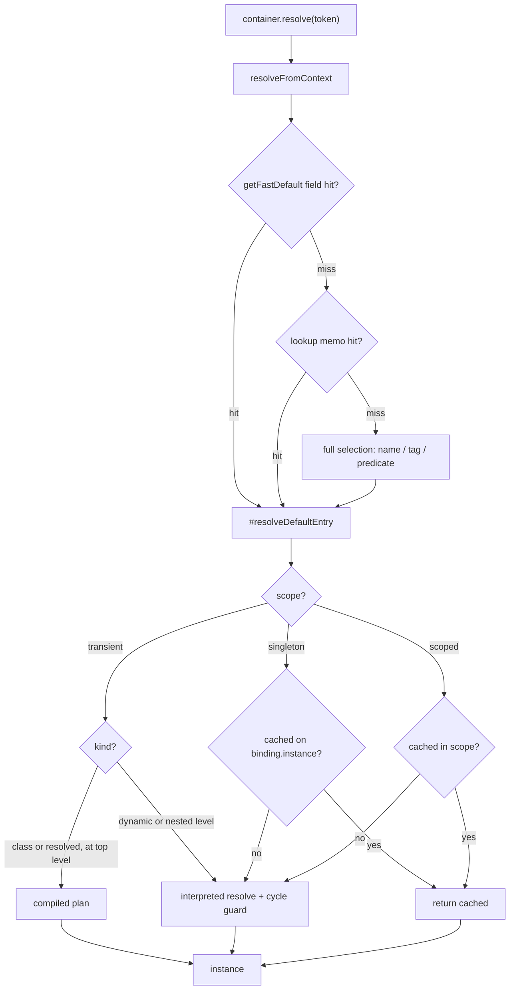
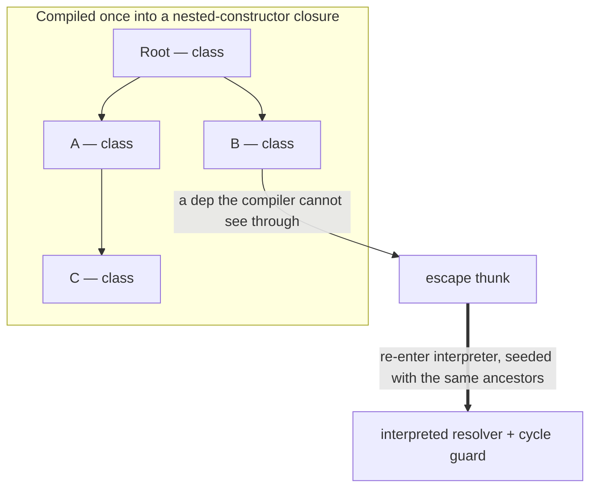
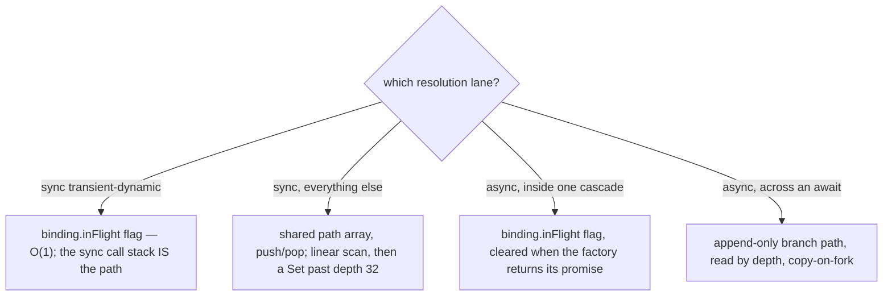
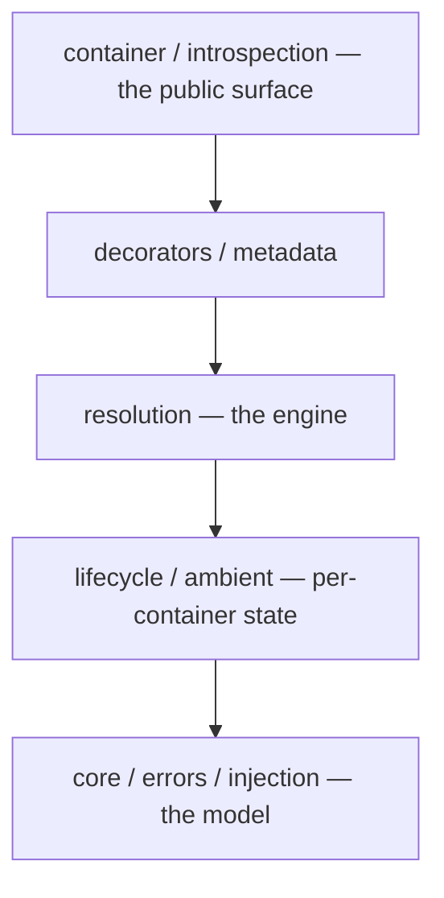
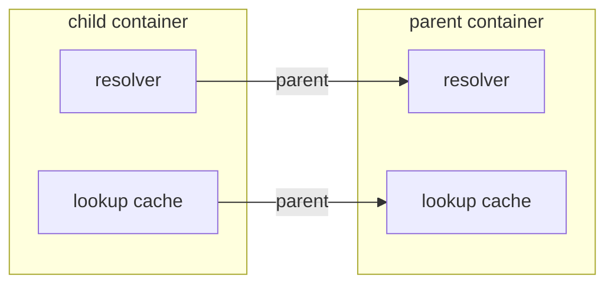
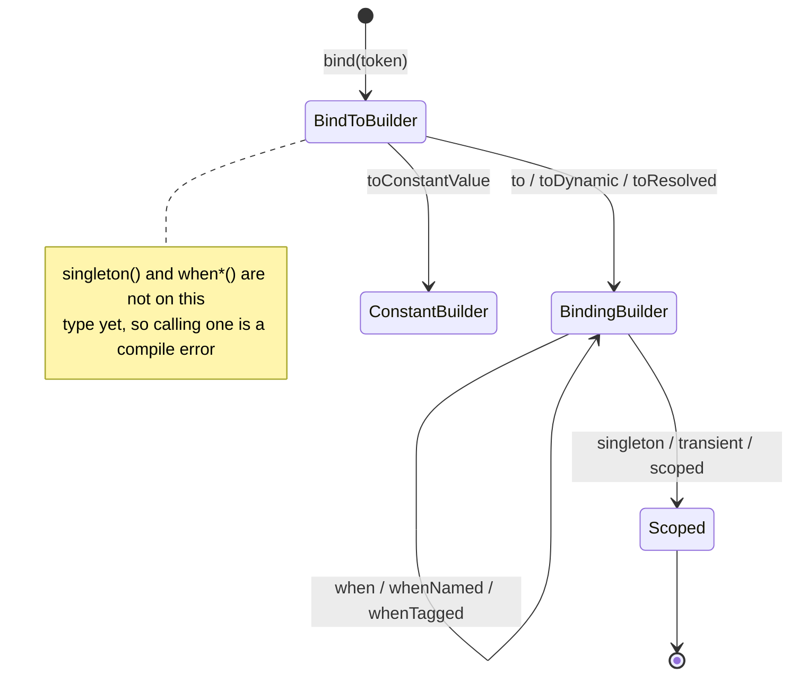

# Learning from `@codefast/di`

A guided read of how this dependency-injection engine applies real computer-science and software-engineering ideas —
architectural patterns, design patterns, algorithms and data structures, TypeScript type techniques, performance
engineering, and testing. The goal isn't to document the API (that's [`README.md`](./README.md)) or the contract (that's
[`SPEC.md`](./SPEC.md)); it's to give a newcomer a map of _which techniques live where_, and enough of the reasoning to
learn from them.

**How to use this document.** It teaches by pointing at real code. Every technique below cites the file that implements
it — open that file, that's where the learning is. The document has two parts you can read in either order:

- **Part 1 — a guided tour** follows one `resolve()` call from `bind()` to a returned instance, naming each concept as
  it comes up. Read this first for the big picture.
- **Part 2 — a catalogue** groups the same techniques by category so you can study one theme (say, all the caching, or
  all the TypeScript tricks) in depth, or come back to look one up.

**A note on the performance claims.** Several techniques here exist for speed. Where this document explains _why_ a
shape is fast, treat that as a hypothesis tied to a particular Node/V8 version and machine — the numbers behind it live
with the [`benchmarks/di-inversify`](../../benchmarks/di-inversify/README.md) suite, which is how you'd actually check.
This document teaches the _technique and the reasoning_, not a scoreboard. When in doubt, read the code and measure.

The three companion documents, and when each is the one you want:

| You want to know…                               | Read                                   |
| ----------------------------------------------- | -------------------------------------- |
| how to _use_ the library                        | [`README.md`](./README.md)             |
| the exact behavioural _contract_                | [`SPEC.md`](./SPEC.md)                 |
| what the shape _is_ and what it _guarantees_    | [`ARCHITECTURE.md`](./ARCHITECTURE.md) |
| _which techniques_ it applies, and how to learn | this file                              |

---

## Part 1 — The life of a `resolve()`

Follow one dependency from the moment it's declared to the moment an instance comes back. Each stop names the technique
in play and links the code; Part 2 goes deeper on each.

The whole path on one page — a request tries the cheapest lane that can work, then dispatches on `scope` and `kind`:



### Stop 0 — Declaring a binding: a fluent builder that is also a type-level state machine

```ts
container.bind(Storage).to(S3Storage).whenTagged(Region.of("eu")).singleton();
```

That chain is one object. [`BindingChain`](src/container/binding-builders.ts) implements _every_ step interface at once
— `BindToBuilder`, `BindingBuilder`, `SingletonBindingBuilder`, and the rest — and each method's **return type**, not a
runtime check, decides what you may call next:

```ts
export class BindingChain<Value>
  implements
    AliasBindingBuilder,
    BindingBuilder<Value>,
    BindToBuilder<Value>,
    ConstantBindingBuilder<Value>,
    ScopedBindingBuilder<Value>,
    SingletonBindingBuilder<Value>,
    SingletonLifecycleBuilder<Value>,
    TransientBindingBuilder<Value> { … }
```

`bind()` hands you back the `BindToBuilder` face, on which `singleton()` and `whenTagged()` simply don't exist — so
`bind(T).singleton()` is a _compile_ error, not a runtime one. This is the **Builder pattern** carrying a **type-level
ordering guarantee** (see [SPEC — the canonical chain order](SPEC.md#chain-order)). Part 2 covers both the
[builder](#builder--fluent-interface) and the [type mechanics](#type-level-ordering-guarantee).

### Stop 1 — Registration: one construction site, last-wins, versioned

`to()`/`toConstantValue()`/`toDynamic()` all funnel through `#register`, which calls the **single binding construction
site**, [`createBinding()`](src/core/binding.ts). Every binding in the process is built by that one literal in one fixed
field order, so they all share a single V8 hidden class — a [performance technique](#one-hidden-class-for-every-binding)
covered later.

The binding lands in the [`BindingRegistry`](src/core/registry.ts) — the **Registry pattern**, a token→bindings store
with side indexes for id and criterion lookups. Registration is **last-wins**: `add()` finds any existing binding whose
_slot_ is equal and displaces it (see [SPEC — slots and last-wins](SPEC.md#slot-matching)). Every mutation bumps a
monotonic `#version` counter — the seed for all the [cache invalidation](#version-stamping--cache-invalidation) later.

### Stop 2 — Asking for a value: a tiered fast-lane dispatch

`container.resolve(Storage)` reaches the engine, [`DependencyResolver`](src/resolution/resolver.ts), and the hot entry
`resolveFromContext`. It tries the cheapest thing that can work first, and only falls through on a miss — a **fast-lane
dispatch**:

1. a direct field read on the own-registry fast-default index (`getFastDefault`);
2. else the chain-versioned lookup memo ([`BindingLookupCache`](src/resolution/cache/binding-lookup-cache.ts));
3. else full candidate selection.

The memo mirrors the container's parent chain, so a child answers from its own cache without re-walking the hierarchy.
This tiering — and its [inline one-entry cache](#inline-cache-in-front-of-a-map) — is in Part 2.

### Stop 3 — Selecting the binding: interning, a bitmask prefilter, and specificity

If selection is needed, the request's criteria (a name, a tag, a predicate) are matched against candidate slots. Three
techniques stack here:

- **Interning / flyweight.** A tag criterion is minted once by [`TagKey.of()`](src/core/tag.ts) and cached, so equal
  criteria are the _same object_ and can be compared by identity. See [interning](#interning--flyweight).
- **Bitmask subset prefilter.** Each tag key owns one bit; a slot's keys OR into a mask; a single `&` rejects any slot
  the request doesn't cover before a value is read. See [the bitmask prefilter](#bitmask-subset-prefilter).
- **Most-specific-wins.** Among survivors, [`selectBinding`](src/resolution/select/binding-select.ts) prefers a
  predicate-bearing candidate, then the one with the most tags, else raises `AmbiguousBindingError`.

The one rule for "does this slot match this request" lives in a single function, `matchesSlot()` — a deliberate
[single source of truth](#one-rule-one-place) so the fast lanes can't drift from the slow one.

### Stop 4 — Deciding how to build: a tagged union, and compile-vs-interpret

A `Binding` is a **discriminated union** keyed by `kind` (`class`, `dynamic`, `constant`, `alias`, …). The dispatcher
[`#resolveDefaultEntry`](src/resolution/resolver.ts) switches on `scope` then `kind`:

```ts
if (scope === "transient") {
  if (binding.kind === "dynamic") { … }
  // Compiled plans only run at the top level — inner levels keep the runtime cycle guard.
  if ((binding.kind === "class" || binding.kind === "resolved") && resolutionPath.length === 0) {
    const plan = this.#getInstantiationPlan(binding);
    if (plan !== null) { return plan(); }
  }
} else if (scope === "singleton") {
  if (this.#isPlainConstant(binding)) { return binding.value; }
  const cachedSingleton = binding.instance;
  if (cachedSingleton !== NO_INSTANCE) { return cachedSingleton; }
  …
}
```

A top-level transient `class`/`resolved` graph is **compiled once** into a nested-constructor closure by
[`InstantiationPlanCompiler`](src/resolution/plan/instantiation-plan.ts) and then runs with no per-resolve bookkeeping —
the classic **compile-vs-interpret** trade. A dependency the compiler can't see through (a factory, a scoped binding, a
hook) becomes an **escape**: a re-entry into the interpreter seeded with exactly the ancestors it would have had, so
behaviour is identical to never compiling. See [compile-vs-interpret](#plan-compile-vs-interpret) and
[the escape hatch](#escape-hatch--partial-compilation).



Notice the comment `a constant is a singleton that is already its own instance` and the plain-constant test living
_inside_ the `singleton` branch — that placement is a deliberate [dispatcher-ordering technique](#dispatcher-ordering).

### Stop 5 — Guarding against cycles: four mechanisms, one per lane

Before a factory runs, the engine must catch `A → B → A`. It uses **four different cycle detectors**, each the cheapest
correct one for its lane:

| Lane                    | Mechanism                                                                                       |
| ----------------------- | ----------------------------------------------------------------------------------------------- |
| sync transient-dynamic  | a boolean `binding.inFlight` flag — O(1) exact membership                                       |
| everything else sync    | push/pop one shared path array ([`resolution-path.ts`](src/resolution/path/resolution-path.ts)) |
| async, inside a cascade | `inFlight` again, cleared when the factory returns its _promise_                                |
| async, across an await  | an append-only branch path read by depth                                                        |



Why a flag suffices for sync (one call stack can't interleave, so the flag _is_ path membership) and why async needs two
lanes is the richest algorithmic story in the codebase — see [cycle detection](#cycle-detection-four-lanes).

### Stop 6 — Constructing: ambient context, and reused scratch space

For a `class` binding the engine calls `new`, but constructor-parameter `@inject` accessors need to know _which
container_ is resolving. The engine sets a module-level [`activeContainer`](src/ambient/active-container.ts) around the
call — an **ambient-context** pattern — so the accessor reads it at property-access time and restores it after.

The scratch arrays that track the resolution path aren't allocated per call; they come from an **object pool** of
resolution contexts reused by depth. See [ambient context](#ambient-context) and [the object pool](#object-pool).

### Stop 7 — Lifecycle: a sentinel, cached singletons, and hooks

Finally the value is produced, possibly run through `onActivation` hooks, and — if `singleton` — cached. The singleton
lives directly on `binding.instance`, a field read rather than a map lookup, with a **null-object sentinel**
[`NO_INSTANCE`](src/core/binding.ts) distinguishing "not resolved yet" from a legitimately cached `undefined`:

```ts
export const NO_INSTANCE: unique symbol = Symbol("di:no-instance");
```

The value comes back to the caller. That's one `resolve()`. Part 2 revisits every stop as a standalone lesson.

---

## Part 2 — A catalogue of techniques

<a id="architecture"></a>

### A. Architectural patterns

<a id="layering"></a>

**Strict downward-only layering.** The `src/` tree is organised into layers, and _value_ imports only ever point down;
type-only imports may point up because they erase at build time and couple nothing at runtime. `core/` (the model) knows
nothing of `resolution/` (the engine); the engine imports the model, not vice versa. You can see it in the import block
at the top of [`resolver.ts`](src/resolution/resolver.ts). [`ARCHITECTURE.md`](ARCHITECTURE.md) has the full layer
diagram. _Lesson: a dependency direction can be an architectural invariant, and the compiler can hold it if you keep
value-imports one-way._



An arrow reads "imports / depends on"; a value import only ever points down. A type-only import may point up (it erases
at build time), so it isn't drawn here.

<a id="ports-and-adapters"></a>

**Ports & adapters (hexagonal) — the metadata seam.** Reflection over decorators is abstracted behind a port,
[`MetadataReader`](src/metadata/metadata-types.ts); the default adapter is
[`SymbolMetadataReader`](src/metadata/symbol-metadata-reader.ts), and a consumer can inject their own. A foreign reader
is wrapped by [`verifyingMetadataReader`](src/metadata/verifying-metadata-reader.ts) — the **Decorator pattern** — which
validates its answers before use, while the trusted default is passed through untouched. _Lesson: an injection point for
a whole subsystem, plus a validating wrapper that only pays for untrusted implementations._

<a id="registry"></a>

**Registry.** [`BindingRegistry`](src/core/registry.ts) is the single store of truth for what's bound: a primary
token→bindings map, plus by-id, named, and tagged side indexes that exist so the hot lookups don't scan. _Lesson: a
registry earns its side indexes only where a scan would otherwise be on a hot path._

<a id="plan-compile-vs-interpret"></a>

**Plan-compile vs. interpret.** Two execution strategies for the same graph: an interpreter (the general resolver) and a
compiler ([`InstantiationPlanCompiler`](src/resolution/plan/instantiation-plan.ts)) that turns a static subgraph into a
nested-constructor closure once, so repeated resolves skip the per-hop machinery. The dispatcher picks the compiled path
only at the top level (`resolutionPath.length === 0`). _Lesson: compile the part of the graph that is static and known;
keep an interpreter for the part that isn't._

<a id="escape-hatch--partial-compilation"></a>

**Escape hatch / partial compilation.** The compiler doesn't give up when it hits something opaque (a factory, a hook, a
too-deep class). It emits an _escape thunk_ ([`#compileEscapeThunk`](src/resolution/plan/instantiation-plan.ts)) that
re-enters the interpreter seeded with the exact ancestors the interpreted path would have had — so cycle detection and
constraint contexts behave identically. This "indistinguishable from interpreting" property is a correctness invariant
(see [`ARCHITECTURE.md`](ARCHITECTURE.md)), pinned by `tests/unit/resolution/plan/instantiation-plan-escapes.test.ts`.
_Lesson: partial compilation is only safe if the escape is behaviourally identical to the slow path — design the seam so
that's true by construction._

<a id="fast-lane-dispatch"></a>

**Fast-lane dispatch.** `resolveFromContext` in [`resolver.ts`](src/resolution/resolver.ts) is a waterfall: a field read
first, then a versioned memo, then full selection. Each tier is a superset-correct shortcut for the tier below. _Lesson:
order a hot path cheapest-first, and make sure every shortcut yields exactly what the general path would._

The memo behind that waterfall isn't one shared table — each container's
[`BindingLookupCache`](src/resolution/cache/binding-lookup-cache.ts) links to its parent's, mirroring the container
chain, so a child answers from its own cache without re-walking the hierarchy on every hop:



_Lesson: when a lookup has to consult a hierarchy, giving each level its own cache that points at the parent's turns a
repeated walk into a single stamped check._

<a id="deferred-initialization"></a>

**Deferred (lazy) subsystem initialization.** A container's constructor ([`container.ts`](src/container/container.ts))
builds only what a resolve cannot happen without — registry, scope manager, lifecycle manager, resolver. The inspector,
module tables, scoped/in-flight caches, named/tagged indexes, and class-metadata caches all allocate on first use. An
empty `Map` isn't free, and most containers never touch most of them. The invariant is that a deferred collaborator
answers identically whether or not it's been touched — pinned by `tests/unit/container/deferred-subsystems.test.ts`.
_Lesson: pay for a subsystem when it's first used, but only if "never allocated" and "allocated but empty" are
indistinguishable to callers._

<a id="ambient-context"></a>

**Ambient context (scoped implicit global).** [`runWithContainer`](src/ambient/active-container.ts) sets and restores a
single module-level `activeContainer` around a callback, so property-access `@inject` accessors can find the resolving
container without it being threaded through every signature. _Lesson: an ambient is a controlled global — safe when it's
strictly set-around-a-synchronous-callback and always restored._

<a id="callbacks-as-interface"></a>

**Narrow callback interface between resolver and context.** The three `ResolutionContext` implementations don't know the
resolver's internals; they call back through a small [`ResolverCallbacks`](src/resolution/context.ts) interface.
_Lesson: decouple two collaborators with the smallest interface that carries the messages, not with a shared base
class._

<a id="one-rule-one-place"></a>

**One rule, one place (single source of truth for a decision).** The tiered fast lanes above are an optimization risk:
each is a shortcut that must yield exactly what the general path would. So "does this slot match this request?" is
answered by _one_ function, `matchesSlot()`, and "does this request carry exactly one criterion?" by
`singleCriterionOnlyOf()` ([`binding-select.ts`](src/resolution/select/binding-select.ts),
[`resolve-options.ts`](src/injection/resolve-options.ts)) — the lanes _call_ those rather than re-deciding. This isn't
hypothetical caution: a fast lane that re-implemented a rule once returned a binding a `when()` predicate was refusing.
_Lesson: when several code paths must agree on a decision, put the decision in one function they all call — a duplicated
rule is how the fast path and the slow path silently drift._

<a id="design-patterns"></a>

### B. Design patterns (GoF & idiomatic)

<a id="builder--fluent-interface"></a>

**Builder + fluent interface.** [`BindingChain`](src/container/binding-builders.ts) is the canonical example: one object
implements every step interface, registers on `to*()` via `#register`, and refines in place via `#reslot`/`#withScope`.
Note that refinement re-registers under the _original id_ so `id()` stays stable across a chain:

```ts
#reslot(slot: BindingSlot, predicate: BindingConstraint | undefined): this {
  const previous = this.#registered();
  this.#binding = createBinding(previous, previous.token, slot, predicate, previous.id);
  this.#commit(this.#binding, previous.id);
  return this;
}
```

_Lesson: a fluent builder can be one mutable object; the interfaces it returns are what make it feel like a pipeline._

<a id="static-factory"></a>

**Static factory objects.** `Container` (with `.create`/`.fromModules`), `Module.create`,
[`token()`](src/core/token.ts), and [`tag()`](src/core/tag.ts) are all factories that hide construction and hand back a
typed handle. _Lesson: a factory function is the natural home for a brand (below) that a bare constructor can't
produce._

<a id="strategy-table-driven"></a>

**Table-driven strategy.** Instead of a `switch`, the scope-application step uses a `Record` mapping each `BindingScope`
to its builder call ([`APPLY_BINDING_SCOPE`](src/container/container.ts)). Because it's a total `Record`, adding a new
scope without handling it is a _compile_ error. _Lesson: a lookup table typed as a total `Record` turns "did I handle
every case?" into a type check._

<a id="null-object--sentinels"></a>

**Null-object / sentinel values.** `unique symbol`s stand in for "absent" where `undefined`/`null` would be ambiguous:
[`NO_INSTANCE`](src/core/binding.ts) (unset singleton), `SCOPED_MISS`
([`scope-manager.ts`](src/lifecycle/scope-manager.ts)), `PLAN_RETRY`
([`instantiation-plan.ts`](src/resolution/plan/instantiation-plan.ts)), `UNOWNED_BRANCH`. Each lets a cache legitimately
store `undefined` as a value while still telling "cached `undefined`" apart from "nothing cached." _Lesson: when
`undefined` is a valid value, reach for a private sentinel, not a second boolean._

<a id="interning--flyweight"></a>

**Interning / flyweight.** [`tag.ts`](src/core/tag.ts) is the richest small example in the codebase. `TagKey.of(value)`
returns one shared object per value, so equal criteria compare by `===`:

```ts
of(value: Value): BindingTag<Value> {
  const cacheKey = internKeyFor(value);
  const existing = interned.get(cacheKey);
  if (existing !== undefined) {
    return existing;
  }
  const pair = { key, value, mask } as BindingTag<Value>;
  interned.set(cacheKey, pair);
  return pair;
}
```

_Lesson: interning turns value-equality into reference-equality, which is both faster and indexable — but read
[the ±0 split](#interning-pm-zero) for the correctness subtlety it forces._

<a id="memoization"></a>

**Memoization, each with its own invalidation.** The engine memoizes in several places, and the interesting part is that
each memo has a _different_ invalidation rule matched to what it derives from:

- the resolution `frame` on the binding (derives from immutable fields; cleared when a chain rewrites `scope`);
- per-slot frozen `ResolveOptions` ([`resolve-options.ts`](src/injection/resolve-options.ts));
- compiled plans by binding id;
- class metadata in [`ClassIntrospector`](src/resolution/cache/class-introspector.ts).

_Lesson: a memo is only as correct as its invalidation; write the invalidation rule from "what does this value depend
on?", not from habit._

<a id="inline-cache-in-front-of-a-map"></a>

**Inline (one-entry) cache in front of a `Map`.** When a loop asks about the same key repeatedly,
[`LifecycleManager.activationHandlersFor`](src/lifecycle/lifecycle-manager.ts) and
[`BindingLookupCache.defaultEntry`](src/resolution/cache/binding-lookup-cache.ts) each keep a single
last-token/last-value slot ahead of the map, so the common "same token again" hit skips hashing entirely. _Lesson: a
one-entry cache in front of a hash map is nearly free and often wins the actual access pattern._

<a id="object-pool"></a>

**Object pool.** Sync resolution contexts are pooled by depth and reused via `reset()` rather than allocated per level
([`resolver.ts`](src/resolution/resolver.ts) `#acquireSyncResolutionContext`, [`context.ts`](src/resolution/context.ts)
`reset`). `reset()` even compares-before-storing to avoid needless writes — see
[write barriers](#write-barrier-aware-reset). _Lesson: pool the objects on the hottest path, and remember a pooled
object that lives long enough has different GC costs than a fresh one._

<a id="discriminated-union-dispatch"></a>

**Discriminated-union dispatch.** `Binding` is a `kind`-tagged union ([`binding.ts`](src/core/binding.ts)); the
instantiation switches exhaustively on `kind`, and errors form a parallel union keyed by a `code` literal on the base
[`DiError`](src/errors/errors.ts). _Lesson: a tagged union plus an exhaustive switch is the type-safe alternative to
polymorphism when the set of shapes is closed and hot._

<a id="output-adapters"></a>

**Adapter (output formats).** The dependency graph is built once as a neutral JSON, then adapted to Mermaid, DOT,
Cytoscape, and React Flow by small functions in
[`introspection/graph-adapters/`](src/introspection/graph-adapters/mermaid.ts). _Lesson: compute the neutral form once,
adapt at the edges._

<a id="algorithms"></a>

### C. Algorithms & data structures

<a id="cycle-detection-four-lanes"></a>

**Cycle detection — four mechanisms, chosen per lane.** This is the headline data-structure decision, and a great study
in "the right structure depends on the execution model."

- **Sync transient-dynamic** uses a single boolean, `binding.inFlight`. Because synchronous resolution runs on one call
  stack that can't interleave, the flag _is_ exact membership of the current path — O(1), no allocation.
- **Everything else sync** pushes and pops one shared path array
  ([`enterResolutionPath`](src/resolution/path/resolution-path.ts)), because the error message needs to name the path,
  which a flag can't.
- **Async in a cascade** reuses the `inFlight` flag but clears it when the factory returns its _promise_ (not when it
  settles) — which is what removes a diamond false-positive.
- **Async across an await** can't rely on a call stack, so it carries an append-only path read by branch depth
  ([`extendResolutionBranch`](src/resolution/path/resolution-path.ts)).

_Lesson: don't pick a cycle detector in the abstract — pick the cheapest structure that is exact for the concurrency
model of that specific lane._

<a id="threshold-scan-vs-set"></a>

**Threshold-switched linear-scan vs. `Set`.** Within the shared-array detector, membership is an `Array.includes` scan
while the path is short, and a `Set` attached to the array (under a symbol key) once it grows past a measured threshold:

```ts
export const RESOLUTION_SET_THRESHOLD = 32;

export function enterResolutionPath(resolutionPath: Array<string>, tokenDisplayName: string): Set<string> | undefined {
  const pathWithSet = resolutionPath as ResolutionPathWithSet;
  let resolutionSet = pathWithSet[RESOLUTION_SET_KEY];
  if (resolutionSet !== undefined && resolutionSet.size !== resolutionPath.length) {
    resolutionSet = undefined;
    pathWithSet[RESOLUTION_SET_KEY] = undefined;
  }
  if (resolutionSet === undefined && resolutionPath.length >= RESOLUTION_SET_THRESHOLD) {
    resolutionSet = new Set<string>(resolutionPath);
    pathWithSet[RESOLUTION_SET_KEY] = resolutionSet;
  }
  if (resolutionSet === undefined ? resolutionPath.includes(tokenDisplayName) : resolutionSet.has(tokenDisplayName)) {
    throw new CircularDependencyError([...resolutionPath, tokenDisplayName]);
  }
  resolutionPath.push(tokenDisplayName);
  resolutionSet?.add(tokenDisplayName);
  return resolutionSet;
}
```

The two branches answer _identically_ — the threshold switches the data structure, never the behaviour. The size check
at the top is what keeps that true: the frames already on the path when the set attaches are handed no set to delete
from, so a set whose size disagrees with the path is holding unwound frames' names and gets dropped for the next deep
frame to rebuild. (The value 32 is a tuning constant from a depth sweep; it's the kind of number worth re-measuring
rather than trusting.) _Lesson: for small n a linear scan often beats a hash set; a threshold lets you have both without
changing semantics._

<a id="bitmask-subset-prefilter"></a>

**Bitmask subset prefilter for tags.** Tag matching needs a subset test ("does the request carry every key this slot
declares?"). Each tag key is assigned a monotonic id and thus one bit; a key _set_ becomes one machine word:

```ts
const mask = (1 << (id % MASK_WIDTH)) as TagKeyMask; // in tag()

export function coversTagKeys(requestMask: TagKeyMask, slotMask: TagKeyMask): boolean {
  return (requestMask & slotMask) === slotMask;
}
```

A single `&` rejects any non-covering slot before a criterion is read. Ids past `MASK_WIDTH` wrap, so two keys can share
a bit — but that only ever causes a _false positive_ (a slot that passes the prefilter and is then rejected by the exact
identity comparison), never a false negative. See [`matchesSlot`](src/resolution/select/binding-select.ts) for the
consumer. _Lesson: a bitmask turns a set-subset test into one instruction; when bits can collide, design so collisions
cost a re-check, never a wrong answer._

<a id="interning-pm-zero"></a>

**Interning meets a correctness edge: the ±0 split.** This is the sharpest "algorithm meets correctness" moment in the
repo. `Map` keys compare by SameValueZero, under which `+0` and `-0` are equal; but the tag contract says values compare
by `Object.is`, under which they aren't. If the intern cache stored both zeros under one key, the two would become
indistinguishable everywhere downstream. So the negative zero is cached under a private symbol instead:

```ts
const NEGATIVE_ZERO_KEY: unique symbol = Symbol("di:tag-negative-zero");

function internKeyFor(value: unknown): unknown {
  return value === 0 && Object.is(value, -0) ? NEGATIVE_ZERO_KEY : value;
}
```

Pinned by `tests/unit/resolution/select/tagged-selection.test.ts`. _Lesson: `Map` equality (`SameValueZero`) and
`Object.is` differ on exactly one pair of values — if your identity scheme rides on a `Map`, that difference is a bug
waiting unless you handle it._

<a id="version-stamping--cache-invalidation"></a>

**Version stamping for cache invalidation.** The registry keeps a monotonic `#version` that bumps on every mutation
([`registry.ts`](src/core/registry.ts)); caches stamp themselves with a `chainVersion()` (the _sum_ of the versions
along the container chain) and self-clear on a mismatch
([`binding-lookup-cache.ts`](src/resolution/cache/binding-lookup-cache.ts)). Summing is a cheap way to notice a change
anywhere in the parent chain in one comparison. _Lesson: a monotonic version counter is the simplest correct cache key
for "has anything changed since?", and summing along a chain extends it to "has anything changed anywhere above me?"._

<a id="iterative-alias-resolution"></a>

**Iterative alias resolution with exact cycle detection.** `toAlias` bindings are followed in a `while` loop in
[`#requireBinding`](src/resolution/resolver.ts); a lazily-created `Set` of visited tokens throws
`CircularDependencyError` rather than overflowing the stack. The cache uses a bounded fold (`ALIAS_HOP_LIMIT`) as a fast
pre-check and defers to the exact loop past the cap. _Lesson: follow a chain iteratively, not recursively, and keep an
exact visited-set for the cycle case even when a cheap bound handles the common case._

<a id="dfs-scope-validation"></a>

**DFS for static scope validation.** [`validate()`](src/container/container.ts) walks the constructor/`toResolved`
dependency edges depth-first, following aliases to their terminals, and throws `ScopeViolationError` on a captive
dependency (a longer-lived binding depending on a shorter-lived one). See [SPEC — `validate`](SPEC.md#validate).
_Lesson: some correctness properties are graph properties; a plain DFS with a visited set is often all you need to check
them ahead of time._

<a id="most-specific-wins"></a>

**Most-specific-wins arbitration.** [`selectBinding`](src/resolution/select/binding-select.ts) ranks candidates: a lone
predicate-bearing candidate wins; otherwise the lone candidate with the most tags; otherwise it's ambiguous and raises.
_Lesson: when several answers match, define specificity explicitly and make ambiguity an error, not a silent pick._

<a id="fixed-arity-specialization"></a>

**Fixed-arity specialization.** Spreading an argument array is not free, so both the interpreter (`#resolveDeps`) and
the compiler special-case the common small arities — `new T(dep0())`, `new T(dep0(), dep1())`, up to three — before
falling back to a spread ([`instantiation-plan.ts`](src/resolution/plan/instantiation-plan.ts)). _Lesson: the common
case is usually low-arity; unrolling it a little avoids allocation and helps the JIT._

<a id="typescript"></a>

### D. TypeScript techniques

<a id="branded-types"></a>

**Branded / nominal types.** TypeScript is structural, so the codebase manufactures nominal types with phantom brands:
[`Token<Value>`](src/core/token.ts), `BindingIdentifier` ([`types.ts`](src/core/types.ts)), and the tag brands
([`tag.ts`](src/core/tag.ts)). The most instructive use is in
[`resolution-path.ts`](src/resolution/path/resolution-path.ts): `OwnedBranchPath` and `OwnedBranchDepth` are brands that
turn "may this async lane append to this array?" into a question the _compiler_ answers — only `extendResolutionBranch`
can mint one, so a sync frame's plain array simply can't be passed where an owned branch is required. _Lesson: a brand
encodes a provenance or a permission the structural type system would otherwise ignore._

<a id="variance-annotations"></a>

**Variance annotations (`out`) — and a deliberate omission.** `Token`, `Constructor`, and `InjectionDescriptor` declare
`out Value`, so the compiler rejects the annotation the day the type stops being covariant — a self-checking assertion.
The binding kinds deliberately carry _no_ variance annotation, which sets up the next trick. _Lesson: an explicit `out`
is documentation the compiler enforces; leaving it off is sometimes just as deliberate._

<a id="method-vs-property-bivariance"></a>

**The method-vs-property bivariance trick.** This is _the_ load-bearing type trick of the engine. Under
`strictFunctionTypes`, function-typed _properties_ are checked contravariantly in their parameters, which would make
`Binding<Value>` _not_ assignable to the erased `Binding` the internal lanes pass around. Declaring the lifecycle hooks
as **methods** instead makes their parameters compare _bivariantly_, restoring assignability — while the public
`ActivationHandler`/`DeactivationHandler` stay function-typed properties so a user's handler is still checked strictly:

```ts
interface BindingLifecycleHooks<Value> {
  onActivation?(ctx: ResolutionContext, instance: Value): Value | Promise<Value>; // method → bivariant params
  onDeactivation?(instance: Value): void | Promise<void>;
}
```

Pinned by `tests/types/binding-variance.test.ts`. _Lesson: method syntax and property syntax have different variance
under `strictFunctionTypes` — a real tool, not a quirk, when you need the erasure to type-check._

<a id="type-level-ordering-guarantee"></a>

**Type-level ordering guarantee.** The fluent chain's legal order (Stop 0) is enforced entirely by the return types of
the builder interfaces ([`binding.ts`](src/core/binding.ts)); a `ChainNotRegisteredError` only backstops callers who
have no types or cast past them. Pinned by `tests/types/container-api.test.ts`. Each return type is a state, and the
methods it offers are the only legal transitions out of it:



_Lesson: you can encode a small state machine in return types so illegal transitions don't compile._

<a id="satisfies-completeness-guard"></a>

**`satisfies` as a completeness guard.** [`createBinding`](src/core/binding.ts) writes one literal that must contain
every field any binding kind declares. It's typed `… satisfies ConstructedBindingFields as Binding<Value>`, where
`ConstructedBindingFields` is a `Record` of every field name — so forgetting one is a compile error, while the fixed key
order (which the single hidden class depends on) is preserved:

```ts
return {
  kind: fields.kind,
  id,
  inFlight: false,
  frame: undefined,
  instance: fields.instance ?? NO_INSTANCE,
  // …every other field, in a fixed order…
} satisfies ConstructedBindingFields as Binding<Value>;
```

_Lesson: `satisfies` checks a value against a type without widening it — here it turns "did I write every field?" into a
compile error._

<a id="advanced-conditional-types"></a>

**Advanced conditional & mapped types.** A few worth reading: `DistributiveOmit`/`KeysOfUnion` driving `PartialBinding`
([`binding.ts`](src/core/binding.ts)); `ResolvedDependencyValue` decoding `multi`/`optional` flags into `Array<T>` /
`T | undefined` ([`descriptor.ts`](src/injection/descriptor.ts)); and `toResolved`'s mapped tuple with a `const` type
parameter plus `NoInfer` to type factory arguments positionally against their declared dependencies. _Lesson: mapped
tuples plus `NoInfer` let a factory's argument types be *derived* from a dependency list rather than restated._

<a id="type-predicates"></a>

**Type predicates.** Small narrowing helpers — [`isInjectionDescriptor`](src/injection/descriptor.ts), `isSyncModule`,
`#isPlainConstant` — give the hot paths a typed shortcut and keep the "which shape is this?" logic in one named place.
_Lesson: a `x is T` predicate is how you turn a runtime shape check into type information._

<a id="conditional-package-imports"></a>

**Conditional `package.json#imports`.** Internal `#/…` specifiers resolve to `src/` during development and to built
`dist/` for consumers, via conditional import maps ([`package.json`](package.json)) — no `tsconfig` path aliases needed.
This is a packaging technique as much as a TS one; the root [`CLAUDE.md`](../../CLAUDE.md) explains the three-audience
reasoning. _Lesson: the `imports`/`exports` fields can serve dev and published consumers different files under one
specifier._

<a id="symbol-keyed-off-band-data"></a>

**Symbol-keyed off-band data.** Non-enumerable symbol properties attach engine bookkeeping to public objects without it
showing up in spreads or `JSON`: `MEMOIZED_RESOLVE_OPTIONS` ([`resolve-options.ts`](src/injection/resolve-options.ts)),
`CONSTRAINT_REQUIREMENT`, `RESOLUTION_SET_KEY`. The "spread doesn't copy symbol keys" property is even _relied on_ for
correctness — the escape thunk's `[...names]` intentionally drops a stale membership `Set` that lives under a symbol.
_Lesson: a symbol key is private-by-convention storage that survives on the object but stays invisible to spreads and
serialization — occasionally that invisibility is the feature._

<a id="performance"></a>

### E. Performance engineering techniques

_Reminder: the following are techniques and the reasoning behind them, not benchmark results. Whether any of them is
worth it today is an empirical question the [`benchmarks/di-inversify`](../../benchmarks/di-inversify/README.md) suite
answers; the [`ARCHITECTURE.md`](ARCHITECTURE.md) notes carry the design rationale._

<a id="one-hidden-class-for-every-binding"></a>

**One V8 hidden class for every binding.** V8 gives objects with the same properties in the same order a shared "hidden
class," and monomorphic property reads (always the same hidden class) are much cheaper than megamorphic ones. Every
binding is built by the one literal in [`createBinding`](src/core/binding.ts) with a fixed field order, and the registry
stores it by reference rather than re-copying — so the resolver's hot `kind`/`scope`/`factory` reads stay monomorphic.
_Lesson: if a hot object type has many instances read on a fast path, build them all one way._

<a id="totalized-field"></a>

**Totalizing a field to avoid a branch.** Even an `alias` binding, which has no scope of its own, declares
`scope: "transient"` — so `scope` is _always_ a field read and never needs an `undefined` fallback. The named
`effectiveBindingScope` helper is kept only because it's the vocabulary validation and introspection speak. _Lesson:
making an optional field total can remove a branch (and keep the hidden class stable) at the cost of a tiny redundancy._

<a id="write-barrier-aware-reset"></a>

**Write-barrier-aware reset.** A pooled resolution context lives long enough to sit in V8's old space, where every
pointer store into it costs a write barrier. `reset()` ([`context.ts`](src/resolution/context.ts)) therefore
compares-before-storing the resolver and the two scratch arrays, and the resolver hands it the _same_ array pair each
time so the compares actually hit. _Lesson: for a long-lived object, an unnecessary pointer write isn't free; comparing
first can be cheaper than storing._

<a id="allocation-avoidance"></a>

**Allocation avoidance on the hot path.** Several shapes exist to not allocate: the singleton stored on
`binding.instance` (a field, not a `Map` entry); shared `ROOT_CONSTRAINT_CONTEXT`/`EMPTY_*` constants for the root case;
one frozen `ResolveOptions` per slot reused across every resolve; one `AsyncCascadeContext` shared across all levels of
a cascade; and a deliberately non-`async` helper to avoid a promise + state machine per level
([`resolver.ts`](src/resolution/resolver.ts)). _Lesson: the cheapest allocation is the one you don't make; look for
per-call objects that could be per-slot, per-container, or constant._

<a id="eager-vs-lazy-upsert"></a>

**`getOrInsert` vs `getOrInsertComputed`, chosen by hit rate.** The package's own `Map` upsert helpers
([`map-upsert.ts`](src/core/map-upsert.ts)) come in eager and lazy forms — its own, because the ES2025 methods they
stand in for would raise the package's Node floor. The registry's index insertions use the eager `getOrInsert` because a
bind is usually a token's first (the fallback value is usually what gets stored); `taggedEntry()` uses the lazy
`getOrInsertComputed` with a module-scope factory so no closure is allocated on the common hit
([`registry.ts`](src/core/registry.ts), [`binding-lookup-cache.ts`](src/resolution/cache/binding-lookup-cache.ts)).
_Lesson: eager-vs-lazy isn't a style choice; pick it from which branch dominates._

<a id="dispatcher-ordering"></a>

**Dispatcher ordering (test under the branch that implies it).** In [`#resolveDefaultEntry`](src/resolution/resolver.ts)
the plain-constant test lives _inside_ the `singleton` branch — because a constant _is_ a singleton — rather than at the
top of the dispatcher. Hoisting it up would charge every transient resolve for a test it never needs. The same function
is noted as inlining-sensitive: a test added inside a branch it doesn't even take has shifted an unrelated row. _Lesson:
put a check under the branch that already implies it, and treat hot dispatchers as inlining-sensitive — measure edits
near them._

<a id="memory-friendly-weak-caches"></a>

**GC-friendly weak caches.** Per-class and per-reader caches use `WeakMap`/`WeakSet`
([`class-introspector.ts`](src/resolution/cache/class-introspector.ts)), so a class or reader that becomes unreachable
takes its cache entry with it. _Lesson: key a cache weakly when its lifetime should follow the key's, not the cache's._

<a id="cheap-negative-flags"></a>

**Cheap negative-answer flags.** A container that never bound a constant sets `hasHeldConstantBinding` to skip the
constant-deactivation sweep at dispose; `activationVersion === 0` short-circuits all activation-hook checks. A single
boolean lets a whole sweep be skipped. _Lesson: a one-time "there is nothing here" flag can save a repeated scan for the
common empty case._

<a id="testing"></a>

### F. Testing techniques

di's tests live under `tests/unit`, `tests/integration`, and `tests/types` (the repo-wide taxonomy is described in
[`TESTING.md`](../../TESTING.md)). The techniques worth learning from:

<a id="type-level-tests"></a>

**Type-level tests with `expectTypeOf`.** The load-bearing _type_ invariants are pinned by compile-time assertions, not
runtime ones: `tests/types/binding-variance.test.ts` (the method-vs-property trick),
`tests/types/async-branch-ownership.test.ts` (the ownership brands), `tests/types/container-api.test.ts` (the fluent
order). A type test that _stops_ compiling is the failure signal. _Lesson: if an invariant is a type property, assert it
in the type system — a runtime test can't see it._

<a id="invariant-pinning-tests"></a>

**Invariant-pinning tests, named next to the invariant.** Each correctness invariant in
[`ARCHITECTURE.md`](ARCHITECTURE.md) cites the test that holds it — e.g.
`tests/unit/resolution/in-flight-invariants.test.ts` (the cycle flag is released on every exit path),
`tests/unit/resolution/cache-invalidation.test.ts` (memos clear correctly across lanes),
`tests/unit/resolution/singleton-on-binding.test.ts`. _Lesson: pin a subtle invariant with a test whose name states the
invariant, so a failure reads as "you broke X," not "assertion failed."_

<a id="structural-diagnostics-seam"></a>

**Structural (not timing) assertions via a diagnostics seam.** Performance _shapes_ are verified without a benchmark: a
private `RESOLUTION_DIAGNOSTICS` symbol ([`diagnostics.ts`](src/errors/diagnostics.ts)) exposes counters like
`compiledPlanCount`, `syncContextPoolSize`, and `builtSubsystems`, so a unit test can assert "a plan _was_ compiled" or
"this subsystem _stayed_ deferred" deterministically. _Lesson: you can test that an optimization is *active* (a
structural fact) even when you can't test that it's *fast* (a flaky, machine-dependent fact)._

<a id="toggle-then-reresolve"></a>

**Toggle-then-re-resolve for state cleanup.** To prove a failure path released its state (e.g. `inFlight`), a test flips
a `let` flag to make the first resolve throw, then re-resolves and asserts success — proving nothing leaked
(`tests/unit/resolution/in-flight-invariants.test.ts`). _Lesson: to test that cleanup happened, force the failure, then
exercise the thing again._

---

## Where to go next

A reading order that tends to work:

1. **Use it** — [`README.md`](./README.md), and the runnable [`examples/`](examples/).
2. **Take the tour above**, then open each file it links as you go.
3. **Study one catalogue theme** end-to-end. The most self-contained single files to start from:
   [`src/core/tag.ts`](src/core/tag.ts) (interning + bitmask + the ±0 split),
   [`src/resolution/path/resolution-path.ts`](src/resolution/path/resolution-path.ts) (scan-vs-Set + ownership brands),
   and [`src/injection/resolve-options.ts`](src/injection/resolve-options.ts) (memoize + freeze).
4. **Read the contract** — [`SPEC.md`](./SPEC.md) — when you need the exact rules, and
   [`ARCHITECTURE.md`](./ARCHITECTURE.md) when you're about to change the engine and want the invariants and the
   reasoning.
5. **Run the tests** — they're the executable version of every claim here, and the type tests under `tests/types` are
   short and very readable.

If a performance claim in this document matters to a decision you're making, don't take it on faith — the
[`benchmarks/di-inversify`](../../benchmarks/di-inversify/README.md) suite is how you check it against your own runtime.

## License

Released under the [MIT License](./LICENSE).
