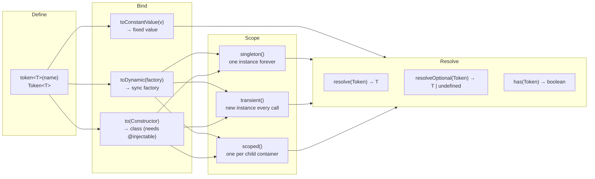

# Example 01 — Tokens & Basic Bindings

**Concepts:** `token()`, `toConstantValue`, `toDynamic`, `singleton`, `transient`, `resolveOptional`, `has`

---

## What this example shows

This is the entry point to `@codefast/di`. Every feature in the library starts with two ideas:

1. **Tokens** are typed keys — `Token<T>` carries the value type `T` through every `bind → resolve` call, so the return type of `resolve()` is always what you registered.
2. **Bindings** tell the container _how_ to create a value for a token.

---

## Diagram



## Key concepts explained

### Creating tokens

```ts
const GreeterToken = token<Greeter>("Greeter");
const MessageToken = token<string>("Message");
```

`token<T>(name)` creates a `Token<T>`. The string name is used only for debugging — it has no effect on resolution. Two calls with the same name produce two distinct tokens.

---

### Binding strategies

#### `toConstantValue` — a fixed value

```ts
container.bind(MessageToken).toConstantValue("Good day");
```

The container returns the same object every time. No factory, no scope needed.

#### `toDynamic` — sync factory

```ts
container
  .bind(GreeterToken)
  .toDynamic((ctx) => {
    const message = ctx.resolve(MessageToken); // resolve other tokens via ctx
    return new FormalGreeter(message);
  })
  .singleton();
```

The factory runs once (singleton) or every time (transient). `ctx` is the resolution context — use it to pull other tokens without going back to the container directly.

#### Scopes

| Scope          | Behaviour                                         |
| -------------- | ------------------------------------------------- |
| `.singleton()` | Created once, cached forever in the container     |
| `.transient()` | Fresh instance on every `resolve()`               |
| `.scoped()`    | One instance per child container (see Example 03) |

The default scope when none is specified is `singleton`.

---

### Resolution

```ts
const greeter = container.resolve(GreeterToken); // throws if unbound
const log = container.resolveOptional(LogToken); // returns undefined if unbound
const exists = container.has(MessageToken); // boolean check, no creation
```

- **`resolve`** — throws `TokenNotBoundError` if the token has no binding.
- **`resolveOptional`** — safe alternative; returns `undefined` instead of throwing.
- **`has`** — existence check without creating an instance.

---

### Singleton vs. transient in practice

```ts
// Singleton: same instance returned both times
const first = container.resolve(GreeterToken);
const second = container.resolve(GreeterToken);
console.log(first === second); // true

// Transient: independent instances
const counterA = container.resolve(CounterToken);
const counterB = container.resolve(CounterToken);
counterA.increment();
console.log(counterA.value()); // 1
console.log(counterB.value()); // 0  ← separate state
```

---

## What to read next

- **Example 02** — use `@injectable` and `inject()` so the container constructs classes automatically instead of writing factory functions.
- **Example 03** — understand the third scope, `scoped`, and how child containers enable per-request isolation.
