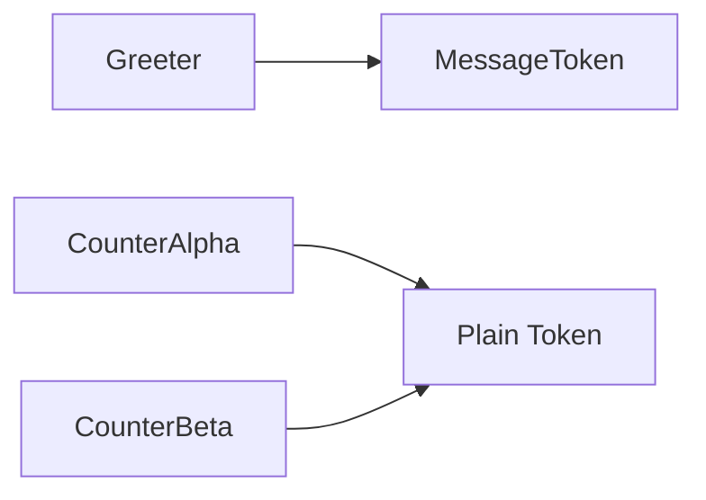

# Example 01: Basic Tokens & Bindings

This example demonstrates the core building blocks of `@codefast/di`: **Tokens** and the various ways to bind values to them.

## Key Concepts

### 1. Tokens

Tokens are unique identifiers for dependencies. Unlike strings, tokens are type-safe and represent a specific interface or class.

```typescript
const MessageToken = token<string>("Message");
```

### 2. Constant Values

Use `toConstantValue` for configuration, primitives, or pre-existing objects.

```typescript
container.bind(MessageToken).toConstantValue("Good day");
```

### 3. Dynamic Factories (Synchronous)

Use `toDynamic` when you need logic to create a dependency, or when a dependency depends on other tokens.

```typescript
container.bind(GreeterToken).toDynamic((ctx) => {
  const msg = ctx.resolve(MessageToken);
  return new Greeter(msg);
});
```

## Dependency Graph



## Singleton vs. Transient

- **Singleton** (Default for `.to()`/`.toSelf()`): The same instance is reused every time the token is resolved.
- **Transient**: A new instance is created every time.

In this example:

- `Greeter` is a **Singleton**.
- `Counter` is bound as **Transient**, so `counterAlpha` and `counterBeta` are independent instances.

## Resolver API

- `container.resolve(token)`: Throws if not bound.
- `container.resolveOptional(token)`: Returns `undefined` if not bound.
- `container.has(token)`: Checks if a binding exists.
