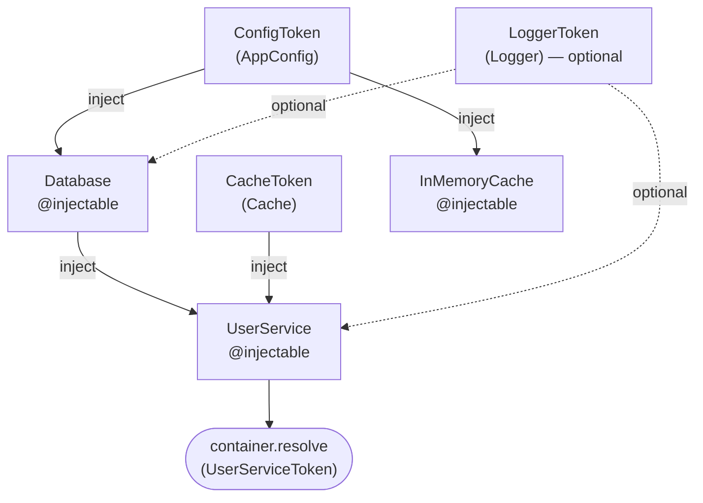

# Example 02 — Decorators

**Concepts:** `@injectable`, `inject()`, `optional()`, `.to()`, `.toSelf()`

---

## What this example shows

When a class has constructor dependencies, you don't have to write a factory function by hand. The `@injectable` decorator records the dependency list once; the container reads it and wires up arguments automatically.

This uses **TC39 Stage 3 decorators** — no `reflect-metadata`, no `experimentalDecorators`.

---

## Diagram

Dependency graph of the example: arrows show "depends on".



## Key concepts explained

### `@injectable` — declare constructor dependencies

```ts
@injectable([inject(ConfigToken), optional(LoggerToken)])
class Database {
  constructor(config: AppConfig, logger?: Logger) {
    this.url = config.dbUrl;
    logger?.log(`Database connected to ${config.dbUrl}`);
  }
}
```

The array passed to `@injectable` maps positionally to constructor parameters:

- `inject(Token)` — required dependency; throws if not bound.
- `optional(Token)` — optional dependency; resolves to `undefined` if not bound.

The order of entries must match the order of constructor parameters exactly.

---

### `inject()` — required dependency marker

```ts
@injectable([inject(Database), inject(CacheToken), optional(LoggerToken)])
class UserService {
  constructor(
    private readonly database: Database,
    private readonly cache: Cache,
    private readonly logger?: Logger,
  ) {}
}
```

`inject(token)` is the standard way to mark a dependency. You can pass a `Token<T>` or a class constructor directly (see Example 08 for the plain-token shorthand).

---

### `optional()` — nullable dependency

```ts
optional(LoggerToken);
```

If `LoggerToken` is not bound in the container the parameter receives `undefined`. The TypeScript type must be `T | undefined` (or `T?`) to match.

---

### Binding classes: `.to()` and `.toSelf()`

```ts
container.bind(CacheToken).to(InMemoryCache).singleton();
```

`.to(Constructor)` tells the container "construct this class when `CacheToken` is resolved." The class must have `@injectable`.

```ts
container.bind(Database).toSelf().singleton();
```

`.toSelf()` is shorthand when the token _is_ the class constructor — `bind(Database).toSelf()` is equivalent to `bind(Database).to(Database)`.

---

### Default scope

```ts
container.bind(UserServiceToken).to(UserService);
// no .singleton() / .transient() → defaults to singleton
```

When no scope is specified the container defaults to `singleton`.

---

### Verifying singleton behaviour

```ts
const first = container.resolve(Database);
const second = container.resolve(Database);
console.log(first === second); // true — same instance
```

---

## When to use `@injectable` vs. `toDynamic`

| Situation                                | Use                     |
| ---------------------------------------- | ----------------------- |
| Class with typed constructor deps        | `@injectable` + `.to()` |
| Complex construction logic or conditions | `toDynamic` factory     |
| Plain value / third-party object         | `toConstantValue`       |

---

## What to read next

- **Example 03** — scoped lifetime and child containers (per-request isolation).
- **Example 08** — plain tokens in `@injectable` (no `inject()` wrapper needed for the simple case).
