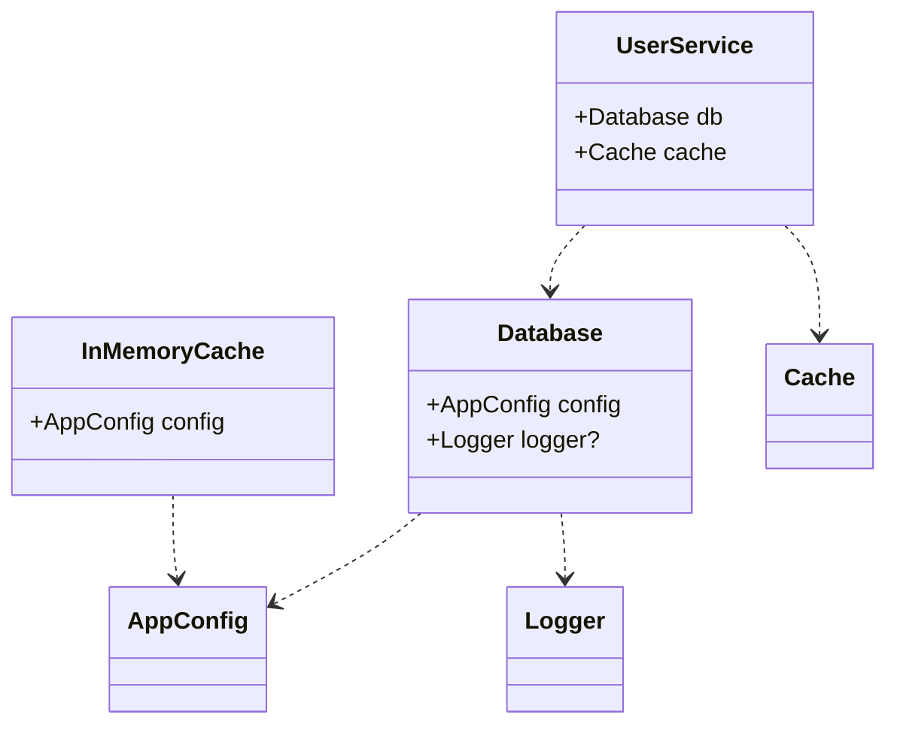

# Example 02: Decorators (@injectable & @inject)

This example shows how to use TC39 Stage 3 Decorators for a clean, declarative dependency injection experience.

## Decorators vs. Reflect-Metadata

`@codefast/di` **does not** require `reflect-metadata`. It uses a custom AST-based transformer (or manual metadata via decorators) to track constructor dependencies.

### `@injectable([dependencies])`

Marks a class as available for injection. You must provide a list of dependencies using `inject()` or `optional()`.

```typescript
@injectable([
  inject(ConfigToken),
  optional(LoggerToken)
])
class Database {
  constructor(config: AppConfig, logger?: Logger) { ... }
}
```

## Class Relationships



## Internal Mechanics

When you use `@injectable`, the library attaches a static property to the class containing the dependency metadata. This allows the container to resolve constructor arguments automatically when you bind the class using `.to(Database)`.

## Optional Dependencies

The `optional()` wrapper tells the container to pass `undefined` if no binding is found for the token, instead of throwing a `TokenNotBoundError`.
