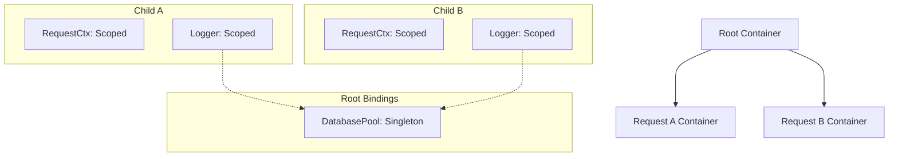

# Example 03: Scopes & Child Containers

This example demonstrates how to manage long-lived (Singleton) and short-lived (Scoped/Transient) dependencies, particularly useful for per-request isolation in web servers.

## Lifetimes Explained

| Scope         | Behavior                                            | Use Case                                         |
| :------------ | :-------------------------------------------------- | :----------------------------------------------- |
| **Singleton** | Created once per root container. Shared everywhere. | DB Pools, Global Config, Shared Caches.          |
| **Scoped**    | Created once per container (Root or Child).         | Request Loggers, User Context, Auth State.       |
| **Transient** | Created every time it is resolved.                  | Command handlers, temporary calculation objects. |

## Container Hierarchy

Child containers inherit bindings from their parents but can override them with specialized versions.

## How it works

1.  **Register as Scoped**: Bind tokens using `.scoped()`.
2.  **Create Child**: Use `container.createChild()`.
3.  **Local Bindings**: Bind the request-specific data (like `RequestContext`) directly in the child container.
4.  **Resolve**: When you resolve a service from the child, it automatically picks up the "local" scoped dependencies while still using "global" singletons from the parent.

## Benefits

This pattern avoids "Parameter Threading" — passing the `ctx` object through every layer of your application. Instead, components simply `@inject(RequestContext)` and let the container provide the correct one for the current execution branch.
