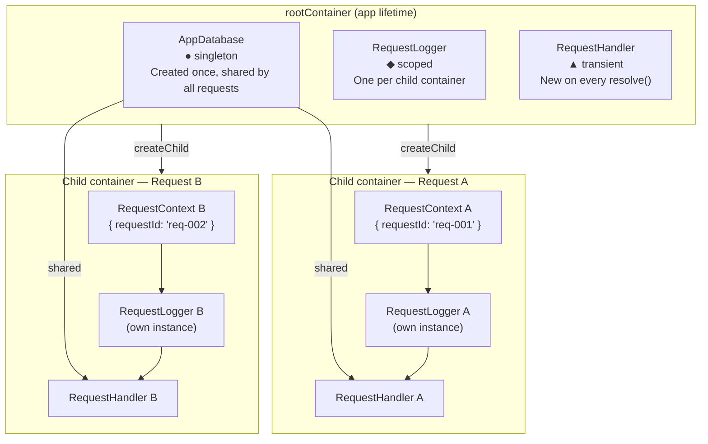

# Example 03 — Scopes & Child Containers

**Concepts:** `singleton`, `transient`, `scoped`, `createChild()`

---

## What this example shows

`@codefast/di` has three lifetimes. The first two (`singleton`, `transient`) were introduced in Example 01. This example adds the third — `scoped` — which requires a **child container** to work and is the standard pattern for per-HTTP-request or per-session isolation.

---

## Diagram



## The three scopes

| Scope       | When is the instance created?         | How long does it live?                |
| ----------- | ------------------------------------- | ------------------------------------- |
| `singleton` | First resolution                      | Forever (until container is disposed) |
| `transient` | Every `resolve()` call                | Discarded immediately after the call  |
| `scoped`    | First resolution in a child container | Until the child container is disposed |

---

## Child containers

```ts
const rootContainer = Container.create();
// ... register singletons on root

// Per-request: create a child
const requestContainer = rootContainer.createChild();
requestContainer.bind(RequestContextToken).toConstantValue({ requestId, userId });

const handler = requestContainer.resolve(HandlerToken);
```

A child container:

- Inherits all bindings from its parent (parent bindings are resolved in the parent).
- Maintains its own cache for `scoped` bindings.
- Can shadow a parent binding by re-binding the same token.

---

## Per-request isolation walkthrough

### Root container (app lifetime)

```ts
rootContainer.bind(AppDbToken).to(AppDatabase).singleton(); // one db for all requests
rootContainer.bind(RequestLoggerToken).to(RequestLogger).scoped(); // one per child
```

### Request handler

```ts
function handleRequest(requestId: string, userId: string, query: string): void {
  const requestContainer = rootContainer.createChild();

  // Override RequestContextToken with this request's data
  requestContainer.bind(RequestContextToken).toConstantValue({ requestId, userId });

  const handler = requestContainer.resolve(HandlerToken);
  handler.handle(query);
}
```

- `AppDatabase` (singleton) is resolved from the root — always the same instance.
- `RequestLogger` (scoped) is resolved from the child — one per request.
- Two calls to `requestContainer.resolve(HandlerToken)` return the same scoped instance.
- Two different child containers get their own independent scoped instances.

---

## Scoped vs. transient — the key difference

```ts
// Scoped: same instance within one child container
const loggerA = requestContainer.resolve(RequestLoggerToken);
const loggerB = requestContainer.resolve(RequestLoggerToken);
console.log(loggerA === loggerB); // true

// Transient: new instance every time, regardless of container
const handlerA = requestContainer.resolve(HandlerToken); // transient
const handlerB = requestContainer.resolve(HandlerToken);
console.log(handlerA === handlerB); // false
```

---

## Scope violation warning

A **singleton** must never depend on a **scoped** or **transient** binding directly — the singleton is created once and would capture an instance from the first child container forever, breaking isolation for all subsequent requests. Call `container.validate()` to detect this (shown in Example 09).

---

## What to read next

- **Example 04** — organise bindings into reusable modules.
- **Example 07** — full web-app example combining scoped containers with async modules and middleware.
- **Example 09** — `ScopeViolationError` and how `validate()` catches captive dependencies.
