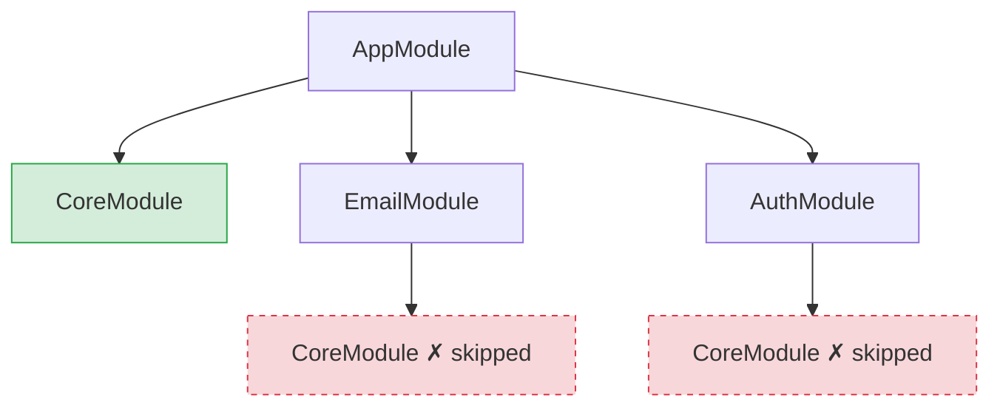
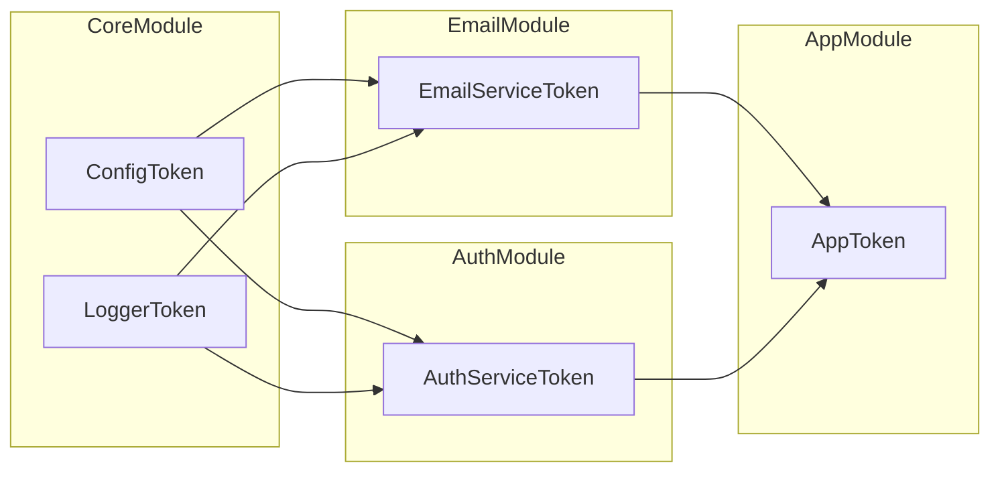

# Example 04 — Modules

**Concepts:** `Module.create()`, `builder.import()`, diamond deduplication, `Container.fromModules()`, `load()`, `unload()`

---

## What this example shows

As an app grows, scattering `container.bind()` calls everywhere becomes hard to maintain. **Modules** solve this by grouping related bindings into a reusable, composable unit. A module can import other modules, and the container deduplicates them automatically — even in a diamond-dependency graph.

---

## Diagram

### Module import tree (diamond deduplication)



`CoreModule` setup runs **once** even though three modules import it.

### What each module provides



## Defining a module

```ts
const CoreModule = Module.create("Core", (builder) => {
  builder.bind(ConfigToken).toConstantValue({ smtpHost: "smtp.example.com", jwtSecret: "s3cr3t" });
  builder.bind(LoggerToken).toConstantValue({ info: console.log, error: console.error });
});
```

`Module.create(name, setup)` runs `setup` with a `ModuleBuilder` that has the same `bind()` API as a container. The name is used for debugging.

---

## Composing modules

```ts
const EmailModule = Module.create("Email", (builder) => {
  builder.import(CoreModule); // declare dependency
  builder.bind(EmailServiceToken).to(EmailService).singleton();
});

const AuthModule = Module.create("Auth", (builder) => {
  builder.import(CoreModule); // also depends on Core
  builder.bind(AuthServiceToken).to(AuthService).singleton();
});

const AppModule = Module.create("App", (builder) => {
  builder.import(CoreModule, EmailModule, AuthModule); // CoreModule imported 3× total
  builder.bind(AppToken).to(App);
});
```

`builder.import()` declares that this module's bindings depend on another module's bindings being present. When `AppModule` is loaded, `CoreModule` is deduplicated — its setup function runs **once** no matter how many modules import it.

---

## Bootstrapping from modules

```ts
const container = Container.fromModules(AppModule);
```

`Container.fromModules` loads the module tree in dependency order and returns a ready container. All sync modules in the tree are applied immediately.

---

## Diamond deduplication

```
AppModule
├── CoreModule   ← 1st import
├── EmailModule
│   └── CoreModule  ← 2nd import (skipped)
└── AuthModule
    └── CoreModule  ← 3rd import (skipped)
```

`CoreModule` setup runs exactly once. The `Config` and `Logger` singletons are shared across `EmailService` and `AuthService` automatically.

```ts
const firstLogger = container.resolve(LoggerToken);
const secondLogger = container.resolve(LoggerToken);
console.log(firstLogger === secondLogger); // true
```

---

## Dynamic load / unload

Modules can be added and removed after the container is created:

```ts
const ExtraModule = Module.create("Extra", (builder) => {
  builder.bind(ExtraToken).toConstantValue("extra-value");
});

container.load(ExtraModule); // adds bindings
container.unload(ExtraModule); // removes them
```

This is useful for feature flags, hot-reload during development, or plugin systems (see Example 10).

---

## Async modules

When setup needs to `await` something (fetching remote config, opening a DB connection), use `Module.createAsync`:

```ts
const InfraModule = Module.createAsync("Infra", async (builder) => {
  const config = await fetchRemoteConfig();
  builder.bind(ConfigToken).toConstantValue(config);
});
```

See Example 05 for the full async module + lifecycle story.

---

## What to read next

- **Example 05** — async factories, lifecycle hooks, and `await using` disposal.
- **Example 10** — plugin architecture built on dynamic module load/unload.
