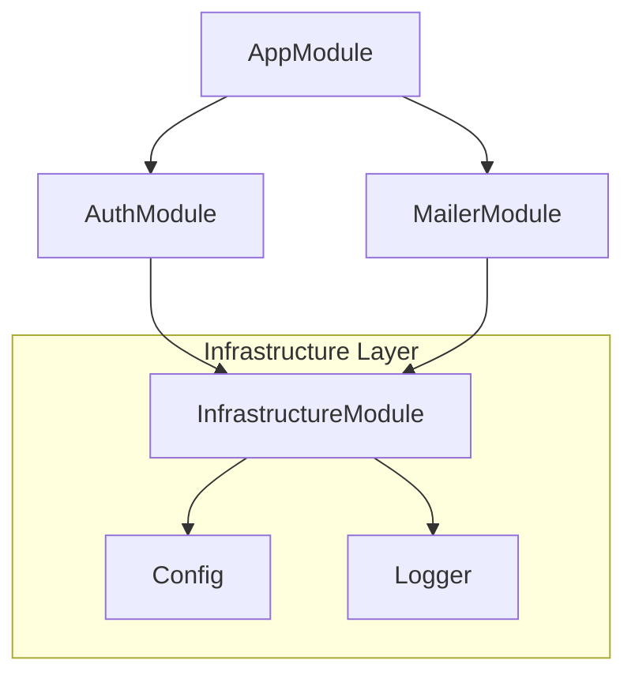

# Example 04: Modules & Composition

Modules are the primary way to organize large dependency graphs into cohesive, reusable units of logic.

## Why use Modules?

- **Encapsulation**: Group related bindings together (e.g., `DatabaseModule`, `AuthModule`).
- **Reuse**: Import common modules into multiple higher-level modules.
- **Deduplication**: The DI container ensures that if multiple modules import the same `SharedModule`, the setup logic for `SharedModule` runs only once (The "Diamond Import" problem).

## Module Graph

Individual modules define their dependencies via `builder.import()`.



## Setup Logic

Modules provide a `builder` API to register bindings:

```typescript
const MyModule = Module.create("MyModule", (builder) => {
  builder.import(OtherModule);
  builder.bind(MyToken).to(MyService);
});
```

## Runtime Inspection

You can use `container.inspect()` to see a list of all active bindings and their metadata, which is incredibly useful for debugging complex modular systems.
