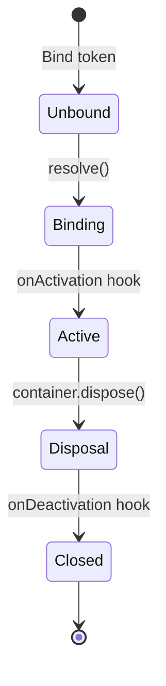

# Example 05: Async Lifecycle & Hooks

This example explores the asynchronous nature of modern infrastructure (databases, caches) and how to manage their lifecycle using activation and deactivation hooks.

## Async Factories

Use `toDynamicAsync` for dependencies that require an asynchronous startup (e.g., establishing a socket connection).

```typescript
builder.bind(DatabaseToken).toDynamicAsync(async (ctx) => {
  const db = new Database();
  await db.connect();
  return db;
});
```

## Lifecycle Timeline

Activation occurs the first time a binding is resolved. Deactivation occurs when the container is disposed.



## Lifecycle Hooks

### `onActivation(callback)`

Runs **after** the instance is created but **before** it is returned to the resolver. Useful for:

- Starting background tasks.
- Validating the instance state.
- Wrapping the instance in a Proxy.

### `onDeactivation(callback)`

Runs when the container is disposed. Crucial for **Graceful Shutdown**:

- Closing DB pool connections.
- Clearing intervals/timers.
- Flushing log buffers to disk.

## Resource Management: `await using`

The container supports the `Explicit Resource Management` proposal. By using `await using`, the container's `dispose()` method is automatically called when the current scope ends.

```typescript
await using container = await Container.fromModulesAsync(AppModule);
// ... work ...
// container.dispose() is called here automatically
```
