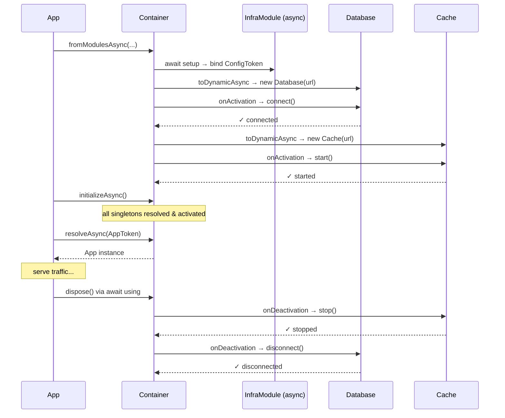

# Example 05 — Async Factories, Lifecycle Hooks & Disposal

**Concepts:** `toDynamicAsync`, `toResolvedAsync`, `onActivation`, `onDeactivation`, `Module.createAsync`, `Container.fromModulesAsync`, `initializeAsync`, `resolveAsync`, `await using`

---

## What this example shows

Real infrastructure — databases, caches, message brokers — needs async setup and teardown. This example shows how `@codefast/di` handles the full async lifecycle: creation, activation, and graceful shutdown.

---

## Diagram

### Full async lifecycle sequence



> Deactivation fires in **reverse** activation order (LIFO).

## Async factories

### `toDynamicAsync` — async factory with resolution context

```ts
builder
  .bind(DatabaseToken)
  .toDynamicAsync(async (ctx) => {
    const config = ctx.resolve(ConfigToken); // sync deps resolved normally
    return new Database(config.dbUrl); // async construction
  })
  .singleton();
```

Works exactly like `toDynamic` but the factory can `await`. Use `resolveAsync()` (not `resolve()`) when consuming such a binding.

---

## Lifecycle hooks

### `onActivation` — runs after the instance is created

```ts
  .onActivation(async (_ctx, database) => {
    await database.connect(); // open connection pool, run migrations, etc.
    return database;          // must return the (possibly transformed) instance
  })
```

- Called immediately after the factory produces the instance.
- Can be async.
- **Must return the instance** (or a replacement). Forgetting the return makes the binding resolve to `undefined`.

### `onDeactivation` — runs when the container is disposed

```ts
  .onDeactivation(async (database) => {
    await database.disconnect(); // drain queues, close sockets, etc.
  })
```

- Called during `container.dispose()`.
- Hooks fire in **reverse activation order** (LIFO), so resources are torn down in the correct dependency order.

---

## Async modules

When module setup itself is async (e.g. fetching remote config):

```ts
const InfrastructureModule = Module.createAsync("Infra", async (builder) => {
  const config = await fetchConfig(); // await during module bootstrap
  builder.bind(ConfigToken).toConstantValue(config);
});
```

Bootstrap with `Container.fromModulesAsync` instead of `Container.fromModules`:

```ts
const container = await Container.fromModulesAsync(
  InfrastructureModule,
  DatabaseModule,
  CacheModule,
  AppModule,
);
```

---

## `initializeAsync` — eager singleton resolution

```ts
await container.initializeAsync();
```

Without this call, async singletons are resolved lazily (on first `resolveAsync`). `initializeAsync()` eagerly resolves all singletons — all `onActivation` hooks run before the app starts serving traffic. This is the recommended pattern for production services.

---

## `await using` — automatic disposal

```ts
async function main(): Promise<void> {
  await using container = await Container.fromModulesAsync(...);

  await container.initializeAsync();
  // ... use the container ...

} // container.dispose() called automatically here, firing all onDeactivation hooks
```

`await using` is an ES2022 explicit resource management feature. The container implements `Symbol.asyncDispose` so cleanup is guaranteed even if an exception is thrown.

---

## Parallel in-flight deduplication

For async singletons, two concurrent `resolveAsync` calls share a single in-flight `Promise` — the factory runs exactly once:

```ts
const [db1, db2] = await Promise.all([
  container.resolveAsync(DatabaseToken),
  container.resolveAsync(DatabaseToken),
]);
console.log(db1 === db2); // true — one instance, one connection
```

---

## What to read next

- **Example 07** — full web-app combining async modules with per-request scoped containers.
- **Example 12** — production microservice with DB pools, health checks, and graceful shutdown.
