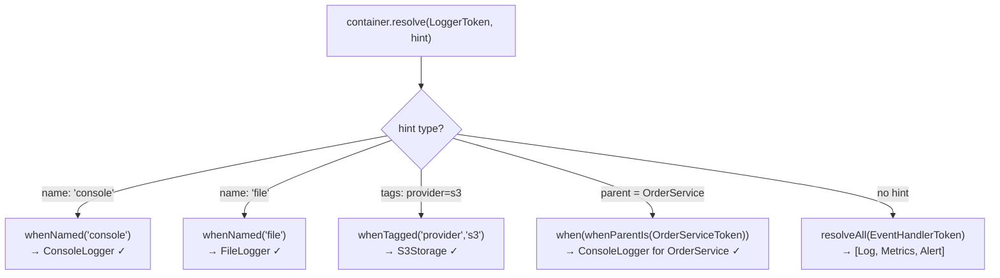

# Example 06 — Constraints & Multi-binding

**Concepts:** `whenNamed()`, `whenTagged()`, `when()` + `whenParentIs`, `resolveAll()`, `resolveAll` for event fans-out

---

## What this example shows

A token can have **multiple bindings** in the same container — each binding is selected by a constraint. This enables:

- Named variants (e.g. `"console"` logger vs. `"file"` logger)
- Tagged variants (e.g. `provider: "s3"` vs. `provider: "local"`)
- Parent-aware injection (different impl depending on which service depends on it)
- Fan-out: resolve all implementations of a token at once

---

## Diagram

### How a constraint selects the matching binding



### Multi-binding fan-out with `resolveAll`

```mermaid
graph LR
    subgraph EventHandlerToken
        H1["LogEventHandler\nwhenNamed('log')"]
        H2["MetricsEventHandler\nwhenNamed('metrics')"]
        H3["AlertEventHandler\nwhenNamed('alert')"]
    end
    RA["resolveAll(EventHandlerToken)"] --> H1 & H2 & H3
    H1 & H2 & H3 -->|handle('order.created')| Out["All handlers invoked"]
```

## Named bindings

Register multiple values under the same token using `.whenNamed(name)`:

```ts
container.bind(LoggerToken).toConstantValue(consoleLogger).whenNamed("console");
container.bind(LoggerToken).toConstantValue(fileLogger).whenNamed("file");
container.bind(LoggerToken).toConstantValue(silentLogger).whenNamed("silent");
```

Resolve a specific one by passing a `name` hint:

```ts
const logger = container.resolve(LoggerToken, { name: "file" });
```

Inject a specific named binding into a class:

```ts
@injectable([inject(LoggerToken, { name: "console" })])
class MyService { ... }
```

---

## Tagged bindings

Tags are arbitrary key-value pairs attached to a binding with `.whenTagged(key, value)`:

```ts
container.bind(StorageToken).to(S3Storage).whenTagged("provider", "s3").singleton();
container.bind(StorageToken).to(LocalStorage).whenTagged("provider", "local").singleton();
```

Resolve by tags:

```ts
const s3 = container.resolve(StorageToken, { tags: [["provider", "s3"]] });
```

A binding can carry multiple tags (all must match for the binding to be selected).

---

## Parent-aware constraints (`whenParentIs`)

Import from `@codefast/di/constraints`:

```ts
import { whenParentIs } from "@codefast/di/constraints";
```

Register two bindings for `LoggerToken`; each fires only when the correct consumer is being resolved:

```ts
container.bind(LoggerToken).toConstantValue(consoleLogger).when(whenParentIs(OrderServiceToken)); // only for OrderService

container.bind(PaymentLoggerToken).toConstantValue(fileLogger); // dedicated token for PaymentService
```

`whenParentIs(token)` matches when the class currently being constructed has `token` as its binding token. This keeps the injection invisible to the consumers — they both inject `LoggerToken` but receive different instances.

See Example 17 for the full constraint family (`whenAnyAncestorIs`, `whenParentNamed`, `whenParentTagged`, …).

---

## Multi-binding with `resolveAll`

When you need _all_ implementations of a token (event handlers, middleware, plugins):

```ts
container.bind(EventHandlerToken).to(LogEventHandler).whenNamed("log");
container.bind(EventHandlerToken).to(MetricsEventHandler).whenNamed("metrics");
container.bind(EventHandlerToken).to(AlertEventHandler).whenNamed("alert");
```

```ts
const handlers = container.resolveAll(EventHandlerToken);
// → [LogEventHandler, MetricsEventHandler, AlertEventHandler]

for (const handler of handlers) {
  handler.handle("order.created");
}
```

`resolveAll` returns every binding for the token, regardless of name/tag.

---

## Choosing between named, tagged, and `when()`

| Need                                                | Use                       |
| --------------------------------------------------- | ------------------------- |
| A small, fixed set of alternatives with string keys | `whenNamed`               |
| Richer metadata or multi-dimensional selection      | `whenTagged`              |
| Logic that depends on the consumer class            | `when(whenParentIs(...))` |
| Custom predicate                                    | `when(ctx => ...)`        |

---

## What to read next

- **Example 08** — `toAlias` for redirecting one token to another, `BindingIdentifier` for removing a specific named binding.
- **Example 17** — full constraint family for deep ancestor-chain matching.
