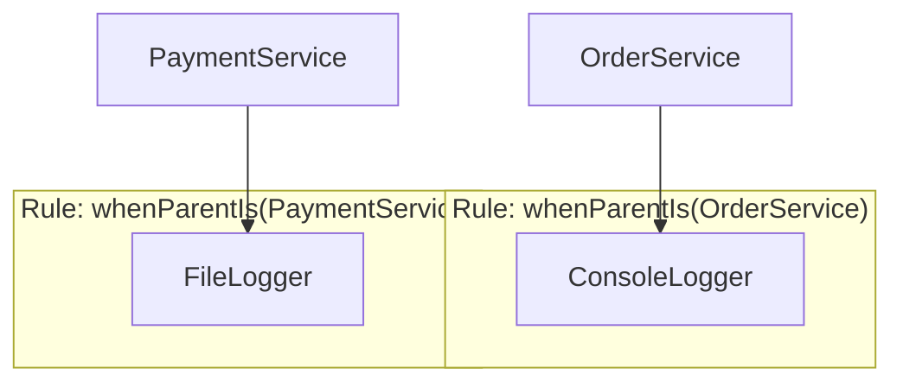

# Example 06: Constraints & Multi-binding

This example demonstrates advanced wiring techniques: selecting between multiple implementations of the same interface and collecting groups of related services.

## 1. Multi-binding (`resolveAll`)

You can bind multiple implementations to the same token. This is perfect for "Plugin" patterns where you want to execute a list of handlers.

```typescript
container.bind(HandlerToken).to(LogHandler);
container.bind(HandlerToken).to(MetricsHandler);

const allHandlers = container.resolveAll(HandlerToken); // [Log, Metrics]
```

## 2. Selection Hints (Names & Tags)

When multiple bindings exist, you can disambiguate using names or tags.

```typescript
// Registration
container.bind(LoggerToken).toConstantValue(consoleLog).named("console");
container.bind(LoggerToken).toConstantValue(fileLog).named("file");

// Resolution
const logger = container.resolve(LoggerToken, { name: "console" });
```

## 3. Contextual Constraints (`whenParentIs`)

This allows you to select a dependency based on **who** is requesting it.



### Example Implementation:

```typescript
container.bind(LoggerToken).toConstantValue(consoleLog).whenParentIs(OrderService);

container.bind(LoggerToken).toConstantValue(fileLog).whenParentIs(PaymentService);
```

## Use Cases

- **Logging Strategy**: Injecting different loggers to different services automatically.
- **Service Registries**: Collecting all `EventHandler` instances to boot a message bus.
- **Feature Toggles**: Using tags to swap implementations based on environment flags.
