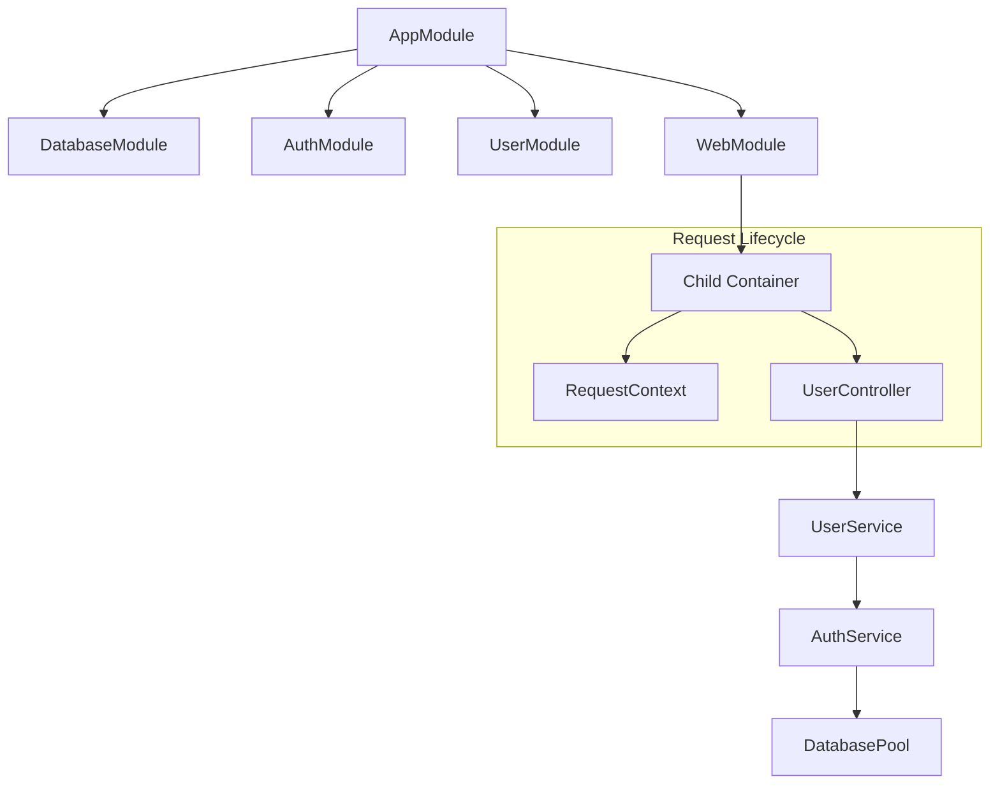
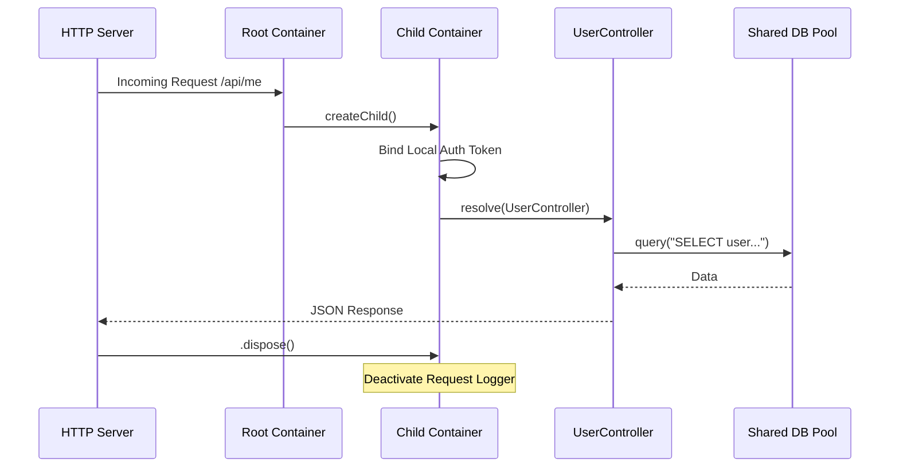

# Example 07: Real-World Web Application

This example demonstrates how to structure a complete web application with multiple layers, request-scoping, and graph validation.

## Application Architecture

The app is divided into functional modules that come together in the root `AppModule`.

## Core Features

### 1. Request Scoping

Every incoming HTTP request triggers the creation of a `child container`.

- `DatabasePool` is a **Singleton** (shared across all requests).
- `RequestContext` and `UserActivityLogger` are **Scoped** (unique per request).

### 2. Dependency Graph Validation

Before starting the server, the code calls `container.validate()`. This performs a static analysis of the graph to detect issues like:

- **Circular Dependencies**: (e.g., A depends on B and B depends on A).
- **Scope Violations**: (e.g., a Singleton depending on a Scoped service). This is also known as a **Captive Dependency**.

### 3. Graceful Shutdown

The container ensures the DB pool is closed only after all active requests have finished and their scoped loggers have been deactivated.

## The Web Flow (Sequence Diagram)

## Summary of Techniques

- **Module Composition**: Using `builder.import()` to build a tree of capabilities.
- **Factory Functions**: Using `toDynamic()` to wire complex objects like `MockHttpServer`.
- **Validation**: Failing fast if the dependency graph is architecturally unsound.
