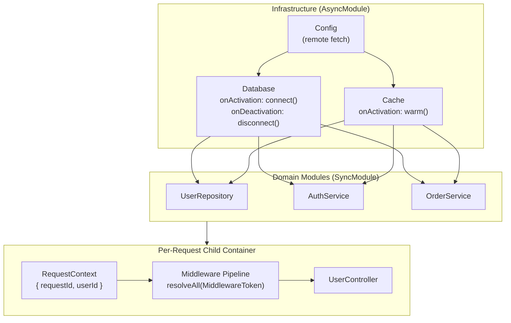
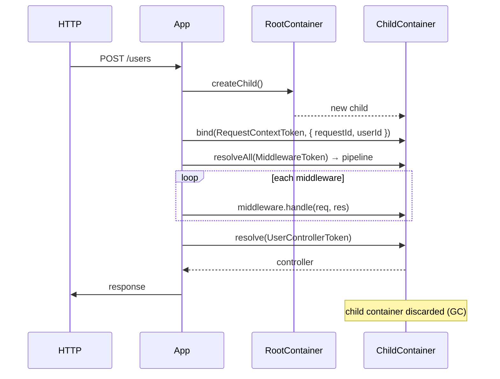

# Example 07 — Real-world Web App

**Concepts:** All features combined — `AsyncModule`, scoped child containers per request, lifecycle hooks, named environment overrides, `resolveAll` middleware pipeline, `validate()`, `await using`, dependency graph export

---

## What this example shows

This is the integration example. It wires together every concept from Examples 01–06 into a realistic web application:

- **Infrastructure layer** — async module fetches config, opens DB connection, warms cache
- **Domain layer** — repositories, services, auth
- **Request handling** — scoped child container per HTTP request, middleware pipeline resolved with `resolveAll`
- **Validation** — `container.validate()` before serving traffic
- **Graceful shutdown** — `await using` triggers `onDeactivation` hooks in reverse order

---

## Diagram

### Application architecture layers



### Per-request container lifecycle



## Architecture overview

```
Container.fromModulesAsync(
  InfraModule,      ← AsyncModule: config, DB (async connect), cache
  RepositoryModule, ← SyncModule: user repo, product repo
  ServiceModule,    ← SyncModule: auth, order, notification services
  MiddlewareModule, ← SyncModule: auth, logging, rate-limit (multi-binding)
  ControllerModule  ← SyncModule: user controller, product controller
)
```

### Infrastructure: async setup and teardown

```ts
const InfraModule = Module.createAsync("Infra", async (builder) => {
  const config = await loadConfig(); // remote config fetch
  builder.bind(ConfigToken).toConstantValue(config);
});

builder
  .bind(DatabaseToken)
  .toDynamicAsync(async (ctx) => new Database(ctx.resolve(ConfigToken)))
  .singleton()
  .onActivation(async (_ctx, db) => {
    await db.connect();
    return db;
  })
  .onDeactivation(async (db) => {
    await db.disconnect();
  });
```

### Middleware pipeline: multi-binding + `resolveAll`

```ts
// Three separate named bindings under MiddlewareToken
builder.bind(MiddlewareToken).to(AuthMiddleware).whenNamed("auth");
builder.bind(MiddlewareToken).to(LoggingMiddleware).whenNamed("logging");
builder.bind(MiddlewareToken).to(RateLimitMiddleware).whenNamed("rateLimit");

// Dispatch a request through the full pipeline
const middlewares = container.resolveAll(MiddlewareToken);
for (const mw of middlewares) {
  await mw.handle(request, response);
}
```

### Per-request scoped container

```ts
async function handleHttpRequest(raw: HttpRequest): Promise<HttpResponse> {
  const requestContainer = appContainer.createChild();
  requestContainer.bind(RequestContextToken).toConstantValue(raw);

  // Scoped bindings get their own instance per child container
  const controller = await requestContainer.resolveAsync(UserControllerToken);
  return controller.handle(raw);
}
```

The root container holds all singletons (DB, cache, services). The child container holds only the request-specific binding (`RequestContext`). Scoped services resolve from the child, singletons resolve from the parent transparently.

### Validation before serving traffic

```ts
await container.initializeAsync(); // eagerly resolve all singletons + run onActivation hooks
container.validate(); // throw ScopeViolationError if any captive dependency detected

// Now safe to start accepting requests
```

### Graceful shutdown

```ts
await using container = await Container.fromModulesAsync(...);

// ... serve traffic ...

// On scope exit: container.dispose() fires all onDeactivation hooks in reverse order:
// controller → service → repository → cache → database
```

### Dependency graph for debugging

```ts
import { toDotGraph } from "@codefast/di/graph-adapters/dot";

const graph = container.generateDependencyGraph();
const dot = toDotGraph(graph);
// Paste into https://graphviz.online to visualize the full wiring
```

---

## Named bindings for environment overrides

```ts
// Bind a real SMTP mailer for production, a stub for development
builder.bind(MailerToken).to(SmtpMailer).whenNamed("production").singleton();
builder.bind(MailerToken).to(StubMailer).whenNamed("development").singleton();

const mailer = container.resolve(MailerToken, { name: config.env });
```

---

## What this example is NOT

This is not a framework — it's a demonstration of wiring patterns. In production you would separate each module into its own file, and typically each architectural layer into its own package.

---

## What to read next

- **Example 12** — a production microservice with health checks, job workers, and structured startup/shutdown.
- **Example 16** — how to test code structured this way (fresh containers, `rebind()`, child overrides).
