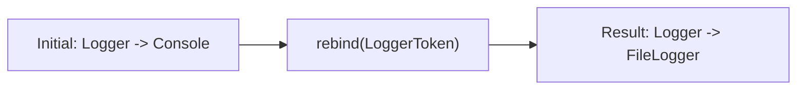
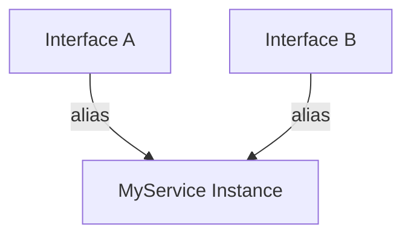

# Example 08: Advanced Binding Techniques

This example explores surgical control over the container: linking tokens, resolving vs creating, and hot-swapping bindings at runtime.

## 1. Aliasing (`toAlias`)

A token can point to another token. This is useful for providing multiple "names" for the same service or satisfying multiple interface requirements with one instance.

```typescript
container.bind(LoggerToken).to(ConsoleLogger).singleton();
container.bind(AbstractLoggerToken).toAlias(LoggerToken);
```

## 2. Shared Resolution (`toResolved`)

Similar to `toAlias`, but usually used when you want to ensure that resolving a specific token always returns an instance that has already been registered (or will be registered) elsewhere in the graph. It maintains a strict link between two tokens.

## 3. Rebinding (`rebind`)

In development or testing, you might need to swap an implementation after the container has already been initialized. `rebind()` atomically replaces the binding.



## 4. Multi-Interface Services

Use cases where a service implements multiple interfaces:

1.  Bind the service class once (e.g. `to(MyService)`).
2.  Bind both interfaces using `toAlias(MyService)`.
3.  Both interfaces will now resolve to the **same singleton instance** of `MyService`.



## 5. Direct Class Injection

In `@injectable`, you can use class constructors directly as dependencies if they are bound using `.toSelf()` or if they are the target of a `.to(Class)` binding. The injector automatically derives the correct token.
