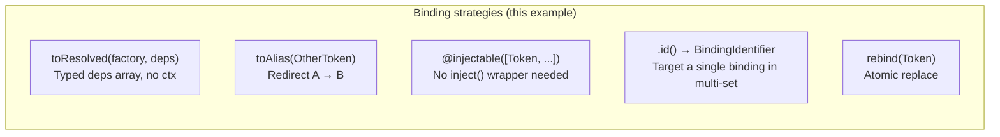
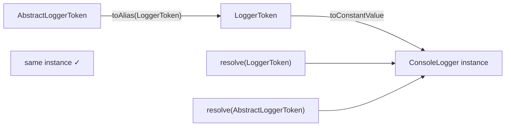
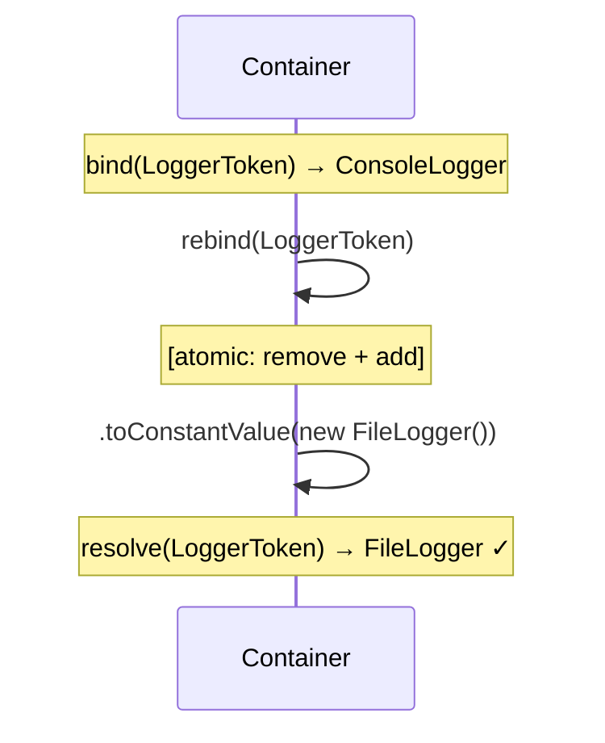

# Example 08 — Advanced Bindings

**Concepts:** `toResolved`, `toAlias`, plain tokens in `@injectable`, `BindingIdentifier` + `.id()`, `rebind()`

---

## What this example shows

Five binding patterns that cover the gaps left by `toConstantValue`, `toDynamic`, and `.to()`:

1. `toResolved` — typed deps array, no `ctx` object
2. `toAlias` — redirect one token to another
3. Plain tokens in `@injectable` — skip `inject()` when you don't need name/tag options
4. `BindingIdentifier` + `.id()` — remove a specific binding from a multi-binding set
5. `rebind()` — atomically replace a binding

---

## Diagram

### Binding strategies at a glance



### `toAlias` — same instance, two tokens



### `rebind()` vs. `unbind + bind`



## 1. `toResolved` — typed factory without a context object

```ts
container.bind(MailerToken).toResolved(
  (logger, config) => new SmtpMailer(logger, config),
  [LoggerToken, ConfigToken] as const, // ← as const for tuple inference
);
```

The second argument is a `const` tuple of tokens. TypeScript infers the factory parameter types from it — no manual casting needed. Equivalent to `toDynamic((ctx) => new SmtpMailer(ctx.resolve(LoggerToken), ctx.resolve(ConfigToken)))` but cleaner when deps are simple.

The `as const` assertion is required so TypeScript sees a fixed-length tuple instead of a generic array, enabling per-parameter type inference.

---

## 2. `toAlias` — redirect token A to token B

```ts
container.bind(AbstractLoggerToken).toAlias(LoggerToken);
```

Resolving `AbstractLoggerToken` returns whatever `LoggerToken` resolves to — same instance, same scope. Useful for interface tokens that should map to a concrete singleton token without duplicating the binding.

```ts
const a = container.resolve(LoggerToken);
const b = container.resolve(AbstractLoggerToken);
console.log(a === b); // true
```

---

## 3. Plain tokens in `@injectable`

When you don't need named or tagged injection, pass tokens or constructors directly in the deps array — no `inject()` wrapper required:

```ts
@injectable([LoggerToken, ConfigToken])       // plain tokens
class PlainNotifier implements Notifier { ... }
```

Mix styles freely:

```ts
@injectable([LoggerToken, inject(ConfigToken), optional(NotifierToken)])
class MixedService { ... }
```

Use `inject()` only when you need its options (`{ name, tags }`). Plain tokens are the shorter form for the common case.

---

## 4. `BindingIdentifier` + `.id()` — targeted unbind in multi-binding

When multiple bindings share a token, `.unbind(token)` removes _all_ of them. To remove only one, capture its `BindingIdentifier` with `.id()`:

```ts
const logPluginId = container
  .bind(PluginToken)
  .toConstantValue({ name: "log", run: () => {} })
  .whenNamed("log")
  .id(); // ← returns BindingIdentifier

const metricsPluginId = container
  .bind(PluginToken)
  .toConstantValue({ name: "metrics", run: () => {} })
  .whenNamed("metrics")
  .id();
```

Remove only the metrics plugin:

```ts
container.unbind(metricsPluginId); // log and audit plugins unaffected

const remaining = container.resolveAll(PluginToken);
console.log(remaining.length); // 2
```

`.id()` must be called at the end of the binding chain — after `.whenNamed()`, `.whenTagged()`, etc.

---

## 5. `rebind()` — atomically replace a binding

```ts
container.bind(LoggerToken).toConstantValue(new ConsoleLogger());

// Swap to a different implementation atomically:
container.rebind(LoggerToken).toConstantValue(new FileLogger());
```

`rebind()` removes **all** existing bindings for the token, then returns a fresh `BindingBuilder`. Subsequent `resolve()` calls see only the new binding. This is the correct pattern for hot-reload and for overriding bindings in tests.

Difference from unbind + bind:

```ts
// Equivalent but rebind() is atomic — no window where the token is unbound
container.unbind(LoggerToken);
container.bind(LoggerToken).toConstantValue(new FileLogger());
```

---

## What to read next

- **Example 09** — all error types and how to recover from each.
- **Example 16** — using `rebind()` in tests to swap real services for stubs.
