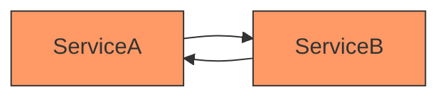
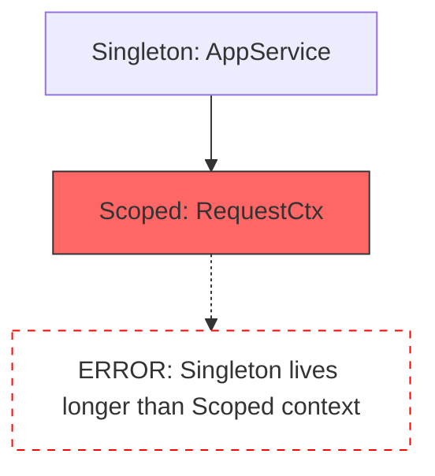

# Example 09: Error Handling & Debugging

`@codefast/di` is designed to be developer-friendly. Every error thrown by the library is a specific class with a unique `.code` and a message designed to help you fix the issue without checking the documentation.

## Error Reference Table

| Error Class               | Code                  | Cause                                                                                          |
| :------------------------ | :-------------------- | :--------------------------------------------------------------------------------------------- |
| `TokenNotBoundError`      | `TOKEN_NOT_BOUND`     | You tried to `resolve()` a token that hasn't been registered.                                  |
| `NoMatchingBindingError`  | `NO_MATCHING_BINDING` | A name or tag hint was provided, but no binding matched those criteria.                        |
| `AsyncResolutionError`    | `ASYNC_RESOLUTION`    | You called `resolve()` (sync) on a token that uses an async factory or async activation.       |
| `CircularDependencyError` | `CIRCULAR_DEPENDENCY` | A dependency cycle was detected (e.g., A → B → A).                                             |
| `MissingMetadataError`    | `MISSING_METADATA`    | You tried to bind a class via `.to()` or `.toSelf()` but it lacks the `@injectable` decorator. |
| `ScopeViolationError`     | `SCOPE_VIOLATION`     | A Singleton service depends on a Scoped service (Captive Dependency).                          |
| `AsyncModuleLoadError`    | `ASYNC_MODULE_LOAD`   | You called `load()` (sync) on a module that is defined as an `AsyncModule`.                    |

## Visualizing Common Errors

### Circular Dependency

The error message will trace the exact path of the cycle: `ServiceA → ServiceB → ServiceA`.

### Scope Violation (Captive Dependency)

The error message explains why a Singleton cannot use a Scoped service: the Scoped service would be "captured" for the lifetime of the Singleton, breaking the scope isolation.

## How to Debug

1.  **Read the Trace**: Circular and Scope errors provide a resolution path (e.g., `App -> ServiceA -> ServiceB`).
2.  **Use `resolveOptional`**: If a dependency is truly optional, use this to avoid `TOKEN_NOT_BOUND` errors.
3.  **Check metadata**: Ensure all injected classes have `@injectable` with the correct arguments.
