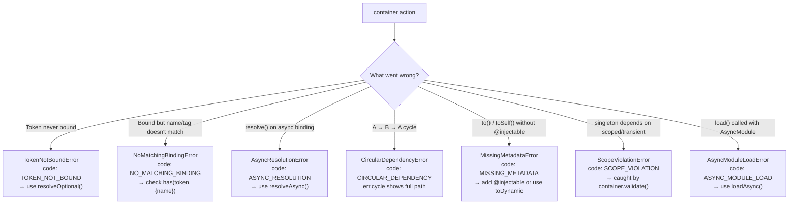

# Example 09 — Error Handling

**Concepts:** `TokenNotBoundError`, `NoMatchingBindingError`, `AsyncResolutionError`, `CircularDependencyError`, `MissingMetadataError`, `ScopeViolationError`, `AsyncModuleLoadError`

---

## What this example shows

Every error thrown by `@codefast/di` has a stable `.code` string property and a message with enough context to diagnose the problem without reading source code. This example demonstrates how each error is triggered and how to recover from it.

---

## Diagram

### Error hierarchy and triggers



## Error reference

### 1. `TokenNotBoundError` — resolve on an unregistered token

**Code:** `TOKEN_NOT_BOUND`

```ts
try {
  container.resolve(LoggerToken); // nothing bound yet
} catch (err) {
  if (err instanceof TokenNotBoundError) {
    console.log(err.code); // "TOKEN_NOT_BOUND"
    console.log(err.message); // includes token name
  }
}
```

**Recovery:** use `resolveOptional` when a missing binding is acceptable:

```ts
const logger = container.resolveOptional(LoggerToken); // undefined, no throw
```

---

### 2. `NoMatchingBindingError` — name/tag hint matches nothing

**Code:** `NO_MATCHING_BINDING`

Thrown when a binding exists for the token but none of them match the supplied name or tags:

```ts
container.bind(LoggerToken).toConstantValue(consoleLogger).whenNamed("console");
container.resolve(LoggerToken, { name: "file" }); // ← throws: "file" not bound
```

**Recovery:** check `container.has(token, { name })` before resolving, or ensure the named binding is registered.

---

### 3. `AsyncResolutionError` — sync `resolve()` on an async binding

**Code:** `ASYNC_RESOLUTION`

```ts
container
  .bind(DbToken)
  .toDynamicAsync(async () => new Database())
  .singleton();

container.resolve(DbToken); // ← throws
await container.resolveAsync(DbToken); // ← correct
```

The container cannot await a factory during a synchronous `resolve()` call. Always use `resolveAsync` / `resolveOptionalAsync` for bindings declared with `toDynamicAsync` or `toResolvedAsync`.

---

### 4. `CircularDependencyError` — A → B → A cycle

**Code:** `CIRCULAR_DEPENDENCY`

```ts
// ServiceA depends on ServiceB, ServiceB depends on ServiceA
circularContainer.bind(ServiceAToken).toDynamic((ctx) => new A(ctx.resolve(ServiceBToken)));
circularContainer.bind(ServiceBToken).toDynamic((ctx) => new B(ctx.resolve(ServiceAToken)));

try {
  circularContainer.resolve(ServiceAToken);
} catch (err) {
  if (err instanceof CircularDependencyError) {
    console.log(err.cycle?.join(" → ")); // "ServiceA → ServiceB → ServiceA"
  }
}
```

`err.cycle` contains the full dependency path so you can pinpoint exactly where the cycle forms.

**Recovery:** break the cycle by introducing a lazy accessor, an event system, or restructuring responsibilities.

---

### 5. `MissingMetadataError` — `.to()` without `@injectable`

**Code:** `MISSING_METADATA`

```ts
class UnmarkedService {
  constructor(private logger: Logger) {}
  // no @injectable
}

container.bind(UnmarkedToken).to(UnmarkedService);
container.resolve(UnmarkedToken); // ← throws
```

The container uses metadata recorded by `@injectable` to know which tokens to inject. Without it, it cannot resolve constructor arguments.

**Recovery options:**

- Add `@injectable([inject(LoggerToken)])` to the class, or
- Switch to `toDynamic` / `toResolved` and wire dependencies manually.

---

### 6. `ScopeViolationError` — captive dependency detected by `validate()`

**Code:** `SCOPE_VIOLATION`

A **captive dependency** occurs when a `singleton` depends on a `scoped` or `transient` binding. The singleton is created once and permanently captures the shorter-lived instance, breaking isolation.

```ts
container.bind(ScopedServiceToken).to(ScopedService).scoped();
container.bind(SingletonConsumerToken).to(SingletonConsumer).singleton();
// SingletonConsumer injects ScopedService ← violation

container.validate(); // ← throws ScopeViolationError before any request is served
```

Call `validate()` at startup (after `initializeAsync`) to catch this class of bug before production traffic hits it.

---

### 7. `AsyncModuleLoadError` — `load()` called with an `AsyncModule`

**Code:** `ASYNC_MODULE_LOAD`

```ts
const AsyncDbModule = Module.createAsync("Db", async (builder) => { ... });

container.load(AsyncDbModule);      // ← throws: load() is sync-only
await container.loadAsync(AsyncDbModule); // ← correct
```

`load()` is synchronous and cannot await the async module setup function. Use `loadAsync()` for `AsyncModule` instances.

---

## Importing error classes

All error classes are exported from the main package entry:

```ts
import {
  AsyncModuleLoadError,
  AsyncResolutionError,
  CircularDependencyError,
  MissingMetadataError,
  NoMatchingBindingError,
  ScopeViolationError,
  TokenNotBoundError,
} from "@codefast/di";
```

---

## What to read next

- **Example 03** — `scoped` scope explained; prerequisite for understanding `ScopeViolationError`.
- **Example 16** — testing patterns: `validate()` as a wiring smoke-test at the start of integration tests.
