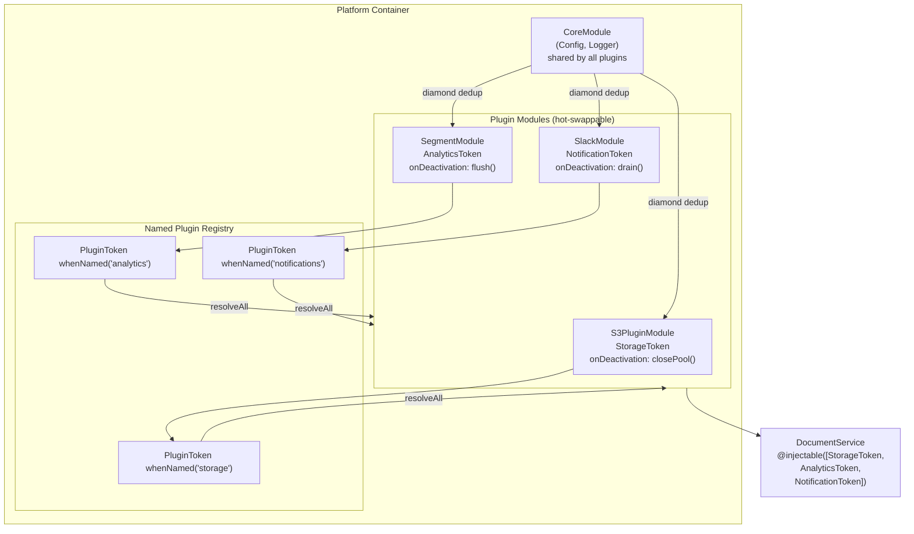
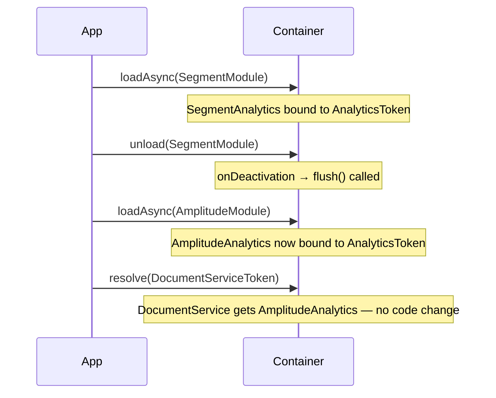

# Example 10 — Plugin Architecture

**Concepts:** `Module.createAsync`, `container.load()` / `container.unload()`, named multi-binding slots, `onDeactivation` for resource cleanup, diamond deduplication across plugins

---

## What this example shows

How to build an application platform where every capability (storage, analytics, notifications) is a self-contained, hot-swappable plugin. Plugins can be loaded and unloaded at runtime; the `DocumentService` that uses them never imports a plugin class directly.

---

## Diagram

### Plugin system architecture



### Hot-swap sequence



## The core insight: modules as plugins

Each capability is an `AsyncModule` that:

1. Imports `CoreModule` (logger, config) — deduped automatically
2. Binds its capability token (`StorageToken`, `AnalyticsToken`, …)
3. Owns its own async `onActivation` (open connections) and `onDeactivation` (close them)

```ts
const S3PluginModule = Module.createAsync("S3Plugin", async (builder) => {
  builder.import(CoreModule); // shared config & logger

  builder
    .bind(StorageToken)
    .toDynamicAsync(async (ctx) => {
      const config = ctx.resolve(AppConfigToken);
      return new S3StorageProvider(config.s3Bucket, config.region, logger);
    })
    .singleton()
    .onDeactivation((provider) => provider.closeConnectionPool());
});
```

---

## Multi-binding for plugin descriptors

A `PluginToken` multi-binding registry keeps one named slot per capability. This allows `resolveAll(PluginToken)` to enumerate every loaded plugin:

```ts
// After loading modules, register a named descriptor for each capability
container
  .bind(PluginToken)
  .toConstantValue({ name: "s3", version: "1.0", capabilities: ["upload"] })
  .whenNamed("storage");
container
  .bind(PluginToken)
  .toConstantValue({ name: "segment", version: "2.1", capabilities: ["track"] })
  .whenNamed("analytics");

const plugins = container.resolveAll(PluginToken);
plugins.forEach((p) => console.log(p.name)); // "s3", "segment", ...
```

---

## Hot-swap at runtime

`load` and `unload` work after the container is created:

```ts
// Swap the analytics plugin at runtime
container.unload(SegmentAnalyticsModule);
await container.loadAsync(AmplitudeAnalyticsModule);

// DocumentService now uses the Amplitude provider — zero code change
const doc = container.resolve(DocumentServiceToken);
await doc.process("quarterly-report");
```

`onDeactivation` fires when the old module is unloaded — connection pools are drained, flush queues emptied.

---

## Consumer stays abstraction-clean

```ts
@injectable([inject(StorageToken), inject(AnalyticsToken), inject(NotificationToken)])
class DocumentService {
  // depends only on interfaces — knows nothing about S3, Segment, or Slack
}
```

Swapping a plugin changes behaviour without touching `DocumentService`.

---

## Diamond deduplication

```
AppContainer
├── S3PluginModule → CoreModule (logger, config)
├── AnalyticsModule → CoreModule (already loaded, skipped)
└── NotificationsModule → CoreModule (already loaded, skipped)
```

`CoreModule` setup runs once no matter how many plugins import it.

---

## What to read next

- **Example 04** — module fundamentals and diamond deduplication.
- **Example 05** — async lifecycle hooks (`onActivation` / `onDeactivation`).
- **Example 11** — same pattern applied to multi-tenant isolation.
