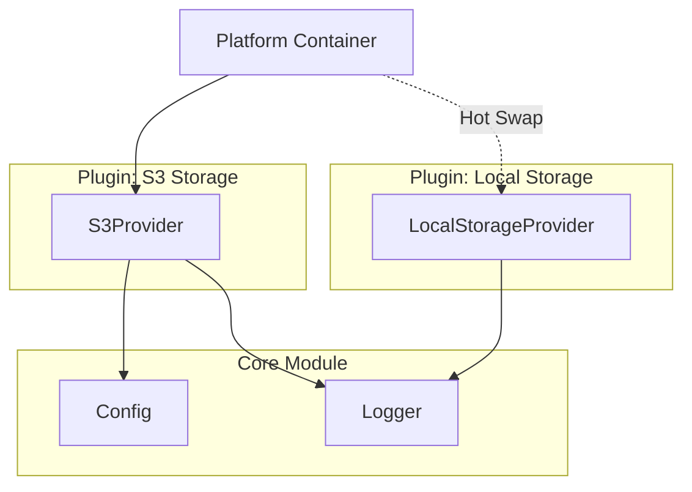
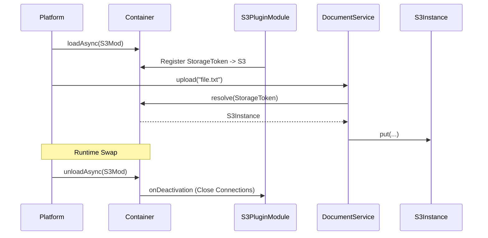

# Example 10: Plugin Architecture

This example demonstrates how to build an extensible application platform where capabilities like storage, analytics, and notifications are hot-swappable plugins.

## Core Philosophical Concepts

### 1. Capability Tokens vs. Registry Tokens

- **Capability Token** (e.g., `StorageToken`): A unique requirement. Only one implementation should win (Last-wins semantics per module).
- **Registry Token** (e.g., `PluginToken`): A collection. Multiple implementations should coexist (Append semantics via `multi` binding).

## Architecture Diagram

## Plugin Registration Flow

The platform uses `Module` to package each plugin. This allows plugins to have their own private dependencies and lifecycle hooks.

## Implementation Highlights

- **Dynamic Loading**: Using `container.loadAsync()` and `container.unloadAsync()` to change system behavior without stopping the process.
- **Abstract Wiring**: The `DocumentService` only knows about `StorageToken`. It doesn't care if the implementation is S3, Disk, or Memory.
- **Reverse Hooks**: When a plugin is unloaded, the container automatically kills its specific resources (caches, socket pools) while keeping the main platform alive.

## Why DI for Plugins?

Without DI, you would have to manually track which plugin is active and pass dependencies (like Config) into every plugin constructor yourself. With DI, the plugin just declares what it needs, and the platform provides it automatically.
