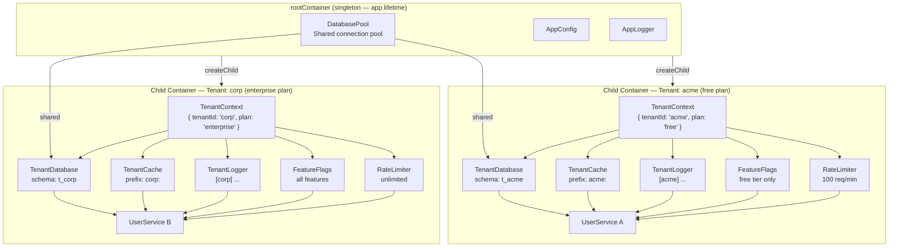

# Example 11 — Multi-Tenant SaaS

**Concepts:** child containers per tenant request, scoped bindings for tenant-specific resources, plan-gated feature flags, per-plan rate limiting

---

## What this example shows

In a multi-tenant SaaS application each request belongs to a specific tenant with its own database schema, cache namespace, logger context, feature flags, and rate limits. This example shows how a single child container per request threads tenant context through an entire service graph without passing it as a function argument.

---

## Diagram

### Container hierarchy per tenant request



## The problem DI solves here

Without DI, tenant context must travel through every function call:

```ts
// Without DI — context threaded explicitly
userService.listUsers(tenantId, dbSchema, plan, rateLimiter);
```

With DI — bind tenant context once on the child container; every downstream service resolves it automatically:

```ts
// With DI — bind once, inject everywhere
tenantContainer.bind(TenantContextToken).toConstantValue({ tenantId, plan, dbSchema });
const userService = tenantContainer.resolve(UserServiceToken);
await userService.listUsers(); // all tenant deps resolved automatically
```

---

## Architecture

```
rootContainer (singleton lifetime)
├── DatabasePoolToken   → shared PgPool (all tenants share one connection pool)
├── AppConfigToken      → global config
└── AppLoggerToken      → base logger

tenantContainer (child, one per request)
├── TenantContextToken  → { tenantId, plan, dbSchema }   ← bound here
├── TenantDbToken       → namespaced to tenant schema    ← scoped
├── TenantCacheToken    → key-prefixed per tenant        ← scoped
├── TenantLoggerToken   → enriched with tenantId         ← scoped
├── FeatureFlagsToken   → plan-gated feature set         ← scoped
├── RateLimiterToken    → per-plan quota                 ← scoped
└── UserServiceToken    → uses all of the above          ← scoped
```

---

## Creating a tenant child container

```ts
function createTenantContainer(context: TenantContext): Container {
  const tenantContainer = rootContainer.createChild();

  tenantContainer.bind(TenantContextToken).toConstantValue(context);

  // Scoped services resolve their tenant context from the child container
  tenantContainer.bind(TenantDbToken).to(TenantDatabase).scoped();
  tenantContainer.bind(TenantCacheToken).to(TenantCache).scoped();
  tenantContainer.bind(TenantLoggerToken).to(ContextLogger).scoped();
  tenantContainer.bind(FeatureFlagsToken).to(PlanFeatureFlags).scoped();
  tenantContainer.bind(RateLimiterToken).to(PlanRateLimiter).scoped();
  tenantContainer.bind(UserServiceToken).to(UserManager).scoped();

  return tenantContainer;
}
```

---

## Plan-gated feature flags

```ts
@injectable([inject(TenantContextToken)])
class PlanFeatureFlags implements FeatureFlags {
  private readonly enabledSet: Set<string>;

  constructor(context: TenantContext) {
    this.enabledSet = new Set(PLAN_FEATURES[context.plan]);
  }

  isEnabled(flag: string): boolean {
    return this.enabledSet.has(flag);
  }
}
```

`PLAN_FEATURES` maps `"free" | "pro" | "enterprise"` to a list of enabled flag names. The flags object is automatically different for each tenant because `TenantContext` is tenant-specific.

---

## Per-plan rate limiting

```ts
@injectable([inject(TenantContextToken)])
class PlanRateLimiter implements RateLimiter {
  constructor(context: TenantContext) {
    this.quotas = PLAN_QUOTAS[context.plan]; // different limits per plan
  }
}
```

Each tenant container gets its own `RateLimiter` instance — quotas are never shared across tenants.

---

## Two tenants, fully isolated

```ts
const freeContainer = createTenantContainer({ tenantId: "acme", plan: "free", dbSchema: "t_acme" });
const proContainer = createTenantContainer({ tenantId: "beta", plan: "pro", dbSchema: "t_beta" });
const entContainer = createTenantContainer({
  tenantId: "corp",
  plan: "enterprise",
  dbSchema: "t_corp",
});

// Each resolves a fully isolated UserService — different db, cache, logger, flags
const acmeUsers = await freeContainer.resolve(UserServiceToken).listUsers();
const betaUsers = await proContainer.resolve(UserServiceToken).listUsers();
```

The root `DatabasePool` singleton is shared (one connection pool for efficiency); the tenant wrappers namespace queries to the correct schema automatically.

---

## What to read next

- **Example 03** — scoped lifetime and child containers.
- **Example 12** — production microservice: similar patterns applied to a single-tenant service with health checks and graceful shutdown.
