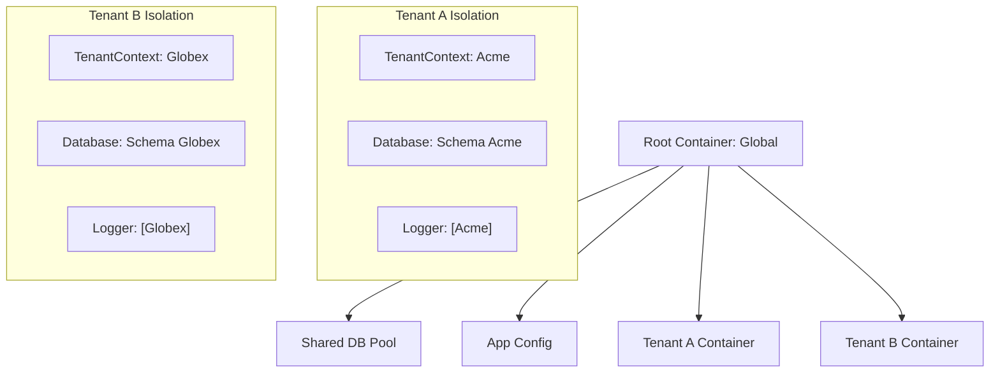
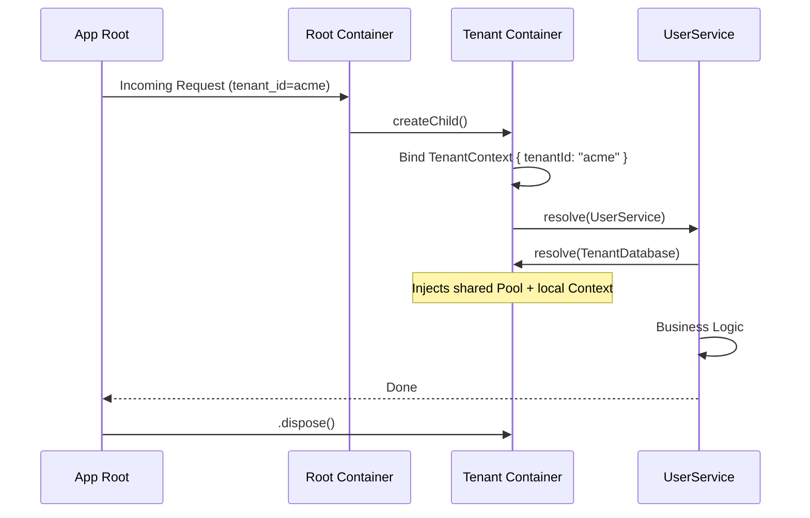

# Example 11: Multi-Tenant SaaS Application

This example demonstrates how to build a multi-tenant application where every tenant lives in its own isolated child container, sharing global infrastructure while maintaining strict per-tenant state.

## The Problem: Context Passing

In a SaaS app, you often need to know the `tenantId` in deep layers of your code (database views, loggers, rate limiters). Passing this manually through every function call ("Parameter Threading") is error-prone and tedious.

## The Solution: Tenant Containers

We use a **Root Container** for shared infrastructure and create a **Child Container** for every tenant request.

## Isolation Architecture

### 1. Shared Infrastructure

The `DatabasePool` is registered in the **Root Container**. It manages the physical connection pool to the database.

### 2. Namespaced Wrappers

The `TenantDatabase` is registered as **Scoped** in the child container. It injects the `DatabasePool` (from root) AND the `TenantContext` (from child). It then wraps every query to automatically append the correct schema or `tenant_id` filter.

### 3. Plan-Gated Features

The `FeatureFlags` service is bound in the tenant container based on the tenant's subscription plan.

## Request Sequence Breakdown

## Key Benefits

- **Zero Param Threading**: Downstream services like `UserService` or `InviteService` don't need to accept `tenantId` as a parameter. They simply `@inject(TenantContext)`.
- **Security by Design**: It is architecturally impossible for Tenant A to accidentally access Tenant B's database because the `TenantDatabase` instance is unique and correctly configured for Tenant A.
- **Graceful Cleanup**: When the request ends, only the tenant-specific resources (temporary caches or log buffers) are cleared.
