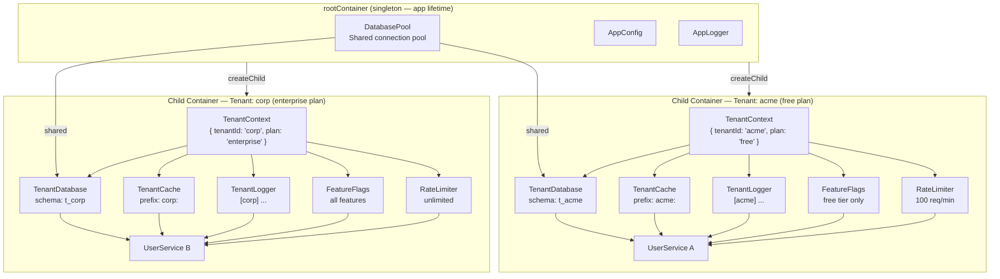

# Example 11 — Multi-Tenant SaaS

**Concepts:** child containers per tenant request, scoped bindings for tenant-specific resources, plan-gated feature
flags, per-plan rate limiting

---

## What this example shows

In a multi-tenant SaaS application each request belongs to a specific tenant with its own database schema, cache
namespace, logger context, feature flags, and rate limits. This example shows how a single child container per request
threads tenant context through an entire service graph without passing it as a function argument.

---

## Diagram

### Container hierarchy per tenant request


```mermaid
graph TB
    subgraph root["rootContainer (singleton — app lifetime)"]
        Pool["DatabasePool\nShared connection pool"]
        AppCfg["AppConfig"]
        BaseLog["AppLogger"]
    end

    subgraph tenantA["Child Container — Tenant: acme (free plan)"]
        CtxA["TenantContext\n{ tenantId: 'acme', plan: 'free' }"]
        DbA["TenantDatabase\nschema: t_acme"]
        CacheA["TenantCache\nprefix: acme:"]
        LogA["TenantLogger\n[acme] ..."]
        FlagsA["FeatureFlags\nfree tier only"]
        RLimA["RateLimiter\n100 req/min"]
        SvcA["UserService A"]
    end

    subgraph tenantB["Child Container — Tenant: corp (enterprise plan)"]
        CtxB["TenantContext\n{ tenantId: 'corp', plan: 'enterprise' }"]
        DbB["TenantDatabase\nschema: t_corp"]
        CacheB["TenantCache\nprefix: corp:"]
        LogB["TenantLogger\n[corp] ..."]
        FlagsB["FeatureFlags\nall features"]
        RLimB["RateLimiter\nunlimited"]
        SvcB["UserService B"]
    end

    root -->|createChild| tenantA
    root -->|createChild| tenantB
    Pool -->|shared| DbA & DbB
    CtxA --> DbA & CacheA & LogA & FlagsA & RLimA --> SvcA
    CtxB --> DbB & CacheB & LogB & FlagsB & RLimB --> SvcB
```

## The problem DI solves here

Without DI, tenant context must travel through every function call:

```ts
// Without DI — context threaded explicitly
userService.listUsers(tenantId, dbSchema, plan, rateLimiter);
```

With DI — bind tenant context once on the child container; every downstream service resolves it automatically:

```ts
// With DI — bind once, inject everywhere
tenantContainer.bind(TenantContextToken).toConstantValue({ tenantId, plan, databaseSchema });
const userService = tenantContainer.resolve(UserServiceToken);
await userService.listUsers(); // all tenant deps resolved automatically
```

---

## Architecture

```
rootContainer (singleton lifetime)
├── DatabasePoolToken   → shared PgPool (all tenants share one connection pool)
├── AppConfigToken      → global config
└── AppLoggerToken      → base logger

tenantContainer (child, one per request)
├── TenantContextToken   → { tenantId, plan, databaseSchema }   ← bound here
├── TenantDatabaseToken  → namespaced to tenant schema          ← scoped
├── TenantCacheToken     → key-prefixed per tenant              ← scoped
├── TenantLoggerToken    → enriched with tenantId               ← scoped
├── FeatureFlagsToken    → plan-gated feature set               ← scoped
├── RateLimiterToken     → per-plan quota                       ← scoped
└── UserServiceToken     → uses all of the above                ← scoped
```

---

## Creating a tenant child container

```ts
function createTenantContainer(
  rootContainer: Container,
  tenantContext: TenantContext,
  // Resolved once at boot (async singleton) and captured as a plain value,
  // so the sync tenant bindings never trigger async resolution.
  sharedDatabasePool: DatabasePool,
): Container {
  const tenantContainer = rootContainer.createChild();

  // Tenant identity — everything downstream derives from this one binding.
  // toConstantValue is a fixed value; the child container is what scopes it.
  tenantContainer.bind(TenantContextToken).toConstantValue(tenantContext);

  // Each scoped service is built by a dynamic factory that resolves the
  // tenant context (and any sibling services) from the child container.
  tenantContainer
    .bind(TenantLoggerToken)
    .toDynamic((context) => {
      // No logger class — the factory returns a plain object literal.
      const { tenantId, plan } = context.resolve(TenantContextToken);
      const prefix = `[${tenantId}/${plan}]`;
      return {
        info: (message, metadata) => console.log(`  ${prefix} INFO  ${message}`, metadata ?? ""),
        warn: (message, metadata) => console.log(`  ${prefix} WARN  ${message}`, metadata ?? ""),
        error: (message, metadata) => console.error(`  ${prefix} ERROR ${message}`, metadata ?? ""),
      };
    })
    .scoped();

  tenantContainer
    .bind(TenantDatabaseToken)
    .toDynamic((context) => {
      const { databaseSchema } = context.resolve(TenantContextToken);
      const tenantLogger = context.resolve(TenantLoggerToken);
      return new TenantDatabaseConnection(sharedDatabasePool, databaseSchema, tenantLogger);
    })
    .scoped();

  tenantContainer
    .bind(TenantCacheToken)
    .toDynamic((context) => {
      const { tenantId } = context.resolve(TenantContextToken);
      const tenantLogger = context.resolve(TenantLoggerToken);
      return new NamespacedRedisCache(`tenant:${tenantId}`, tenantLogger);
    })
    .scoped();

  tenantContainer
    .bind(FeatureFlagsToken)
    .toDynamic((context) => new PlanFeatureFlags(context.resolve(TenantContextToken).plan))
    .scoped();

  tenantContainer
    .bind(RateLimiterToken)
    .toDynamic((context) => {
      const { plan } = context.resolve(TenantContextToken);
      return new PlanRateLimiter(plan, context.resolve(TenantLoggerToken));
    })
    .scoped();

  // Domain services — plain class bindings that read everything from the tokens above.
  tenantContainer.bind(UserServiceToken).to(TenantUserManager).scoped();
  tenantContainer.bind(InviteServiceToken).to(TenantInviteManager).scoped();

  return tenantContainer;
}
```

---

## Plan-gated feature flags

```ts
// Undecorated — instantiated by the FeatureFlagsToken factory, which passes
// in the tenant's plan (resolved from TenantContext), not the whole context.
class PlanFeatureFlags implements FeatureFlags {
  private static readonly PLAN_FLAGS: Record<TenantPlan, Array<string>> = {
    free: ["basic_auth", "file_upload"],
    pro: ["basic_auth", "file_upload", "api_access", "webhooks", "advanced_analytics"],
    enterprise: [
      "basic_auth",
      "file_upload",
      "api_access",
      "webhooks",
      "advanced_analytics",
      "sso",
      "audit_logs",
      "custom_domain",
      "priority_support",
    ],
  };

  constructor(private readonly plan: TenantPlan) {}

  isEnabled(flag: string): boolean {
    return PlanFeatureFlags.PLAN_FLAGS[this.plan].includes(flag);
  }

  enabledFlags(): Array<string> {
    return PlanFeatureFlags.PLAN_FLAGS[this.plan];
  }
}
```

The private static `PLAN_FLAGS` maps each plan (`"free" | "pro" | "enterprise"`) to its list of enabled flag names. The
flags differ per tenant because the `FeatureFlagsToken` factory constructs `PlanFeatureFlags` with the plan from that
tenant's `TenantContext`.

---

## Per-plan rate limiting

```ts
// Undecorated — the RateLimiterToken factory passes in the plan and the
// tenant logger. Quotas are keyed by plan; usage is tracked per operation.
class PlanRateLimiter implements RateLimiter {
  private static readonly QUOTAS: Record<TenantPlan, Record<string, number>> = {
    free: { api_call: 100, file_upload: 10, invite: 3 },
    pro: { api_call: 10_000, file_upload: 500, invite: 50 },
    enterprise: { api_call: Infinity, file_upload: Infinity, invite: Infinity },
  };

  private readonly usage = new Map<string, number>();

  constructor(
    private readonly plan: TenantPlan,
    private readonly tenantLogger: TenantLogger,
  ) {}

  checkQuota(operation: string): boolean {
    const quota = PlanRateLimiter.QUOTAS[this.plan][operation] ?? 0;
    const used = this.usage.get(operation) ?? 0;
    if (used >= quota) {
      this.tenantLogger.warn(`rate_limit.exceeded`, { operation, quota, used });
      return false;
    }
    this.usage.set(operation, used + 1);
    return true;
  }
}
```

Each tenant container gets its own `RateLimiter` instance — quotas are never shared across tenants.

---

## Two tenants, fully isolated

```ts
const freeContainer = createTenantContainer({ tenantId: "acme", plan: "free", databaseSchema: "t_acme" });
const proContainer = createTenantContainer({ tenantId: "beta", plan: "pro", databaseSchema: "t_beta" });
const entContainer = createTenantContainer({
  tenantId: "corp",
  plan: "enterprise",
  databaseSchema: "t_corp",
});

// Each resolves a fully isolated UserService — different db, cache, logger, flags
const acmeUsers = await freeContainer.resolve(UserServiceToken).listUsers();
const betaUsers = await proContainer.resolve(UserServiceToken).listUsers();
```

The root `DatabasePool` singleton is shared (one connection pool for efficiency); the tenant wrappers namespace queries
to the correct schema automatically.

---

## What to read next

- **Example 03** — scoped lifetime and child containers.
- **Example 12** — production microservice: similar patterns applied to a single-tenant service with health checks and
  graceful shutdown.

## License

Released under the [MIT License](../../LICENSE).
