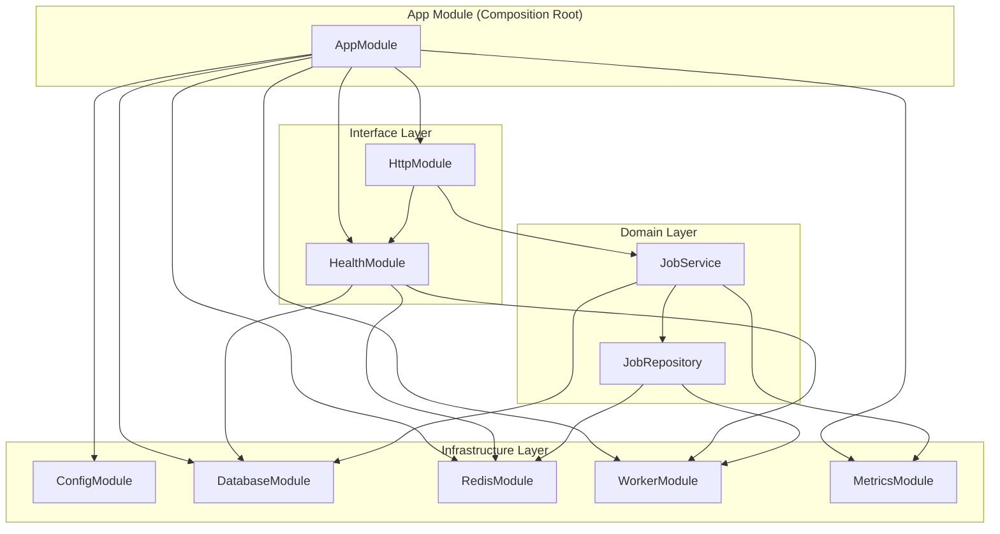
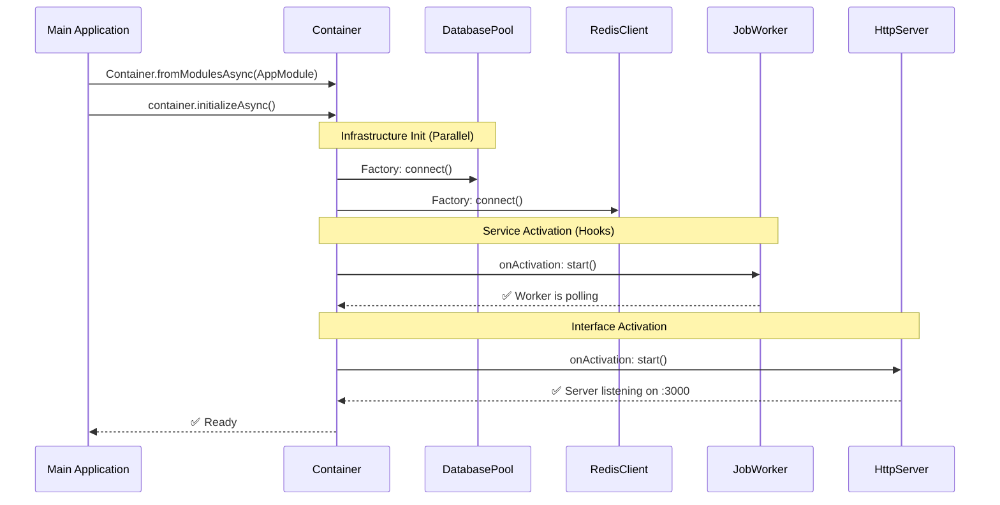
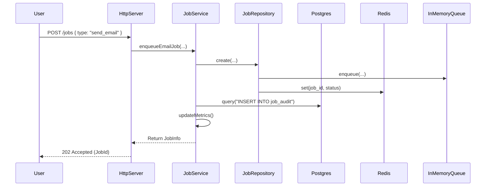
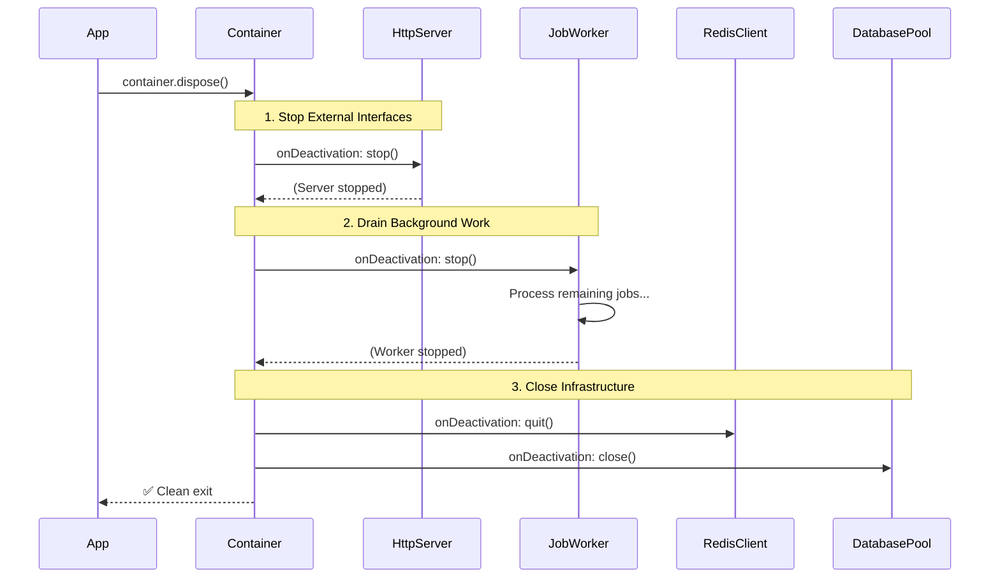

# Example 12: Production Microservice Deep Dive

This document provides a detailed walkthrough of `12-production-microservice.ts`, which demonstrates a complete, production-grade microservice bootstrap and shutdown lifecycle using `@codefast/di`.

## Overview

The example simulates a **Job Processing Service** that exposes an HTTP API to enqueue and monitor background jobs (e.g., sending emails, generating reports).

It solves the "Tangled Bootstrap" problem where infrastructure dependencies (DB, Redis, Workers) must be initialized in a specific order and shut down in the exact reverse order to avoid data loss or hanging processes.

## 1. Architecture & Dependency Graph

The system is organized into several **Modules**, each responsible for a specific domain or infrastructure component.

## 2. The Bootstrap Sequence

When `Container.fromModulesAsync(AppModule)` is called followed by `container.initializeAsync()`, the DI container performs the following:

1.  **Graph Analysis**: It identifies that `ConfigModule` is the root dependency for almost everything.
2.  **Parallel Initialization**: It starts independent async branches (Database connection and Redis connection) in parallel to minimize startup time.
3.  **Activation Hooks**: Services that need to "start" (like the `JobWorker` and `HttpServer`) use the `onActivation` hook.

## 3. Request Flow Example: `POST /jobs`

This diagram shows how various injected components collaborate to handle a single business transaction.

## 4. Graceful Shutdown (Reverse Disposal)

The example uses the `await using` syntax (Explicit Resource Management). When the `bootstrap` function finishes, the container is disposed of automatically.

> [!IMPORTANT]
> The container disposes of bindings in the **exact reverse order** of their creation. This ensures that the HTTP server stops accepting requests before the database connection it depends on is closed.

## Key DI Patterns Used

| Feature                   | Usage in Example 12                                                                |
| :------------------------ | :--------------------------------------------------------------------------------- |
| **Async Modules**         | `Module.createAsync` handles dynamic imports and async binding definitions.        |
| **Async Factories**       | `toDynamicAsync` connects to DB/Redis using `await`.                               |
| **Lifecycle Hooks**       | `onActivation` starts the worker; `onDeactivation` ensures graceful cleanup.       |
| **Token-based Injection** | Decouples the service logic from specific implementations (e.g., `JobQueueToken`). |
| **Scope Validation**      | `container.validate()` ensures no Singletons capture Scoped dependencies.          |
