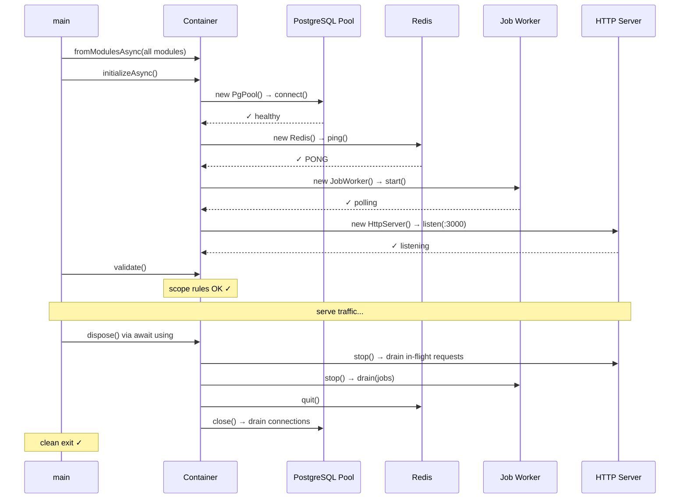
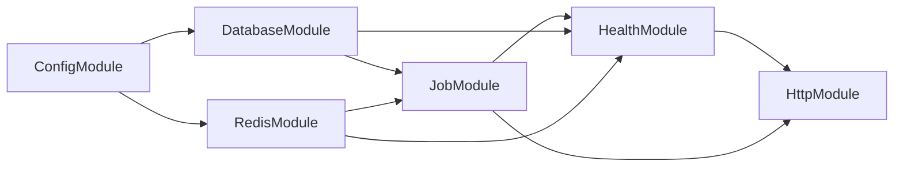

# Example 12 — Production Microservice Bootstrap

**Concepts:** Full service lifecycle — config, async DB/Redis pools, job worker, health registry, HTTP server, `container.validate()`, graceful shutdown via `await using`

---

## What this example shows

A complete, production-grade microservice where DI manages the entire lifecycle: ordered async startup, health checks, background job processing, and graceful shutdown triggered by a single `container.dispose()`.

---

## Diagram

### Startup & shutdown sequence



### Module dependency graph



## The problem DI solves here

Without DI, microservice startup looks like 200+ lines of explicit ordering, manual null-checks, and teardown scattered across `try/finally` blocks:

```ts
// Without DI
const config = loadConfig();
const db = new PgPool(config.databaseUrl);
await db.connect();
const redis = new Redis(config.redisUrl);
await redis.connect();
const worker = new JobWorker(db, redis);
await worker.start();
// ...and teardown spread across process signal handlers
```

With DI:

```ts
// With DI — declare what each service needs; container figures out order
await using container = await Container.fromModulesAsync(
  ConfigModule,
  DatabaseModule,
  RedisModule,
  JobModule,
  HealthModule,
  HttpModule,
);
await container.initializeAsync(); // all onActivation hooks run in dependency order
container.validate(); // catch scope violations before serving traffic
```

---

## Bootstrap sequence

The container resolves each module's dependencies automatically and in the correct order:

```
1. ConfigModule     → load config from environment
2. DatabaseModule   → open PostgreSQL pool (onActivation: health check)
3. RedisModule      → open Redis connection (onActivation: PING)
4. JobModule        → start background worker (onActivation: begin polling)
5. HealthModule     → register DB + Redis health checks
6. HttpModule       → register routes, start HTTP server (onActivation: listen)
```

Each step is an async binding with lifecycle hooks:

```ts
builder
  .bind(DatabasePoolToken)
  .toDynamicAsync(async (ctx) => {
    const config = ctx.resolve(ServiceConfigToken);
    return new PgPool(config.databaseUrl);
  })
  .singleton()
  .onActivation(async (_ctx, pool) => {
    await pool.connect(); // open connection pool
    await pool.healthCheck(); // verify connectivity
    return pool;
  })
  .onDeactivation(async (pool) => {
    await pool.close(); // drain connections on shutdown
  });
```

---

## Health registry: multi-binding pattern

All health checks are registered under a single `HealthCheckToken` and collected at query time:

```ts
// Each infrastructure module registers its own health check
builder.bind(HealthCheckToken).toConstantValue(dbHealthCheck).whenNamed("database");
builder.bind(HealthCheckToken).toConstantValue(redisHealthCheck).whenNamed("redis");

// Health endpoint aggregates all checks
const checks = container.resolveAll(HealthCheckToken);
const results = await Promise.all(checks.map((c) => c.run()));
```

---

## Job worker with graceful drain

```ts
builder
  .bind(JobWorkerToken)
  .toDynamicAsync(async (ctx) => new JobWorker(ctx.resolve(JobQueueToken)))
  .singleton()
  .onActivation(async (_ctx, worker) => {
    await worker.start();
    return worker;
  })
  .onDeactivation(async (worker) => {
    await worker.stop(); // stop accepting new jobs
    await worker.drain(); // wait for in-flight jobs to complete
  });
```

---

## Scope validation before serving traffic

```ts
await container.initializeAsync(); // all singletons warm, all onActivation ran
container.validate(); // throws ScopeViolationError on captive dependencies
startHttpServer(); // safe to accept traffic
```

---

## Shutdown sequence (reverse of startup)

`await using` ensures `container.dispose()` fires even if an exception is thrown. Deactivation hooks run in **reverse dependency order**:

```
HTTP server  → stop accepting requests
Job worker   → drain in-flight jobs
Redis        → close connection
PostgreSQL   → drain connection pool
```

```ts
async function main() {
  await using container = await Container.fromModulesAsync(...);
  await container.initializeAsync();
  container.validate();

  process.on("SIGTERM", () => container.dispose());

  // serve traffic...
} // container.dispose() called automatically
```

---

## What to read next

- **Example 05** — async lifecycle fundamentals (`toDynamicAsync`, `onActivation`, `onDeactivation`, `await using`).
- **Example 09** — `ScopeViolationError` and how `validate()` catches it.
- **Example 13** — the same patterns applied to a full e-commerce platform with multiple bounded contexts.
