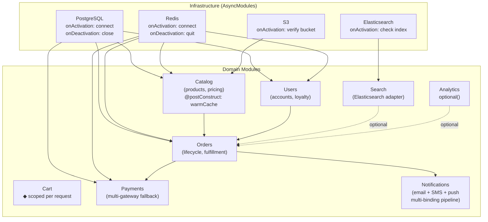
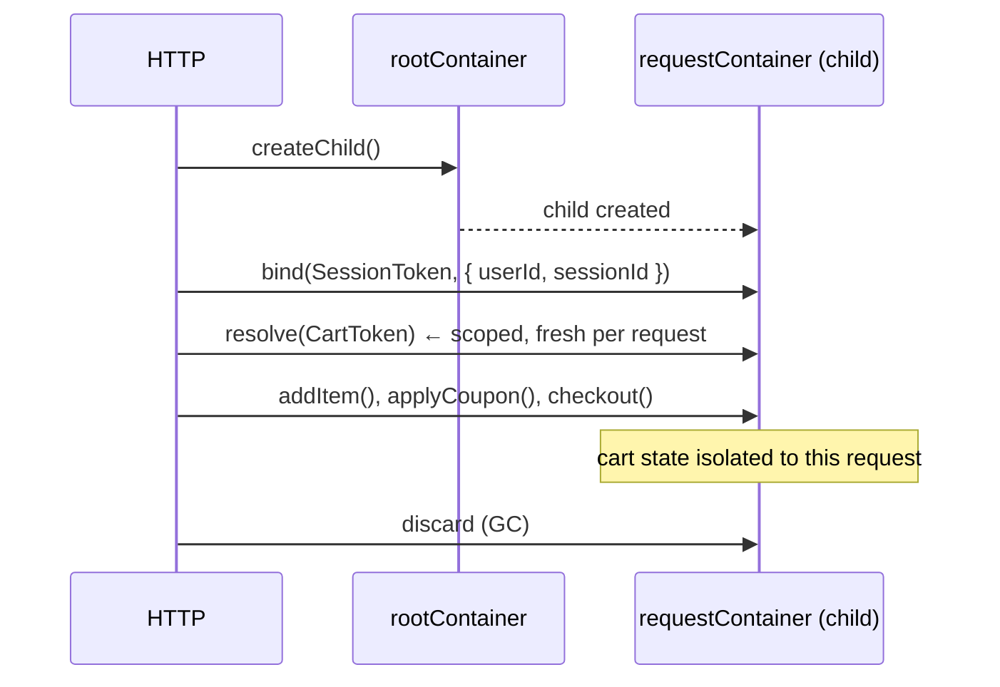

# Example 13 — E-Commerce Platform

**Concepts:** All DI features combined in a domain-rich context — bounded contexts as modules, `@postConstruct`, `@preDestroy`, `injectAll`, `optional`, multi-gateway payment, notification pipeline, per-request scoped cart, `resolveOptional` for A/B testing

---

## What this example shows

The largest example in the set. Every feature of `@codefast/di` is exercised inside a realistic domain — an e-commerce backend with eight bounded contexts (Catalog, Cart, Orders, Payments, Users, Notifications, Search, Analytics) backed by PostgreSQL, Redis, S3, and Elasticsearch.

Use this example as a reference for how DI scales to a real production application.

---

## Diagram

### Bounded contexts and their dependencies



### Per-request cart scope



## Bounded contexts as modules

Each domain context is one (or more) modules. Infrastructure modules are imported by domain modules and deduplicated automatically:

```
InfrastructureModule (AsyncModule)
├── PostgresDatabaseModule   → PgPool (async connect / disconnect)
├── RedisModule              → Redis client (async connect / disconnect)
├── S3Module                 → S3 client (onActivation: verify bucket)
└── ElasticsearchModule      → ES client (onActivation: check index health)

CatalogModule (SyncModule, imports InfrastructureModule)
CartModule    (SyncModule, scoped per request)
OrdersModule  (SyncModule, imports InfrastructureModule, CatalogModule)
PaymentsModule (SyncModule, multi-gateway)
UsersModule   (SyncModule, imports InfrastructureModule)
NotificationsModule (SyncModule, multi-binding pipeline)
SearchModule  (SyncModule, imports ElasticsearchModule)
AnalyticsModule (SyncModule, optional integration)
```

---

## Decorators: `@postConstruct` and `@preDestroy`

For classes that need lifecycle callbacks without binding-level hooks:

```ts
@injectable([inject(DatabaseToken), inject(CacheToken)])
class CatalogService {
  @postConstruct
  async warmUpCache(): Promise<void> {
    // Called automatically after construction, before first resolve() returns
    const products = await this.db.query("SELECT * FROM products LIMIT 100");
    for (const p of products) this.cache.set(`product:${p.id}`, p);
  }

  @preDestroy
  async flushCache(): Promise<void> {
    // Called automatically during container.dispose()
    await this.cache.flush();
  }
}
```

`@postConstruct` and `@preDestroy` are method decorators — no binding-level `.onActivation()` / `.onDeactivation()` needed when the logic belongs to the class itself.

---

## `injectAll` — inject all implementations as an array

```ts
@injectable([injectAll(PaymentGatewayToken)])
class PaymentOrchestrator {
  constructor(private readonly gateways: PaymentGateway[]) {}

  async charge(amount: number, currency: string): Promise<Receipt> {
    for (const gateway of this.gateways) {
      try {
        return await gateway.charge(amount, currency);
      } catch {
        continue; // try next gateway
      }
    }
    throw new Error("All payment gateways failed");
  }
}
```

`injectAll(token)` resolves all bindings for that token and injects them as an array. Used here for multi-gateway payment fallback and for the notification pipeline.

---

## Notification pipeline: multi-binding

```ts
// Three notification channels under one token
builder.bind(NotificationToken).to(EmailNotifier).whenNamed("email").singleton();
builder.bind(NotificationToken).to(SmsNotifier).whenNamed("sms").singleton();
builder.bind(NotificationToken).to(PushNotifier).whenNamed("push").singleton();

// Orchestrator injects all three
@injectable([injectAll(NotificationToken)])
class NotificationDispatcher {
  async dispatch(event: OrderEvent): Promise<void> {
    await Promise.all(this.channels.map((ch) => ch.send(event)));
  }
}
```

---

## Scoped cart per request

Cart state is request-scoped — it must not leak between requests:

```ts
// Registered as scoped on the root container
rootContainer.bind(CartToken).to(ShoppingCart).scoped();

// Each HTTP request gets its own child container
const requestContainer = rootContainer.createChild();
requestContainer.bind(SessionToken).toConstantValue({ userId, sessionId });

const cart = requestContainer.resolve(CartToken); // fresh per request
```

---

## `optional` for A/B testing

```ts
@injectable([inject(CatalogServiceToken), optional(AbTestingToken)])
class SearchController {
  constructor(
    private readonly catalog: CatalogService,
    private readonly abTesting?: AbTestingService, // undefined if not configured
  ) {}

  search(query: string) {
    const variant = this.abTesting?.getVariant("search-algo") ?? "control";
    return this.catalog.search(query, variant);
  }
}
```

`optional(token)` gracefully handles the A/B service not being configured in development environments.

---

## Full scenario in `main()`

```
1. Bootstrap infrastructure (async modules, onActivation hooks)
2. Load all domain modules
3. initializeAsync() — warm all singletons (catalog cache, pricing rules)
4. validate() — catch captive dependencies before traffic
5. Customer journey:
   a. Browse catalog + search
   b. Register / login
   c. Add to cart (scoped child container)
   d. Apply coupon
   e. Checkout: address → shipping quote → payment (Stripe → PayPal fallback)
   f. Order created → fulfillment triggered
   g. Notification pipeline: email receipt + SMS update
   h. Loyalty points awarded
   i. Analytics event emitted
6. Graceful shutdown via await using
```

---

## What to read next

- This example intentionally covers everything. If a specific feature is unclear, the earlier numbered examples isolate that feature:
  - Async lifecycle → **Example 05**
  - Multi-binding / `resolveAll` → **Example 06**
  - Scoped containers → **Example 03**
  - `@postConstruct` / `@preDestroy` → covered here and in Example 05
  - Testing this architecture → **Example 16**
