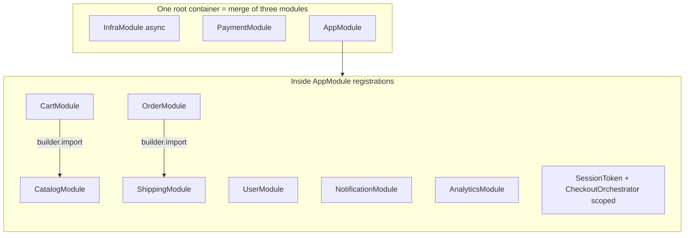
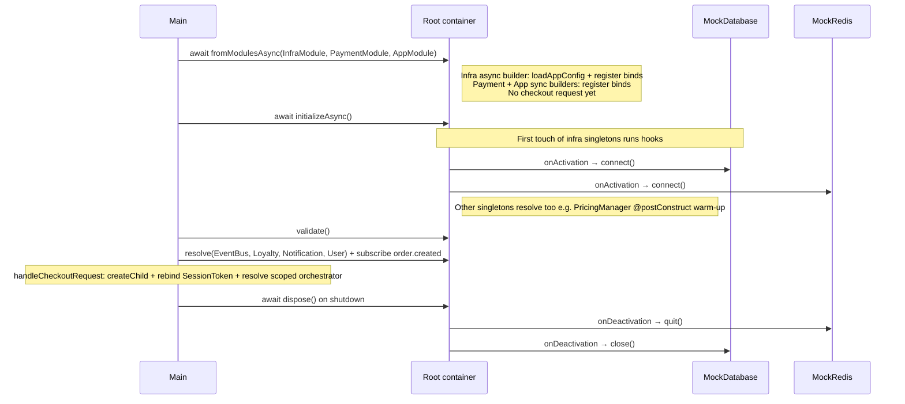
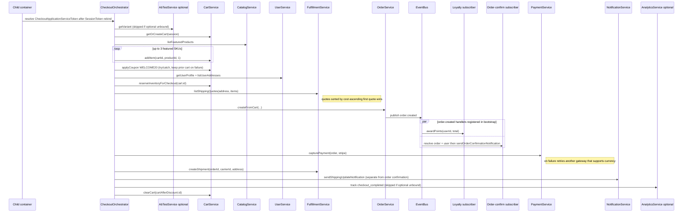

# Example 13: E-Commerce Platform (Bounded Contexts)

Walkthrough of `13-ecommerce-platform.ts`: a **single-file, domain-rich** backend sketch that wires a full customer journey through `@codefast/di`—from async infrastructure to per-request checkout orchestration.

> This is a **runnable simulation**: Postgres, Redis, S3, Elasticsearch, Stripe, and so on are **mocked** with realistic delays and logs. The value is the **composition graph**, not external services.

## Overview

The example answers: _“How do I organize a non-trivial product into modules, lifetimes, and cross-cutting infrastructure without turning `main()` into a ball of mud?”_

- **Bounded contexts** (Catalog, Cart, Orders, Payments, Users, Notifications, Analytics) each map to `Module.create` / `Module.createAsync` registrations.
- **Infrastructure** (DB pool connect, Redis connect) uses async activation and deactivation hooks.
- **Multi-binding** models payment gateways, shipping carriers, and notification channels (`injectAll` / `resolveAll` patterns).
- **Per-request isolation** uses a **child container** so `UserSession` and scoped checkout logic do not leak across concurrent HTTP-shaped requests.

## 1. High-level architecture

`bootstrap()` builds **one** root container from **three sibling modules** (none of them `import`s the others at module level—merge happens in `fromModulesAsync`):

- **InfraModule** (`Module.createAsync`): config + logger + id generator + DB/Redis/S3/ES/EventBus.
- **PaymentModule** (`Module.create`): named gateways + `PaymentProcessor` / `PaymentServiceToken`.
- **AppModule** (`Module.create`): imports domain modules below, binds placeholder `SessionToken`, registers **scoped** `CheckoutOrchestrator`.



`InfraModule`, `PaymentModule`, and `AppModule` are **not** linked by `builder.import` to each other; the container **merges** their binding tables. Domain services and `CheckoutOrchestrator` then **resolve** tokens that were registered in `InfraModule` (e.g. `DatabaseToken`, `LoggerToken`, `RedisToken`, `EventBusToken`) or `PaymentModule` (`PaymentServiceToken`, gateways) alongside tokens from the `AppModule` subtree.

## 2. Bootstrap sequence

Async **connect** for `MockDatabase` / `MockRedis` is wired with `.onActivation` on their bindings; in this demo those instances are created when the container **initializes** singletons, not at an arbitrary earlier step.



## 3. Checkout journey (application service)

`CheckoutOrchestrator.completeCheckoutJourney` is the **application** flow. **Order confirmation email** and **loyalty points** are **not** called from this class: `OrderManager.createFromCart` publishes `order.created`, and **root** `EventBus` subscribers registered in `bootstrap()` handle those side effects (possibly interleaved with later orchestrator steps when handlers run).



Each concurrent “request” in `main()` calls `rootContainer.createChild()`, re-binds `SessionToken`, and resolves a **fresh** scoped orchestrator—mirroring per-request DI in a real HTTP server.

## 4. Multi-bindings in one glance

| Token / axis                                               | Implementations                                           | Consumed by                                                               |
| ---------------------------------------------------------- | --------------------------------------------------------- | ------------------------------------------------------------------------- |
| `PaymentGatewayToken` (named: `stripe`, `paypal`, `cod`)   | `StripeGateway`, `PayPalGateway`, `CashOnDeliveryGateway` | `PaymentProcessor` (`injectAll`) with runtime selection + fallback charge |
| `ShippingCarrierToken` (named: `fedex`, `ups`, `dhl`)      | `FedExCarrier`, `UpsCarrier`, `DhlCarrier`                | `ShippingFulfillmentService` (`injectAll`) for quote aggregation          |
| `NotificationChannelToken` (named: `email`, `sms`, `push`) | `EmailChannel`, `SmsChannel`, `PushChannel`               | `NotificationDispatcher` filters `canHandle` then broadcasts              |

## Key DI patterns demonstrated

| Feature                                                  | Where it shows up                                   |
| -------------------------------------------------------- | --------------------------------------------------- |
| `Module.createAsync` + `onActivation` / `onDeactivation` | `InfraModule` for DB/Redis lifecycle                |
| `Module.create` + `builder.import`                       | Catalog/Cart diamond (Cart imports Catalog)         |
| Named multi-bindings + `injectAll`                       | Payments, shipping, notifications                   |
| Scoped services + `createChild`                          | `CheckoutOrchestrator` + per-request `SessionToken` |
| `optional()` injection                                   | `AnalyticsService`, `AbTestService` on orchestrator |
| `@postConstruct` / `@preDestroy`                         | `PricingManager` cache warm-up / flush              |
| `container.validate()`                                   | Catch captive-dependency mistakes before traffic    |
| `container.initializeAsync()`                            | Warm singleton graph after async module load        |
| `generateDependencyGraph` + `toDotGraph`                 | Export DOT for Graphviz                             |

## Run it

From the `packages/di` package root:

```bash
cd packages/di
npx tsx examples/13-ecommerce-platform/13-ecommerce-platform.ts
```

You should see structured JSON logs (logger), bootstrap banners, three concurrent checkouts, a sample catalog search, dependency-graph stats, and a graceful shutdown banner.

## Files

| File                                                     | Role                                                                         |
| -------------------------------------------------------- | ---------------------------------------------------------------------------- |
| [`13-ecommerce-platform.ts`](./13-ecommerce-platform.ts) | Entire platform: tokens, domain types, modules, bootstrap, `main()` scenario |

For smaller focused demos of individual mechanics, start with [01-basic-tokens](../01-basic-tokens/README.md) through [06-constraints-multi-binding](../06-constraints-multi-binding/README.md), then return here for the **integrated** story.
