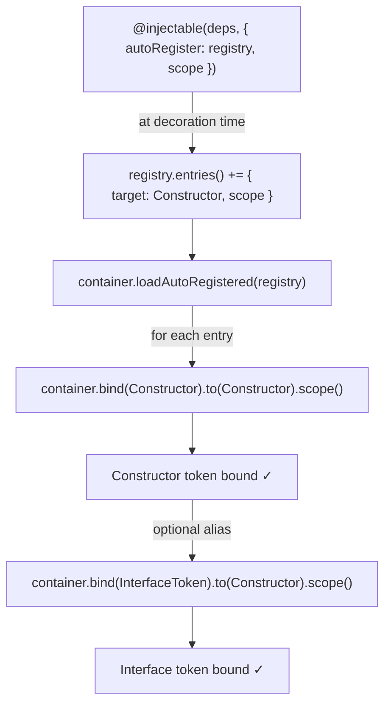
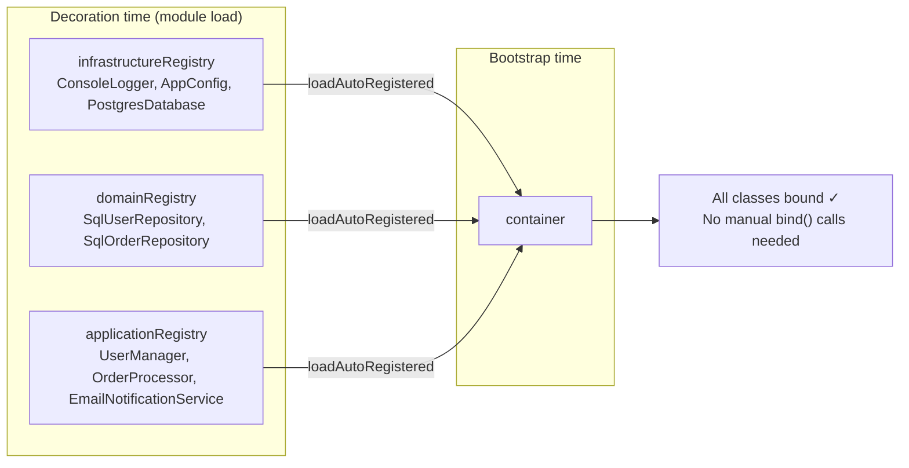

# Example 14 — Auto-Register Registry

**Concepts:** `createAutoRegisterRegistry()`, `autoRegister` option in `@injectable`, `container.loadAutoRegistered()`, per-layer registries, conditional (env-based) registration

---

## What this example shows

When a large number of services share the same wiring strategy (all singletons, all bound to their own constructor token), writing a `container.bind(X).to(X).singleton()` call for each one is repetitive. The auto-register registry eliminates that boilerplate.

---

## Diagram

### Auto-register flow



### Per-layer registries



## The pattern

**Step 1** — create a registry (one per architectural layer, or one global):

```ts
import { createAutoRegisterRegistry, type AutoRegisterRegistry } from "@codefast/di";

const infrastructureRegistry: AutoRegisterRegistry = createAutoRegisterRegistry();
const domainRegistry: AutoRegisterRegistry = createAutoRegisterRegistry();
const applicationRegistry: AutoRegisterRegistry = createAutoRegisterRegistry();
```

**Step 2** — decorate each class with `autoRegister`:

```ts
@injectable([inject(LoggerToken), inject(ConfigToken)], {
  autoRegister: infrastructureRegistry,
  scope: "singleton",
})
class PostgresDatabase implements Database {
  constructor(
    private readonly logger: Logger,
    private readonly config: Config,
  ) {}
  // ...
}
```

`autoRegister` records the class and its scope in the registry at decoration time. No `container.bind()` call needed here.

**Step 3** — bulk-load the registry into a container at bootstrap:

```ts
const infraCount = container.loadAutoRegistered(infrastructureRegistry);
const domainCount = container.loadAutoRegistered(domainRegistry);
const appCount = container.loadAutoRegistered(applicationRegistry);

console.log(`Auto-registered: ${infraCount} infra + ${domainCount} domain + ${appCount} app`);
```

`loadAutoRegistered` internally calls `container.bind(Constructor).to(Constructor).scope()` for each entry and returns the number of bindings added.

---

## What `loadAutoRegistered` does

For each entry in the registry:

```ts
container.bind(Constructor).to(Constructor).singleton(); // or .transient() / .scoped()
```

This binds the class **to itself** — the token is the constructor. If you need interface tokens (e.g. `DatabaseToken`), add alias bindings afterward:

```ts
container.bind(DatabaseToken).to(PostgresDatabase).singleton();
```

---

## Per-layer registries

Separate registries per architectural layer enforce separation of concerns and make it easy to load only the layers you need (e.g. skip `applicationRegistry` in a CLI tool that only needs infrastructure):

```ts
const infrastructureRegistry = createAutoRegisterRegistry(); // heavy resources
const domainRegistry = createAutoRegisterRegistry(); // repositories
const applicationRegistry = createAutoRegisterRegistry(); // use-case services
```

---

## Conditional (environment-based) registration

Because classes are registered at decorator-application time (module load), use separate registries per environment and select one at bootstrap:

```ts
const devRegistry  = createAutoRegisterRegistry();
const prodRegistry = createAutoRegisterRegistry();

@injectable([], { autoRegister: devRegistry, scope: "singleton" })
class StubNotificationService implements NotificationService { ... }

@injectable([inject(LoggerToken)], { autoRegister: prodRegistry, scope: "singleton" })
class SmtpNotificationService implements NotificationService { ... }

// At bootstrap — pick the right registry
const envRegistry = process.env.NODE_ENV === "production" ? prodRegistry : devRegistry;
container.loadAutoRegistered(envRegistry);
```

---

## Inspecting registry entries

```ts
const entries = infrastructureRegistry.entries();
entries.forEach((e) => console.log(`${e.target.name} (${e.scope})`));
// PostgresDatabase (singleton)
// ConsoleLogger (singleton)
// AppConfig (singleton)
```

---

## When to use auto-register vs. manual `bind()`

| Situation                                     | Use                                             |
| --------------------------------------------- | ----------------------------------------------- |
| Many services with identical wiring strategy  | `autoRegister`                                  |
| Complex construction logic or async factories | `toDynamic` / `toDynamicAsync`                  |
| Third-party classes you cannot decorate       | `toConstantValue` / `toDynamic`                 |
| Interface token → concrete class alias        | Manual `bind(InterfaceToken).to(ConcreteClass)` |

---

## What to read next

- **Example 02** — `@injectable` fundamentals.
- **Example 04** — modules as an alternative way to group bindings.
