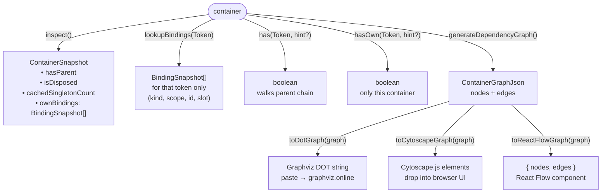
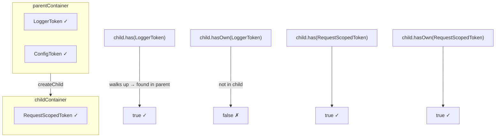

# Example 15 — Container Inspection & Graph Visualization

**Concepts:** `container.inspect()`, `container.lookupBindings()`, `container.has()` / `hasOwn()`, `container.generateDependencyGraph()`, `toDotGraph()`, `toCytoscapeGraph()`, startup audit helper

---

## What this example shows

How to introspect a running container — enumerate bindings, check existence, trace parent/child visibility, and export the full dependency graph as Graphviz DOT or Cytoscape.js data for visualization and debugging.

---

## Diagram

### Inspection API overview



### `has()` vs `hasOwn()` in a parent/child hierarchy



## `container.inspect()` — full snapshot

```ts
const snapshot = container.inspect();

console.log(snapshot.hasParent); // is this a child container?
console.log(snapshot.isDisposed); // has dispose() been called?
console.log(snapshot.cachedSingletonCount); // how many singletons are cached?
console.log(snapshot.ownBindings.length); // how many bindings are registered?

for (const binding of snapshot.ownBindings) {
  // binding.tokenName — string name of the token
  // binding.kind      — "constant" | "class" | "dynamic" | "alias" | ...
  // binding.scope     — "singleton" | "transient" | "scoped"
  // binding.slot.name — named constraint (if any)
  // binding.slot.tags — tagged constraints (if any)
  console.log(`${binding.tokenName} kind=${binding.kind} scope=${binding.scope}`);
}
```

---

## `container.lookupBindings(token)` — narrow to one token

```ts
const loggerBindings = container.lookupBindings(LoggerToken);
// Returns BindingSnapshot[] for all bindings under LoggerToken

for (const b of loggerBindings) {
  console.log(`kind=${b.kind}, scope=${b.scope}, id=${b.id}`);
}
```

Useful for verifying that a multi-binding set (named / tagged) has the expected number of entries.

---

## `has()` vs. `hasOwn()` — existence checks

```ts
container.has(LoggerToken); // true — checks own + parent chain
container.hasOwn(LoggerToken); // true — checks own bindings only

// With name/tag hints:
container.has(PluginToken, { name: "alpha" }); // true if "alpha" slot is bound
container.has(PluginToken, { name: "gamma" }); // false
```

`has` walks up to parent containers; `hasOwn` is strictly local. Use `hasOwn` when you need to know whether a child container shadows a parent binding.

---

## Child container inspection

```ts
const child = parent.createChild();
child.bind(RequestScopedToken).toConstantValue({ requestId: "req-42" });

const childSnapshot = child.inspect();
console.log(childSnapshot.hasParent); // true
console.log(childSnapshot.ownBindings.length); // 1 — only what the child adds

// has() vs hasOwn() across the parent/child boundary:
child.has(LoggerToken); // true — inherited from parent
child.hasOwn(LoggerToken); // false — not in child's own bindings
child.has(RequestScopedToken); // true
child.hasOwn(RequestScopedToken); // true
```

---

## Dependency graph

```ts
const graph = container.generateDependencyGraph();
// graph.nodes — one entry per binding
// graph.edges — directed edges from dependent → dependency
```

### Graphviz DOT (paste into graphviz.online)

```ts
import { toDotGraph } from "@codefast/di/graph-adapters/dot";

const dot = toDotGraph(graph);
console.log(dot);
// digraph { "UserService" -> "Database"; "UserService" -> "Cache"; ... }
```

Paste the output into [graphviz.online](https://graphviz.online) to visualise the full wiring.

### Cytoscape.js (embed in a React/browser UI)

```ts
import { toCytoscapeGraph } from "@codefast/di/graph-adapters/cytoscape";

const elements = toCytoscapeGraph(graph);
// Drop into <CytoscapeComponent elements={elements} />
```

Each element has `data.id`, `data.label`, `data.kind`, `data.scope`. Edge elements have `data.source` and `data.target`.

### React Flow adapter

```ts
import { toReactFlowGraph } from "@codefast/di/graph-adapters/react-flow";
const { nodes, edges } = toReactFlowGraph(graph);
```

---

## Startup audit helper

A common pattern — check that all required tokens are bound before serving traffic:

```ts
function auditContainer(c: Container, required: Token<unknown>[]): void {
  const missing = required.filter((t) => !c.has(t));
  if (missing.length > 0) {
    throw new Error(`Missing bindings: ${missing.map(tokenName).join(", ")}`);
  }
}

auditContainer(container, [LoggerToken, DatabaseToken, UserServiceToken]);
```

Call this after `initializeAsync()` and `validate()` for a three-layer wiring check at startup.

---

## Subpath imports

Graph adapters are tree-shakeable — import only what you use:

```ts
import { toDotGraph } from "@codefast/di/graph-adapters/dot";
import { toCytoscapeGraph } from "@codefast/di/graph-adapters/cytoscape";
import { toReactFlowGraph } from "@codefast/di/graph-adapters/react-flow";
```

---

## What to read next

- **Example 09** — `ScopeViolationError`; `validate()` is the dynamic complement to graph inspection.
- **Example 16** — using `inspect()` and `has()` in tests to verify container wiring.
