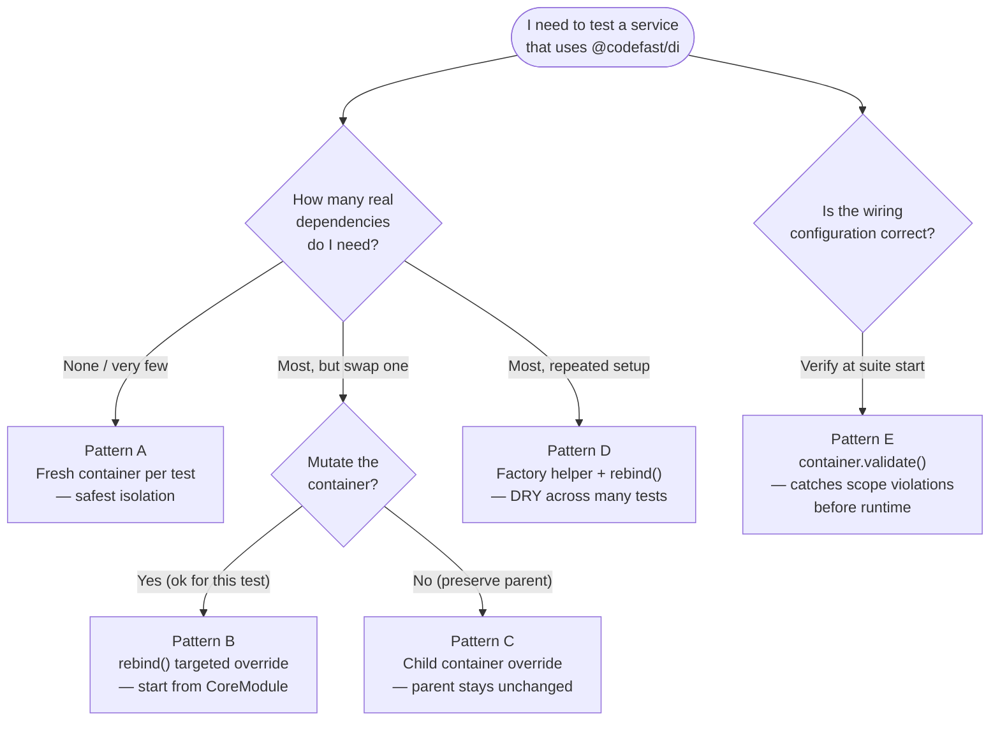
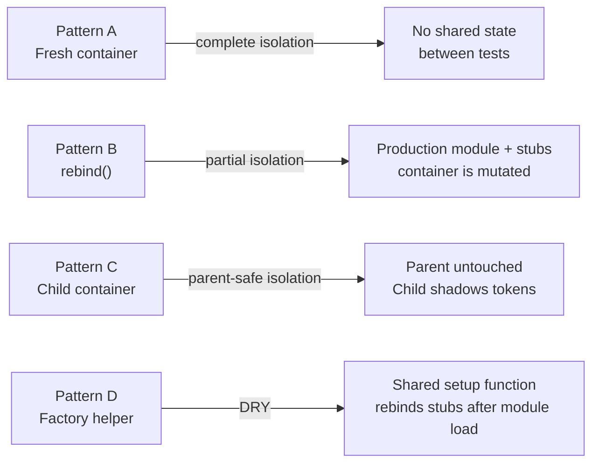

# Example 16 — Testing Patterns

**Concepts:** fresh containers per test, `rebind()` for targeted stub injection, child container overrides, module-based setup with factory helper, `container.validate()` as a wiring smoke-test

---

## What this example shows

Five patterns for writing isolated, deterministic tests for code that uses `@codefast/di`, without a global shared container that leaks state between tests.

---

## Diagram

### Choosing a testing pattern



### Container isolation levels



## Pattern A — Fresh container per test (safest)

Build a minimal container from scratch for each test. No teardown needed.

```ts
it("places an order and sends a confirmation email", () => {
  const stubUser = new StubUserService().seed("u1", "alice@example.com");
  const stubPayment = new StubPaymentGateway();
  const stubEmail = new StubEmailService();

  const c = Container.create();
  c.bind(LoggerToken).to(StubLogger).singleton();
  c.bind(UserServiceToken).toConstantValue(stubUser);
  c.bind(PaymentGatewayToken).toConstantValue(stubPayment);
  c.bind(EmailServiceToken).toConstantValue(stubEmail);
  c.bind(OrderServiceToken).to(OrderProcessor).singleton();

  const orderService = c.resolve(OrderServiceToken);
  const result = orderService.placeOrder("u1", 49.99);

  expect(result.transactionId).toMatch(/^stub-txn-/);
  expect(stubPayment.capturedPayments[0]?.amount).toBe(49.99);
  expect(stubEmail.sentEmails[0]?.to).toBe("alice@example.com");
});
```

**When to use:** unit tests where you only need a small subset of the real wiring.

---

## Pattern B — `rebind()` for a targeted override

Start from the production module, then swap only the binding under test:

```ts
it("throws when the payment gateway fails", () => {
  const c = Container.fromModules(CoreModule);

  // Swap only the payment gateway — everything else stays real
  const stubPayment = new StubPaymentGateway().failNextCharge();
  c.rebind(PaymentGatewayToken).toConstantValue(stubPayment);
  c.rebind(UserServiceToken).toConstantValue(new StubUserService().seed("u1", "alice@example.com"));

  expect(() => c.resolve(OrderServiceToken).placeOrder("u1", 99)).toThrow();
  expect(stubPayment.capturedPayments).toHaveLength(0);
});
```

`rebind()` atomically removes all existing bindings for the token before adding the new one — no stale binding can survive.

**When to use:** integration tests where you want the real service graph but need to isolate one external dependency.

---

## Pattern C — Child container override (parent untouched)

Create a child container per test that shadows specific tokens. The parent production container is never mutated.

```ts
const productionContainer = Container.fromModules(CoreModule);

it("child container shadows PaymentGateway without mutating parent", () => {
  const stubPayment = new StubPaymentGateway();
  const child = productionContainer.createChild();
  child.bind(PaymentGatewayToken).toConstantValue(stubPayment);
  child.bind(OrderServiceToken).to(OrderProcessor).singleton();

  child.resolve(OrderServiceToken).placeOrder("u2", 25);

  expect(stubPayment.capturedPayments).toHaveLength(1);

  // Parent is untouched
  const parentBinding = productionContainer.lookupBindings(PaymentGatewayToken);
  expect(parentBinding[0]?.kind).toBe("class"); // still the real class
});
```

**When to use:** when you want to reuse a shared, fully-wired parent container and override only what changes per test.

---

## Pattern D — Factory helper with `rebind()`

Extract container construction into a reusable factory function. Tests call the factory and get a fully wired container with stubs already in place:

```ts
function buildTestContainer(stubUser: StubUserService, stubPayment: StubPaymentGateway) {
  const stubEmail = new StubEmailService();
  const c = Container.fromModules(CoreModule);
  c.rebind(UserServiceToken).toConstantValue(stubUser);
  c.rebind(PaymentGatewayToken).toConstantValue(stubPayment);
  c.rebind(EmailServiceToken).toConstantValue(stubEmail);
  return { container: c, stubEmail };
}

it("module override replaces all three stubs", () => {
  const { container: c, stubEmail } = buildTestContainer(
    new StubUserService().seed("u1", "alice@example.com"),
    new StubPaymentGateway(),
  );

  c.resolve(OrderServiceToken).placeOrder("u1", 75);
  expect(stubEmail.sentEmails[0]?.to).toBe("alice@example.com");
});
```

**When to use:** test suites with many similar tests that vary only in stub behaviour.

---

## Pattern E — `validate()` as a wiring smoke-test

Call `validate()` at the start of an integration test suite to catch missing or mismatched bindings before any test runs:

```ts
it("fully-wired container passes validate()", () => {
  const c = Container.fromModules(CoreModule);
  expect(() => c.validate()).not.toThrow();
});

it("incomplete container detected via inspect() and has()", () => {
  const c = Container.create();
  c.bind(OrderServiceToken).to(OrderProcessor).singleton();
  // intentionally missing: Logger, UserService, PaymentGateway, EmailService

  expect(c.has(LoggerToken)).toBe(false);
  expect(c.inspect().ownBindings).toHaveLength(1);
});
```

**When to use:** add a single `validate()` call in your `beforeAll` hook for integration tests to surface misconfigured containers immediately.

---

## Stub design guidelines

- Keep stubs simple — implement only the interface, record calls in public arrays.
- Add builder methods for configuring error scenarios: `stub.failNextCharge()`.
- Never share stub instances between tests — create fresh stubs per test.

---

## What to read next

- **Example 09** — `ScopeViolationError`; understand what `validate()` is checking.
- **Example 15** — `inspect()` and `lookupBindings()` for asserting container state in tests.
