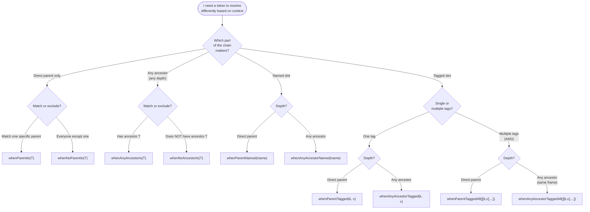
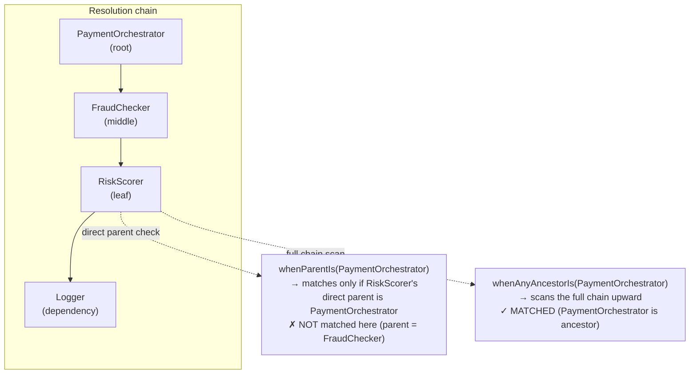

# Example 17 — Extended Constraint Family

**Concepts:** `whenParentIs`, `whenNoParentIs`, `whenAnyAncestorIs`, `whenNoAncestorIs`, `whenParentNamed`, `whenAnyAncestorNamed`, `whenParentTagged`, `whenParentTaggedAll`, `whenAnyAncestorTagged`, `whenAnyAncestorTaggedAll`

---

## What this example shows

Example 06 introduced `whenParentIs`. This example covers the complete constraint family, showing when each predicate is the right choice with a focused scenario per constraint.

All constraints are imported from a tree-shakeable subpath:

```ts
import {
  whenParentIs,
  whenNoParentIs,
  whenAnyAncestorIs,
  whenNoAncestorIs,
  whenParentNamed,
  whenAnyAncestorNamed,
  whenParentTagged,
  whenParentTaggedAll,
  whenAnyAncestorTagged,
  whenAnyAncestorTaggedAll,
} from "@codefast/di/constraints";
```

---

## Diagram

### Constraint decision tree



### Visual comparison: `whenParentIs` vs `whenAnyAncestorIs`



## Constraint reference

| Constraint                        | Matches when…                                                         |
| --------------------------------- | --------------------------------------------------------------------- |
| `whenParentIs(T)`                 | direct parent token === T                                             |
| `whenNoParentIs(T)`               | direct parent token !== T (or no parent)                              |
| `whenAnyAncestorIs(T)`            | any token in the ancestor chain === T                                 |
| `whenNoAncestorIs(T)`             | no token in the ancestor chain === T                                  |
| `whenParentNamed(n)`              | direct parent was resolved with name `n`                              |
| `whenAnyAncestorNamed(n)`         | any ancestor was resolved with name `n`                               |
| `whenParentTagged(k, v)`          | direct parent slot carries tag `k=v`                                  |
| `whenParentTaggedAll(pairs)`      | direct parent slot carries ALL given tags                             |
| `whenAnyAncestorTagged(k, v)`     | any ancestor slot carries tag `k=v`                                   |
| `whenAnyAncestorTaggedAll(pairs)` | any ancestor slot carries ALL given tags (on the same ancestor frame) |

---

## 1. `whenParentIs` / `whenNoParentIs` — direct consumer match

**Scenario:** `OrderService` gets a verbose logger; everything else gets a silent one.

```ts
container
  .bind(LoggerToken)
  .toConstantValue(makeLogger("verbose"))
  .when(whenParentIs(OrderServiceToken)); // only for OrderService

container
  .bind(LoggerToken)
  .toConstantValue(makeLogger("silent"))
  .when(whenNoParentIs(OrderServiceToken)); // everyone else
```

`whenParentIs` checks the **immediate** parent. Use it when a specific consumer should receive a different implementation.

---

## 2. `whenAnyAncestorIs` / `whenNoAncestorIs` — deep chain match

**Scenario:** A Logger should switch to "audit" mode whenever `PaymentOrchestrator` is anywhere in the resolution chain — regardless of depth.

```
PaymentOrchestrator → FraudChecker → RiskScorer → Logger
```

```ts
container
  .bind(LoggerToken)
  .toConstantValue(makeLogger("audit"))
  .when(whenAnyAncestorIs(PaymentOrchestratorToken));

container
  .bind(LoggerToken)
  .toConstantValue(makeLogger("standard"))
  .when(whenNoAncestorIs(PaymentOrchestratorToken));
```

Even though `RiskScorer`'s direct parent is `FraudChecker`, `whenAnyAncestorIs` scans the entire chain upward and finds `PaymentOrchestrator`.

---

## 3. `whenParentNamed` / `whenAnyAncestorNamed` — name propagation

**Scenario:** `DataSource` has two named bindings ("primary", "replica"). The `Logger` injected into each adapts based on which named slot is being resolved.

```ts
container
  .bind(LoggerToken)
  .toConstantValue(makeLogger("primary-logger"))
  .when(whenParentNamed("primary"));

container
  .bind(LoggerToken)
  .toConstantValue(makeLogger("replica-logger"))
  .when(whenParentNamed("replica"));

container.bind(DataSourceToken).to(DataSource).whenNamed("primary").singleton();
container.bind(DataSourceToken).to(DataSource).whenNamed("replica").singleton();

// QueryRunner resolves DataSource named "replica" → gets replica-logger
container.bind(QueryRunnerToken).to(QueryRunner).singleton();
container.resolve(QueryRunnerToken).execute(); // [replica-logger] connected
```

`whenAnyAncestorNamed` works the same way but searches the full ancestor chain instead of only the direct parent.

---

## 4. `whenParentTagged` / `whenParentTaggedAll` — tag-based dispatch

**Scenario:** `CacheAdapter` has multiple backends. Services carry tags; the container selects the matching adapter.

```ts
// Redis-EU requires BOTH backend=redis AND region=eu (AND semantics)
container
  .bind(CacheAdapterToken)
  .toConstantValue({ backend: "redis-eu", ... })
  .when(whenParentTaggedAll([["backend", "redis"], ["region", "eu"]]));

// Memcached requires only backend=memcached (single tag)
container
  .bind(CacheAdapterToken)
  .toConstantValue({ backend: "memcached", ... })
  .when(whenParentTagged("backend", "memcached"));

// Tag SessionStore with both redis AND eu
container
  .bind(SessionStoreToken)
  .to(SessionStore)
  .whenTagged("backend", "redis")
  .whenTagged("region", "eu")
  .singleton();
```

`whenParentTagged` — single tag match.  
`whenParentTaggedAll` — ALL tags must be present on the direct parent (AND).

---

## 5. `whenAnyAncestorTagged` / `whenAnyAncestorTaggedAll` — tag propagation through the chain

**Scenario:** Multi-tenant app. Root service bindings are tagged by tenant tier. A deep dependency (`AuditLogger`) automatically picks the right implementation based on which tagged ancestor is in the chain — intermediate nodes stay tag-free.

```ts
// Enterprise audit logger: parent chain must carry tenant=enterprise AND tier=paid on the same frame
container
  .bind(AuditLoggerToken)
  .toConstantValue({ tier: "enterprise", audit: (e) => console.log(`[ENTERPRISE] ${e}`) })
  .when(
    whenAnyAncestorTaggedAll([
      ["tenant", "enterprise"],
      ["tier", "paid"],
    ]),
  );

// Starter: single tag sufficient
container
  .bind(AuditLoggerToken)
  .toConstantValue({ tier: "starter", audit: (e) => console.log(`[starter] ${e}`) })
  .when(whenAnyAncestorTagged("tenant", "starter"));

// Root bindings carry the tags; intermediate nodes are untagged
container
  .bind(AnalyticsDashboardToken)
  .to(AnalyticsDashboard)
  .whenTagged("tenant", "enterprise")
  .whenTagged("tier", "paid")
  .singleton();
```

The tag sits on the root binding slot. `whenAnyAncestorTaggedAll` requires both tags to appear on the **same ancestor frame** (not spread across different ancestor nodes).

---

## Quick decision guide

| Need                                                 | Use                             |
| ---------------------------------------------------- | ------------------------------- |
| Different impl for one specific consumer             | `whenParentIs(T)`               |
| Default impl for all but one consumer                | `whenNoParentIs(T)`             |
| Behaviour propagated from a root service, any depth  | `whenAnyAncestorIs(T)`          |
| Opt-out when a root service is absent                | `whenNoAncestorIs(T)`           |
| Adapt to which named slot the parent was resolved in | `whenParentNamed(n)`            |
| Same but searching any depth                         | `whenAnyAncestorNamed(n)`       |
| Single tag on the immediate parent                   | `whenParentTagged(k, v)`        |
| Multiple tags (AND) on the immediate parent          | `whenParentTaggedAll([…])`      |
| Single tag anywhere in the ancestor chain            | `whenAnyAncestorTagged(k, v)`   |
| Multiple tags (AND, same frame) anywhere in chain    | `whenAnyAncestorTaggedAll([…])` |

---

## What to read next

- **Example 06** — basic `whenNamed`, `whenTagged`, and `whenParentIs` usage.
- **Example 11** — ancestor tag constraints applied to multi-tenant isolation.
