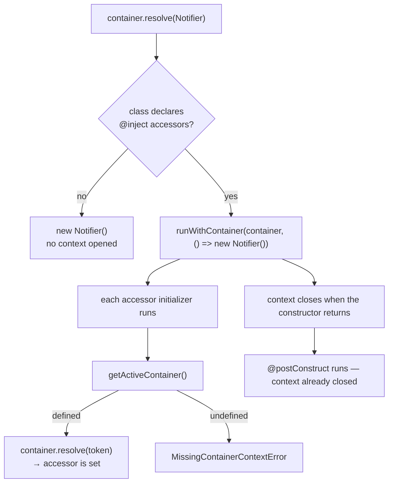

# Example 18 — Ambient Container & Property Injection

**Concepts:** `@inject()` on an `accessor` field, named slots on accessors, `getActiveContainer()`, `runWithContainer()`, `MissingContainerContextError`, nested contexts

---

## What this example shows

`@inject()` has a second role: applied to an auto-accessor it becomes **property injection**. The accessor's initializer needs a container to resolve from, and it finds one through an _ambient container context_ the resolver opens around construction. This example shows when that context exists, what happens when it does not, and how `runWithContainer()` opens one for instances the container does not build itself.

---

## Diagram

### Where the context comes from



### Nesting is a stack, not a global


---

## Property injection with `@inject()` on an accessor

```ts
@injectable([])
class Notifier {
  @inject(ClockToken) accessor clock!: Clock;
  @inject(TransportToken, { name: "email" }) accessor email!: Transport;
}

const notifier = container.resolve(Notifier);
notifier.clock.now(); // already injected
```

Requirements:

- The field must be an **auto-accessor** (`accessor clock!: Clock`), not a plain property — the decorator hooks the accessor's initializer.
- The class still needs `@injectable([...])` for its **constructor** parameters; the accessor list is separate metadata.
- Instance accessors only. A `static` accessor throws at class-evaluation time.
- `optional()` is not a decorator — accessor injection always goes through `resolve()`, so an unbound token throws.

Use it for a dependency that is awkward as a constructor parameter (a base class shared by many subclasses, a framework-constructed object). Constructor injection stays the default: it is checked by `validate()` and visible in the dependency graph.

---

## `getActiveContainer()` — who sees a context

```ts
getActiveContainer(); // undefined at module scope
```

The resolver opens the context **only for classes whose metadata declares accessor injection** — the wrapper costs a `try`/`finally` per instantiation, so classes with plain constructor injection skip it. That means:

| Where                                   | `getActiveContainer()` |
| --------------------------------------- | ---------------------- |
| module scope                            | `undefined`            |
| constructor of a constructor-only class | `undefined`            |
| constructor of a class with accessors   | the container          |
| inside `@postConstruct`                 | `undefined`            |

`@postConstruct` runs after the constructor returns, so the context has already closed — the accessors are set by then, which is what the hook needs.

---

## `MissingContainerContextError`

```ts
new Notifier(); // ✗ MissingContainerContextError — code: "MISSING_CONTAINER_CONTEXT"
```

`error.targetName` is the class that was constructed — the condition is per-class, not per-field, and the message tells you to resolve that class instead.

---

## `runWithContainer()` — the bridge

When a router, an ORM, or a test helper owns the `new`, wrap its call site:

```ts
import { runWithContainer } from "@codefast/di";

const instance = runWithContainer(container, () => new Notifier());
```

Only accessor injection is bridged. Lifecycle belongs to the resolver, so a hand-built instance **does not** run `@postConstruct`, and the container will not dispose it either. If you need lifecycle, bind the class and resolve it.

Nesting restores the previous context on exit (`try`/`finally`), so a per-request child container can shadow the root for the duration of a handler and leave nothing behind.

---

## Guarded ambient lookup

A helper that cannot take a container as an argument can read one — with a fallback, never an assertion:

```ts
function currentRequestId(): string {
  return getActiveContainer()?.resolveOptional(RequestIdToken) ?? "no-request";
}
```

This is a service-locator escape hatch: the dependency is invisible to `validate()` and to the graph. Reach for it when a signature genuinely cannot carry the dependency, not to avoid threading one.

---

## Imports

Both functions are on the root entry; the module that owns them is also a subpath if you want to import narrowly:

```ts
import { getActiveContainer, runWithContainer } from "@codefast/di";
import { getActiveContainer, runWithContainer } from "@codefast/di/resolution/environment";
```

---

## Run it

```sh
node --import tsx/esm examples/18-ambient-container/18-ambient-container.ts
```

---

## What to read next

- **Example 02** — constructor injection with `@inject()` descriptors, the default you should prefer.
- **Example 06** — named and tagged slots, the same selection the accessor's `{ name }` option performs.
- **Example 19** — supplying accessor metadata (and everything else) from a custom `MetadataReader`.
