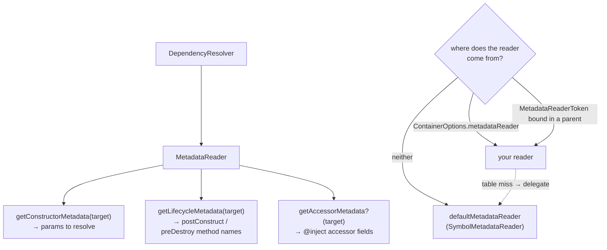
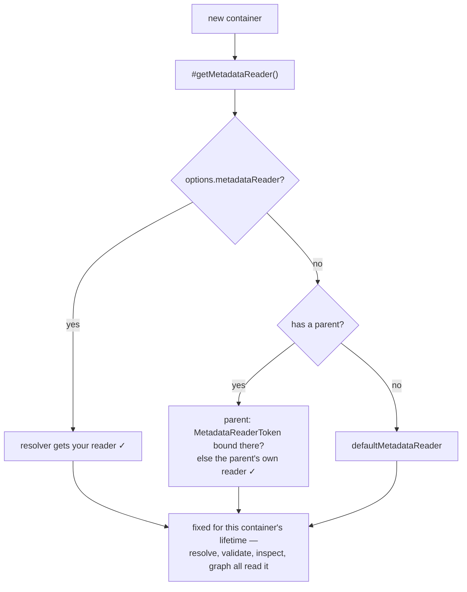

# Example 19 — Custom Metadata Reader

**Concepts:** `MetadataReader`, `Container.create({ metadataReader })`, `defaultMetadataReader`, `getConstructorMetadata`, `getLifecycleMetadata`, `getAccessorMetadata`, `MetadataReaderToken`

---

## What this example shows

Everything the resolver knows about a class — its constructor parameters, its lifecycle hooks, its `@inject` accessors — it learns through one interface: `MetadataReader`. The default implementation reads Stage 3 decorator metadata. Bind your own and you can wire classes that carry no decorators at all: a class from a dependency, generated code, plain JavaScript.

---

## Diagram

### The seam



### Which source reaches resolution



---

## The interface

```ts
interface MetadataReader {
  getConstructorMetadata(target: Constructor): ConstructorMetadata | undefined;
  getLifecycleMetadata(target: Constructor): LifecycleMetadata | undefined;
  getAccessorMetadata?(
    target: Constructor,
  ): ReadonlyArray<{ key: string | symbol; descriptor: InjectionDescriptor }> | undefined;
}
```

- `ConstructorMetadata.params` — one `ParamMetadata` per constructor parameter: `{ index, token, optional, multi, name?, tags? }`. This is the same shape `@injectable([inject(A), optional(B)])` produces.
- `LifecycleMetadata` — **method names**, not functions: `{ postConstruct: ["open"], preDestroy: ["close"] }`.
- `getAccessorMetadata` is optional — but omitting it means no class gets an ambient container context, so any `@inject` accessor then throws `MissingContainerContextError` (see example 18). Delegate it unless you are replacing property injection wholesale.

---

## Declaring an undecorated class

```ts
class LegacyPool {
  constructor(
    readonly config: Config,
    readonly logger: Logger,
  ) {}
  open(): void {}
  close(): void {}
}

const constructorMetadata = new Map<Constructor, ConstructorMetadata>([
  [
    LegacyPool,
    {
      params: [
        { index: 0, token: ConfigToken, optional: false, multi: false },
        { index: 1, token: LoggerToken, optional: false, multi: false },
      ],
    },
  ],
]);

const lifecycleMetadata = new Map<Constructor, LifecycleMetadata>([
  [LegacyPool, { postConstruct: ["open"], preDestroy: ["close"] }],
]);
```

`open` / `close` stay ordinary methods, so the class remains importable by code that has no DI at all — the reader is what promotes them to hooks.

---

## Always delegate on a miss

```ts
class TableFirstMetadataReader implements MetadataReader {
  getConstructorMetadata(target: Constructor): ConstructorMetadata | undefined {
    return constructorMetadata.get(target) ?? defaultMetadataReader.getConstructorMetadata(target);
  }
  getLifecycleMetadata(target: Constructor): LifecycleMetadata | undefined {
    return lifecycleMetadata.get(target) ?? defaultMetadataReader.getLifecycleMetadata(target);
  }
  getAccessorMetadata(target: Constructor) {
    return defaultMetadataReader.getAccessorMetadata(target);
  }
}
```

The resolver has **one** reader for every class it builds, so a table-only reader would make every `@injectable` class throw `MissingMetadataError`. Delegating keeps the decorator path intact and makes the table purely additive.

---

## Installing it — the construction-time rule

A container hands its reader to the resolver it builds **in its constructor**, so the reader has to be knowable by then. `ContainerOptions.metadataReader` is:

```ts
const app = Container.create({ metadataReader: new TableFirstMetadataReader() });
app.bind(PoolToken).to(LegacyPool).singleton(); // ✓ resolves from the table
```

Children inherit it, so a per-request child needs no extra wiring. The option also outranks a `MetadataReaderToken` binding, which keeps every path — resolution, `validate()`, the graph — reading the same reader.

`MetadataReaderToken` still works, in exactly one shape: bound on a container that already exists when the _using_ container is constructed.

```ts
// ✓ the child is constructed after the parent binding exists
const root = Container.create();
root.bind(MetadataReaderToken).toConstantValue(new TableFirstMetadataReader());
const app = root.createChild();

// ✗ too late — this container's resolver already holds the default reader
const container = Container.create();
container.bind(MetadataReaderToken).toConstantValue(new TableFirstMetadataReader());
container.resolve(PoolToken); // MissingMetadataError

// ✗ same problem — modules load after the container exists
Container.fromModules(moduleThatBindsTheReader);
```

In the last two, nothing sees the reader — not resolution, and not `validate()` / `inspect()` / `generateDependencyGraph()` either. One container has exactly one reader, fixed when its resolver was built, so introspection can never disagree with resolution about how a class is wired. Prefer the option; reach for the token only when the reader itself has to be resolved from other bindings.

Since `fromModules` takes modules variadically, there is no options argument to pass — `Container.create(options)` followed by `load(...)` is the equivalent.

---

## What the reader unlocks for tooling

Because the static checks read the same reader, table-declared wiring is a first-class citizen:

```ts
app.validate(); // checks table-declared params too
const graph = app.generateDependencyGraph();
// Pool → Config [0]
// Pool → Logger [1]
// ReportService → Pool [0]
```

An undecorated class wired through a table shows up in the graph exactly like a decorated one.

---

## Imports

Everything needed to write a reader and install it is on the root entry:

```ts
import { Container, defaultMetadataReader, MetadataReaderToken, SymbolMetadataReader } from "@codefast/di";
import type {
  ConstructorMetadata,
  ContainerOptions,
  LifecycleMetadata,
  MetadataReader,
  ParamMetadata,
} from "@codefast/di";
```

The owning modules are subpaths too, if you prefer importing narrowly: `@codefast/di/metadata/metadata-types`, `@codefast/di/metadata/symbol-metadata-reader`.

---

## Run it

```sh
node --import tsx/esm examples/19-custom-metadata-reader/19-custom-metadata-reader.ts
```

---

## What to read next

- **Example 02** — the decorator metadata this reader replaces or augments.
- **Example 08** — `toResolved()` / `toDynamic()`, the decorator-free alternative when you only have a handful of foreign classes.
- **Example 15** — the dependency graph that consumes the same reader.
